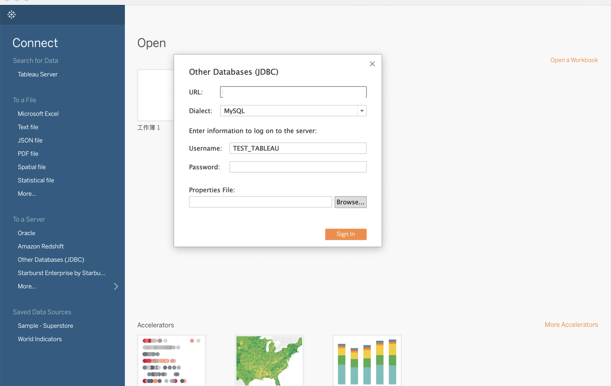

# Tableau Desktop

Tableau Desktop 支持对 StarRocks 的内部数据和外部数据进行查询和可视化处理。

在 Tableau Desktop 中创建数据库：



注意以下几点：

- 选择 **Other Databases(****JDBC****)** 作为数据源。
- 在 **Dialect** 里选择 **MySQL**。
- 在 **URL** 里，按如下 MySQL URI 格式输入 URL：

  ```SQL
  jdbc:mysql://<Host>:<Port>/<Catalog>.<Databases>
  ```

  URL 参数说明如下：

  - `Host`：StarRocks 集群的 FE 主机 IP 地址。
  - `Port`：StarRocks 集群的 FE 查询端口，如 `9030`。
  - `Catalog`：StarRocks 集群中的目标 Catalog。Internal Catalog 和 External Catalog 均支持。
  - `Database`：StarRocks 集群中的目标数据库。内部数据库和外部数据库均支持。

- 在 **Username** 和 **Password** 里输入用户名和密码。
  - **Username**：用于登录 StarRocks 集群的用户名，如 `admin`。
  - **Password**：用于登录 StarRocks 集群的用户密码。
