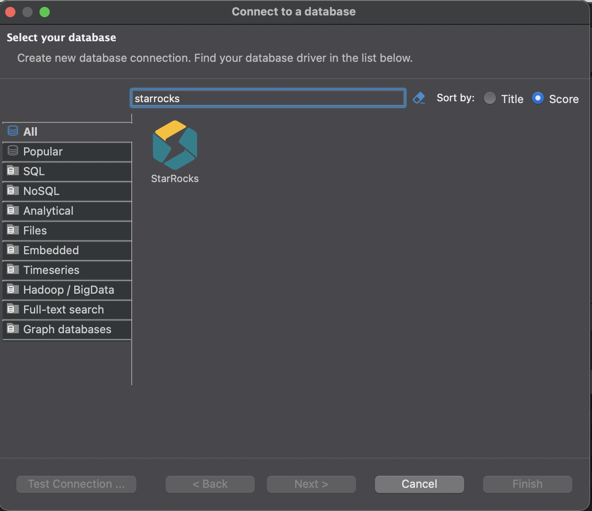
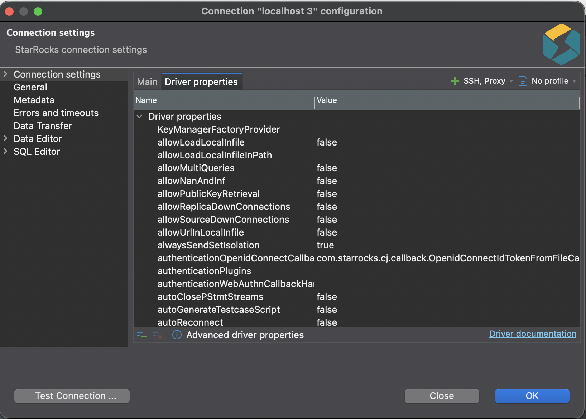
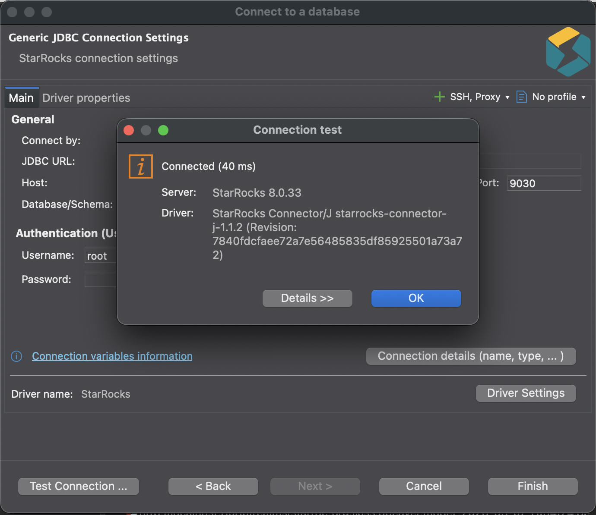

# DBeaver

DBeaver 是一款 SQL 客户端软件应用程序和数据库管理工具，提供了一个helpful助手，引导您完成连接数据库的过程。

## 前提条件

确保您已安装 DBeaver。

您可以在以下地址下载 DBeaver 社区版 [https://dbeaver.io](https://dbeaver.io/) 或在以下地址下载 DBeaver PRO 版 [https://dbeaver.com](https://dbeaver.com/)。

## 集成

按照以下步骤连接到数据库：

1. 启动 DBeaver。

2. 点击加号（**+**）图标，位于 DBeaver 窗口的左上角，或在菜单栏中选择 **数据库** > **新建数据库连接** 以访问助手。

   

   

3. 选择 StarRocks 驱动程序。

   在 **选择您的数据库** 步骤中，您将看到一个可用驱动程序列表。在搜索栏中搜索 **StarRocks** ，或点击左侧面板中的 **分析型** 来定位它。然后，双击 **StarRocks** 图标。

   :::note
   如果您的 DBeaver 版本不包含 StarRocks 驱动程序，您可以使用 **MySQL** 驱动程序作为备选。
   :::

   

4. 配置数据库连接。

   在 **连接设置** 步骤中，转到 **主** 选项卡并配置以下基本连接设置：

   - **主机**：您的 StarRocks 集群的 FE 主机 IP 地址。
   - **端口**: StarRocks 集群的 FE 查询端口，例如 `9030`。
   - **数据库/Schema**: StarRocks 集群中的目标数据库。
   - **用户名**: 用于登录 StarRocks 集群的用户名，例如 `admin`。
   - **密码**: 用于登录 StarRocks 集群的密码。

   :::note
   从 DBeaver 26.0.5 开始，使用 StarRocks 驱动时支持多 Catalog 浏览，允许您在不指定数据库的情况下浏览集群中的所有 Catalog。
   :::

   

   如有需要，您也可以在 **驱动属性** 选项卡上查看和编辑 StarRocks 驱动的属性。要编辑某个特定属性，请点击该属性在 **值** 列中对应的行。

   

5. 测试与数据库的连接。

   点击 **测试连接** 以验证连接设置的准确性。系统将弹出一个显示 StarRocks 驱动信息的对话框。点击对话框中的 **确定** 确认信息。成功配置连接设置后，点击 **完成** 完成该过程。

   

6. 连接到数据库。

   连接建立后，您可以在左侧数据库连接树中查看该连接，DBeaver 即可有效连接到数据库。

   
