# Dataphin

Dataphin 是阿里巴巴集团 OneData 数据治理方法论内部实践的云化输出，一站式提供数据采、建、管、用全生命周期的大数据能力，以助力企业显著提升数据治理水平，构建质量可靠、消费便捷、生产安全经济的企业级数据中台。Dataphin 提供多种计算平台支持及可拓展的开放能力，以适应各行业企业的平台技术架构和特定诉求。

Dataphin 与 StarRocks 集成分为以下几种场景：

- 作为数据集成的来源或目标数据源，支持从 StarRocks 中读取数据到其他数据源，或从其他数据源写入数据到 StarRocks。

- 作为实时研发的来源表、维表或结果表。

- 作为数据仓库或数据集市，注册 StarRocks 为 Dataphin 计算源，可进行 SQL 研发及调度、数据质量检测、安全识别等数据研发及治理工作。

## 数据集成

在 Dataphin 中，支持创建 StarRocks 数据源，并且在离线集成任务中使用 StarRocks 数据源作为来源数据库或目标数据库。具体使用步骤如下：

### 创建 StarRocks 数据源

#### 基本信息

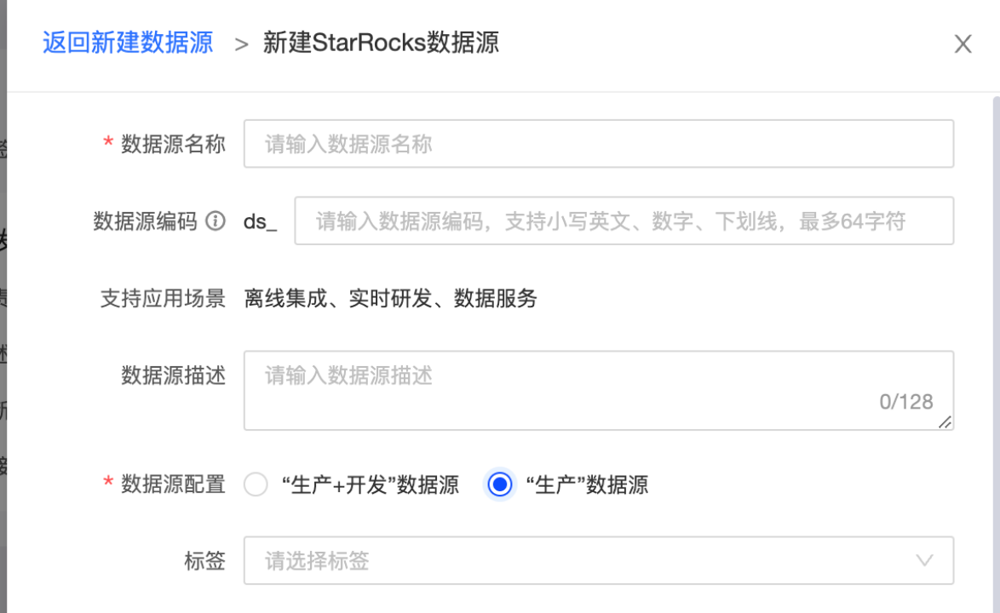

- **数据源名称**：必填。输入数据源的名称，只能包含中文、字母、数字、下划线（_）或中划线（-），长度不能超过 64 个字符。

- **数据源编码**：选填。配置数据源编码后，可在 Flink SQL 任务中通过`数据源编码.table` 或 `数据源编码.schema.table` 的格式引用数据源中的表。如果需要根据所处环境自动访问对应环境的数据源，请通过 `${数据源编码}.table` 或 `${数据源编码}.schema.table` 的格式访问。注意：目前仅支持 MySQL、Hologres、MaxCompute 数据源。

- **数据源描述**：选填。输入对数据源简单的描述，长度不得超过 128 个字符。

- **数据源配置**：必填。如果业务数据源区分生产数据源和开发数据源，则选择 **“生产+开发”数据源**。如果业务数据源不区分生产数据源和开发数据源，则选择 **“生产”数据源**。

- **标签**：选填。可选择标签给数据源进行分类打标。

#### 配置信息

- **JDBC URL**：必填。格式为 `jdbc:mysql://<host>:<port>/<dbname>`，其中 `host` 为 StarRocks 集群的 FE（Front End）主机 IP 地址，`port` 为 FE 的查询端口，`dbname` 为数据库名称。

- **Load URL**：必填。格式为 `fe_ip:http_port;fe_ip:http_port`，其中 `fe_ip` 为 FE 的 Host，`http_port` 为 FE 的 HTTP 端口。

- **用户名**：必填。数据库的用户名。

- **密码**：必填。数据库的密码。

#### 高级设置

- **connectTimeout**：数据库的 `connectTimeout` 时长（单位 ms），默认 900000 毫秒（15 分钟）。

- **socketTimeout**：数据库的 `socketTimeout` 时长（单位 ms），默认 1800000 毫秒（30 分钟）。

### 从 StarRocks 数据源读取数据写入其他数据源

#### 在离线集成任务画布中拖入 StarRocks 输入组件

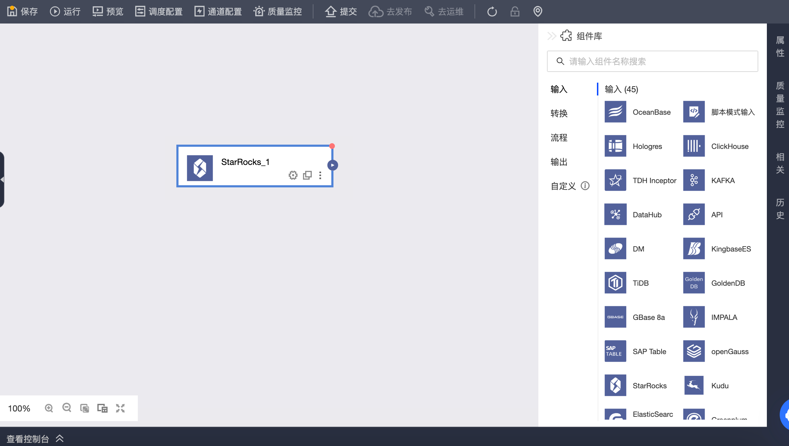

#### 配置 StarRocks 输入组件配置

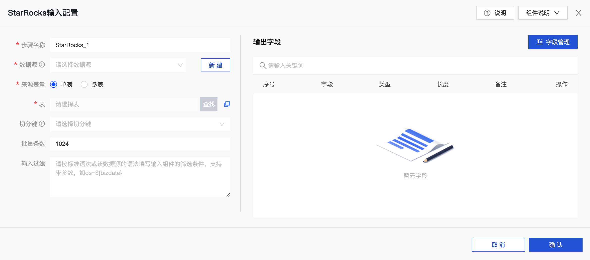

- **步骤名称**：根据当前组件的使用场景及定位，输入合适的名称。

- **数据源**：可选 Dataphin 中创建的 StarRocks 数据源或是项目。需要配置人员具备同步读权限的数据源。如有不满足，可通过添加数据源或申请相关权限获取。

- **来源表信息**：根据实际场景需要，选择单张表或多张具有相同表结构的表，作为输入。

- **表**：下拉可以选择 StarRocks 数据源中的表。

- **过滤信息**：过滤信息非必填项。

  两种情况下会填写相关信息：

  - 固定的某一部分数据。
  - 带参数过滤，比如对于需要每天增量追加或全量覆盖获取数据的情况，往往会填入带有表内日期字段限制为 Dataphin 的系统时间参数，比如 StarRocks 库中的一张交易表，交易创建日期=`${bizdate}`。

- **输出字段**：针对所选的表信息，获取表的字段作为输出字段。可进行字段重命名、移除或再次添加、移动字段的顺序。一般情况下，重命名是为了下游的数据可读性或输出时候的字段方便映射；移除是因为从应用场景角度考虑不需要相关字段，因此在输入步骤及早对不需要的字段进行剔除；移动字段顺序是为了下游有多个输入数据进行合并或输出的时候，对名称不一致情况下可以采用同行映射的方式高效进行数据合并或映射输出。

#### 选择目标数据源作为输出组件，并配置输出组件

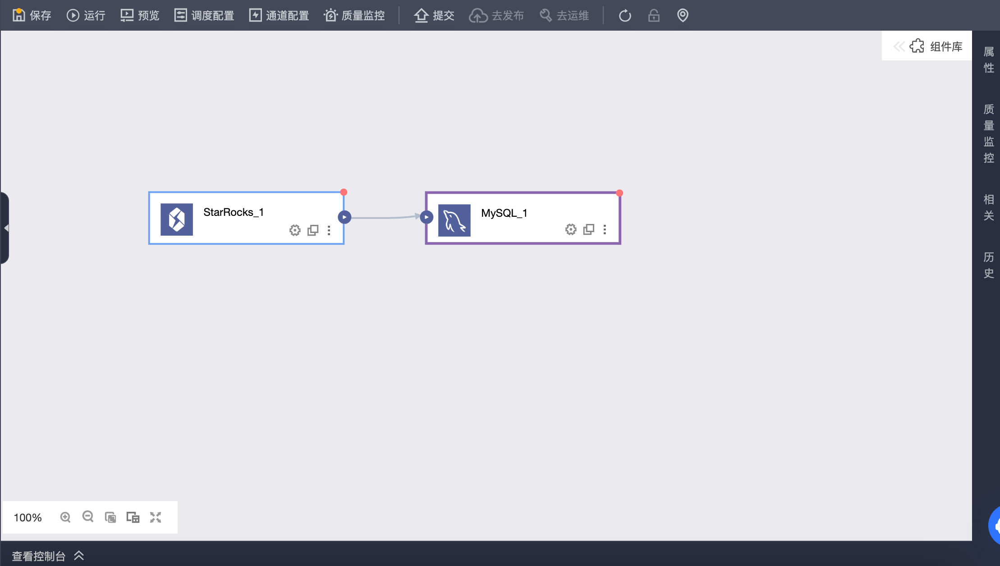

### 从其他数据源读取数据写入到 StarRocks 数据源

#### 在离线集成任务中配置输入组件，配置 StarRocks 输出组件作为下游

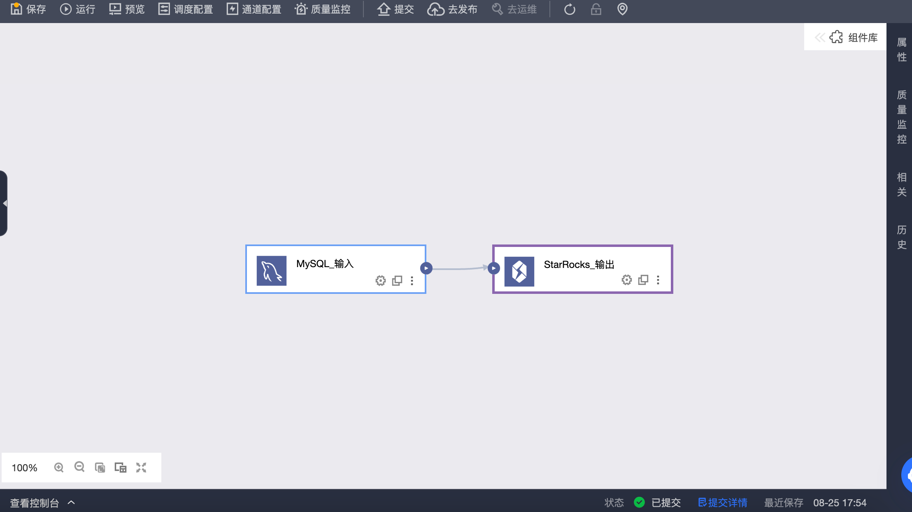

#### 配置 StarRocks 输出组件

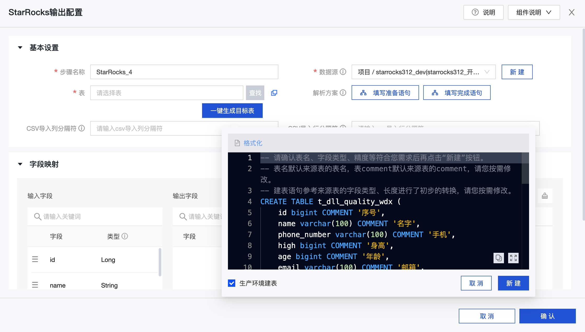

- **步骤名称**：根据当前组件的使用场景及定位，输入合适的名称。

- **数据源**：可选 Dataphin 中创建的 StarRocks 数据源或是项目。需要配置人员具备同步写权限的数据源。如有不满足，可通过添加数据源或申请相关权限获取。

- **表**：下拉可选择 StarRocks 数据源中的表，作为数据写入的目标。

- **一键生成目标表**：如 StarRocks 数据源中还没有创建目标表，可自动获取上游读取的字段名称、类型与备注，生成建表语句，点击该按钮可一键生成目标表。

- **CSV导入列分隔符**：使用 Stream Load 按 CSV 格式导入，可配置 CSV 导入列分隔符，默认 `\t`，使用默认值请不要在此显式指定。如果数据中本身包含 `\t`，则需自定义使用其他字符作为分隔符。

- **CSV导入行分隔符**：使用 Stream Load 按 CSV 格式导入，可配置 CSV 导入行分隔符，默认 `\n`，使用默认值请不要在此显式指定。如果数据中本身包含 `\n`，则需自定义使用其他字符作为分隔符。

- **解析方案**：非必填项。是指数据输出前和输出完成后的一些特殊处理。准备语句将在数据写入 StarRocks 数据源前执行，结束语句将在写入完成后执行。

- **字段映射**：根据上游的输入和目标表的字段，可以手动选择字段映射或批量根据同行或同名映射。

## 实时研发

### 应用场景

StarRocks 是一种快速、可扩展的实时分析数据库，StarRocks 在实时计算中通常用于进行读取和写入操作，以满足实时数据分析和查询的需求，被广泛应用于企业实时计算场景中。以下是一些关于 StarRocks 在实时计算中的应用示例：

- **实时业务监控和分析**

  企业可以使用 StarRocks 来实时监控和分析业务数据。例如，电商平台可以利用 StarRocks 来实时跟踪订单和交易数据，监测销售情况、库存状况和客户行为。通过实时的数据分析，企业可以及时调整策略、做出决策并提供更好的服务。

- **实时用户行为分析**

  StarRocks 可以用于实时分析用户行为数据，例如移动应用的用户点击数据、页面浏览数据等。通过实时分析这些数据，企业可以快速了解用户行为模式、用户偏好、以及用户转化路径，从而优化产品和服务。

- **广告实时竞价系统**

  在广告领域，实时计算是非常重要的。企业可以使用 StarRocks 构建实时竞价系统，通过实时分析用户特征、广告库存和竞价数据，快速决定广告投放策略和出价，从而提高广告投放的效果和收益。

- **实时风控和反欺诈**

  金融、电商和其他在线平台需要对用户行为进行实时风险控制和反欺诈。StarRocks 可以用于实时监测和分析用户行为数据，识别异常行为和欺诈风险，及时采取措施保护企业和用户的利益。

- **实时监控和预警**

  StarRocks 可以用于实时监控企业的关键指标和业务数据，并在达到预警条件时触发警报。例如，企业可以利用 StarRocks 实时监控服务器的负载、网络流量、交易成功率等指标，及时发现问题并采取措施解决。

### StarRocks Connector

Flink 连接器内部的结果表是通过缓存并批量通过 Stream Load 导入实现，源表是通过批量读取数据实现。StarRocks 连接器支持的信息如下。

| **类别**                     | **详情**             |
| ---------------------------- | -------------------- |
| 支持类型                     | 来源表、维表、结果表 |
| 运行模式                     | 流模式和批模式       |
| 数据格式                     | JSON 和 CSV            |
| 特有监控指标                 | 暂无                 |
| API 种类                    | DataStream 和 SQL      |
| 是否支持更新或删除结果表数据    | 是                   |

### 如何使用

Dataphin 支持 StarRocks 数据源作为实时计算的读写目标端，支持创建 StarRocks 元表并用于实时计算任务，下面举例说明操作步骤：

#### 创建 StarRocks 元表

1. 进入 **Dataphin** > **研发** > **开发** > **表管理**。

2. 点击**新建**，选择**实时计算表**。

   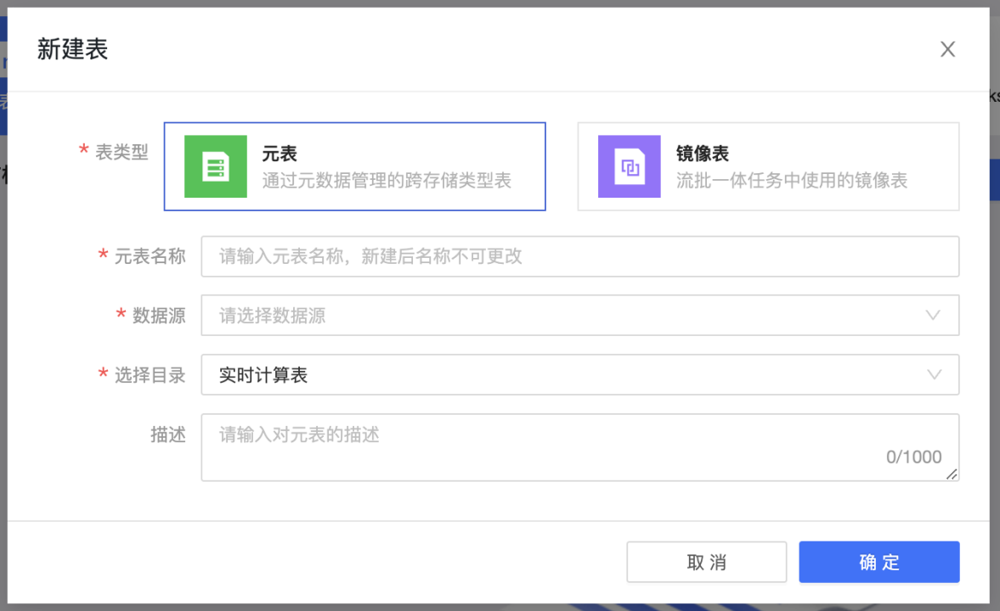

   - **表类型**：选择**元表**。

   - **元表名称**：填写元表的名称。

   - **数据源**：选择一个 StarRocks 类型的数据源。

   - **来源表**：选择一张物理表作为来源表。

   - **选择目录**：选择要新建表的目录。

   - **描述**：选填。输入原表的简单描述。

   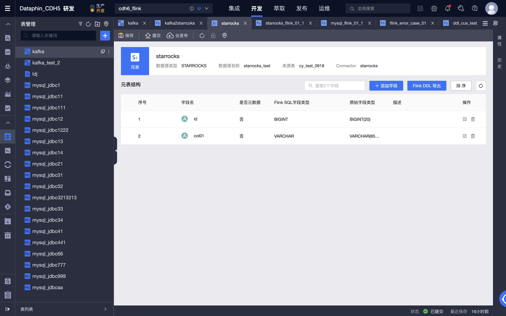

3. 建好元表后，可以对元表进行编辑，包括修改数据源、来源表、元表字段、配置元表参数等。

   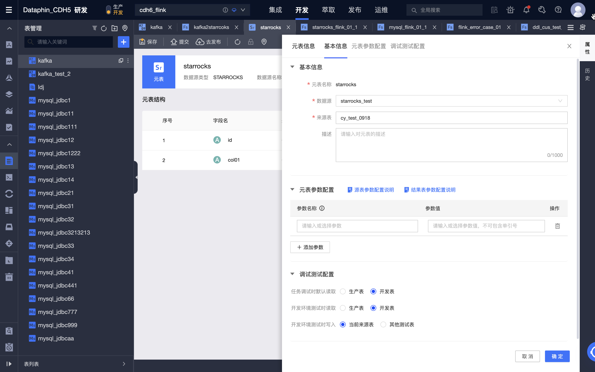

4. 提交元表。

#### 创建 Flink SQL 任务实现将 Kafka 中的数据实时写入到 StarRocks 中

1. 进入 **Dataphin** > **研发** > **开发** > **计算任务**。

2. 点击**新建 Flink SQL 任务**。

   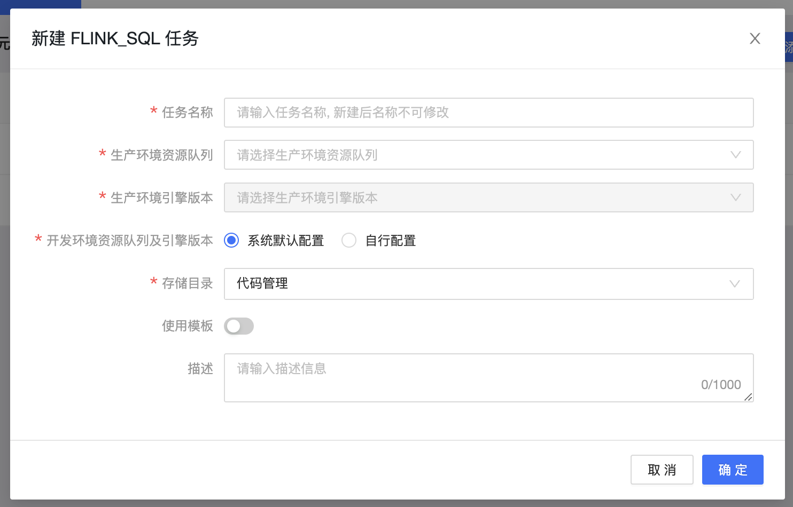

3. 编辑 Fink SQL 代码并进行预编译，这里用到了 Kafka 元表作为输入表，StarRocks 元表作为输出表。

   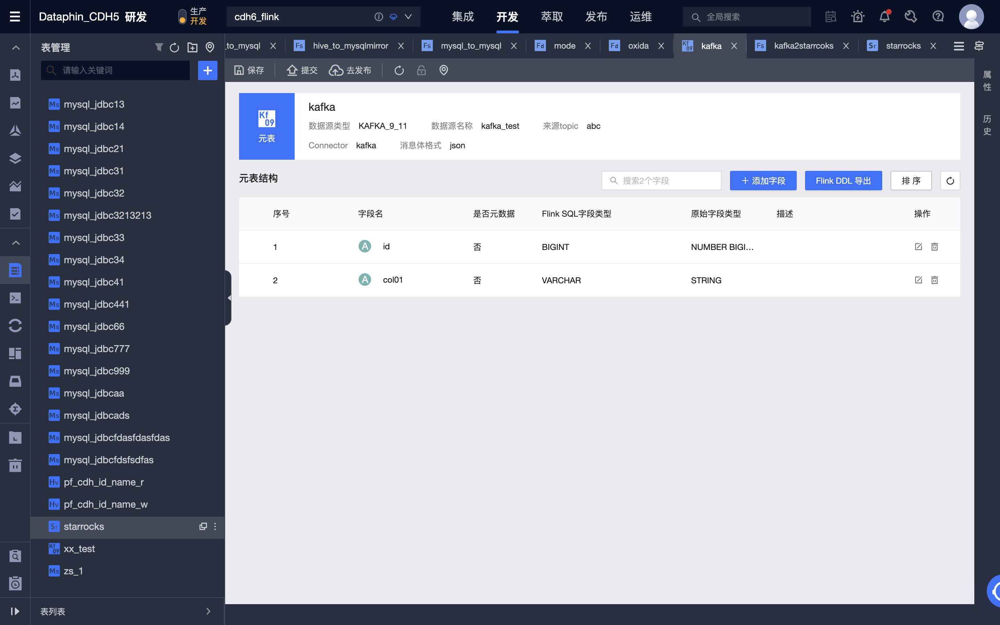

   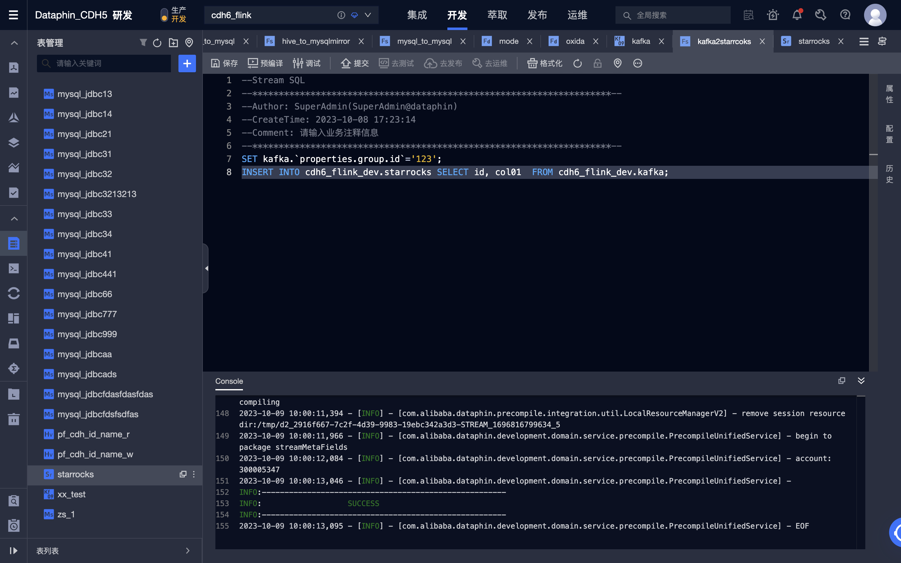

4. 预编译成功后，可以对代码进行调试、提交。

5. 在开发环境进行测试，可以通过打印日志和写测试表两种方式进行，其中测试表可以在**元表** > **属性** > **调试测试配置**中进行设置。

   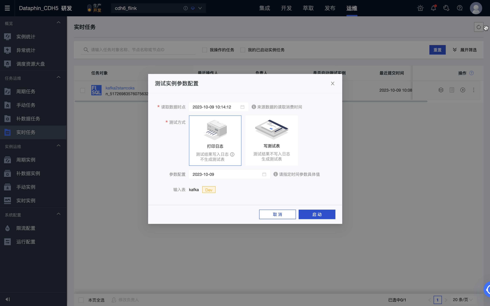

   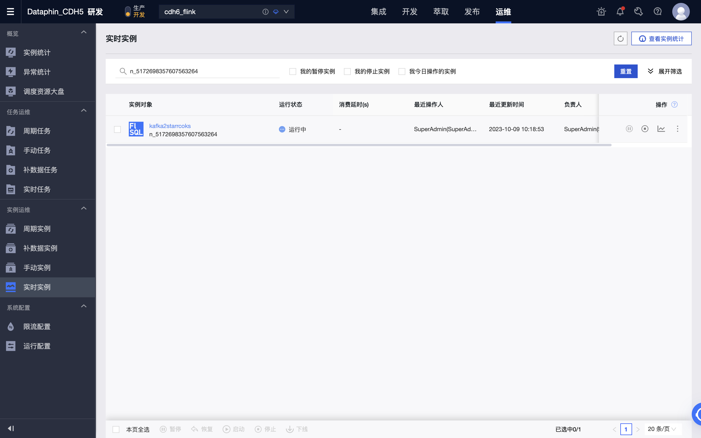

6. 开发环境任务正常运行后，可以将任务及用到的元表一起发布到生产环境。

   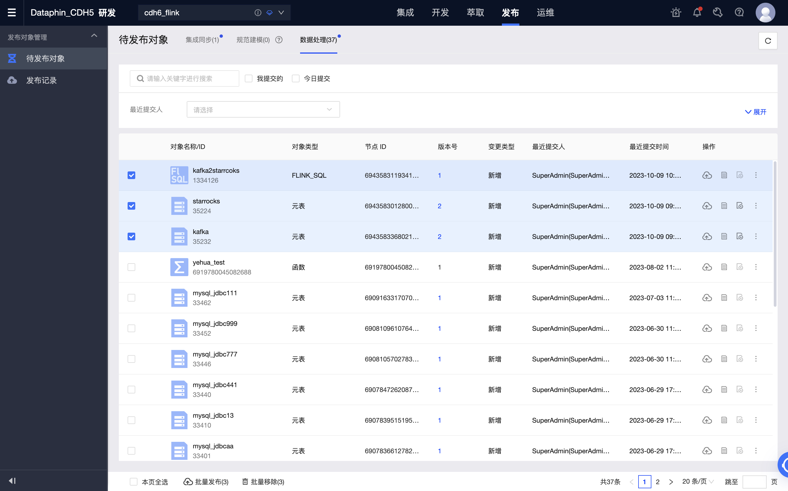

7. 在生产环境启动任务，实现将 Kafka 中的数据实时写入到 StarRocks 中。可以通过查看运行分析中各指标的情况和日志了解任务运行情况，也可以为任务配置监控告警。

## 数据仓库或数据集市

### 前提条件

- StarRocks 版本为 3.0.6 及以上。

- 已安装 Dataphin，且 Dataphin 版本为 3.12 及以上。

- 统计信息采集已开启，StarRocks 安装后采集即默认开启。详情见[CBO 统计信息](https://docs.starrocks.io/zh-cn/latest/using_starrocks/Cost_based_optimizer)。

- 仅支持 StarRocks Internal Catalog，即 `default_catalog`，不支持 External Catalog。

### 连接配置说明

#### 元仓设置

Dataphin 可以基于元数据进行信息的呈现与展示，包括表使用信息、元数据变更等。可支持使用 StarRocks 进行元数据的加工计算。因此在开始使用前，需要对元数据计算引擎（元仓）进行初始化设置。设置的步骤如下：

1. 使用管理员身份用户登录 Dataphin 元仓租户。

2. 进入**管理中心** > **系统设置** > **元仓设置**。

   a. 点击**开始**。

   b. 选择 **StarRocks**。

   c. 进行参数配置，通过测试连接后，点击**下一步**。

   d. 完成元仓初始化。

   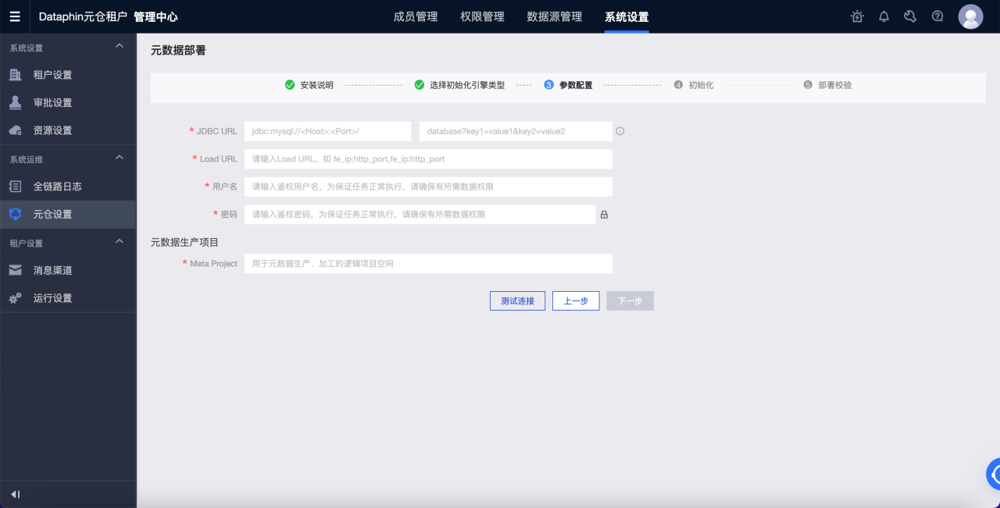

   参数说明如下：

   - **JDBC URL**：JDBC 连接串，分为两部分填写，可参考 MySQL JDBC URL 格式 `https://dev.mysql.com/doc/connector-j/8.1/en/connector-j-reference-jdbc-url-format.html`。

     - 第一部分：格式为 `jdbc:mysql://<Host>:<Port>/`，其中 `Host` 为 StarRocks 集群的 FE 主机 IP 地址，`Port` 为 FE 的查询端口，默认为 9030。

     - 第二部分：格式为 `database?key1=value1&key2=value2`，其中 `database` 为 StarRocks 用于元数据计算的数据库的名称，为必填项。`?` 后的参数为选填项。

   - **Load URL**：格式为 `fe_ip:http_port;fe_ip:http_port`，其中 `fe_ip` 为 FE 的 Host，`http_port` 为 FE 的 HTTP 端口。

   - **用户名**：连接 StarRocks 的用户名。

     该用户 JDBC URL 中给定的数据库有读写权限，需要有以下数据库及表的访问权限：

     - Information Schema 下所有表

     - _statistics_.column_statistics

     - _statistics_.table_statistic_v1

   - **密码**：连接 StarRocks 的密码。

   - **Meta Project**：Dataphin 用于元数据加工的项目名称，仅用于 Dataphin 系统内部使用，建议使用 **dataphin_meta**。

#### 创建 StarRocks 项目并开始数据研发

开始数据研发，包括以下步骤：

1. 计算设置。

2. 创建 StarRocks 计算源。

3. 创建 Dataphin 项目。

4. 创建 StarRocks SQL 任务。

##### 步骤一：计算设置

计算设置设置了该租户下的计算引擎类型以及集群的地址。详细步骤如下：

1. 使用系统管理员或超级管理员身份登录 Dataphin。

2. 进入**管理中心** > **系统设置** > **计算设置**。

3. 选择 **StarRocks**，点击**下一步**。

4. 填写 **JDBC URL**，并等待校验通过。JDBC URL 的格式为 `jdbc:mysql://<Host>:<Port>/`，其中 `Host` 为 StarRocks 集群的 FE 主机 IP 地址，`Port` 为 FE 的查询端口，默认为 9030。

##### 步骤二：创建 StarRocks 计算源

计算源是 Dataphin 里的一个概念，主要的目的是将 Dataphin 的项目空间与 StarRocks 的存储计算空间（即 Database）进行绑定和注册。需要为每个项目创建一个计算源。详细的步骤如下：

1. 使用系统管理员或超级管理员身份登录 Dataphin。

2. 进入**规划** > **计算源**。

3. 点击右上角的**新增计算源**，创建计算源。

   详细的配置信息如下说明：

   **基本信息**

   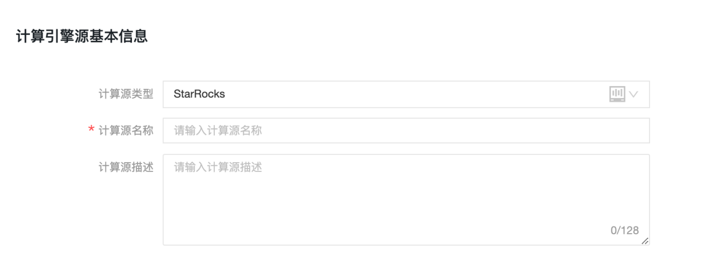

   - **计算源类型**：选择 **StarRocks**。

   - **计算源名称**：建议使用与即将创建的项目名称一致，若用于开发项目，则加上 **_dev** 后缀。

   - **计算源描述**：选填。填入计算源的描述信息。

   **配置信息**

   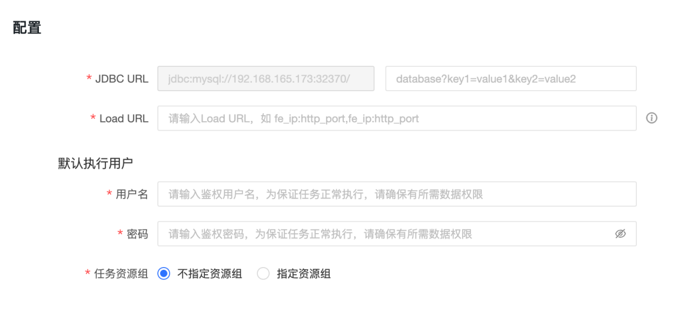

   - **JDBC URL**：格式为 `jdbc:mysql://<Host>:<Port>/`，其中 `Host` 为 StarRocks 集群的 FE 主机 IP 地址，`Port` 为 FE 的查询端口，默认为 9030。

   - **Load URL**：格式为 `fe_ip:http_port;fe_ip:http_port`，其中 `fe_ip` 为 FE 的 Host，`http_port` 为 FE 的 HTTP 端口。

   - **用户名**：连接 StarRocks 的用户名。

   - **密码**：连接 StarRocks 的密码。

   - **任务资源组**：可指定不同优先级的任务使用不同的 StarRocks 资源组。选择**不指定资源组**时，由 StarRocks 引擎决定执行的资源组；选择**指定资源组**时，不同优先级的任务将在执行时由 Dataphin 指定到设置的资源组。若在 SQL 任务的代码里、以及逻辑表的物化配置里指定了资源组，则以代码的设置及逻辑表的物化配置为准，计算源的任务资源组配置在该任务执行时将被忽略。

   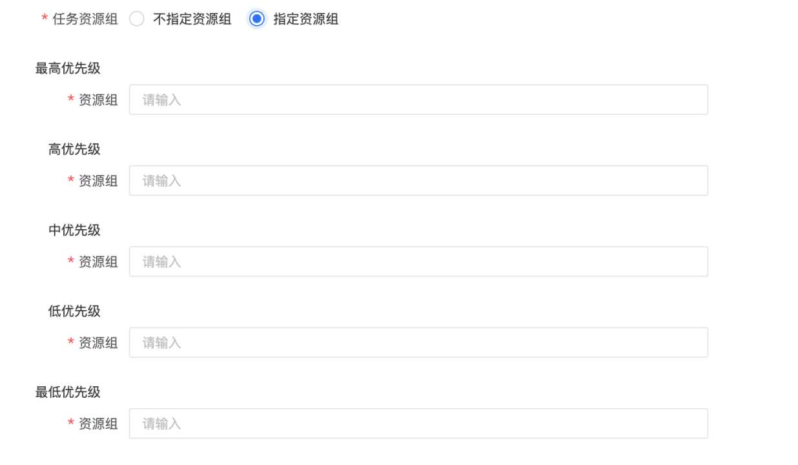

##### 步骤三：创建 Dataphin 项目

创建好计算源后，就可以绑定为 Dataphin 的项目了。Dataphin 的项目承载了项目成员的管理、StarRocks 的存储与计算空间、以及计算任务的管理和运维。

创建 Dataphin 项目的详细的步骤如下：

1. 使用系统管理员或超级管理员身份登录 Dataphin。

2. 进入**规划** > **项目**。

3. 点击右上角的**新建项目**，创建项目。

4. 填入基本信息，并在离线计算源中选择上一步中创建的 StarRocks 计算源。

5. 点击**完成创建**。

##### 步骤四：创建 StarRocks SQL 任务

创建好项目后，即可开始创建 StarRocks SQL 任务对 StarRocks 进行 DDL 或者 DML 操作。

详细的步骤如下：

1. 进入**研发** > **开发**。

2. 点击右上角的 **+**，创建 StarRocks SQL 任务。

   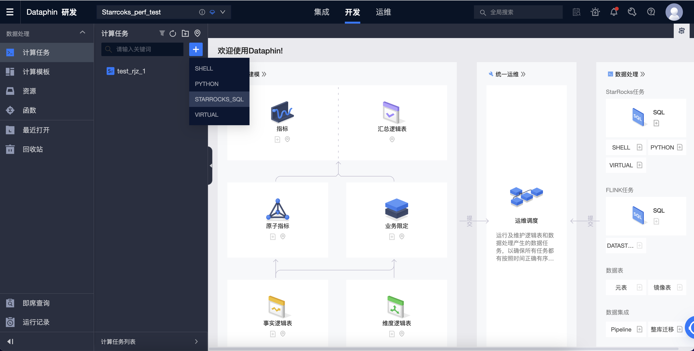

3. 填入名称及调度类型后，完成 SQL 任务的创建。

4. 在编辑器输入 SQL，即可开始对 StarRock 进行 DDL 及 DML 操作。

   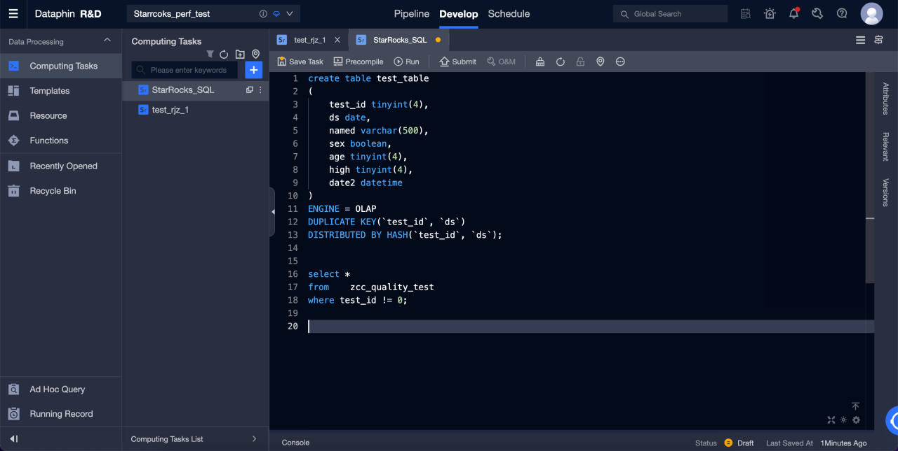
