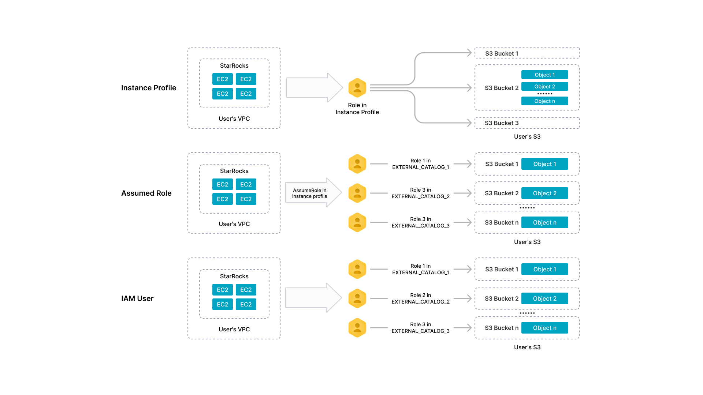

# 配置 AWS 认证信息

StarRocks 支持通过以下三种认证鉴权方式实现与 AWS 资源的集成：Instance Profile、Assumed Role、IAM User。本文介绍在这三种认证鉴权方式下如何配置 AWS 安全凭证。

## 认证方式介绍

### 基于 Instance Profile 认证鉴权

通过 Instance Profile，您可以让 StarRocks 集群直接从所在 AWS EC2 虚拟机继承 Instance Profile 的权限。在该模式下，任何能够登录到集群的用户都可以根据 AWS IAM 策略配置，对相关的 AWS 资源执行授权范围内允许的操作（例如 AWS S3 指定 Bucket 的读写操作）。

### 基于 Assumed Role 认证鉴权

与 Instance Profile 的模式不同，Assumed Role 支持通过担任 AWS IAM Role 来实现对外部数据源的访问认证和鉴权。参见 AWS 官网文档[代入角色](https://docs.aws.amazon.com/zh_cn/awscloudtrail/latest/userguide/cloudtrail-sharing-logs-assume-role.html)。

<!--您可以为不同的 Catalog 配置不同的 Assume Role，从而拥有特定 AWS 资源（例如 S3 Bucket）的访问权限。作为管理员，您还可以向不同的用户授予不同 Catalog 的操作权限，从而实现同一集群内不同用户对不同外部数据的访问控制。-->

### 基于 IAM User 认证鉴权

IAM User 支持通过 AWS IAM User 来实现对外部数据源的访问认证和鉴权。参见 AWS 官网文档 [IAM users](https://docs.aws.amazon.com/IAM/latest/UserGuide/id_users.html)。

<!--您可以在不同 Catalog 里指定不同的 IAM User 的 Access Key 和 Secret Key，从而实现同一集群内不同用户对不同外部数据的访问控制。-->

## 准备工作

首先，找到 StarRocks 集群所在 EC2 实例所关联的 IAM 角色（以下简称“EC2 实例关联角色”），并获取该角色的 ARN。在使用基于 Instance Profile 的认证方式时，会用到该角色；在使用基于 Assumed Role 的认证方式时，会用到该角色及其 ARN。

下一步，根据要访问的 AWS 资源、以及与 StarRocks 集成的具体操作场景来创建 IAM 策略。IAM 策略用于声明特定 AWS 资源的一组访问权限。创建 IAM 策略后，您需要将创建好的策略添加到某个 IAM 用户或角色，从而使该 IAM 用户或角色拥有该策略中所声明的访问特定 AWS 资源的权限。

> **注意**
>
> 您必须拥有登录 [AWS IAM 控制台](https://us-east-1.console.aws.amazon.com/iamv2/home#/home)和编辑 IAM 用户及角色的权限才能完成上述准备工作。

关于访问特定 AWS 资源所需要创建的 IAM 策略，见如下内容：

- [从 AWS S3 批量导入数据](../reference/aws_iam_policies.md#从-aws-s3-批量导入数据)
- [从 AWS S3 读写数据](../reference/aws_iam_policies.md#从-aws-s3-读写数据)
- [对接 AWS Glue](../reference/aws_iam_policies.md#对接-aws-glue)

### 基于 Instance Profile 认证鉴权

把声明了访问特定 AWS 资源的 [IAM 策略](../reference/aws_iam_policies.md) 添加到 EC2 实例关联角色。

### 基于 Assumed Role 认证鉴权

#### 创建 IAM 角色并添加策略

您可以根据需要访问的 AWS 资源选择创建一个或多个 IAM 角色。具体操作请参见 AWS 官网文档 [Creating IAM roles](https://docs.aws.amazon.com/IAM/latest/UserGuide/id_roles_create.html)。然后，把声明了访问特定 AWS 资源的 [IAM 策略](../reference/aws_iam_policies.md) 添加到您所创建的 IAM 角色。

这里假设您的操作场景需要 StarRocks 集群访问 AWS S3 和 AWS Glue。在这种情况下，您可以选择创建一个 IAM 角色（如 `s3_assumed_role`），然后把赋权访问 AWS S3 的策略和赋权访问 AWS Glue 的策略都添加到该角色。您也可以选择创建两个不同的 IAM 角色（如 `s3_assumed_role` 和 `glue_assumed_role`），然后把这些不同的策略分别添加到这两个角色（即，把赋权访问 AWS S3 的策略添加到 `s3_assumed_role`， 把赋权访问 AWS Glue 的策略添加到 `glue_assumed_role`）。

StarRocks 集群的 EC2 实例关联角色通过承担您所创建和配置的 IAM 角色，便可以获得访问特定 AWS 资源的权限。

本文假设您只创建了一个 Assumed Role `s3_assumed_role`，并且已把赋权访问 AWS S3 的策略和赋权访问 AWS Glue 的策略都添加到了该角色。

#### 配置信任关系

请按如下步骤配置 Assumed Role：

1. 登录 [AWS IAM 控制台](https://us-east-1.console.aws.amazon.com/iamv2/home#/home)。
2. 在左侧导航栏选择 **Access management** > **Roles**。
3. 找到 Assumed Role (`s3_assumed_role`)，单击角色名称。
4. 在角色详情页上，单击 **Trust relationships** 页签，然后在 **Trust relationships** 页签上单击 **Edit trust policy**。
5. 在 **Edit trust policy** 页面上，删掉当前的 JSON 格式策略，然后拷贝并粘贴如下策略。注意您需要把下面策略中的 `<cluster_EC2_iam_role_ARN>` 替换为 EC2 实例关联角色的 ARN。最后，单击 **Update policy**。

   ```JSON
   {
       "Version": "2012-10-17",
       "Statement": [
           {
               "Effect": "Allow",
               "Principal": {
                   "AWS": "<cluster_EC2_iam_role_ARN>"
               },
               "Action": "sts:AssumeRole"
           }
       ]
   }
   ```

如果您创建了不同的 Assumed Role 用以赋权访问不同的 AWS 资源，那么您需要参照上述操作步骤完成其他所有 Assumed Role 的配置。例如，您创建了 `s3_assumed_role` 和 `glue_assumed_role` 两个 Assumed Role，分别用于赋权访问 AWS S3 和 AWS Glue。在这种情况下，您需要重复上述操作步骤，完成对 `glue_assumed_role` 的配置。

请按如下步骤配置 EC2 实例关联角色：

1. 登录 [AWS IAM 控制台](https://us-east-1.console.aws.amazon.com/iamv2/home#/home)。
2. 在左侧导航栏选择 **Access management** > **Roles**。
3. 找到 EC2 实例关联角色，单击角色名称。
4. 在角色详情页的 **Permissions policies** 区域，单击 **Add permissions** 并选择 **Create inline policy**。
5. 在 **Specify permissions** 步骤， 单击 **JSON** 页签，删掉当前的 JSON 格式策略，然后拷贝并粘贴如下策略。注意您需要把下面策略中的 `<s3_assumed_role_ARN>` 替换为 Assumed Role `s3_assumed_role` 的 ARN。最后，单击 **Review policy**。

   ```JSON
   {
       "Version": "2012-10-17",
       "Statement": [
           {
               "Effect": "Allow",
               "Action": ["sts:AssumeRole"],
               "Resource": [
                   "<s3_assumed_role_ARN>"
               ]
           }
       ]
   }
   ```

   如果您创建了不同的 Assumed Role 用以赋权访问不同的 AWS 资源，那么您需要在上面策略的 **Resource** 字段中填入所有 Assumed Role 的 ARN。例如，您创建了 `s3_assumed_role` 和 `glue_assumed_role` 两个 Assumed Role，分别用于赋权访问 AWS S3 和 AWS Glue。在这种情况下，您需要在 **Resource** 字段中填入 `s3_assumed_role` 的 ARN 和 `glue_assumed_role` 的 ARN，格式如下：`"<s3_assumed_role_ARN>","<glue_assumed_role_ARN>"`。

6. 在 **Review Policy** 步骤，输入策略名称，然后单击 **Create policy**。

### 基于 IAM User 认证鉴权

创建一个 IAM 用户。具体操作请参见 AWS 官网文档 [Creating an IAM user in your AWS account](https://docs.aws.amazon.com/IAM/latest/UserGuide/id_users_create.html)。

然后，把声明了访问特定 AWS 资源的 [IAM 策略](../reference/aws_iam_policies.md) 添加到创建好的 IAM 用户。

## 原理图

StarRocks 中 Instance Profile、Assumed Role、以及 IAM User 三种认证方式的原理和差异如下图所示。



## 参数配置

### 访问 AWS S3 的认证参数

在 StarRocks 需要与 AWS S3 进行集成的各类场景下，例如在创建 External Catalog 或文件外部表、以及从 AWS S3 导入、备份或恢复数据时，AWS S3 的认证参数都需要参考下述进行配置：

- 如果基于 Instance Profile 进行认证和鉴权，则需要把 `aws.s3.use_instance_profile` 设置为 `true`。
- 如果基于 Assumed Role 进行认证和鉴权，则需要把 `aws.s3.use_instance_profile` 设置为 `true`，并在 `aws.s3.iam_role_arn` 中填入用于访问 AWS S3 的 Assumed Role 的 ARN（例如，前面创建的 `s3_assumed_role` 的 ARN）。
- 如果基于 IAM User 进行认证和鉴权，则需要把 `aws.s3.use_instance_profile` 设置为 `false`，并在 `aws.s3.access_key` 和 `aws.s3.secret_key` 中分别填入 AWS IAM User 的 Access Key 和 Secret Key。

参数说明见下表。

| 参数                        | 是否必须   | 说明                                                         |
| --------------------------- | -------- | ------------------------------------------------------------ |
| aws.s3.use_instance_profile | 是       | 指定是否开启 Instance Profile 和 Assumed Role 两种鉴权方式。取值范围：`true` 和 `false`。默认值：`false`。 |
| aws.s3.iam_role_arn         | 否       | 有权限访问 AWS S3 Bucket 的 IAM Role 的 ARN。采用 Assumed Role 鉴权方式访问 AWS S3 时，必须指定此参数。 |
| aws.s3.access_key           | 否       | IAM User 的 Access Key。采用 IAM User 鉴权方式访问 AWS S3 时，必须指定此参数。 |
| aws.s3.secret_key           | 否       | IAM User 的 Secret Key。采用 IAM User 鉴权方式访问 AWS S3 时，必须指定此参数。 |

### 访问 AWS Glue 的认证参数

在 StarRocks 需要与 AWS Glue 进行集成的各类场景下，例如在创建 External Catalog 时，AWS Glue 的认证参数都需要参考下述进行配置：

- 如果基于 Instance Profile 进行认证和鉴权，则需要把 `aws.glue.use_instance_profile` 设置为 `true`。
- 如果基于 Assumed Role 进行认证和鉴权，则需要把 `aws.glue.use_instance_profile` 设置为 `true`，并在 `aws.glue.iam_role_arn` 中填入用于访问 AWS Glue 的 Assumed Role 的 ARN（例如，前面创建的 `glue_assumed_role` 的 ARN）。
- 如果基于 IAM User 进行认证和鉴权，则需要把 `aws.glue.use_instance_profile` 设置为 `false`，并在 `aws.glue.access_key` 和 `aws.glue.secret_key` 中分别填入 AWS IAM User 的 Access Key 和 Secret Key。

参数说明见下表。

| 参数                          | 是否必须   | 说明                                                         |
| ----------------------------- | -------- | ------------------------------------------------------------ |
| aws.glue.use_instance_profile | 是       | 指定是否开启 Instance Profile 和 Assumed Role 两种鉴权方式。取值范围：`true` 和 `false`。默认值：`false`。 |
| aws.glue.iam_role_arn         | 否       | 有权限访问 AWS Glue Data Catalog 的 IAM Role 的 ARN。采用 Assumed Role 鉴权方式访问 AWS Glue 时，必须指定此参数。 |
| aws.glue.access_key           | 否       | IAM User 的 Access Key。采用 IAM User 鉴权方式访问 AWS Glue 时，必须指定此参数。 |
| aws.glue.secret_key           | 否       | IAM User 的 Secret Key。采用 IAM User 鉴权方式访问 AWS Glue 时，必须指定此参数。 |

## 集成示例

### External Catalog

在 StarRocks 集群中创建 External Catalog 之前，您必须集成数据湖的两个关键组件：

- 分布式文件存储，如 AWS S3，用于存储表文件。
- 元数据服务，如 Hive Metastore（以下简称 HMS）或 AWS Glue，用于存储表文件的元数据和位置信息。

StarRocks 支持以下类型的 External Catalog：

- [Hive catalog](../data_source/catalog/hive_catalog.md)
- [Iceberg catalog](../data_source/catalog/iceberg_catalog.md)
- [Hudi catalog](../data_source/catalog/hudi_catalog.md)
- [Delta Lake catalog](../data_source/catalog/deltalake_catalog.md)

以下示例创建了一个名为 `hive_catalog_hms` 或 `hive_catalog_glue` 的 Hive Catalog，用于查询 Hive 集群里的数据。有关详细的语法和参数说明，参见 [Hive catalog](../data_source/catalog/hive_catalog.md)。

#### 基于 Instance Profile 鉴权认证

- 如果 Hive 集群使用 HMS 作为元数据服务，您可以这样创建 Hive Catalog：

  ```SQL
  CREATE EXTERNAL CATALOG hive_catalog_hms
  PROPERTIES
  (
      "type" = "hive",
      "aws.s3.use_instance_profile" = "true",
      "aws.s3.region" = "us-west-2",
      "hive.metastore.uris" = "thrift://xx.xx.xx.xx:9083"
  );
  ```

- 如果 Amazon EMR Hive 集群使用 AWS Glue 作为元数据服务，您可以这样创建 Hive Catalog：

  ```SQL
  CREATE EXTERNAL CATALOG hive_catalog_glue
  PROPERTIES
  (
      "type" = "hive",
      "aws.s3.use_instance_profile" = "true",
      "aws.s3.region" = "us-west-2",
      "hive.metastore.type" = "glue",
      "aws.glue.use_instance_profile" = "true",
      "aws.glue.region" = "us-west-2"
  );
  ```

#### 基于 Assumed Role 鉴权认证

- 如果 Hive 集群使用 HMS 作为元数据服务，您可以这样创建 Hive Catalog：

  ```SQL
  CREATE EXTERNAL CATALOG hive_catalog_hms
  PROPERTIES
  (
      "type" = "hive",
      "aws.s3.use_instance_profile" = "true",
      "aws.s3.iam_role_arn" = "arn:aws:iam::081976408565:role/s3_assumed_role",
      "aws.s3.region" = "us-west-2",
      "hive.metastore.uris" = "thrift://xx.xx.xx.xx:9083"
  );
  ```

- 如果 Amazon EMR Hive 集群使用 AWS Glue 作为元数据服务，您可以这样创建 Hive Catalog：

  ```SQL
  CREATE EXTERNAL CATALOG hive_catalog_glue
  PROPERTIES
  (
      "type" = "hive",
      "aws.s3.use_instance_profile" = "true",
      "aws.s3.iam_role_arn" = "arn:aws:iam::081976408565:role/s3_assumed_role",
      "aws.s3.region" = "us-west-2",
      "hive.metastore.type" = "glue",
      "aws.glue.use_instance_profile" = "true",
      "aws.glue.iam_role_arn" = "arn:aws:iam::081976408565:role/glue_assumed_role",
      "aws.glue.region" = "us-west-2"
  );
  ```

#### 基于 IAM User 鉴权认证

- 如果 Hive 集群使用 HMS 作为元数据服务，您可以这样创建 Hive Catalog：

  ```SQL
  CREATE EXTERNAL CATALOG hive_catalog_hms
  PROPERTIES
  (
      "type" = "hive",
      "aws.s3.use_instance_profile" = "false",
      "aws.s3.access_key" = "<iam_user_access_key>",
      "aws.s3.secret_key" = "<iam_user_access_key>",
      "aws.s3.region" = "us-west-2",
      "hive.metastore.uris" = "thrift://xx.xx.xx.xx:9083"
  );
  ```

- 如果 Amazon EMR Hive 集群使用 AWS Glue 作为元数据服务，您可以这样创建 Hive Catalog：

  ```SQL
  CREATE EXTERNAL CATALOG hive_catalog_glue
  PROPERTIES
  (
      "type" = "hive",
      "aws.s3.use_instance_profile" = "false",
      "aws.s3.access_key" = "<iam_user_access_key>",
      "aws.s3.secret_key" = "<iam_user_secret_key>",
      "aws.s3.region" = "us-west-2",
      "hive.metastore.type" = "glue",
      "aws.glue.use_instance_profile" = "false",
      "aws.glue.access_key" = "<iam_user_access_key>",
      "aws.glue.secret_key" = "<iam_user_secret_key>",
      "aws.glue.region" = "us-west-2"
  );
  ```

### 文件外部表

必须在 Internal Catalog `default_catalog` 中创建文件外部表。以下示例在现有数据库 `test_s3_db` 上创建了一个名为 `file_table` 的文件外部表。有关详细的语法和参数说明，参见 [文件外部表](../data_source/file_external_table.md)。

#### 基于 Instance Profile 鉴权认证

您可以这样创建文件外部表：

```SQL
CREATE EXTERNAL TABLE test_s3_db.file_table
(
    id varchar(65500),
    attributes map<varchar(100), varchar(2000)>
) 
ENGINE=FILE
PROPERTIES
(
    "path" = "s3://starrocks-test/",
    "format" = "ORC",
    "aws.s3.use_instance_profile" = "true",
    "aws.s3.region" = "us-west-2"
);
```

#### 基于 Assumed Role 鉴权认证

您可以这样创建文件外部表：

```SQL
CREATE EXTERNAL TABLE test_s3_db.file_table
(
    id varchar(65500),
    attributes map<varchar(100), varchar(2000)>
) 
ENGINE=FILE
PROPERTIES
(
    "path" = "s3://starrocks-test/",
    "format" = "ORC",
    "aws.s3.use_instance_profile" = "true",
    "aws.s3.iam_role_arn" = "arn:aws:iam::081976408565:role/s3_assumed_role",
    "aws.s3.region" = "us-west-2"
);
```

#### 基于 IAM User 鉴权认证

您可以这样创建文件外部表：

```SQL
CREATE EXTERNAL TABLE test_s3_db.file_table
(
    id varchar(65500),
    attributes map<varchar(100), varchar(2000)>
) 
ENGINE=FILE
PROPERTIES
(
    "path" = "s3://starrocks-test/",
    "format" = "ORC",
    "aws.s3.use_instance_profile" = "false",
    "aws.s3.access_key" = "<iam_user_access_key>",
    "aws.s3.secret_key" = "<iam_user_secret_key>",
    "aws.s3.region" = "us-west-2"
);
```

### 数据导入

您可以从 AWS S3 导入数据。 以下示例将存储在 `s3a://test-bucket/test_brokerload_ingestion` 路径下的所有 Parquet 格式数据文件都导入到了现有数据库 `test_s3_db` 中一个名为 `test_ingestion_2` 的表中。有关详细的语法和参数说明，参见 [BROKER LOAD](../sql-reference/sql-statements/data-manipulation/BROKER_LOAD.md)。

#### 基于 Instance Profile 鉴权认证

您可以这样导入数据：

```SQL
LOAD LABEL test_s3_db.test_credential_instanceprofile_7
(
    DATA INFILE("s3a://test-bucket/test_brokerload_ingestion/*")
    INTO TABLE test_ingestion_2
    FORMAT AS "parquet"
)
WITH BROKER
(
    "aws.s3.use_instance_profile" = "true",
    "aws.s3.region" = "us-west-1"
)
PROPERTIES
(
    "timeout" = "1200"
);
```

#### 基于 Assumed Role 鉴权认证

您可以这样导入数据：

```SQL
LOAD LABEL test_s3_db.test_credential_instanceprofile_7
(
    DATA INFILE("s3a://test-bucket/test_brokerload_ingestion/*")
    INTO TABLE test_ingestion_2
    FORMAT AS "parquet"
)
WITH BROKER
(
    "aws.s3.use_instance_profile" = "true",
    "aws.s3.iam_role_arn" = "arn:aws:iam::081976408565:role/s3_assumed_role",
    "aws.s3.region" = "us-west-1"
)
PROPERTIES
(
    "timeout" = "1200"
);
```

#### 基于 IAM User 鉴权认证

您可以这样导入数据：

```SQL
LOAD LABEL test_s3_db.test_credential_instanceprofile_7
(
    DATA INFILE("s3a://test-bucket/test_brokerload_ingestion/*")
    INTO TABLE test_ingestion_2
    FORMAT AS "parquet"
)
WITH BROKER
(
    "aws.s3.use_instance_profile" = "false",
    "aws.s3.access_key" = "<iam_user_access_key>",
    "aws.s3.secret_key" = "<iam_user_secret_key>",
    "aws.s3.region" = "us-west-1"
)
PROPERTIES
(
    "timeout" = "1200"
);
```
