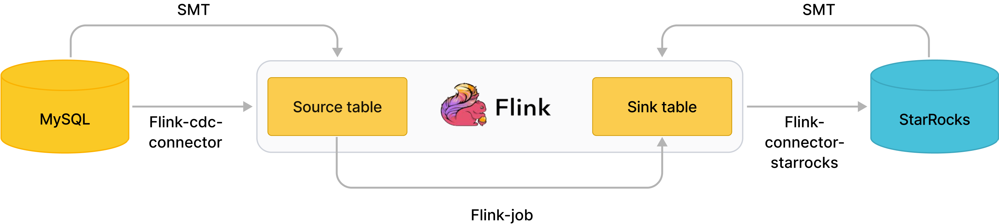

# StarRocks migration tool（SMT）

StarRocks migration tool（简称 SMT）是 StarRocks 提供的数据迁移工具，用于将源数据库的数据通过 Flink 导入 StarRocks。其主要有两个功能：

- 根据源数据库和目标 StarRocks 集群的信息，生成 StarRocks 建表语句。
- 生成 Flink 的 SQL 客户端 可执行的 SQL 语句，以提交同步数据的 Flink job，简化链路中全量或增量数据同步流程。

当前 SMT 支持的源数据库如下：

| 源数据库     | 表结构同步 | 全量同步 | 增量同步 |
| ---------- | ---------- | -------- | -------- |
| MySQL      | 支持       | 支持     | 支持     |
| PostgreSQL | 支持       | 支持     | 支持     |
| Oracle     | 支持       | 支持     | 支持     |
| Hive       | 支持       | 支持     | 不支持   |
| ClickHouse  | 支持       | 支持     | 不支持   |
| SQL Server  | 支持       | 支持     | 支持     |
| TiDB       | 支持       | 支持     | 支持     |
<!--pending clickhosue-->
下载链接：https://cdn-thirdparty.starrocks.com/smt.tar.gz?r=2

## SMT 使用步骤

通常分成三步：

1. 配置 conf/config_prod.conf 文件。
2. 执行 starrocks-migration-tool。
3. 运行结果默认生成在 result 目录中。

然后就可以执行 result 中的 SQL 脚本来进行元数据或者数据的同步了。

## SMT 配置

- `[db]` 段为数据源的连接信息，根据 type 不同配置对应数据源的连接信息即可。
- `[other]` 段为一些其他配置，建议修改 `be_num` 为实际的个数即可。
- `flink.starrocks.sink.*` 是 flink-connector-starrocks 的配置信息，参考[配置项说明](https://github.com/StarRocks/flink-connector-starrocks#sink-options)即可。
- `[table-rule.1]` 是数据源 table 匹配规则，可以根据正则表达式匹配数据库和表名生成建表的 SQL，也可以配置多个规则。每个规则都会生成对应的结果，例如：
   - `[table-rule.1]` -> `result/starrocks-create.1.sql`
   - `[table-rule.2]` -> `result/starrocks-create.2.sql`
   
   如果有多组规则，需要给每一组规则匹配 database，table 和 flink-connector-starrocks 的配置。

    ```Bash
    [table-rule.1]
    # pattern to match databases for setting properties
    database = ^ database1.*$
    # pattern to match tables for setting properties
    table = ^.*$
    schema = ^.*$
    ############################################
    ### flink sink configurations
    ### DO NOT set `connector`, `table-name`, `database-name`, they are auto-generated
    ############################################
    flink.starrocks.jdbc-url=jdbc:mysql://192.168.1.1:9030
    flink.starrocks.load-url= 192.168.1.1:8030
    flink.starrocks.username=root
    flink.starrocks.password=
    flink.starrocks.sink.max-retries=10
    flink.starrocks.sink.buffer-flush.interval-ms=15000
    flink.starrocks.sink.properties.format=json
    flink.starrocks.sink.properties.strip_outer_array=true

    [table-rule.2]
    # pattern to match databases for setting properties
    database = ^database2.*$
    # pattern to match tables for setting properties
    table = ^.*$
    schema = ^.*$
    ############################################
    ### flink sink configurations
    ### DO NOT set `connector`, `table-name`, `database-name`, they are auto-generated
    ############################################
    flink.starrocks.jdbc-url=jdbc:mysql://192.168.1.1:9030
    flink.starrocks.load-url= 192.168.1.1:8030
    flink.starrocks.username=root
    flink.starrocks.password=
    flink.starrocks.sink.max-retries=10
    flink.starrocks.sink.buffer-flush.interval-ms=15000
    flink.starrocks.sink.properties.format=json
    flink.starrocks.sink.properties.strip_outer_array=true
    ```

- 针对分库分表的大表可以单独配置一个规则，比如：有两个数据库 edu_db_1，edu_db_2，每个数据库下面分别有 course_1，course_2 两张表，并且所有表的数据结构都是相同的，通过如下配置把他们导入 StarRocks 的一张表中进行分析。

    ```Bash
    [table-rule.3]
    # pattern to match databases for setting properties
    database = ^edu_db_[0-9]*$
    # pattern to match tables for setting properties
    table = ^course_[0-9]*$
    schema = ^.*$
    ```

    这样会自动生成一个多对一的导入关系，在 StarRocks 默认生成的表名是 `course__auto_shard`，也可以自行在生成的配置文件中修改。

## 同步 MySQL 到 StarRocks

### 简介

通过 Flink CDC connector 和 SMT 可以实现 MySQL 数据的秒级同步。



如图所示，SMT 可以根据 MySQL 和 StarRocks 的集群信息和表结构自动生成 source table 和 sink table 的建表语句。

通过 Flink CDC connector 消费 MySQL 的 Binlog，经过 Flink-connector-starrocks 写入 StarRocks。

### 操作步骤

1. 下载 [Flink](https://flink.apache.org/downloads.html)，最低支持版本 1.11。
2. 下载 [Flink CDC connector](https://github.com/ververica/flink-cdc-connectors/releases)，请注意下载对应 Flink 版本的 flink-sql-connector-mysql-cdc-xxx.jar。
3. 下载 [Flink StarRocks connector](https://github.com/StarRocks/flink-connector-starrocks).
4. 复制 `flink-sql-connector-mysql-cdc-xxx.jar`, `flink-connector-starrocks-xxx.jar` 到 `flink-xxx/lib/`
5. 下载 [smt.tar.gz](https://cdn-thirdparty.starrocks.com/smt.tar.gz?r=2)
6. 解压并修改配置文件。

    ```Bash
    [db]
    host = 192.168.1.1
    port = 3306
    user = root
    password =  
    type = mysql

    [other]
    # number of backends in StarRocks
    be_num = 3
    # `decimal_v3` is supported since StarRocks-1.18.1
    use_decimal_v3 = false
    # directory to save the converted DDL SQL
    output_dir = ./result

    [table-rule.1]
    # pattern to match databases for setting properties
    database = ^db$
    # pattern to match tables for setting properties
    table = ^table$
    schema = ^.*$

    ############################################
    ### flink sink configurations
    ### DO NOT set `connector`, `table-name`, `database-name`, they are auto-generated
    ############################################
    flink.starrocks.jdbc-url=jdbc:mysql://192.168.1.1:9030
    flink.starrocks.load-url= 192.168.1.1:8030
    flink.starrocks.username=root
    flink.starrocks.password=
    flink.starrocks.sink.max-retries=10
    flink.starrocks.sink.buffer-flush.interval-ms=15000
    flink.starrocks.sink.properties.format=json
    flink.starrocks.sink.properties.strip_outer_array=true
    ```

7. 执行 starrocks-migrate-tool，所有建表语句都生成在 result 目录下。

    ```Bash
    $./starrocks-migrate-tool
    $ls result
    flink-create.1.sql    smt.tar.gz              starrocks-create.all.sql
    flink-create.all.sql  starrocks-create.1.sql  starrocks-external-create.all.sql
    ```

8. 生成 StarRocks 的表结构。

    ```Bash
    mysql -hxx.xx.xx.x -P9030 -uroot -p < starrocks-create.all.sql
    ```

9. 生成 Flink table 并开始同步。

    ```Bash
    bin/sql-client.sh embedded < flink-create.all.sql
    ```

    这个执行以后同步任务会持续执行。

10. 观察任务状况

    ```Bash
    bin/flink list 
    ```

    如果有任务请查看 log 日志，或者调整 conf 中的系统配置中内存和 slot。

### 注意事项

- 如何开启 MySQL binlog？

  1. 修改/etc/my.cnf

      ```plaintext
      #开启binlog日志
      log-bin=/var/lib/mysql/mysql-bin

      #log_bin=ON
      ##binlog日志的基本文件名
      #log_bin_basename=/var/lib/mysql/mysql-bin
      ##binlog文件的索引文件，管理所有binlog文件
      #log_bin_index=/var/lib/mysql/mysql-bin.index
      #配置serverid
      server-id=1
      binlog_format = row
      ```

  2. 重启 mysqld，然后可以通过 `SHOW VARIABLES LIKE 'log_bin';` 确认是否已经打开。

## 同步 PostgreSQL 到 StarRocks

### 简介

通过 Flink CDC connector 和 SMT 可以实现 PostgreSQL 数据的秒级同步。

SMT 可以根据 PostgreSQL 和 StarRocks 的集群信息和表结构自动生成 source table 和 sink table 的建表语句。

通过 Flink CDC connector 消费 PostgreSQL 的 WAL，经过 Flink-connector-starrocks 写入 StarRocks。

### 操作步骤

1. 下载 [Flink](https://flink.apache.org/downloads.html)，最低支持版本1.11。
2. 下载 [Flink CDC connector](https://github.com/ververica/flink-cdc-connectors/releases)，请注意下载对应 Flink 版本的 flink-sql-connector-postgres-cdc-xxx.jar。
3. 下载 [Flink StarRocks connector](https://github.com/StarRocks/flink-connector-starrocks)。
4. 复制 `flink-sql-connector-postgres-cdc-xxx.jar`, `flink-connector-starrocks-xxx.jar` 到 `flink-xxx/lib/`。
5. 下载 [smt.tar.gz](https://cdn-thirdparty.starrocks.com/smt.tar.gz?r=2)。
6. 解压并修改配置文件。

    ```Bash
    [db]
    host = 192.168.1.1
    port = 5432
    user = xxx
    password = xxx
    type = pgsql

    [other]
    # number of backends in StarRocks
    be_num = 3
    # `decimal_v3` is supported since StarRocks-1.18.1
    use_decimal_v3 = false
    # directory to save the converted DDL SQL
    output_dir = ./result

    [table-rule.1]
    # pattern to match databases for setting properties
    database = ^db$
    # pattern to match tables for setting properties
    table = ^table$
    # pattern to match schemas for setting properties
    schema = ^.*$

    ############################################
    ### flink sink configurations
    ### DO NOT set `connector`, `table-name`, `database-name`, they are auto-generated
    ############################################
    flink.starrocks.jdbc-url=jdbc:mysql://192.168.1.1:9030
    flink.starrocks.load-url= 192.168.1.1:8030
    flink.starrocks.username=root
    flink.starrocks.password=
    flink.starrocks.sink.max-retries=10
    flink.starrocks.sink.buffer-flush.interval-ms=15000
    flink.starrocks.sink.properties.format=json
    flink.starrocks.sink.properties.strip_outer_array=true
    ```

7. 执行 starrocks-migrate-tool，所有建表语句都生成在 result 目录下。

    ```Bash
    $./starrocks-migrate-tool
    $ls result
    flink-create.1.sql    smt.tar.gz              starrocks-create.all.sql
    flink-create.all.sql  starrocks-create.1.sql 
    ```

8. 生成 StarRocks 的表结构。

    ```Bash
    mysql -hxx.xx.xx.x -P9030 -uroot -p < starrocks-create.all.sql
    ```

9. 生成 Flink table 并开始同步。

    ```Bash
    bin/sql-client.sh embedded < flink-create.all.sql
    ```

    这个执行以后同步任务会持续执行。

10. 观察任务状况。

    ```Bash
    bin/flink list 
    ```

    如果有任务请查看 log  日志，或者调整 conf 中的系统配置中内存和 slot。

### 注意事项

1. 对于 9.* 版本的 PostgreSQL 需要特殊 flink-cdc 配置如下所示（建议使用 10+ 版本，否则需要自行安装 WAL 解析插件）：

    ```Bash
    ############################################
    ############################################
    ### flink-cdc plugin configuration for `postgresql`
    ############################################
    ### for `9.*` decoderbufs, wal2json, wal2json_rds, wal2json_streaming, wal2json_rds_streaming
    ### refer to https://ververica.github.io/flink-cdc-connectors/master/content/connectors/postgres-cdc.html 
    ### and https://debezium.io/documentation/reference/postgres-plugins.html
    ### flink.cdc.decoding.plugin.name = decoderbufs
    ```
    <!--pending-->
2. 如何开启 PostgreSQL WAL？

    ```Bash
    # 开启连接权限
    echo "host all all 0.0.0.0/32 trust" >> pg_hba.conf
    echo "host replication all 0.0.0.0/32 trust" >> pg_hba.conf
    # 开启 wal logical 复制
    echo "wal_level = logical" >> postgresql.conf
    echo "max_wal_senders = 2" >> postgresql.conf
    echo "max_replication_slots = 8" >> postgresql.conf
    ```

    对需要同步的表需要开启对应的复制完整数据流：

    ```SQL
    ALTER TABLE schema_name.table_name REPLICA IDENTITY FULL
    ```

    重启 PostgreSQL 即可。

## 同步 Oracle 到 StarRocks

### 简介

通过 Flink CDC connector 和 SMT 可以实现 Oracle 数据的秒级同步。

SMT 可以根据 Oracle 和 StarRocks 的集群信息和表结构自动生成 source table 和 sink table 的建表语句。

通过过 Flink CDC connector 消费 Oracle 的 logminer，经过 Flink-connector-starrocks 写入 StarRocks。

### 操作步骤

1. 下载 [Flink](https://flink.apache.org/downloads.html)，最低支持版本 1.11。
2. 下载 [Flink CDC connector](https://github.com/ververica/flink-cdc-connectors/releases)，请注意下载对应 Flink 版本的flink-sql-connector-oracle-cdc-xxx.jar。
3. 下载 [Flink StarRocks connector](https://github.com/StarRocks/flink-connector-starrocks)。
4. 复制 `flink-sql-connector-oracle-cdc-xxx.jar`, `flink-connector-starrocks-xxx.jar` 到 `flink-xxx/lib/`。
5. 下载 [smt.tar.gz](https://cdn-thirdparty.starrocks.com/smt.tar.gz?r=2)。
6. 解压并修改配置文件。

    ```Bash
    [db]
    host = 192.168.1.1
    port = 1521
    user = xxx
    password = xxx
    type = oracle

    [other]
    # number of backends in StarRocks
    be_num = 3
    # `decimal_v3` is supported since StarRocks-1.18.1
    use_decimal_v3 = false
    # directory to save the converted DDL SQL
    output_dir = ./result

    [table-rule.1]
    # pattern to match databases for setting properties
    database = ^db$
    # pattern to match tables for setting properties
    table = ^table$
    # pattern to match schemas for setting properties
    schema = ^.*$

    ############################################
    ### flink sink configurations
    ### DO NOT set `connector`, `table-name`, `database-name`, they are auto-generated
    ############################################
    flink.starrocks.jdbc-url=jdbc:mysql://192.168.1.1:9030
    flink.starrocks.load-url= 192.168.1.1:8030
    flink.starrocks.username=root
    flink.starrocks.password=
    flink.starrocks.sink.max-retries=10
    flink.starrocks.sink.buffer-flush.interval-ms=15000
    flink.starrocks.sink.properties.format=json
    flink.starrocks.sink.properties.strip_outer_array=true
    ```

7. 执行 starrocks-migrate-tool，所有建表语句都生成在 result 目录下。

    ```Bash
    $./starrocks-migrate-tool
    $ls result
    flink-create.1.sql    smt.tar.gz              starrocks-create.all.sql
    flink-create.all.sql  starrocks-create.1.sql 
    ```

8. 生成 StarRocks 的表结构。 

    ```Bash
    mysql -hxx.xx.xx.x -P9030 -uroot -p < starrocks-create.all.sql
    ```

9. 生成 Flink table 并开始同步。

    ```Bash
    bin/sql-client.sh embedded < flink-create.all.sql
    ```

    这个执行以后同步任务会持续执行。

10. 观察任务状况。

    ```Bash
    bin/flink list 
    ```

    如果有任务请查看 log 日志，或者调整 conf 中的系统配置中内存和 slot。

### 注意事项

- 通过 logminer 同步 Oracle：

    ```SQL
    # 开启日志
    alter system set db_recovery_file_dest = '/home/oracle/data' scope=spfile;
    alter system set db_recovery_file_dest_size = 10G;
    shutdown immediate;
    startup mount;
    alter database archivelog;
    alter database open;

    ALTER TABLE schema_name.table_name ADD SUPPLEMENTAL LOG DATA (ALL) COLUMNS;
    ALTER DATABASE ADD SUPPLEMENTAL LOG DATA;

    # 授权创建并授权用户
    GRANT CREATE SESSION TO flinkuser;
    GRANT SET CONTAINER TO flinkuser;
    GRANT SELECT ON V_$DATABASE TO flinkuser;
    GRANT FLASHBACK ANY TABLE TO flinkuser;
    GRANT SELECT ANY TABLE TO flinkuser;
    GRANT SELECT_CATALOG_ROLE TO flinkuser;
    GRANT EXECUTE_CATALOG_ROLE TO flinkuser;
    GRANT SELECT ANY TRANSACTION TO flinkuser;
    GRANT LOGMINING TO flinkuser;
    GRANT CREATE TABLE TO flinkuser;
    GRANT LOCK ANY TABLE TO flinkuser;
    GRANT ALTER ANY TABLE TO flinkuser;
    GRANT CREATE SEQUENCE TO flinkuser;
    GRANT EXECUTE ON DBMS_LOGMNR TO flinkuser;
    GRANT EXECUTE ON DBMS_LOGMNR_D TO flinkuser;
    GRANT SELECT ON V_$LOG TO flinkuser;
    GRANT SELECT ON V_$LOG_HISTORY TO flinkuser;
    GRANT SELECT ON V_$LOGMNR_LOGS TO flinkuser;
    GRANT SELECT ON V_$LOGMNR_CONTENTS TO flinkuser;
    GRANT SELECT ON V_$LOGMNR_PARAMETERS TO flinkuser;
    GRANT SELECT ON V_$LOGFILE TO flinkuser;
    GRANT SELECT ON V_$ARCHIVED_LOG TO flinkuser;
    GRANT SELECT ON V_$ARCHIVE_DEST_STATUS TO flinkuser;
    ```

- [table-rule.1] 中的db配置不支持正则，只可以写完整的db名称。<!--pending-->
- 由于 Oracle12c 开始支持了 CDB 模式，SMT 内部会自动判断是否开启了 CDB，并自动修改对应的 flink-cdc 配置项。但用户需要注意的是 [db].user 的配置需要注意是否添加 c## 前缀，防止无权限访问的问题发生。<!--pending-->

## 同步 Hive 到 StarRocks

### 简介

介绍如何使用 SMT 同步 Hive 数据至 StarRocks 时，会创建 StarRocks 明细表，并且使用 Flink 任务来进行数据的同步。
<!--pending一种是Hive外表同步，也就是仅仅创建Hive外表，然后可以通过外表直接查询Hive。-->

### 操作步骤

#### 准备配置

```SQL
[db]
# hiveserver2 service ip
host = 127.0.0.1
# hiveserver2 service port
port = 10000        
user = hive/emr-header-1.cluster-49148
password = 
type = hive
# only takes effect with `type = hive`.
# Available values: kerberos, none, nosasl, kerberos_http, none_http, zk, ldap
authentication = kerberos
```

支持以下三种认证方式：
- nosasl，zk： user password 留空即可。
- none，none_http ，ldap： 填入对应的 user password 即可。
- kerberos，kerberos_http：此时需要如下操作：
  1. 在 Hive 集群执行 kadmin.local, 并查看 list_principals 找到对应的principal 名称，如：`hive/emr-header-1.cluster-49148@EMR.49148.COM`，那么 user 就需要设置为 `hive/emr-header-1.cluster-49148`，password 留空即可。
  2. 在执行 SMT 的机器上先执行 `kinit -kt  /path/to/keytab  principal` 并执行 klis t查看是否已有正确的 token 生成。

<!--pending
#### Hive 外表同步
1. 执行 ./starrocks-migrate-tool 
2. 在 StarRocks 中执行 result/starrocks-external-create.all.sql 即可。
-->

#### 同步数据

1. 执行 ./starrocks-migrate-tool。
2. 在 StarRocks 中执行 result/starrocks-create.all.sql 创建 StarRocks 的同步表结构。

    ```bash
    mysql -hxx.xx.xx.x -P9030 -uroot -p < starrocks-create.all.sql
    ```

3. 在 flink/conf/ 中建立 sql-client-defaults.yaml 并编辑如下：

    ```YAML
    execution:
    planner: blink
    type: batch
    current-catalog: hive-starrocks
    catalogs:
    - name: hive-starrocks
    type: hive
    hive-conf-dir: /path/to/apache-hive-xxxx-bin/conf
    ```

4. 在 Flink 对应版本的 Hive 界面下载[依赖包](https://nightlies.apache.org/flink/flink-docs-release-1.13/zh/docs/connectors/table/hive/overview/)(flink-sql-connector-hive-xxxx) 并放入 flink/lib 目录下。
5. 启动 Flink 集群，并执行 `flink/bin/sql-client.sh embedded < result/flink-create.all.sql` 即可开始同步。

## 同步 SQL Server 到 StarRocks

### 简介

通过 Flink CDC connector 和 SMT 可以实现 SQL Server 数据的秒级同步。

SMT 可以根据 SQL Server 和 StarRocks 的集群信息和表结构自动生成 source table 和 sink table 的建表语句。

通过 Flink CDC connector 捕获并记录 SQL Server 数据库服务器中发生的行级变更，其原理是使用 SQL Server 自身提供的 CDC 特性，SQL Server 自身提供的 CDC 能力可以将数据库中指定的变更存档到指定的 change tables 中。SQL Server CDC 连接器首先通过 JDBC 读取表中的历史数据，再从 change tables 中或缺增量变更数据，从而实现全增量同步。之后再经过Flink-connector-starrocks 将变更数据写入 StarRocks。<!--pending-->

### 操作步骤

1. 下载 [Flink](https://flink.apache.org/downloads.html)，最低支持版本 1.11。
2. 下载 [Flink CDC connector](https://github.com/ververica/flink-cdc-connectors/releases)，请注意下载对应 Flink 版本的flink-sql-connector-sqlserver-cdc-xxx.jar。
3. 下载 [Flink StarRocks connector](https://github.com/StarRocks/flink-connector-starrocks)。
4. 复制 `flink-sql-connector-sqlserver-cdc-xxx.jar`, `flink-connector-starrocks-xxx.jar` 到 `flink-xxx/lib/`。
5. 下载 [smt.tar.gz](https://cdn-thirdparty.starrocks.com/smt.tar.gz?r=2)。
6. 解压并修改配置文件。

    ```Bash
    [db]
    host = 127.0.0.1
    port = 1433
    user = xxx
    password = xxx 

    # currently available types: `mysql`, `pgsql`, `oracle`, `hive`, `clickhouse`
    type = sqlserver 

    [other]
    # number of backends in StarRocks
    be_num = 3
    # `decimal_v3` is supported since StarRocks-1.18.1
    use_decimal_v3 = false
    # directory to save the converted DDL SQL
    output_dir = ./result

    [table-rule.1]
    # pattern to match databases for setting properties
    database = ^db$
    # pattern to match tables for setting properties
    table = ^table$
    schema = ^.*$

    ############################################
    ### flink sink configurations
    ### DO NOT set `connector`, `table-name`, `database-name`, they are auto-generated
    ############################################
    flink.starrocks.jdbc-url=jdbc:mysql://192.168.1.1:9030
    flink.starrocks.load-url= 192.168.1.1:8030
    flink.starrocks.username=root
    flink.starrocks.password=
    flink.starrocks.sink.max-retries=10
    flink.starrocks.sink.buffer-flush.interval-ms=15000
    flink.starrocks.sink.properties.format=json
    flink.starrocks.sink.properties.strip_outer_array=true
    ```

7. 执行 starrocks-migrate-tool，所有建表语句都生成在 result 目录下。

    ```Bash
    $./starrocks-migrate-tool
    $ls result
    flink-create.1.sql    smt.tar.gz              starrocks-create.all.sql
    flink-create.all.sql  starrocks-create.1.sql  starrocks-external-create.all.sql
    ```

8. 生成 StarRocks 的表结构。

    ```Bash
    mysql -hxx.xx.xx.x -P9030 -uroot -p < starrocks-create.all.sql
    ```

9. 生成 Flink table 并开始同步。

    ```Bash
    bin/sql-client.sh embedded < flink-create.all.sql
    ```

    这个执行以后同步任务会持续执行。

10. 观察任务状况。

    ```Bash
    bin/flink list 
    ```

    如果有任务请查看 log 日志，或者调整 conf 中的系统配置中内存和 slot。

### 注意事项

1. 确保 Server Agent Service 开启。

    检查 Server Agent Service 是否正常启动。

    ```sql
    EXEC master.dbo.xp_servicecontrol N'QUERYSTATE', N'SQLSERVERAGENT'
    GO
    ```

    开启 Server Agent Service。

    ```Bash
    /opt/mssql/bin/mssql-conf set sqlagent.enabled true
    ```

2. 确保对应数据库开启 CDC。

    查看是否开启。

    ```sql
    select is_cdc_enabled, name from sys.databases where name = 'XXX_databases'
    GO
    ```

    开启 CDC。

    :::note
    
    执行此操作时，需确保用户 serverRole 为 sysadmin。
    
    :::

    ```SQL
    USE XXX_databases
    GO
    EXEC sys.sp_cdc_enable_db
    GO
    ```

3. 确保对应数据表开启 CDC。

    ```SQL
    EXEC sys.sp_cdc_enable_table 
    @source_schema = 'XXX_schema', 
    @source_name = 'XXX_table', 
    @role_name = NULL, 
    @supports_net_changes = 0;
    GO
    ```

## 同步 TiDB 到 StarRocks 

### 简介

通过 Flink CDC connector 和 SMT 可以实现 TiDB 数据的秒级同步。

SMT 可以根据 TiDB 和 StarRocks 的集群信息和表结构自动生成 source table 和 sink table 的建表语句。

通过 Flink CDC connector 直接读取其底层 TiKV 存储中的全量数据和增量数据实现数据捕获，其中全量部分是通过按 key 划分 range 读取，增量部分使用 TiDB 提供的 CDC Client 获取增量变更数据，之后再经过 Flink-connector-starrocks 写入 StarRocks。

### 操作步骤

1. 下载 [Flink](https://flink.apache.org/downloads.html)，最低支持版本 1.11。
2. 下载 [Flink CDC connector](https://github.com/ververica/flink-cdc-connectors/releases)，请注意下载对应 Flink 版本的 flink-sql-connector-tidb-cdc-xxx.jar。
3. 下载 [Flink StarRocks connector](https://github.com/StarRocks/flink-connector-starrocks)。
4. 复制 `flink-sql-connector-tidb-cdc-xxx.jar`, `flink-connector-starrocks-xxx.jar` 到 `flink-xxx/lib/`。
5. 下载 [smt.tar.gz](https://cdn-thirdparty.starrocks.com/smt.tar.gz?r=2)。
6. 解压并修改配置文件。

    ```Bash
    [db]
    host = 127.0.0.1
    port = 4000
    user = root
    password = 
    # currently available types: `mysql`, `pgsql`, `oracle`, `hive`, `clickhouse`, `sqlserver`, `tidb`
    type = tidb 
    # # only takes effect on `type == hive`. 
    # # Available values: kerberos, none, nosasl, kerberos_http, none_http, zk, ldap
    # authentication = kerberos

    [other]
    # number of backends in StarRocks
    be_num = 3
    # `decimal_v3` is supported since StarRocks-1.18.1
    use_decimal_v3 = false
    # directory to save the converted DDL SQL
    output_dir = ./result

    [table-rule.1]
    # pattern to match databases for setting properties
    database = ^db$
    # pattern to match tables for setting properties
    table = ^table$
    schema = ^.*$

    ############################################
    ### flink sink configurations
    ### DO NOT set `connector`, `table-name`, `database-name`, they are auto-generated
    ############################################
    flink.starrocks.jdbc-url=jdbc:mysql://192.168.1.1:9030
    flink.starrocks.load-url= 192.168.1.1:8030
    flink.starrocks.username=root
    flink.starrocks.password=
    flink.starrocks.sink.max-retries=10
    flink.starrocks.sink.buffer-flush.interval-ms=15000
    flink.starrocks.sink.properties.format=json
    flink.starrocks.sink.properties.strip_outer_array=true

    ############################################
    ### flink-cdc configuration for `tidb`
    ############################################
    # # Only takes effect on TiDB before v4.0.0. 
    # # TiKV cluster's PD address.
    # flink.cdc.pd-addresses = 127.0.0.1:2379
    ```

7. 执行 starrocks-migrate-tool，所有建表语句都生成在 result 目录下。

    ```Bash
    $./starrocks-migrate-tool
    $ls result
    flink-create.1.sql    smt.tar.gz              starrocks-create.all.sql
    flink-create.all.sql  starrocks-create.1.sql  starrocks-external-create.all.sql
    ```

8. 生成 StarRocks 的表结构。

    ```Bash
    mysql -hxx.xx.xx.x -P9030 -uroot -p < starrocks-create.all.sql
    ```

9. 生成 Flink table 并开始同步。

    ```Bash
    bin/sql-client.sh embedded < flink-create.all.sql
    ```

    这个执行以后同步任务会持续执行。

10. 观察任务状况。

    ```Bash
    bin/flink list 
    ```

    如果有任务请查看 log 日志，或者调整 conf 中的系统配置中内存和 slot。

### 注意事项

Tidb v4.0.0 之前的版本需要额外配置 flink.cdc.pd-addresses。

```Bash
############################################
### flink-cdc configuration for `tidb`
############################################
# # Only takes effect on TiDB before v4.0.0. 
# # TiKV cluster's PD address.
# flink.cdc.pd-addresses = 127.0.0.1:2379
```
