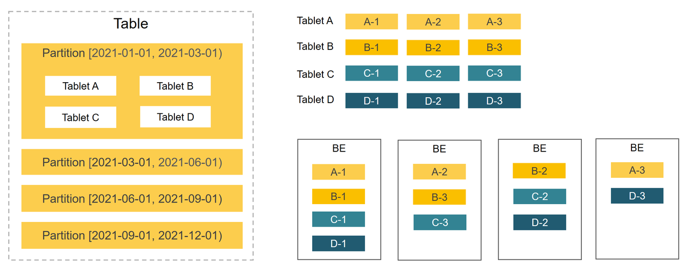

# 系统架构

StarRocks 架构简洁，整个系统的核心只有 FE（Frontend）、BE（Backend）两类进程，不依赖任何外部组件，方便部署与维护。FE 和 BE 模块都可以在线水平扩展，元数据和业务数据都有副本机制，确保整个系统无单点。StarRocks 提供 MySQL 协议接口，支持标准 SQL 语法。用户可通过 MySQL 客户端方便地查询和分析 StarRocks 中的数据。

## 系统架构图

### FE

FE 是 StarRocks 的前端节点，负责管理元数据，管理客户端连接，进行查询规划，查询调度等工作。每个 FE 节点都会在内存保留一份完整的元数据，这样每个 FE 节点都能够提供无差别的服务。

FE 有三种角色：Leader FE，Follower FE 和 Observer FE。Follower 会通过类 Paxos 的 Berkeley DB Java Edition（BDBJE）协议自动选举出一个 Leader。三者区别如下：

- Leader
  - Leader 从 Follower 中自动选出，进行选主需要集群中有半数以上的 Follower 节点存活。如果 Leader 节点失败，Follower 会发起新一轮选举。
  - Leader FE 提供元数据读写服务。只有 Leader 节点会对元数据进行写操作，Follower 和 Observer 只有读取权限。Follower 和 Observer 将元数据写入请求路由到 Leader 节点，Leader 更新完数据后，会通过 BDB JE 同步给 Follower 和 Observer。必须有半数以上的 Follower 节点同步成功才算作元数据写入成功。

- Follower
  - 只有元数据读取权限，无写入权限。通过回放 Leader 的元数据日志来异步同步数据。
  - 参与 Leader 选举，必须有半数以上的 Follower 节点存活才能进行选主。

- Observer
  - 主要用于扩展集群的查询并发能力，可选部署。
  - 不参与选主，不会增加集群的选主压力。
  - 通过回放 Leader 的元数据日志来异步同步数据。

### BE

BE 是 StarRocks 的后端节点，负责数据存储、SQL执行等工作。

- 数据存储方面，StarRocks 的 BE 节点都是完全对等的，FE 按照一定策略将数据分配到对应的 BE 节点。BE 负责将导入数据写成对应的格式存储下来，并生成相关索引。

- 在执行 SQL 计算时，一条 SQL 语句首先会按照具体的语义规划成逻辑执行单元，然后再按照数据的分布情况拆分成具体的物理执行单元。物理执行单元会在对应的数据存储节点上执行，这样可以实现本地计算，避免数据的传输与拷贝，从而能够得到极致的查询性能。

> 在进行 Stream load 导入时，FE 会选定一个 BE 节点作为 Coordinator BE，负责将数据分发到其他 BE 节点。导入的最终结果由 Coordinator BE 返回给用户。更多信息，参见 [Stream load](../loading/StreamLoad.md)。

## 数据管理

StarRocks 使用列式存储，采用分区分桶机制进行数据管理。一张表可以被划分成多个分区，如将一张表按照时间来进行分区，粒度可以是一天，或者一周等。一个分区内的数据可以根据一列或者多列进行分桶，将数据切分成多个 Tablet。Tablet 是 StarRocks 中最小的数据管理单元。每个 Tablet 都会以多副本 (replica) 的形式存储在不同的 BE 节点中。您可以自行指定 Tablet 的个数和大小。 StarRocks 会管理好每个 Tablet 副本的分布信息。

下图展示了 StarRocks 的数据划分以及 Tablet 多副本机制。图中，表按照日期划分为 4 个分区，第一个分区进一步切分成 4 个 Tablet。每个 Tablet 使用 3 副本进行备份，分布在 3 个不同的 BE 节点上。

由于一张表被切分成了多个 Tablet，StarRocks 在执行 SQL 语句时，可以对所有 Tablet 实现并发处理，从而充分的利用多机、多核提供的计算能力。用户也可以利用 StarRocks 数据的切分方式，将高并发请求压力分摊到多个物理节点，从而可以通过增加物理节点的方式来扩展系统支持高并发的能力。

Tablet 的分布方式与具体的物理节点没有相关性。在 BE 节点规模发生变化时，比如在扩容、缩容时，**StarRocks 可以做到无需停止服务，直接完成节点的增减。**节点的变化会触发 Tablet 的自动迁移。当节点增加时，一部分 Tablet 会在后台自动被均衡到新增的节点，从而使得数据能够在集群内分布的更加均衡。在节点减少时，下线机器上的 Tablet 会被自动均衡到其他节点，从而自动保证数据的副本数不变。管理员能够非常容易地实现 StarRocks 的弹性伸缩，无需手工进行任何数据的重分布。

StarRocks 支持 **Tablet 多副本存储**，默认副本数为三个。**多副本能够保证数据存储的高可靠以及服务的高可用。**在使用三副本的情况下，一个节点的异常不会影响服务的可用性，集群的读、写服务仍然能够正常进行。另外，增加副本数还有助于提高系统的高并发查询能力。
