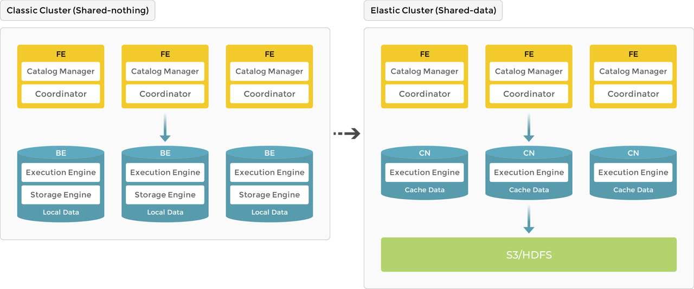
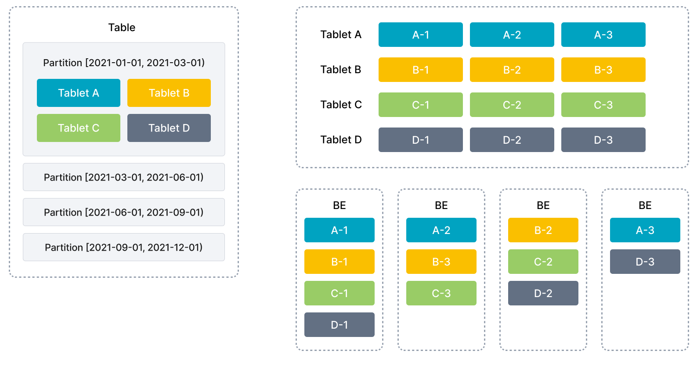
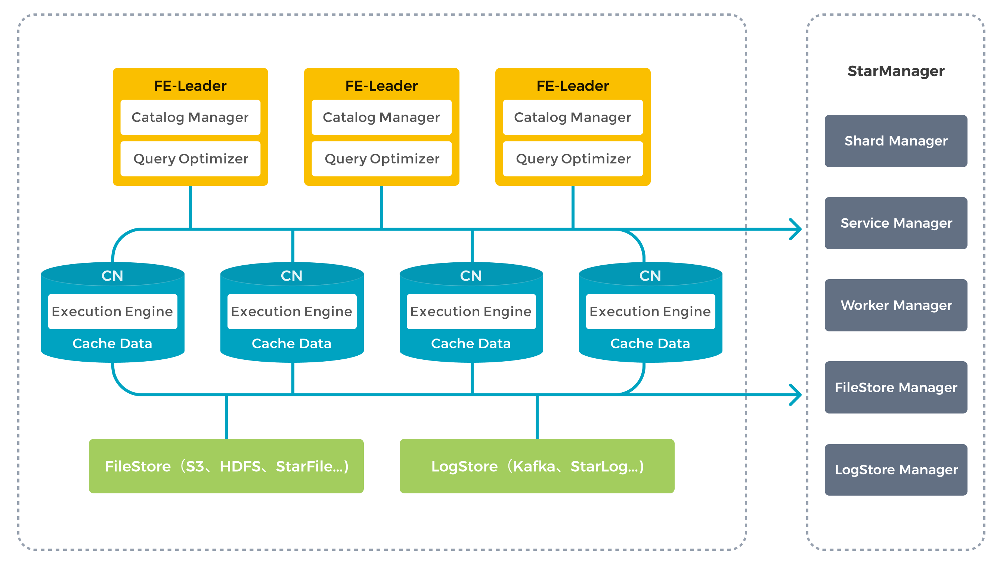

# 系统架构

StarRocks 架构简洁，整个系统的核心只有 FE（Frontend）、BE (Backend) 或 CN (Compute Node) 两类进程，方便部署与维护，节点可以在线水平扩展，元数据和业务数据都有副本机制，确保整个系统无单点。StarRocks 提供 MySQL 协议接口，支持标准 SQL 语法。用户可通过 MySQL 客户端方便地查询和分析 StarRocks 中的数据。

随着 StarRocks 产品的不断演进，系统架构也从原先的存算一体 (shared-nothing) 进化到存算分离 (shared-data)。

- 3.0 版本之前使用存算一体架构，BE 同时负责数据存储和计算，数据访问和分析都在本地进行，提供极速的查询分析体验。
- 3.0 版本开始引入存算分离架构，数据存储功能从原来的 BE 中抽离，BE 节点升级为无状态的 CN 节点。数据可持久存储在远端对象存储或 HDFS 上，CN 本地磁盘只用于缓存热数据来加速查询。存算分离架构下支持动态增删计算节点，实现秒级的扩缩容能力。

下图展示了存算一体到存算分离的架构演进。

## 存算一体

作为 MPP 数据库的典型代表，StarRocks 3.0 版本之前使用存算一体 (shared-nothing) 架构，BE 同时负责数据存储和计算，在查询时可以直接访问 BE 本地数据，进行本地计算，避免数据传输与拷贝，从而能够得到极速的查询分析性能。存算一体架构支持数据的多副本存储，提升了集群的高并发查询能力和数据可靠性。存算一体适用于追求极致查询性能的场景。

### 节点介绍

存算一体架构下，StarRocks 由 FE 和 BE 组成：FE 负责元数据管理和构建执行计划；BE 负责实际执行以及数据存储管理，BE 采用本地存储，通过多副本的机制保证高可用。

#### FE

FE 是 StarRocks 的前端节点，负责管理元数据、管理客户端连接、进行查询规划、查询调度等工作。每个 FE 节点都会在内存保留一份完整的元数据，这样每个 FE 节点都能够提供无差别的服务。

FE 有三种角色：Leader FE，Follower FE 和 Observer FE，区别如下。

| **FE 角色** | **元数据读写**                                               | **Leader 选举**                                          |
| --------------- | ------------------------------------------------------------ | ------------------------------------------------------------ |
| Leader          | Leader FE 提供元数据读写服务，Follower 和 Observer 只有读取权限，无写入权限。Follower 和 Observer 将元数据写入请求路由到 Leader，Leader 更新完元数据后，会通过 BDB JE (Berkeley DB Java Edition) 同步给 Follower 和 Observer。必须有半数以上的 Follower 节点同步成功才算作元数据写入成功。 | Leader 从 Follower 中自动选出。如果当前 Leader 节点失败，Follower 会发起新一轮选举。 |
| Follower        | 只有元数据读取权限，无写入权限。通过回放 Leader 的元数据日志来异步同步数据。 | Follower 参与 Leader 选举，会通过类 Paxos 的 BDBJE 协议自动选举出一个 Leader，必须有半数以上的 Follower 节点存活才能进行选主。 |
| Observer        | 同 Follower。                                                | Observer 主要用于扩展集群的查询并发能力，可选部署。Observer 不参与选主，不会增加集群的选主压力。 |

#### BE

BE 是 StarRocks 的后端节点，负责数据存储和 SQL 计算等工作。

- 数据存储方面，BE 节点都是完全对等的。FE 按照一定策略将数据分配到对应的 BE 节点，BE 负责将导入数据写成对应的格式存储下来，并生成相关索引。
- 在执行 SQL 计算时，一条 SQL 语句首先会按照语义规划成逻辑执行单元，然后再按照数据的分布情况拆分成具体的物理执行单元。物理执行单元会在对应的 BE 节点上执行，这样可以实现本地计算，避免数据的传输与拷贝，从而得到极速的查询性能。

### 数据管理

StarRocks 使用列式存储，采用分区分桶机制进行数据管理。一张表可以被划分成多个分区，一个分区内的数据可以根据一列或者多列进行分桶，将数据切分成多个 Tablet。Tablet 是 StarRocks 中最小的数据管理单元。每个 Tablet 都会以多副本 (replica) 的形式存储在不同的 BE 节点中。用户可以自行指定 Tablet 的个数和大小，StarRocks 会管理好每个 Tablet 副本的分布信息。

下图展示了 StarRocks 的数据划分以及 Tablet 多副本机制。表按照日期划分为 4 个分区，第一个分区进一步切分成 4 个 Tablet。每个 Tablet 使用 3 副本进行备份，分布在 3 个不同的 BE 节点上。

在执行 SQL 语句时，StarRocks 可以对所有 Tablet 实现并发处理，从而充分利用多机、多核提供的计算能力。用户也可以将高并发请求压力分摊到多个物理节点，通过增加物理节点的方式来扩展系统的高并发能力。

StarRocks 支持 Tablet 多副本存储（默认三个），多副本能够保证数据存储的高可靠以及服务的高可用。在三副本下，一个节点的异常不会影响服务的可用性，集群的读写服务仍然能够正常进行。增加副本数还有助于提高系统的高并发查询能力。

在 BE 节点数量发生变化时 （比如扩缩容时），StarRocks 可以自动完成节点的增减，无需停止服务。节点变化会触发 Tablet 的自动迁移。当节点增加时，一部分 Tablet 会自动均衡到新增的节点，保证数据能够在集群内分布的更加均衡；当节点减少时，待下线机器上的 Tablet 会被自动均衡到其他节点，从而自动保证数据的副本数不变。管理员能够非常容易的实现弹性伸缩，无需手工进行数据的重分布。

存算一体架构的优势在于极速的查询性能，但也存在一些局限性：

- 成本高：需要使用三副本保证数据可靠性；随着用户存储数据量的增加，需要不断扩容存储资源，导致计算资源浪费。
- 架构复杂：存算一体架构需要维护多数据副本的一致性，增加了系统的复杂度。
- 弹性不够：存算一体模式下，扩缩容会触发数据重新平衡，弹性体验不佳。

## 存算分离

StarRocks 存算分离技术在现有存算一体架构的基础上，将计算和存储进行解耦。在存算分离新架构中，数据持久化存储在更为可靠和廉价的远程对象存储（比如 S3）或 HDFS 上。CN 本地磁盘只用于缓存热数据来加速查询。在本地缓存命中的情况下，存算分离可以获得与存算一体架构相同的查询性能。存算分离架构下，用户可以动态增删计算节点，实现秒级的扩缩容。存算分离大大降低了数据存储成本和扩容成本，有助于实现资源隔离和计算资源的弹性伸缩。

与存算一体架构类似，存算分离版本拥有同样简洁的架构，整个系统依然只有 FE 和 CN 两种服务进程，用户唯一需要额外提供的是后端对象存储。

### 节点介绍

存算分离架构下，FE 的功能保持不变。BE 原有的存储功能被抽离，数据存储从本地存储 (local storage) 升级为共享存储 (shared storage)。BE 节点升级为无状态的 CN 节点，只缓存热数据。CN 会执行数据导入、查询计算、缓存数据管理等任务。

### 存储

目前，StarRocks 存算分离技术支持如下后端存储方式，用户可根据需求自由选择：

- 兼容 AWS S3 协议的对象存储系统（支持主流的对象存储系统如 AWS S3、Google GCP、阿里云 OSS、腾讯云 COS、百度云 BOS、华为云 OBS 以及 MinIO 等）
- Azure Blob Storage
- 传统数据中心部署的 HDFS

在数据格式上，StarRocks 存算分离数据文件与存算一体保持一致，各种索引技术在存算分离表中也同样适用，不同的是，描述数据文件的元数据（如 TabletMeta 等）被重新设计以更好地适应对象存储。

### 缓存

为了提升存算分离架构的查询性能，StarRocks 构建了分级的数据缓存体系，将最热的数据缓存在内存中，距离计算最近，次热数据则缓存在本地磁盘，冷数据位于对象存储，数据根据访问频率在三级存储中自由流动。

查询时，热数据通常会直接从缓存中命中，而冷数据则需要从对象存储中读取并填充至本地缓存，以加速后续访问。通过内存、本地磁盘、远端存储，StarRocks 存算分离构建了一个多层次的数据访问体系，用户可以指定数据冷热规则以更好地满足业务需求，让热数据靠近计算，真正实现高性能计算和低成本存储。

StarRocks 存算分离的统一缓存允许用户在建表时决定是否开启缓存。如果开启，数据写入时会同步写入本地磁盘以及后端对象存储，查询时，CN 节点会优先从本地磁盘读取数据，如果未命中，再从后端对象存储读取原始数据并同时缓存在本地磁盘。

同时，针对未被缓存的冷数据，StarRocks 也进行了针对性优化，可根据应用访问模式，利用数据预读技术、并行扫描技术等手段，减少对于后端对象存储的访问频次，提升查询性能。
