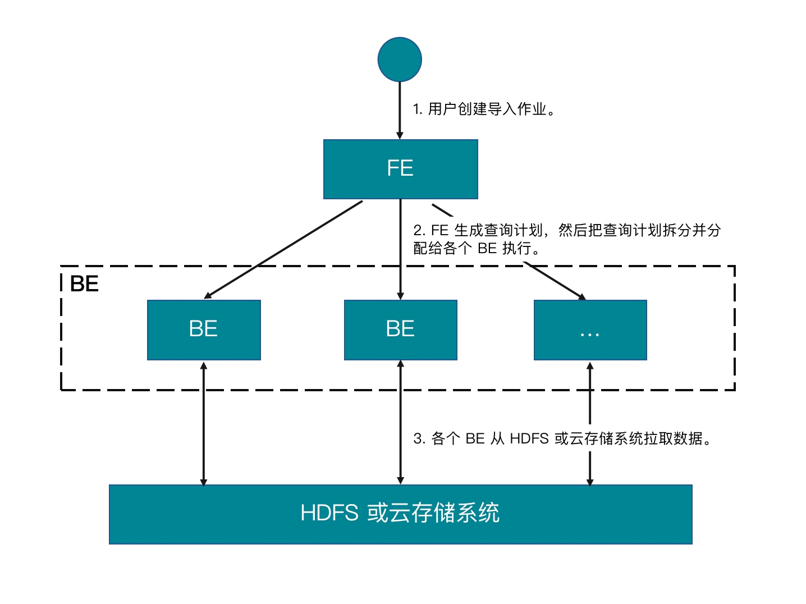

# 从 HDFS 或外部云存储系统导入数据

StarRocks 提供基于 MySQL 协议的 Broker Load 导入方式，帮助您从 HDFS 或外部云存储系统导入大批量数据。

Broker Load 是一种异步的导入方式。您提交导入作业以后，StarRocks 会异步地执行导入作业。您需要通过 [SHOW LOAD](../sql-reference/sql-statements/data-manipulation/SHOW_LOAD.md) 语句或者 curl 命令来查看导入作业的结果。

Broker Load 支持单表导入 (Single-Table Load) 和多表导入 (Multi-Table Load)。您可以通过单次导入操作，把一个或多个数据文件导入单张或多张目标表。而且 Broker Load 能够保证单次导入事务的原子性，即单次导入的多个数据文件都成功或者都失败，而不会出现部分导入成功、部分导入失败的情况。

Broker Load 支持在导入过程中做数据转换、以及通过 UPSERT 和 DELETE 操作实现数据变更。请参见[导入过程中实现数据转换](../loading/Etl_in_loading.md)和[通过导入实现数据变更](../loading/Load_to_Primary_Key_tables.md)。

## 背景信息

在 v2.4 及以前版本，StarRocks 在执行 Broker Load 时需要借助 Broker 才能访问外部存储系统，称为“有 Broker 的导入”。导入语句中需要通过 `WITH BROKER "<broker_name>"` 来指定使用哪个 Broker。Broker 是一个独立的无状态服务，封装了文件系统接口。通过 Broker，StarRocks 能够访问和读取外部存储系统上的数据文件，并利用自身的计算资源对数据文件中的数据进行预处理和导入。

自 v2.5 起，StarRocks 在执行 Broker Load 时不需要借助 Broker 即可访问外部存储系统，称为“无 Broker 的导入”。导入语句中也不再需要指定 `broker_name`，但继续保留 `WITH BROKER` 关键字。

需要注意的是，无 Broker 的导入在数据源为 HDFS 的某些场景下会受限，例如，在多 HDFS 集群或者多 Kerberos 用户的场景。在这些场景下，可以继续采用有 Broker 的导入，需要确保至少部署了一组独立的 Broker。有关各种场景下如何指定认证方式和 HA 配置，参见 [HDFS](../sql-reference/sql-statements/data-manipulation/BROKER_LOAD.md##hdfs)。

> **说明**
>
> 您可以通过 [SHOW BROKER](../sql-reference/sql-statements/Administration/SHOW_BROKER.md) 语句来查看 StarRocks 集群中已经部署的 Broker。如果集群中没有部署 Broker，请参见[部署 Broker 节点](../deployment/deploy_broker.md)完成 Broker 部署。

## 支持的数据文件格式

Broker Load 支持如下数据文件格式：

- CSV

- Parquet

- ORC

> **说明**
>
> 对于 CSV 格式的数据，需要注意以下两点：
>
> - StarRocks 支持设置长度最大不超过 50 个字节的 UTF-8 编码字符串作为列分隔符，包括常见的逗号 (,)、Tab 和 Pipe (|)。
> - 空值 (null) 用 `\N` 表示。比如，数据文件一共有三列，其中某行数据的第一列、第三列数据分别为 `a` 和 `b`，第二列没有数据，则第二列需要用 `\N` 来表示空值，写作 `a,\N,b`，而不是 `a,,b`。`a,,b` 表示第二列是一个空字符串。

## 支持的外部存储系统

Broker Load 支持从如下外部存储系统导入数据：

- HDFS

- AWS S3

- Google GCS

- 阿里云 OSS

- 腾讯云 COS

- 华为云 OBS

- 其他兼容 S3 协议的对象存储（如 MinIO）

## 基本原理

提交导入作业以后，FE 会生成对应的查询计划，并根据目前可用 BE 的个数和源数据文件的大小，将查询计划分配给多个 BE 执行。每个 BE 负责执行一部分导入任务。BE 在执行过程中，会从 HDFS 或云存储系统拉取数据，并且会在对数据进行预处理之后将数据导入到 StarRocks 中。所有 BE 均完成导入后，由 FE 最终判断导入作业是否成功。

下图展示了 Broker Load 的主要流程：



## 基本操作

### 创建多表导入 (Multi-Table Load) 作业

这里以 CSV 格式的数据为例，介绍如何导入多个数据文件至多张目标表。有关如何导入其他格式的数据、以及 Broker Load 的详细语法和参数说明，请参见 [BROKER LOAD](../sql-reference/sql-statements/data-manipulation/BROKER_LOAD.md)。

注意在 StarRocks 中，部分文字是 SQL 语言的保留关键字，不能直接用于 SQL 语句。如果想在 SQL 语句中使用这些保留关键字，必须用反引号 (`) 包裹起来。参见[关键字](../sql-reference/sql-statements/keywords.md)。

#### 数据样例

1. 在本地文件系统中创建 CSV 格式的数据文件。

   a. 创建一个名为 `file1.csv` 的数据文件。文件一共包含三列，分别代表用户 ID、用户姓名和用户得分，如下所示：

      ```Plain
      1,Lily,23
      2,Rose,23
      3,Alice,24
      4,Julia,25
      ```

   b. 创建一个名为 `file2.csv` 的数据文件。文件一共包含两列，分别代表城市 ID 和城市名称，如下所示：

      ```Plain
      200,'北京'
      ```

2. 把创建好的数据文件 `file1.csv` 和 `file2.csv` 分别上传到 HDFS 集群的 `/user/starrocks/` 路径下、AWS S3 存储空间 `bucket_s3` 里的 `input` 文件夹下、 Google GCS 存储空间 `bucket_gcs` 里的 `input` 文件夹下、阿里云 OSS 存储空间 `bucket_oss` 里的 `input` 文件夹下、腾讯云 COS 存储空间 `bucket_cos` 里的 `input` 文件夹下、华为云 OBS 存储空间 `bucket_obs` 里的 `input` 文件夹下、以及其他兼容 S3 协议的对象存储空间（如 MinIO） `bucket_minio` 里的 `input` 文件夹下。

3. 在 StarRocks 数据库 `test_db` 中创建 StarRocks 表。

   > **说明**
   >
   > 自 2.5.7 版本起，StarRocks 支持在建表和新增分区时自动设置分桶数量 (BUCKETS)，您无需手动设置分桶数量。更多信息，请参见 [确定分桶数量](../table_design/Data_distribution.md#确定分桶数量)。

   a. 创建一张名为 `table1` 的主键模型表。表包含 `id`、`name` 和 `score` 三列，分别代表用户 ID、用户名称和用户得分，主键为 `id` 列，如下所示：

      ```SQL
      CREATE TABLE `table1`
      (
          `id` int(11) NOT NULL COMMENT "用户 ID",
          `name` varchar(65533) NULL DEFAULT "" COMMENT "用户姓名",
          `score` int(11) NOT NULL DEFAULT "0" COMMENT "用户得分"
      )
          ENGINE=OLAP
          PRIMARY KEY(`id`)
          DISTRIBUTED BY HASH(`id`) BUCKETS 10;
      ```

   b. 创建一张名为 `table2` 的主键模型表。表包含 `id` 和 `city` 两列，分别代表城市 ID 和城市名称，主键为 `id` 列，如下所示：

      ```SQL
      CREATE TABLE `table2`
      (
          `id` int(11) NOT NULL COMMENT "城市 ID",
          `city` varchar(65533) NULL DEFAULT "" COMMENT "城市名称"
      )
          ENGINE=OLAP
          PRIMARY KEY(`id`)
          DISTRIBUTED BY HASH(`id`) BUCKETS 10;
   ```

#### 从 HDFS 导入

可以通过如下语句，把 HDFS 集群 `/user/starrocks/` 路径下的 CSV 文件 `file1.csv` 和 `file2.csv` 分别导入到 StarRocks 表 `table1` 和 `table2` 中：

```SQL
LOAD LABEL test_db.label1
(
    DATA INFILE("hdfs://<hdfs_host>:<hdfs_port>/user/starrocks/file1.csv")
    INTO TABLE table1
    COLUMNS TERMINATED BY ","
    (id, name, score)
    ,
    DATA INFILE("hdfs://<hdfs_host>:<hdfs_port>/user/starrocks/file2.csv")
    INTO TABLE table2
    COLUMNS TERMINATED BY ","
   (id, city)
)
WITH BROKER
(
    StorageCredentialParams
)
PROPERTIES
(
    "timeout" = "3600"
);
```

以上示例中，`StorageCredentialParams` 代表一组认证参数，具体包含哪些参数，需要根据您所使用的认证方式来确定，详情请参见 [BROKER LOAD](../sql-reference/sql-statements/data-manipulation/BROKER_LOAD.md#hdfs)。

#### 从 AWS S3 导入

可以通过如下语句，把 AWS S3 存储空间 `bucket_s3` 里 `input` 文件夹内的 CSV 文件 `file1.csv` 和 `file2.csv` 分别导入到 StarRocks 表 `table1` 和 `table2` 中：

```SQL
LOAD LABEL test_db.label2
(
    DATA INFILE("s3a://bucket_s3/input/file1.csv")
    INTO TABLE table1
    COLUMNS TERMINATED BY ","
    (id, name, score)
    ,
    DATA INFILE("s3a://bucket_s3/input/file2.csv")
    INTO TABLE table2
    COLUMNS TERMINATED BY ","
    (id, city)
)
WITH BROKER
(
    StorageCredentialParams
);
```

> **说明**
>
> 由于 Broker Load 只支持通过 S3A 协议访问 AWS S3，因此当从 AWS S3 导入数据时，`DATA INFILE` 中传入的目标文件的 S3 URI，前缀必须将 `s3://` 修改为 `s3a://`。

以上示例中，`StorageCredentialParams` 代表一组认证参数，具体包含哪些参数，需要根据您所使用的认证方式来确定，详情请参见 [BROKER LOAD](../sql-reference/sql-statements/data-manipulation/BROKER_LOAD.md#aws-s3)。

#### 从 Google GCS 导入

可以通过如下语句，把 Google GCS 存储空间 `bucket_gcs` 里 `input` 文件夹内的 CSV 文件 `file1.csv` 和 `file2.csv` 分别导入到 StarRocks 表 `table1` 和 `table2` 中：

```SQL
LOAD LABEL test_db.label3
(
    DATA INFILE("s3a://bucket_gcs/input/file1.csv")
    INTO TABLE table1
    COLUMNS TERMINATED BY ","
    (id, name, score)
    ,
    DATA INFILE("s3a://bucket_gcs/input/file2.csv")
    INTO TABLE table2
    COLUMNS TERMINATED BY ","
    (id, city)
)
WITH BROKER
(
    StorageCredentialParams
);
```

> **说明**
>
> 由于 Broker Load 只支持通过 S3A 协议访问 Google GCS，因此当从 Google GCS 导入数据时，`DATA INFILE` 中传入的目标文件的 GCS URI，前缀必须修改为 `s3a://`。

以上示例中，`StorageCredentialParams` 代表一组认证参数，具体包含哪些参数，需要根据您所使用的认证方式来确定，详情请参见 [BROKER LOAD](../sql-reference/sql-statements/data-manipulation/BROKER_LOAD.md#google-gcs)。

#### 从阿里云 OSS 导入

可以通过如下语句，把阿里云 OSS 存储空间 `bucket_oss` 里 `input` 文件夹内的 CSV 文件 `file1.csv` 和 `file2.csv` 分别导入到 StarRocks 表 `table1` 和 `table2` 中：

```SQL
LOAD LABEL test_db.label4
(
    DATA INFILE("oss://bucket_oss/input/file1.csv")
    INTO TABLE table1
    COLUMNS TERMINATED BY ","
    (id, name, score)
    ,
    DATA INFILE("oss://bucket_oss/input/file2.csv")
    INTO TABLE table2
    COLUMNS TERMINATED BY ","
    (id, city)
)
WITH BROKER
(
    StorageCredentialParams
);
```

以上示例中，`StorageCredentialParams` 代表一组认证参数，具体包含哪些参数，需要根据您所使用的认证方式来确定，详情请参见 [BROKER LOAD](../sql-reference/sql-statements/data-manipulation/BROKER_LOAD.md#阿里云-oss)。

#### 从腾讯云 COS 导入

可以通过如下语句，把腾讯云 COS 存储空间 `bucket_cos` 里 `input` 文件夹内的 CSV 文件 `file1.csv` 和 `file2.csv` 分别导入到 StarRocks 表 `table1` 和 `table2` 中：

```SQL
LOAD LABEL test_db.label5
(
    DATA INFILE("cosn://bucket_cos/input/file1.csv")
    INTO TABLE table1
    COLUMNS TERMINATED BY ","
    (id, name, score)
    ,
    DATA INFILE("cosn://bucket_cos/input/file2.csv")
    INTO TABLE table2
    COLUMNS TERMINATED BY ","
    (id, city)
)
WITH BROKER
(
    StorageCredentialParams
);
```

以上示例中，`StorageCredentialParams` 代表一组认证参数，具体包含哪些参数，需要根据您所使用的认证方式来确定，详情请参见 [BROKER LOAD](../sql-reference/sql-statements/data-manipulation/BROKER_LOAD.md#腾讯云-cos)。

#### 从华为云 OBS 导入

可以通过如下语句，把华为云 OBS 存储空间 `bucket_obs` 里 `input` 文件夹内的 CSV 文件 `file1.csv` 和 `file2.csv` 分别导入到 StarRocks 表 `table1` 和 `table2` 中：

```SQL
LOAD LABEL test_db.label6
(
    DATA INFILE("obs://bucket_obs/input/file1.csv")
    INTO TABLE table1
    COLUMNS TERMINATED BY ","
    (id, name, score)
    ,
    DATA INFILE("obs://bucket_obs/input/file2.csv")
    INTO TABLE table2
    COLUMNS TERMINATED BY ","
    (id, city)
)
WITH BROKER
(
    StorageCredentialParams
);
```

> **说明**
>
> 从华为云 OBS 导入数据时，需要先下载[依赖库](https://github.com/huaweicloud/obsa-hdfs/releases/download/v45/hadoop-huaweicloud-2.8.3-hw-45.jar)添加到 **$BROKER_HOME/lib/** 路径下并重启 Broker。

以上示例中，`StorageCredentialParams` 代表一组认证参数，具体包含哪些参数，需要根据您所使用的认证方式来确定，详情请参见 [BROKER LOAD](../sql-reference/sql-statements/data-manipulation/BROKER_LOAD.md#华为云-obs)。

#### 从其他兼容 S3 协议的对象存储导入

可以通过如下语句，把兼容 S3 协议的对象存储空间（如 MinIO） `bucket_minio` 里 `input` 文件夹内的 CSV 文件 `file1.csv` 和 `file2.csv` 分别导入到 StarRocks 表 `table1` 和 `table2` 中：

```SQL
LOAD LABEL test_db.label7
(
    DATA INFILE("obs://bucket_minio/input/file1.csv")
    INTO TABLE table1
    COLUMNS TERMINATED BY ","
    (id, name, score)
    ,
    DATA INFILE("obs://bucket_minio/input/file2.csv")
    INTO TABLE table2
    COLUMNS TERMINATED BY ","
    (id, city)
)
WITH BROKER
(
    StorageCredentialParams
);
```

以上示例中，`StorageCredentialParams` 代表一组认证参数，具体包含哪些参数，需要根据您所使用的认证方式来确定，详情请参见 [BROKER LOAD](../sql-reference/sql-statements/data-manipulation/BROKER_LOAD.md#其他兼容-s3-协议的对象存储)。

#### 查询数据

从 HDFS、AWS S3、Google GCS、阿里云 OSS、腾讯云 COS、或者华为云 OBS 导入完成后，您可以使用 SELECT 语句来查看 StarRocks 表的数据，验证数据已经成功导入。

1. 查询 `table1` 表的数据，如下所示：

   ```SQL
   SELECT * FROM table1;
   +------+-------+-------+
   | id   | name  | score |
   +------+-------+-------+
   |    1 | Lily  |    23 |
   |    2 | Rose  |    23 |
   |    3 | Alice |    24 |
   |    4 | Julia |    25 |
   +------+-------+-------+
   4 rows in set (0.00 sec)
   ```

2. 查询 `table2` 表的数据，如下所示：

   ```SQL
   SELECT * FROM table2;
   +------+--------+
   | id   | city   |
   +------+--------+
   | 200  | 北京    |
   +------+--------+
   4 rows in set (0.01 sec)
   ```

### 创建单表导入 (Single-Table Load) 作业

您还可以指定导入一个数据文件或者一个路径下所有数据文件到一张目标表。这里假设您的 AWS S3 存储空间 `bucket_s3` 里 `input` 文件夹下包含多个数据文件，其中一个数据文件名为 `file1.csv`。这些数据文件与目标表 `table1` 包含的列数相同、并且这些列能按顺序一一对应到目标表 `table1` 中的列。

如果要把数据文件 `file1.csv` 导入到目标表 `table1` 中，可以执行如下语句:

```SQL
LOAD LABEL test_db.label_7
(
    DATA INFILE("s3a://bucket_s3/input/file1.csv")
    INTO TABLE table1
    COLUMNS TERMINATED BY ","
    FORMAT AS "CSV"
)
WITH BROKER 
(
    StorageCredentialParams
)；
```

如果要把 `input` 文件夹下的所有数据文件都导入到目标表 `table1` 中，可以执行如下语句:

```SQL
LOAD LABEL test_db.label_8
(
    DATA INFILE("s3a://bucket_s3/input/*")
    INTO TABLE table1
    COLUMNS TERMINATED BY ","
    FORMAT AS "CSV"
)
WITH BROKER 
(
    StorageCredentialParams
)；
```

以上两个示例中，`StorageCredentialParams` 代表一组认证参数，具体包含哪些参数，需要根据您所使用的认证方式来确定，详情请参见 [BROKER LOAD](../sql-reference/sql-statements/data-manipulation/BROKER_LOAD.md#aws-s3)。

### 查看导入作业

Broker Load 支持通过 SHOW LOAD 语句和 curl 命令两种方式来查看导入作业的执行情况。

#### 使用 SHOW LOAD 语句

请参见 [SHOW LOAD](../sql-reference/sql-statements/data-manipulation/SHOW_LOAD.md)。

#### 使用 curl 命令

命令语法如下：

```Bash
curl --location-trusted -u <username>:<password> \
    'http://<fe_host>:<fe_http_port>/api/<database_name>/_load_info?label=<label_name>'
```

> **说明**
>
> 如果账号没有设置密码，这里只需要传入 `<username>:`。

例如，可以通过如下命令查看 `db1` 数据库中标签为 `label1` 的导入作业的执行情况：

```Bash
curl --location-trusted -u <username>:<password> \
    'http://<fe_host>:<fe_http_port>/api/db1/_load_info?label=label1'
```

命令执行后，以 JSON 格式返回导入作业的结果信息 `jobInfo`，如下所示：

```JSON
{"jobInfo":{"dbName":"default_cluster:db1","tblNames":["table1_simple"],"label":"label1","state":"FINISHED","failMsg":"","trackingUrl":""},"status":"OK","msg":"Success"}%
```

`jobInfo` 中包含如下参数：

| **参数**    | **说明**                                                     |
| ----------- | ------------------------------------------------------------ |
| dbName      | 目标 StarRocks 表所在的数据库的名称。                               |
| tblNames    | 目标 StarRocks 表的名称。                        |
| label       | 导入作业的标签。                                             |
| state       | 导入作业的状态，包括：<ul><li>`PENDING`：导入作业正在等待执行中。</li><li>`QUEUEING`：导入作业正在等待执行中。</li><li>`LOADING`：导入作业正在执行中。</li><li>`PREPARED`：事务已提交。</li><li>`FINISHED`：导入作业成功。</li><li>`CANCELLED`：导入作业失败。</li></ul>请参见[异步导入](./Loading_intro.md#异步导入)。 |
| failMsg     | 导入作业的失败原因。当导入作业的状态为`PENDING`，`LOADING`或`FINISHED`时，该参数值为`NULL`。当导入作业的状态为`CANCELLED`时，该参数值包括 `type` 和 `msg` 两部分：<ul><li>`type` 包括如下取值：</li><ul><li>`USER_CANCEL`：导入作业被手动取消。</li><li>`ETL_SUBMIT_FAIL`：导入任务提交失败。</li><li>`ETL-QUALITY-UNSATISFIED`：数据质量不合格，即导入作业的错误数据率超过了 `max-filter-ratio`。</li><li>`LOAD-RUN-FAIL`：导入作业在 `LOADING` 状态失败。</li><li>`TIMEOUT`：导入作业未在允许的超时时间内完成。</li><li>`UNKNOWN`：未知的导入错误。</li></ul><li>`msg` 显示有关失败原因的详细信息。</li></ul> |
| trackingUrl | 导入作业中质量不合格数据的访问地址。可以使用 `curl` 命令或 `wget` 命令访问该地址。如果导入作业中不存在质量不合格的数据，则返回空值。 |
| status      | 导入请求的状态，包括 `OK` 和 `Fail`。                        |
| msg         | HTTP 请求的错误信息。                                        |

### 取消导入作业

当导入作业状态不为 **CANCELLED** 或 **FINISHED** 时，可以通过 [CANCEL LOAD](../sql-reference/sql-statements/data-manipulation/CANCEL_LOAD.md) 语句来取消该导入作业。

例如，可以通过以下语句，撤销 `db1` 数据库中标签为 `label1` 的导入作业：

```SQL
CANCEL LOAD
FROM db1
WHERE LABEL = "label";
```

## 作业拆分与并行执行

一个 Broker Load 作业会拆分成一个或者多个子任务并行处理，一个作业的所有子任务作为一个事务整体成功或失败。作业的拆分通过 `LOAD LABEL` 语句中的 `data_desc` 参数来指定：

- 如果声明多个 `data_desc` 参数对应导入多张不同的表，则每张表数据的导入会拆分成一个子任务。

- 如果声明多个 `data_desc` 参数对应导入同一张表的不同分区，则每个分区数据的导入会拆分成一个子任务。

每个子任务还会拆分成一个或者多个实例，然后这些实例会均匀地被分配到 BE 上并行执行。实例的拆分由以下 [FE 配置](../administration/Configuration.md#配置-fe-动态参数)决定：

- `min_bytes_per_broker_scanner`：单个实例处理的最小数据量，默认为 64 MB。

- `max_broker_concurrency`：单个子任务允许的最大并发实例数，默认为 100 个。

- `load_parallel_instance_num`：单个 BE 上每个作业允许的并发实例数，默认为 1 个。

    可以使用如下公式计算单个子任务的实例总数：

    单个子任务的实例总数 = min（单个子任务待导入数据量的总大小/`min_bytes_per_broker_scanner`，`max_broker_concurrency`，`load_parallel_instance_num` x BE 总数）

一般情况下，一个导入作业只有一个 `data_desc`，只会拆分成一个子任务，子任务会拆分成与 BE 总数相等的实例。

## 相关配置项

[FE 配置项](../administration/Configuration.md#fe-配置项) `max_broker_load_job_concurrency` 指定了 StarRocks 集群中可以并行执行的 Broker Load 作业的最大数量。

StarRocks v2.4 及以前版本中，如果某一时间段内提交的 Broker Load 作业总数超过最大数量，则超出作业会按照各自的提交时间放到队列中排队等待调度。

StarRocks v2.5 版本中，如果某一时间段内提交的 Broker Load 作业总数超过最大数量，则超出的作业会按照作业创建时指定的优先级被放到队列中排队等待调度。参见 [BROKER LOAD](../sql-reference/sql-statements/data-manipulation/BROKER_LOAD.md#opt_properties) 文档中的可选参数 `priority`。您可以使用 [ALTER LOAD](../sql-reference/sql-statements/data-manipulation/ALTER_LOAD.md) 语句修改处于 **QUEUEING** 状态或者 **LOADING** 状态的 Broker Load 作业的优先级。

## 常见问题

请参见 [Broker Load 常见问题](../faq/loading/Broker_load_faq.md)。
