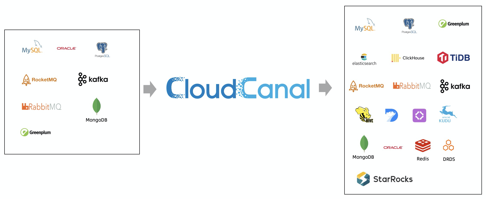
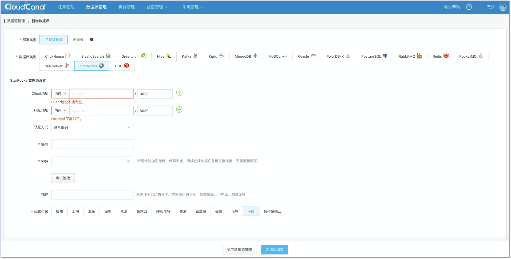
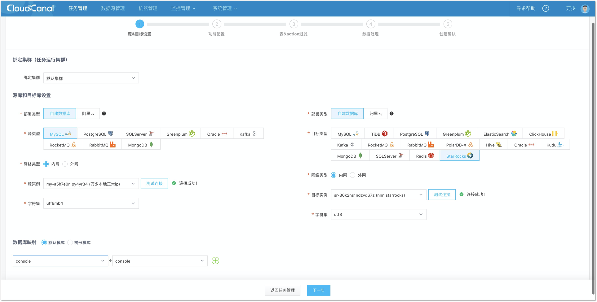
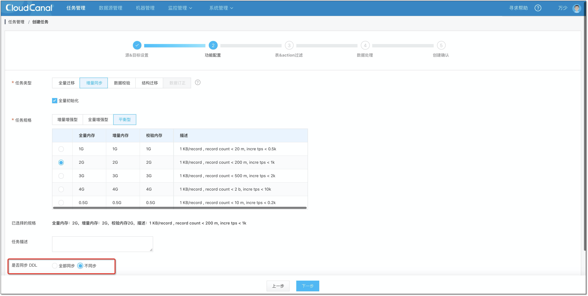
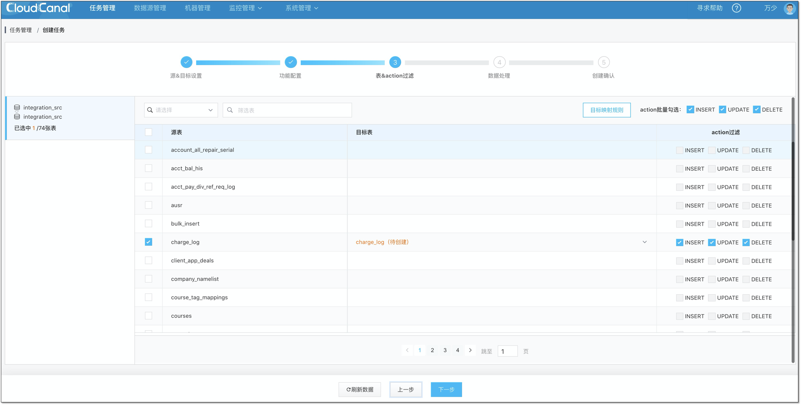
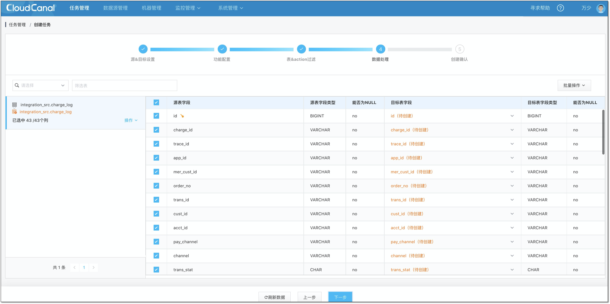
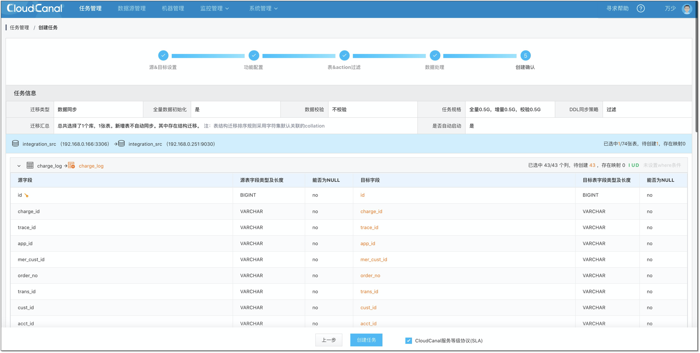
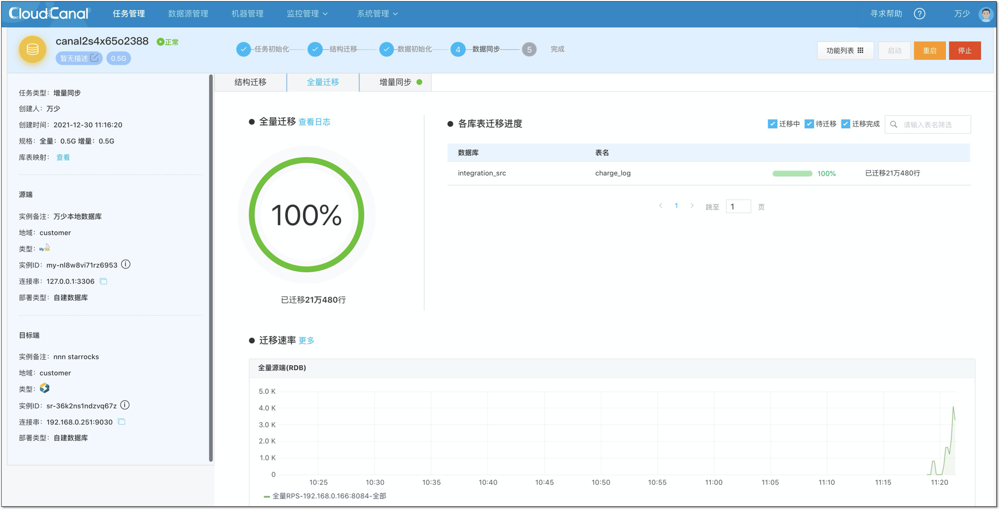

# CloudCanal数据导入

## 介绍

CloudCanal社区版是一款由[ClouGence公司](https://www.clougence.com)发行的集结构迁移、数据全量迁移/校验/订正、增量实时同步为一体的免费数据迁移同步平台。产品包含完整的产品化能力，助力企业打破数据孤岛、完成数据互融互通，从而更好的使用数据。

## 下载安装

[CloudCanal最新版下载地址](https://cloudcanal-community.oss-cn-hangzhou.aliyuncs.com/latest/cloudcanal.7z)

[CloudCanal社区版安装部署参考文档](https://doc-cloudcanal.clougence.com/operation/install_linux)

## 功能说明

- 本功能当前为**实验性版本**，限测试环境试用，请谨慎评估用于生产环境的风险。
- 建议您在使用CloudCanal将增量数据导入至StarRocks时，控制导入的频率，increBatchWaitTimeMs参数的建议取值范围为**大于等于**10000，单位为ms。
- StarRocks对端版本支持：支持StarRocks版本为1.18.x、1.19.x和2.0.x
- 支持的源端以及功能项：
  | 数据源\功能项 | 结构迁移 | 全量数据迁移 | 增量实时同步 | 数据校验 |
  | --- | --- | --- | --- | --- |
  | Oracle源端 | 支持 | 支持 | 支持 | 支持 |
  | PostgreSQL源端 | 支持 | 支持 | 支持 | 支持 |
  | Greenplum源端 | 支持 | 支持 | 不支持 | 支持 |
  | MySQL源端 | 支持 | 支持 | 支持 | 支持 |
  
## 使用方法

CloudCanal提供了完整的产品化能力，用户在可视化界面完成数据源添加和任务创建即可自动完成结构迁移、全量迁移、增量实时同步。下文演示如何将MySQL数据库中的数据迁移同步到对端StarRocks中。其他源端同步到StarRocks也可以按照类似的方式进行。

### 前置条件

首先参考[CloudCanal安装部署参考文档](https://www.askcug.com/topic/75) 完成CloudCanal社区版的安装和部署。

### 添加数据源

- 登录 CloudCanal 平台
- 数据源管理->新增数据源
- 选择自建数据库中StarRocks

> Tips:
>
> - Client地址： 为StarRocks提供给MySQL Client的服务端口，CloudCanal主要用其查询库表的元数据信息
>
> - Http地址： Http地址主要用于接收CloudCanal数据导入的请求

### 任务创建

添加好数据源之后可以按照如下步骤进行数据迁移、同步任务的创建。

- **任务管理**->**任务创建**
- 选择 **源** 和 **目标** 数据库
- 点击 下一步

- 选择 **增量同步**，并且启用 **全量数据初始化**
- 不勾选 DDL 同步(暂不支持)
- 点击下一步

- 选择订阅的表，**结构迁移自动创建的表为主键模型的表，因此暂不支持无主键表**
- 点击下一步

- 配置列映射
- 点击下一步

- 创建任务

- 查看任务状态。任务创建后，会自动完成结构迁移、全量、增量阶段。

## 参考资料

更多关于CloudCanal同步StarRocks的资料，可以查看

- [5分钟搞定MySQL/PostgreSQL/Oracle到StarRocks数据迁移同步-CloudCanal实战](https://www.askcug.com/topic/262)

- [CloudCanal官方社区](https://www.askcug.com/)
