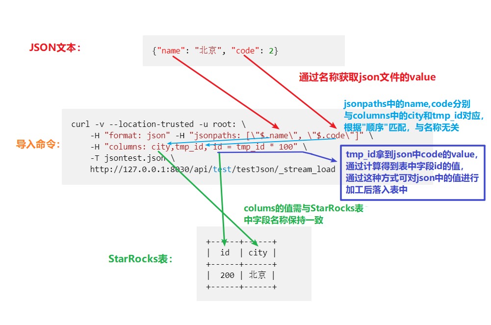

# 介绍

对于一些半结构化的比如Json类型的数据，我们可以用stream load 或者 routine load的方式进行导入。

## 使用场景

* Stream Load： 对于文本文件存储的Json数据，我们可以使用 stream load进行导入。
* Routine Load：对于Kafka中的json格式数据，可以使用Routine load的方式导入。

### Stream Load导入

样例数据：

~~~json
{ "id": 123, "city" : "beijing"},
{ "id": 456, "city" : "shanghai"},
    ...
~~~

示例：

~~~shell
curl -v --location-trusted -u root: \
    -H "format: json" -H "jsonpaths: [\"$.id\", \"$.city\"]" \
    -T example.json \
    http://FE_HOST:HTTP_PORT/api/DATABASE/TABLE/_stream_load
~~~

通过 format: json 参数可以执行导入的数据格式 jsonpaths 用来执行对应的数据导入路径

相关参数：

* jsonpaths : 选择每一列的json路径
* json\_root : 选择json开始解析的列
* strip\_outer\_array ： 裁剪最外面的 array 字段（可以见下一个样例）
* strict\_mode：导入过程中的列类型转换进行严格过滤
* columns:对应StarRocks表中的字段的名称

jsonpaths参数和columns参数还有StarRocks表中字段三者关系如下：

* jsonpaths的值名称与json文件中的key的名称一致
* columns的值的名称和StarRocks表中字段名称保持一致
* columns和jsonpaths属性的值，名称不需要保持一致(建议设置为一致方便区分)，值的顺序保持一致就可以将json文件中的value和StarRocks表中字段对应起来，如下图：

样例数据：

~~~json
{"name": "北京", "code": 2}
~~~

导入示例：

~~~bash
curl -v --location-trusted -u root: \
    -H "format: json" -H "jsonpaths: [\"$.name\", \"$.code\"]" \
    -H "columns: city,tmp_id, id = tmp_id * 100" \
    -T jsontest.json \
    http://127.0.0.1:8030/api/test/testJson/_stream_load
~~~

导入后结果

~~~plain text
+------+------+
|  id  | city |
+------+------+
|  200 | 北京 |
+------+------+
~~~

如果想先对Json中数据进行加工，然后再落入StarRocks表中，可以通过更改columns的值来实现，属性的对应关系可以参考上图中描述，示例如下:

样例数据：

~~~json
{"k1": 1, "k2": 2}
~~~

导入示例：

~~~bash
curl -v --location-trusted -u root: \
    -H "format: json" -H "jsonpaths: [\"$.k2\", \"$.k1\"]" \
    -H "columns: k2, tmp_k1, k1 = tmp_k1 * 100" \
    -T example.json \
    http://127.0.0.1:8030/api/db1/tbl1/_stream_load
~~~

这里导入过程中进行了将k1乘以100的ETL操作，并且通过Jsonpath来进行column和原始数据的对应

导入后结果

~~~plain text
+------+------+
|  k1  |  k2  |
+------+------+
|  100 |  2   |
+------+------+
~~~

 

对于缺失的列 如果列的定义是nullable，那么会补上NULL，也可以通过ifnull补充默认值。

样例数据：

~~~json
[
    {"k1": 1, "k2": "a"},
    {"k1": 2},
    {"k1": 3, "k2": "c"},
]
~~~

> 这里最外层有一对表示 json array 的中括号 `[ ]`，导入时就需要指定 `strip_outer_array = true`

导入示例-1：

~~~shell
curl -v --location-trusted -u root: \
    -H "format: json" -H "strip_outer_array: true" \
    -T example.json \
    http://127.0.0.1:8030/api/db1/tbl1/_stream_load
~~~

导入后结果：

~~~plain text
+------+------+
|  k1  | k2   |
+------+------+
|   1  | a    |
+------+------+
|   2  | NULL |
+------+------+
|   3  | c    |
+------+------+
~~~
  
导入示例-2：

~~~shell
curl -v --location-trusted -u root: \
    -H "format: json" -H "strip_outer_array: true" \
    -H "jsonpaths: [\"$.k1\", \"$.k2\"]" \
    -H "columns: k1, tmp_k2, k2 = ifnull(tmp_k2, 'x')" \
    -T example.json \
    http://127.0.0.1:8030/api/db1/tbl1/_stream_load
~~~

导入后结果：

~~~plain text
+------+------+
|  k1  |  k2  |
+------+------+
|  1   |  a   |
+------+------+
|  2   |  x   |
+------+------+
|  3   |  c   |
+------+------+
~~~

### Routine Load导入

对于 Kafka 数据源，和Stream Load的原理类似，每个 Massage 中的内容被视作一个完整的 Json 数据。

1. 如果一个 Massage 中是以 Array 格式的表示的多行数据，则会导入多行，而 Kafka 的 offset 只会增加 1。
2. 如果一个 Array 格式的 Json 表示多行数据，但是因为 Json 格式错误导致解析 Json 失败，则错误行只会增加 1（因为解析失败，实际上 StarRocks 无法判断其中包含多少行数据，只能按一行错误数据记录）。
  
### 使用Canal从mysql中增量同步binlog导入StarRocks
  
[Canal](https://github.com/alibaba/canal) 是阿里巴巴开源的一个Mysql binlog同步工具，通过他我们可以把Mysql的数据同步到Kafka，在Kafka中数据是用Json的格式生成的，我们这里演示一下如何使用Routine load同步kafka中的数据来实现和Mysql进行增量数据同步的工作：

* 在MySQL中我们有一张数据表 其建表语句如下：

~~~sql
CREATE TABLE `query_record` (
  `query_id` varchar(64) NOT NULL,
  `conn_id` int(11) DEFAULT NULL,
  `fe_host` varchar(32) DEFAULT NULL,
  `user` varchar(32) DEFAULT NULL,
  `start_time` datetime NOT NULL,
  `end_time` datetime DEFAULT NULL,
  `time_used` double DEFAULT NULL,
  `state` varchar(16) NOT NULL,
  `error_message` text,
  `sql` text NOT NULL,
  `database` varchar(128) NOT NULL,
  `profile` longtext,
  `plan` longtext,
  PRIMARY KEY (`query_id`),
  KEY `idx_start_time` (`start_time`) USING BTREE
) ENGINE=InnoDB DEFAULT CHARSET=utf8
~~~

* 准备：首先确认mysql开启了binlog 并且格式为ROW模式

~~~bash
[mysqld]
log-bin=mysql-bin # 开启 binlog
binlog-format=ROW # 选择 ROW 模式
server_id=1       # 配置 MySQL replaction 需要定义，不要和 canal 的 slaveId 重复
~~~

* 创建一个账号并授予Mysql slave的权限

~~~sql
CREATE USER canal IDENTIFIED BY 'canal';
GRANT SELECT, REPLICATION SLAVE, REPLICATION CLIENT ON *.* TO 'canal'@'%';
-- GRANT ALL PRIVILEGES ON *.* TO 'canal'@'%';
FLUSH PRIVILEGES;
~~~

* 然后我们下载安装canal

~~~bash
wget https://github.com/alibaba/canal/releases/download/canal-1.0.17/canal.deployer-1.0.17.tar.gz

mkdir /tmp/canal
tar zxvf canal.deployer-$version.tar.gz -C /tmp/canal
~~~

* 修改配置（mysql 相关）

`$ vi conf/example/instance.properties`

~~~bash
## mysql serverId
canal.instance.mysql.slaveId = 1234
#position info，需要改成自己的数据库信息
canal.instance.master.address = 127.0.0.1:3306
canal.instance.master.journal.name =
canal.instance.master.position =
canal.instance.master.timestamp =
#canal.instance.standby.address =
#canal.instance.standby.journal.name =
#canal.instance.standby.position =
#canal.instance.standby.timestamp =
#username/password，需要改成自己的数据库信息
canal.instance.dbUsername = canal  
canal.instance.dbPassword = canal
canal.instance.defaultDatabaseName =
canal.instance.connectionCharset = UTF-8
#table regex
canal.instance.filter.regex = .\*\\\\..\*
# 选择需要同步的表名和kafka目标的分区名称
canal.mq.dynamicTopic=databasename.query_record
canal.mq.partitionHash= databasename.query_record:query_id
~~~

* 修改配置（kafka 相关）

`$ vi /usr/local/canal/conf/canal.properties`

~~~bash
# 可选项: tcp(默认), kafka, RocketMQ
canal.serverMode = kafka
# ...
# kafka/rocketmq 集群配置: 192.168.1.117:9092,192.168.1.118:9092,192.168.1.119:9092
canal.mq.servers = 127.0.0.1:6667
canal.mq.retries = 0
# flagMessage模式下可以调大该值, 但不要超过MQ消息体大小上限
canal.mq.batchSize = 16384
canal.mq.maxRequestSize = 1048576
# flatMessage模式下请将该值改大, 建议50-200
canal.mq.lingerMs = 1
canal.mq.bufferMemory = 33554432
# Canal的batch size, 默认50K, 由于kafka最大消息体限制请勿超过1M(900K以下)
canal.mq.canalBatchSize = 50
# Canal get数据的超时时间, 单位: 毫秒, 空为不限超时
canal.mq.canalGetTimeout = 100
# 是否为flat json格式对象
canal.mq.flatMessage = false
canal.mq.compressionType = none
canal.mq.acks = all
# kafka消息投递是否使用事务
canal.mq.transaction = false
~~~

* 启动

`bin/startup.sh`

在 `logs/example/example.log` 可以看到相应的同步日志信息，在kafka中也能看到消息，其消息格式如下

~~~json
{
    "data": [{
        "query_id": "3c7ebee321e94773-b4d79cc3f08ca2ac",
        "conn_id": "34434",
        "fe_host": "172.26.34.139",
        "user": "zhaoheng",
        "start_time": "2020-10-19 20:40:10.578",
        "end_time": "2020-10-19 20:40:10",
        "time_used": "1.0",
        "state": "FINISHED",
        "error_message": "",
        "sql": "COMMIT",
        "database": "",
        "profile": "",
        "plan": ""
    }, {
        "query_id": "7ff2df7551d64f8e-804004341bfa63ad",
        "conn_id": "34432",
        "fe_host": "172.26.34.139",
        "user": "zhaoheng",
        "start_time": "2020-10-19 20:40:10.566",
        "end_time": "2020-10-19 20:40:10",
        "time_used": "0.0",
        "state": "FINISHED",
        "error_message": "",
        "sql": "COMMIT",
        "database": "",
        "profile": "",
        "plan": ""
    }, {
        "query_id": "3a4b35d1c1914748-be385f5067759134",
        "conn_id": "34440",
        "fe_host": "172.26.34.139",
        "user": "zhaoheng",
        "start_time": "2020-10-19 20:40:10.601",
        "end_time": "1970-01-01 08:00:00",
        "time_used": "-1.0",
        "state": "RUNNING",
        "error_message": "",
        "sql": " SELECT SUM(length(lo_custkey)), SUM(length(c_custkey)) FROM lineorder_str INNER JOIN customer_str ON lo_custkey=c_custkey;",
        "database": "ssb",
        "profile": "",
        "plan": ""
    }],
    "database": "center_service_lihailei",
    "es": 1603111211000,
    "id": 122,
    "isDdl": false,
    "mysqlType": {
        "query_id": "varchar(64)",
        "conn_id": "int(11)",
        "fe_host": "varchar(32)",
        "user": "varchar(32)",
        "start_time": "datetime(3)",
        "end_time": "datetime",
        "time_used": "double",
        "state": "varchar(16)",
        "error_message": "text",
        "sql": "text",
        "database": "varchar(128)",
        "profile": "longtext",
        "plan": "longtext"
    },
    "old": null,
    "pkNames": ["query_id"],
    "sql": "",
    "sqlType": {
        "query_id": 12,
        "conn_id": 4,
        "fe_host": 12,
        "user": 12,
        "start_time": 93,
        "end_time": 93,
        "time_used": 8,
        "state": 12,
        "error_message": 2005,
        "sql": 2005,
        "database": 12,
        "profile": 2005,
        "plan": 2005
    },
    "table": "query_record",
    "ts": 1603111212015,
    "type": "INSERT"
}
~~~

这里我们只需要导入data中的数据，所以需要加上 json_root 和 strip_outer_array = true

~~~sql
create routine load manual.query_job on query_record   
columns (query_id,conn_id,fe_host,user,start_time,end_time,time_used,state,error_message,`sql`,`database`,profile,plan)  
PROPERTIES (  
    "format"="json",  
    "json_root"="$.data",
    "desired_concurrent_number"="1",  
    "strip_outer_array" ="true",    
    "max_error_number"="1000" 
) 
FROM KAFKA (     
    "kafka_broker_list"= "172.26.92.141:9092",     
    "kafka_topic" = "databasename.query_record" 
);
~~~

这样就可以完成数据从mysql到StarRocks的近实时同步。

通过`show routine load` 可以看到导入任务的进度和错误信息。
