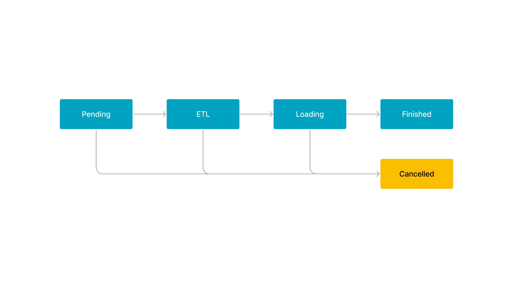

# 导入总览

数据导入是指将原始数据按照业务需求进行清洗、转换、并加载到 StarRocks 中的过程，从而可以在 StarRocks  系统中进行极速统一的数据分析。

StarRocks 通过导入作业实现数据导入。每个导入作业都有一个标签 (Label)，由用户指定或系统自动生成，用于标识该导入作业。每个标签在一个数据库内都是唯一的，仅可用于一个成功的导入作业。一个导入作业成功后，其标签不可再用于提交其他导入作业。只有失败的导入作业的标签，才可再用于提交其他导入作业。这一机制可以保证任一标签对应的数据最多被导入一次，即实现“至多一次 (At-Most-Once) ”语义。

StarRocks 中所有导入方式都提供原子性保证，即同一个导入作业内的所有有效数据要么全部生效，要么全部不生效，不会出现仅导入部分数据的情况。这里的有效数据不包括由于类型转换错误等数据质量问题而被过滤掉的数据。

StarRocks 提供两种访问协议用于提交导入作业：MySQL 协议和 HTTP 协议。不同的导入方式支持的访问协议有所不同，具体请参见本文“[导入方式](../loading/Loading_intro.md#导入方式)”章节。

> **注意**
>
> 导入操作需要目标表的 INSERT 权限。如果您的用户账号没有 INSERT 权限，请参考 [GRANT](../sql-reference/sql-statements/account-management/GRANT.md) 给用户赋权。

## 支持的数据类型

StarRocks 支持导入所有数据类型。个别数据类型的导入可能会存在一些限制，具体请参见[数据类型](../sql-reference/sql-statements/data-types/BIGINT.md)。

## 导入模式

StarRocks 支持两种导入模式：同步导入和异步导入。

> **说明**
>
> 如果是外部程序接入 StarRocks 的导入，需要先判断使用哪种导入模式，然后再确定接入逻辑。

### 同步导入

同步导入是指您创建导入作业以后，StarRocks 同步执行作业，并在作业执行完成以后返回导入结果。您可以通过返回的导入结果判断导入作业是否成功。

支持同步模式的导入方式有 Stream Load 和 INSERT。

用户操作过程如下：

1. 创建导入作业。

2. 查看 StarRocks 返回的导入结果。

3. 判断导入结果。如果导入结果为失败，可以重试导入作业。

### 异步导入

异步导入是指您创建导入作业以后，StarRocks 直接返回作业创建结果。

- 如果导入作业创建成功，StarRocks 会异步执行导入作业。但作业创建成功并不代表数据导入已经成功。您需要通过语句或命令来查看导入作业的状态，并且根据导入作业的状态来判断数据导入是否成功。
- 如果导入作业创建失败，可以根据失败信息，判断是否需要重试。

支持异步模式的导入方式有 Broker Load、Routine Load 和 Spark Load。

用户操作过程如下：

1. 创建导入作业。

2. 根据 StarRocks 返回的作业创建结果，判断作业是否创建成功。

   - 如果作业创建成功，进入步骤 3。
   - 如果作业创建失败，可以回到步骤 1，尝试重试导入作业。

3. 轮询查看导入作业的状态，直到状态变为 **FINISHED** 或 **CANCELLED**。

Broker Load 和 Spark Load 导入作业的执行流程主要分为 5 个阶段，如下图所示。

每个阶段的描述如下：

1. **PENDING**

   该阶段是指提交导入作业后，等待 FE 调度执行。

2. **ETL**

   该阶段执行数据的预处理，包括清洗、分区、排序、聚合等。

   > **说明**
   >
   > 如果是 Broker Load 作业，该阶段会直接完成。

3. **LOADING**

   该阶段先对数据进行清洗和转换，然后将数据发送给 BE 处理。当数据全部导入后，进入等待生效过程，此时，导入作业的状态依旧是 **LOADING**。

4. **FINISHED**

   在导入作业涉及的所有数据均生效后，作业的状态变成 **FINISHED**，此时，导入的数据均可查询。**FINISHED** 是导入作业的最终状态。

5. **CANCELLED**

   在导入作业的状态变为 **FINISHED** 之前，您可以随时取消作业。另外，如果导入出现错误，StarRocks 系统也会自动取消导入作业。作业取消后，进入 **CANCELLED** 状态。**CANCELLED** 也是导入作业的一种最终状态。

Routine Load 导入作业的执行流程描述如下：

1. 用户通过支持 MySQL 协议的客户端向 FE 提交一个导入作业。

2. FE 将该导入作业拆分成若干个任务，每个任务负责导入若干个分区的数据。

3. FE 将各个任务分配到指定的 BE 上执行。

4. BE 完成分配的任务后，向 FE 汇报。

5. FE 根据汇报结果，继续生成后续新的任务，或者对失败的任务进行重试，或者暂停任务的调度。

## 导入方式

StarRocks 提供 [Stream Load](../loading/StreamLoad.md)、[Broker Load](../loading/BrokerLoad.md)、 [Routine Load](../loading/RoutineLoad.md)、[Spark Load](../loading/SparkLoad.md) 和 [INSERT](../loading/InsertInto.md) 多种导入方式，满足您在不同业务场景下的数据导入需求。

| 导入方式            | 数据源                                                                                          | 业务场景                                                                                                     | 数据量（单作业）      | 数据格式                                            | 同步模式    | 协议   |
| ------------------ | ---------------------------------------------------------------------------------------------- | ----------------------------------------------------------------------------------------------------------- | ------------------ | ------------------------------------------------- | ---------- | ------ |
| Stream Load        |<ul><li>本地文件</li><li>流式数据</li></ul>                                                        | 通过 HTTP 协议导入本地文件、或通过程序导入数据流。                                                                 | 10 GB 以内          |<ul><li>CSV</li><li>JSON</li></ul>                 | 同步       | HTTP  |
| Broker Load        |<ul><li>HDFS</li><li>Amazon S3</li><li>Google GCS</li><li>Microsoft Azure Storage</li><li>阿里云 OSS</li><li>腾讯云 COS</li><li>华为云 OBS</li><li>其他兼容 S3 协议的对象存储（如 MinIO）</li></ul> | 从 HDFS 或外部云存储系统导入数据。                                                                               | 数十到数百 GB        |<ul><li>CSV</li><li>Parquet</li><li>ORC</li></ul> | 异步        | MySQL |
| Routine Load       | Apache Kafka®                                                                                 | 从 Kafka 实时地导入数据流。                                                                             | 微批导入 MB 到 GB 级 |<ul><li>CSV</li><li>JSON</li><li>Avro（3.0.1 版本之后支持）</li></ul>          | 异步     | MySQL |
| Spark Load         | <ul><li>HDFS</li><li>Hive</li></ul>                                                            | <ul><li>通过 Apache Spark™ 集群初次从 HDFS 或 Hive 迁移导入大量数据。</li><li>需要做全局数据字典来精确去重。</li></ul> | 数十 GB 到 TB级别    |<ul><li>CSV</li><li>ORC（2.0 版本之后支持）</li><li>Parquet（2.0 版本之后支持）</li></ul>       | 异步     | MySQL |
| INSERT INTO SELECT |<ul><li>StarRocks 表</li><li>外部表</li></ul>                                                    |<ul><li>外表导入。</li><li>StarRocks 数据表之间的数据导入。</li></ul>                                              | 跟内存相关           | StarRocks 表                                     | 同步        | MySQL |
| INSERT INTO VALUES |<ul><li>程序</li><li>ETL 工具</li></ul>                                                          |<ul><li>单条批量小数据量插入。</li><li>通过 JDBC 等接口导入。</li></ul>                                             | 简单测试用           | SQL                                              | 同步        | MySQL |

您可以根据业务场景、数据量、数据源、数据格式和导入频次等来选择合适的导入方式。另外，在选择导入方式时，可以注意以下几点：

- 从 Kafka 导入数据时，推荐使用 [Routine Load](../loading/RoutineLoad.md) 实现导入。但是，如果导入过程中有复杂的多表关联和 ETL 预处理，建议先使用 Apache Flink® 从 Kafka 读取数据并对数据进行处理，然后再通过 StarRocks 提供的标准插件 [flink-connector-starrocks](../loading/Flink-connector-starrocks.md) 把处理后的数据导入到 StarRocks 中。

- 从 Hive、Iceberg、Hudi、Delta Lake 导入数据时，推荐创建 [Hive catalog](../data_source/catalog/hive_catalog.md)、[Iceberg catalog](../data_source/catalog/iceberg_catalog.md)、[Hudi Catalog](../data_source/catalog/hudi_catalog.md)、[Delta Lake Catalog](../data_source/catalog/deltalake_catalog.md)，然后使用 [INSERT](../loading/InsertInto.md) 实现导入。

- 从另外一个 StarRocks 集群或从 Elasticsearch 导入数据时，推荐创建 [StarRocks 外部表](../data_source/External_table.md#starrocks-外部表)或 [Elasticsearch 外部表](../data_source/External_table.md#deprecated-elasticsearch-外部表)，然后使用 [INSERT](../loading/InsertInto.md) 实现导入。或者，您也可以通过 [DataX](../loading/DataX-starrocks-writer.md) 实现导入。

  > **注意**
  >
  > StarRocks 外表只支持数据写入，不支持数据读取。

- 从 MySQL 导入数据时，推荐创建 [MySQL 外部表](../data_source/External_table.md#deprecated-mysql-外部表)、然后使用 [INSERT](../loading/InsertInto.md) 实现导入。或者，您也可以通过 [DataX](../loading/DataX-starrocks-writer.md) 实现导入。如果要导入实时数据，建议您参考 [从 MySQL 实时同步](../loading/Flink_cdc_load.md) 实现导入。

- 从 Oracle、PostgreSQL 或 SQL Server 等数据源导入数据时，推荐创建 [JDBC 外部表](../data_source/External_table.md#更多数据库jdbc的外部表)、然后使用 [INSERT](../loading/InsertInto.md) 实现导入。或者，您也可以通过 [DataX](../loading/DataX-starrocks-writer.md) 实现导入。

下图详细展示了在各种数据源场景下，应该选择哪一种导入方式。

## 内存限制

您可以通过设置参数来限制单个导入作业的内存使用，以防止导入作业占用过多内存，特别是在导入并发较高的情况下。同时，您也需要注意避免设置过小的内存使用上限，因为内存使用上限过小，导入过程中可能会因为内存使用量达到上限而频繁地将内存中的数据刷出到磁盘，进而可能影响导入效率。建议您根据具体的业务场景要求，合理地设置内存使用上限。

不同的导入方式限制内存的方式略有不同，具体请参见 [Stream Load](../loading/StreamLoad.md)、[Broker Load](../loading/BrokerLoad.md)、[Routine Load](../loading/RoutineLoad.md)、[Spark Load](../loading/SparkLoad.md) 和 [INSERT](../loading/InsertInto.md)。需要注意的是，一个导入作业通常都会分布在多个 BE 上执行，这些内存参数限制的是一个导入作业在单个 BE 上的内存使用，而不是在整个集群上的内存使用总和。

您还可以通过设置一些参数来限制在单个 BE 上运行的所有导入作业的总的内存使用上限。可参考本文“[系统配置](../loading/Loading_intro.md#系统配置)”章节。

## 使用说明

### 导入自动赋值

导入数据时，您可以指定不导入数据文件中某个字段的数据，这种情况下：

- 如果您在创建 StarRocks 表时使用 `DEFAULT` 关键字给该字段对应的目标列指定了默认值，则 StarRocks 在导入时该行数据时会自动往该列填充 `DEFAULT` 中指定的默认值。

  [Stream Load](../loading/StreamLoad.md)、[Broker Loa](../loading/BrokerLoad.md)、[Routine Load](../loading/RoutineLoad.md) 和 [INSERT](../loading/InsertInto.md) 四种导入方式当前支持 `DEFAULT current_timestamp`、`DEFAULT <默认值>` 和 `DEFAULT (<表达式>)`。[Spark Load](../loading/SparkLoad.md) 导入方式当前仅支持 `DEFAULT current_timestamp` 和 `DEFAULT <默认值>`，不支持 `DEFAULT (<表达式>)`。

  > **说明**
  >
  > 目前 `DEFAULT (<表达式>)` 仅支持 `uuid()` 和 `uuid_numeric()` 函数。

- 如果您在创建 StarRocks 表时没有使用 `DEFAULT` 关键字给该字段对应的目标列指定默认值，则 StarRocks 在导入该行数据时会自动往该列填充 `NULL` 值。

  > **说明**
  >
  > 如果该列在建表时定义该列为 `NOT NULL`，则导入会报错，作业失败。

  对于 [Stream Load](../loading/StreamLoad.md)、[Broker Loa](../loading/BrokerLoad.md)、[Routine Load](../loading/RoutineLoad.md) 和 [Spark Load](../loading/SparkLoad.md)，您还可以在指定待导入列的参数里通过函数来给该列指定要填充的值。

有关 `NOT NULL` 和 `DEFAULT` 的用法，请参见 [CREATE TABLE](../sql-reference/sql-statements/data-definition/CREATE_TABLE.md)。

### 设置数据导入安全等级

如果您的 StarRocks 集群有多数据副本，您可以根据业务需求为 Table 设置不同导入数据安全等级，即设置需要多少数据副本导入成功后 StarRocks 可返回导入成功。您可在 [CREATE TABLE](../sql-reference/sql-statements/data-definition/CREATE_TABLE.md) 时通过增加属性（PROPERTIES） `write_quorum` 指定导入数据安全等级，或通过 [ALTER TABLE](../sql-reference/sql-statements/data-definition/ALTER_TABLE.md) 语句为已有 Table 添加该属性。该属性从 2.5 版本开始支持。

## 系统配置

本节解释对所有导入方式均适用的参数配置。

### FE 配置

您可以通过修改每个 FE 的配置文件 **fe.conf** 来设置如下参数：

- `max_load_timeout_second` 和 `min_load_timeout_second`

  设置导入超时时间的最大、最小值，单位均为秒。默认的最大超时时间为 3 天，默认的最小超时时间为 1 秒。自定义的导入超时时间不能超过这个最大、最小值范围。该参数配置适用于所有模式的导入作业。

- `desired_max_waiting_jobs`

  等待队列可以容纳的导入作业的最大个数，默认值为 1024 (2.4 及之前版本默认值为 100；2.5 及以后版本默认值变为 1024)。如果 FE 中处于 **PENDING** 状态的导入作业数目达到最大个数限制时，FE 会拒绝新的导入请求。该参数配置仅对异步执行的导入有效。

- `max_running_txn_num_per_db`

  StarRocks 集群每个数据库中正在进行的导入事务的最大个数（一个导入作业可能包含多个事务），默认值为 100。当数据库中正在运行的导入事务达到最大个数限制时，后续提交的导入作业不会执行。如果是同步的导入作业，作业会被拒绝；如果是异步的导入作业，作业会在队列中等待。

  > **说明**
  >
  > 所有模式的作业均包含在内、统一计数。

- `label_keep_max_second`

  已经完成、且处于 **FINISHED** 或 **CANCELLED** 状态的导入作业记录在 StarRocks 系统的保留时长，默认值为 3 天。该参数配置适用于所有模式的导入作业。

### BE 配置

您可以通过修改每个 BE 的配置文件 **be.conf** 来设置如下参数：

- `write_buffer_size`

  BE 上内存块的大小阈值，默认阈值为 100 MB。导入的数据在 BE 上会先写入一个内存块，当内存块的大小达到这个阈值以后才会写回磁盘。如果阈值过小，可能会导致 BE 上存在大量的小文件，影响查询的性能，这时候可以适当提高这个阈值来减少文件数量。如果阈值过大，可能会导致远程过程调用（Remote Procedure Call，简称 RPC）超时，这时候可以适当地调整该参数的取值。

- `streaming_load_rpc_max_alive_time_sec`

  指定了 Writer 进程的等待超时时间，默认为 600 秒。在导入过程中，StarRocks 会为每个 Tablet 开启一个 Writer 进程，用于接收和写入数据。如果在参数指定时间内 Writer 进程没有收到任何数据，StarRocks 系统会自动销毁这个 Writer 进程。当系统处理速度较慢时，Writer 进程可能长时间接收不到下一批次数据，导致上报 "TabletWriter add batch with unknown id" 错误。这时候可适当调大这个参数的取值。

- `load_process_max_memory_limit_bytes` 和 `load_process_max_memory_limit_percent`

  用于导入的最大内存使用量和最大内存使用百分比，用来限制单个 BE 上所有导入作业的内存总和的使用上限。StarRocks 系统会在两个参数中取较小者，作为最终的使用上限。

  - `load_process_max_memory_limit_bytes`：指定 BE 上最大内存使用量，默认为 100 GB。
  - `load_process_max_memory_limit_percent`：指定 BE 上最大内存使用百分比，默认为 30%。该参数与 `mem_limit` 参数不同。`mem_limit` 参数指定的是 BE 进程内存上限，默认硬上限为 BE 所在机器内存的 90%，软上限为 BE 所在机器内存的 90% x 90%。

    假设 BE 所在机器物理内存大小为 M，则用于导入的内存上限为：`M x 90% x 90% x 30%`。

### 会话变量

您可以设置如下[会话变量](../reference/System_variable.md)：

- `query_timeout`

  用于设置查询超时时间。单位：秒。取值范围：`1` ~ `259200`。默认值：`300`，相当于 5 分钟。该变量会作用于当前连接中所有的查询语句，以及 INSERT 语句。

## 常见问题

请参见[导入常见问题](../faq/loading/Loading_faq.md)。
