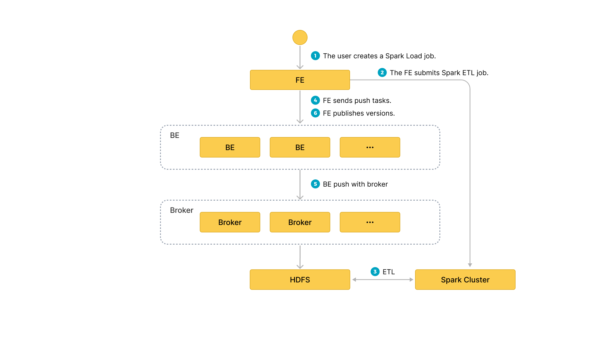

# 使用 Spark Load 批量导入数据

Spark Load 通过外部的 Spark 资源实现对导入数据的预处理，提高 StarRocks 大数据量的导入性能并且节省 StarRocks 集群的计算资源。主要用于 **初次迁移**、**大数据量导入** StarRocks 的场景（数据量可到 TB 级别）。

本文介绍导入任务的操作流程（包括相关客户端配置、创建和查看任务等）、系统配置、最佳实践和常见问题。

> **注意**
>
> * Spark Load 操作需要目标表的 INSERT 权限。如果您的用户账号没有 INSERT 权限，请参考 [GRANT](../sql-reference/sql-statements/account-management/GRANT.md) 给用户赋权。
> * Spark Load 不支持导入至主键表。

## 背景信息

在 StarRocks v2.4 及以前版本，Spark Load 需要借助 Broker 进程访问外部存储系统。配置执行 ETL 任务的 Spark 集群时需要指定 Broker 组。Broker 是一个独立的无状态进程，封装了文件系统接口。通过 Broker 进程，StarRocks 能够访问和读取外部存储系统上的数据文件。
自 StarRocks v2.5 起，Spark Load 不再需要借助 Broker 进程即可访问外部存储系统。
> **说明**
>
> 使用无 Broker 进程的方式导入在某些场景下会受限。如果您配置了多 HDFS 集群或多 Kerberos 用户时，暂时还不支持使用无 Broker 进程的方式导入。这种情况下，您必须继续通过 Broker 进程执行导入。

## 使用说明

如果您继续通过 Broker 进程执行导入，则必须确保您的 StarRocks 集群中已部署 Broker。
您可以通过 [SHOW BROKER](../sql-reference/sql-statements/Administration/SHOW_BROKER.md) 语句来查看集群中已经部署的 Broker。如果集群中没有部署 Broker，请参见[部署 Broker 节点](../deployment/deploy_broker.md)完成 Broker 部署。

## 支持的数据格式

* CSV
* ORC(2.0 版本之后支持)
* PARQUET(2.0 版本之后支持)

## 基本原理

用户通过 MySQL 客户端提交 Spark 类型导入任务，FE记录元数据并返回用户提交成功。

Spark Load 任务的执行主要分为以下几个阶段：

1. 用户向 FE 提交 Spark Load 任务；
2. FE 调度提交 ETL 任务到 Spark 集群执行。
3. Spark 集群执行 ETL 完成对导入数据的预处理。包括全局字典构建（BITMAP类型）、分区、排序、聚合等。预处理后的数据落盘 HDFS。
4. ETL 任务完成后，FE 获取预处理过的每个分片的数据路径，并调度相关的 BE 执行 Push 任务。
5. BE 通过 Broker 进程读取 HDFS 数据，转化为 StarRocks 存储格式。
    > **说明**
    >
    > 如果选择不使用 Broker 进程，则 BE 直接读取 HDFS 数据。
6. FE 调度生效版本，完成导入任务。

下图展示了 Spark Load 的主要流程：

---

## 基本操作

使用 Spark Load导入数据，需要按照 `创建资源 -> 配置 Spark 客户端 -> 配置 YARN 客户端 -> 创建 Spark Load 导入任务` 流程执行，具体的各个部分介绍请参考下面描述。

### 配置 ETL 集群

Spark 作为一种外部计算资源在 StarRocks 中用来完成 ETL 工作，因此我们引入 Resource Management 来管理 StarRocks 使用的外部资源。

提交 Spark 导入任务之前，需要配置执行 ETL 任务的 Spark 集群。操作语法：

#### 创建资源

**示例**：

~~~sql
-- yarn cluster 模式
CREATE EXTERNAL RESOURCE "spark0"
PROPERTIES
(
    "type" = "spark",
    "spark.master" = "yarn",
    "spark.submit.deployMode" = "cluster",
    "spark.jars" = "xxx.jar,yyy.jar",
    "spark.files" = "/tmp/aaa,/tmp/bbb",
    "spark.executor.memory" = "1g",
    "spark.yarn.queue" = "queue0",
    "spark.hadoop.yarn.resourcemanager.address" = "resourcemanager_host:8032",
    "spark.hadoop.fs.defaultFS" = "hdfs://namenode_host:9000",
    "working_dir" = "hdfs://namenode_host:9000/tmp/starrocks",
    "broker" = "broker0",
    "broker.username" = "user0",
    "broker.password" = "password0"
);

-- yarn HA cluster 模式
CREATE EXTERNAL RESOURCE "spark1"
PROPERTIES
(
    "type" = "spark",
    "spark.master" = "yarn",
    "spark.submit.deployMode" = "cluster",
    "spark.hadoop.yarn.resourcemanager.ha.enabled" = "true",
    "spark.hadoop.yarn.resourcemanager.ha.rm-ids" = "rm1,rm2",
    "spark.hadoop.yarn.resourcemanager.hostname.rm1" = "host1",
    "spark.hadoop.yarn.resourcemanager.hostname.rm2" = "host2",
    "spark.hadoop.fs.defaultFS" = "hdfs://namenode_host:9000",
    "working_dir" = "hdfs://namenode_host:9000/tmp/starrocks",
    "broker" = "broker1"
);

-- HDFS HA cluster 模式
CREATE EXTERNAL RESOURCE "spark2"
PROPERTIES
(
    "type" = "spark", 
    "spark.master" = "yarn",
    "spark.hadoop.yarn.resourcemanager.address" = "resourcemanager_host:8032",
    "spark.hadoop.fs.defaultFS" = "hdfs://myha",
    "spark.hadoop.dfs.nameservices" = "myha",
    "spark.hadoop.dfs.ha.namenodes.myha" = "mynamenode1,mynamenode2",
    "spark.hadoop.dfs.namenode.rpc-address.myha.mynamenode1" = "nn1_host:rpc_port",
    "spark.hadoop.dfs.namenode.rpc-address.myha.mynamenode2" = "nn2_host:rpc_port",
    "spark.hadoop.dfs.client.failover.proxy.provider" = "org.apache.hadoop.hdfs.server.namenode.ha.ConfiguredFailoverProxyProvider",
    "working_dir" = "hdfs://myha/tmp/starrocks",
    "broker" = "broker2",
    "broker.dfs.nameservices" = "myha",
    "broker.dfs.ha.namenodes.myha" = "mynamenode1,mynamenode2",
    "broker.dfs.namenode.rpc-address.myha.mynamenode1" = "nn1_host:rpc_port",
    "broker.dfs.namenode.rpc-address.myha.mynamenode2" = "nn2_host:rpc_port",
    "broker.dfs.client.failover.proxy.provider" = "org.apache.hadoop.hdfs.server.namenode.ha.ConfiguredFailoverProxyProvider"
);
~~~

`spark0`、`spark1` 和 `spark2` 为 StarRocks 中配置的 Spark 资源的名字。

PROPERTIES 是 Spark 资源相关参数，以下对重要参数进行说明：
> Spark 资源的全部参数和说明，请参见 [CREATE RESOURCE](../sql-reference/sql-statements/data-definition/CREATE_RESOURCE.md#spark-资源)。

* Spark 集群相关参数
  * `type`：必填，资源类型，取值为 `spark`。
  * `spark.master`: 必填，Spark 的 cluster manager。当前仅支持 YARN，所以取值为 `yarn`。
  * `spark.submit.deployMode`: 必填，Spark driver 的部署模式。取值包括`cluster`和`client`。关于取值说明，参考 [Launching Spark on YARN](https://spark.apache.org/docs/3.3.0/running-on-yarn.html#launching-spark-on-yarn)。
  * `spark.hadoop.fs.defaultFS`: 必填，HDFS 中 NameNode 的地址。格式为 `hdfs://namenode_host:port`。
  * YARN ResourceManager 相关参数。
    * 如果 Spark 为单点 ResourceManager，则需要配置`spark.hadoop.yarn.resourcemanager.address`，表示单点 ResourceManager 地址。
    * 如果 Spark 为 ResourceManager HA，则需要配置（其中 hostname 和 address 任选一个配置）：
      * `spark.hadoop.yarn.resourcemanager.ha.enabled`: ResourceManager 启用 HA，设置为 `true`。
      * `spark.hadoop.yarn.resourcemanager.ha.rm-ids`: ResourceManager 逻辑 ID 列表。
      * `spark.hadoop.yarn.resourcemanager.hostname.rm-id`: 对于每个 rm-id，指定 ResourceManager 对应的主机名。
      * `spark.hadoop.yarn.resourcemanager.address.rm-id`: 对于每个 rm-id，指定 `host:port` 以供客户端提交作业。
* Broker 相关参数
  * `broker`: Broker 组的名称。需要使用 `ALTER SYSTEM ADD BROKER` 命令提前完成配置。
  * `broker.property_key`: Broker 读取 ETL 生成的中间文件时需要指定的认证信息等，详细可参考 [BROKER LOAD](../sql-reference/sql-statements/data-manipulation/BROKER_LOAD.md)。
* 其他参数
  * `working_dir`: 必填，一个 HDFS 文件路径，用于存放 ETL 作业生成的文件。例如`hdfs://host: port/tmp/starrocks`。

**注意**

以上为通过 Broker 进程执行导入时的参数说明，如果使用无 Broker 进程的方式导入，则需要注意如下事项：

* 无需传入 `broker`。
* 如果您需要配置用户身份认证、NameNode 节点的 HA，则需要在 HDFS 集群中的 **hdfs-site.xml** 文件中配置参数，具体参数和说明，请参见 [broker_properties](../sql-reference/sql-statements/data-manipulation/BROKER_LOAD.md#hdfs)。并且将 **hdfs-site.xml** 文件放到每一个 FE 的 **$FE_HOME/conf** 下以及每个 BE 的 **$BE_HOME/conf** 下。

    > **说明**
    >
    > 如果 HDFS 文件只能由特定用户访问，则您仍然需要传入 HDFS 用户名 `broker.name`和 HDFS 用户密码`broker.password`。

#### 查看资源

~~~sql
show resources;
~~~

> **注意**
>
> 普通用户只能看到自己有 USAGE 权限的资源。`db_admin` 角色可以看到全局资源。

资源权限通过 GRANT 和 REVOKE 来管理。可以将相关权限赋予某个用户或者某个角色，请参考 [GRANT](../sql-reference/sql-statements/account-management/GRANT.md)。

### 配置 Spark 客户端

FE 底层通过执行 `spark-submit` 的命令去提交 spark 任务，因此需要为 FE 配置 spark 客户端，建议使用 2.4.5 或以上的 spark2 官方版本，[spark 下载地址](https://archive.apache.org/dist/spark/)，下载完成后，请按步骤完成以下配置：

* **配置 SPARK-HOME 环境变量**
  
    spark_home_default_dir: FE 配置，Spark 客户端目录，此配置项默认为 FE 根目录下的 `lib/spark2x` 路径，此项不可为空。

* **配置 SPARK 依赖包**
  
    spark_resource_path: Spark 客户端 jar 包压缩包。默认值 fe/lib/spark2x/jars/spark-2x.zip 文件，需要将 Spark 客户端下的 jars 文件夹内所有 jar 包归档打包成一个 zip 文件 spark-2x.zip `（默认以 spark-2x.zip 命名）`，若没有找到则会报文件不存在的错误。

当提交 spark load 任务时，会将归档好的依赖文件上传至远端仓库，默认仓库路径挂在 `working_dir/{cluster_id}` 目录下，并以`--spark-repository--{resource-name}`命名，表示集群内的一个 resource 对应一个远端仓库，远端仓库目录结构参考如下：

~~~text
---spark-repository--spark0/
   |---archive-1.0.0/
   |   |---lib-990325d2c0d1d5e45bf675e54e44fb16-spark-dpp-1.0.0-jar-with-dependencies.jar
   |   |---lib-7670c29daf535efe3c9b923f778f61fc-spark-2x.zip
   |---archive-1.1.0/
   |   |---lib-64d5696f99c379af2bee28c1c84271d5-spark-dpp-1.1.0-jar-with-dependencies.jar
   |   |---lib-1bbb74bb6b264a270bc7fca3e964160f-spark-2x.zip
   |---archive-1.2.0/
   |   |-...
~~~

除了 spark 依赖，FE 还会上传 DPP 的依赖包至远端仓库，若此次 spark load 提交的所有依赖文件都已存在远端仓库，那么就不需要再上传依赖，省下原来每次重复上传大量文件的时间。

### 配置 YARN 客户端

FE 底层通过执行 yarn 命令去获取正在运行的 application 的状态，以及终止 application，因此需要为 FE 配置 yarn 客户端，建议使用 2.5.2 或以上的 hadoop2 官方版本（[hadoop 下载地址](https://archive.apache.org/dist/hadoop/common/)），下载完成后，请按步骤完成以下配置:

* **配置 YARN 可执行文件路径**
  
yarn_client_path: FE 配置，默认为 FE 根目录下的 `lib/yarn-client/hadoop/bin/yarn` 路径。

* **配置生成 YARN 所需的配置文件的路径（可选）**
  
yarn_config_dir: FE 配置，默认会在 FE 根目录下的 `lib/yarn-config` 路径生成执行 yarn 命令所需的配置文件，目前生成的配置文件包括 `core-site.xml` 和 `yarn-site.xml`。

### 创建导入任务

**示例 1**：上游数据源为 hdfs 文件的情况

~~~sql
LOAD LABEL db1.label1 #此处的label建议记录，可用于任务查询
(
    DATA INFILE("hdfs://abc.com:8888/user/starRocks/test/ml/file1")
    INTO TABLE tbl1
    COLUMNS TERMINATED BY ","
    (tmp_c1,tmp_c2)
    SET
    (
        id=tmp_c2,
        name=tmp_c1
    ),
    DATA INFILE("hdfs://abc.com:8888/user/starRocks/test/ml/file2")
    INTO TABLE tbl2
    COLUMNS TERMINATED BY ","
    (col1, col2)
    where col1 > 1
)
WITH RESOURCE 'spark0'
(
    "spark.executor.memory" = "2g",
    "spark.shuffle.compress" = "true"
)
PROPERTIES
(
    "timeout" = "3600"
);
~~~

**示例 2**：上游数据源是 hdfs orc 文件的情况

~~~sql
LOAD LABEL db1.label2
(
    DATA INFILE("hdfs://abc.com:8888/user/starRocks/test/ml/file3")
    INTO TABLE tbl3
    COLUMNS TERMINATED BY ","
    FORMAT AS "orc"
    (col1, col2)
    where col1 > 1
)
WITH RESOURCE 'spark0'
(
    "spark.executor.memory" = "2g",
    "spark.shuffle.compress" = "true"
)
PROPERTIES
(
    "timeout" = "3600"
);
~~~

**示例 3**：上游数据源是 hive 表的情况

* step 1: 新建 hive 资源。

    ~~~sql
    CREATE EXTERNAL RESOURCE hive0
   PROPERTIES
    ( 
        "type" = "hive",
        "hive.metastore.uris" = "thrift://xx.xx.xx.xx:8080"
    );
    ~~~

* step 2: 新建 hive 外部表。

    ~~~sql
    CREATE EXTERNAL TABLE hive_t1
    (
        k1 INT,
        K2 SMALLINT,
        k3 varchar(50),
        uuid varchar(100)
    )
    ENGINE=hive
    PROPERTIES
    ( 
        "resource" = "hive0",
        "database" = "tmp",
        "table" = "t1"
    );
    ~~~

* step 3: 提交 load 命令，要求导入的 StarRocks 表中的列必须在 hive 外部表中存在。

    ~~~sql
    LOAD LABEL db1.label3
    (
        DATA FROM TABLE hive_t1
        INTO TABLE tbl1
        SET
        (
            uuid=bitmap_dict(uuid)
        )
    )
    WITH RESOURCE 'spark0'
    (
        "spark.executor.memory" = "2g",
        "spark.shuffle.compress" = "true"
    )
    PROPERTIES
    (
        "timeout" = "3600"
    );
    ~~~

创建导入的详细语法请参考 [SPARK LOAD](../sql-reference/sql-statements/data-manipulation/SPARK_LOAD.md)。这里主要介绍 Spark load 的创建导入语法中参数意义和注意事项。

* **Label**
  
导入任务的标识。每个导入任务，都有一个在单 database 内部唯一的 Label。具体规则与 Broker Load 一致。

* **导入作业参数**
  
导入作业参数主要指的是 Spark load 创建导入语句中的属于 `opt_properties` 部分的参数。导入作业参数是作用于整个导入作业的。规则与 Broker Load 一致。

* **Spark 资源参数**
  
Spark 资源需要提前配置到 StarRocks 系统中并且赋予用户 USAGE-PRIV 权限后才能使用 Spark Load。
当用户有临时性的需求，比如增加任务使用的资源而修改 Spark configs，可以在这里设置，设置仅对本次任务生效，并不影响 StarRocks 集群中已有的配置。

~~~sql
WITH RESOURCE 'spark0'
(
    "spark.driver.memory" = "1g",
    "spark.executor.memory" = "3g"
)
~~~

* **数据源为 hive 表时的导入**
  
目前如果期望在导入流程中将 hive 表作为数据源，那么需要先新建一张类型为 hive 的外部表，然后提交导入命令时指定外部表的表名即可。

* **导入流程构建全局字典**
  
适用于 StarRocks 表聚合列的数据类型为 bitmap 类型。 在 load 命令中指定需要构建全局字典的字段即可，格式为：`StarRocks字段名称=bitmap_dict(hive表字段名称)` 需要注意的是目前 **只有在上游数据源为 hive 表** 时才支持全局字典的构建。

* **导入 binary 类型的数据**

从 2.5.17 版本开始，Spark Load 支持在导入时使用 bitmap_from_binary 函数，可以将 binary 类型转为 bitmap 类型。当 Hive 表或 HDFS 文件中列的数据类型为 binary 类型， 而 StarRocks 表中相应的列是 bitmap 类型的聚合列时，您无需构建全局字典，只需在导入命令中指定相应的字段即可。格式为：`StarRocks字段名=bitmap_from_binary(Hive表字段名)`。

### 查看导入任务

Spark Load 导入方式同 Broker Load 一样都是异步的，用户必须将创建导入的 Label 记录下来，并且在 `SHOW LOAD` 命令中使用 Label 来查看导入结果。查看导入的命令在所有导入方式中是通用的，具体语法可参考 [SHOW LOAD](../sql-reference/sql-statements/data-manipulation/SHOW_LOAD.md)。示例如下：

~~~sql
mysql > show load where label="label1"\G
*************************** 1. row ***************************
         JobId: 76391
         Label: label1
         State: FINISHED
      Progress: ETL:100%; LOAD:100%
          Type: SPARK
       EtlInfo: unselected.rows=4; dpp.abnorm.ALL=15; dpp.norm.ALL=28133376
      TaskInfo: cluster:cluster0; timeout(s):10800; max_filter_ratio:5.0E-5
      ErrorMsg: N/A
    CreateTime: 2019-07-27 11:46:42
  EtlStartTime: 2019-07-27 11:46:44
 EtlFinishTime: 2019-07-27 11:49:44
 LoadStartTime: 2019-07-27 11:49:44
LoadFinishTime: 2019-07-27 11:50:16
           URL: http://1.1.1.1:8089/proxy/application_1586619723848_0035/
    JobDetails: {"ScannedRows":28133395, "TaskNumber":1, "FileNumber":1,"FileSize":200000}
~~~

返回结果集中参数的意义可参考 [查看导入状态](../sql-reference/sql-statements/data-manipulation/SHOW_LOAD.md#返回结果说明)。

### 取消导入

当 Spark load 作业状态不为 CANCELLED 或 FINISHED 时，可以被用户手动取消。取消时需要指定待取消导入任务的 Label 。取消导入命令语法可参考 [CANCEL LOAD](../sql-reference/sql-statements/data-manipulation/CANCEL_LOAD.md) 。示例如下：

~~~sql
CANCEL LOAD FROM db1 WHERE LABEL = "label1";
~~~

---

### 查看 Spark Launcher 提交日志

有时用户需要查看 spark 任务提交过程中产生的详细日志，日志默认保存在 FE 根目录下 `log/spark_launcher_log` 路径下，并以 spark-launcher-`{load-job-id}`-`{label}`.log 命名，日志会在此目录下保存一段时间，当 FE 元数据中的导入信息被清理时，相应的日志也会被清理，默认保存时间为 3 天。

## 相关系统配置

**FE 配置:** 下面配置属于 Spark Load 的系统级别配置，也就是作用于所有 Spark Load 导入任务的配置。主要通过修改 fe.conf 来调整配置值。

* `spark_load_default_timeout_second`：任务默认超时时间为 86400 秒（1 天）。
* `spark_home_default_dir`：spark 客户端路径 (fe/lib/spark2x) 。
* `spark_resource_path`：打包好的 spark 依赖文件路径（默认为空）。
* `spark_launcher_log_dir`：spark 客户端的提交日志存放的目录（fe/log/spark-launcher-log）。
* `yarn_client_path`：yarn 二进制可执行文件路径 (fe/lib/yarn-client/hadoop/bin/yarn) 。
* `yarn_config_dir`：yarn 配置文件生成路径 (fe/lib/yarn-config) 。

---

## 最佳实践

### 全局字典

#### 适用场景

目前 StarRocks 中 BITMAP 列是使用类库 Roaringbitmap 实现的，而 Roaringbitmap 的输入数据类型只能是整型，因此如果要在导入流程中实现对于 BITMAP 列的预计算，那么就需要将输入数据的类型转换成整型。

在 StarRocks 现有的导入流程中，全局字典的数据结构是基于 Hive 表实现的，保存了原始值到编码值的映射。

#### 构建流程

**1.** 读取上游数据源的数据，生成一张 Hive 临时表，记为 hive-table。

**2.** 从 hive-table 中抽取待去重字段的去重值，生成一张新的 Hive 表，记为 distinct-value-table。

**3.** 新建一张全局字典表，记为 dict-table；一列为原始值，一列为编码后的值。

**4.** 将 distinct-value-table 与 dict-table 做 left join，计算出新增的去重值集合，然后对这个集合使用窗口函数进行编码，此时去重列原始值就多了一列编码后的值，最后将这两列的数据写回dict-table。

**5.** 将 dict-table 与 hive-table 做 join，完成 hive-table 中原始值替换成整型编码值的工作。

**6.** hive-table 会被下一步数据预处理的流程所读取，经过计算后导入到 StarRocks 中。

### Spark 程序导入

完整 spark load 导入示例，参考 github 上的 demo: [sparkLoad2StarRocks](https://github.com/StarRocks/demo/blob/master/docs/03_sparkLoad2StarRocks.md)。

---

## 常见问题

* Q：报错 When running with master 'yarn' either HADOOP-CONF-DIR or YARN-CONF-DIR must be set in the environment.

  A：使用 Spark Load 时没有在 Spark 客户端的 spark-env.sh 配置 HADOOP-CONF-DIR 环境变量。

* Q：提交 Spark job 时用到 spark-submit 命令，报错：Cannot run program "xxx/bin/spark-submit": error = 2, No such file or directory

  A：使用 Spark Load 时 `spark_home_default_dir` 配置项没有指定或者指定了错误的 spark 客户端根目录。

* Q：报错 File xxx/jars/spark-2x.zip does not exist 错误。

  A：使用 Spark Load 时 spark-resource-path 配置项没有指向打包好的 zip 文件，检查指向文件路径和文件名词是否一致。

* Q：报错 yarn client does not exist in path: xxx/yarn-client/hadoop/bin/yarn

  A：使用 Spark Load 时 yarn-client-path 配置项没有指定 yarn 的可执行文件。

* Q：报错 Cannot execute hadoop-yarn/bin/../libexec/yarn-config.sh

  A：使用 CDH 的 Hadoop 时，需要配置 HADOOP_LIBEXEC_DIR 环境变量，由于 hadoop-yarn 和 hadoop 目录不同，默认 libexec 目录会找 hadoop-yarn/bin/../libexec，而 libexec 在 hadoop 目录下，yarn application status 命令获取 Spark 任务状态报错导致导入作业失败。
