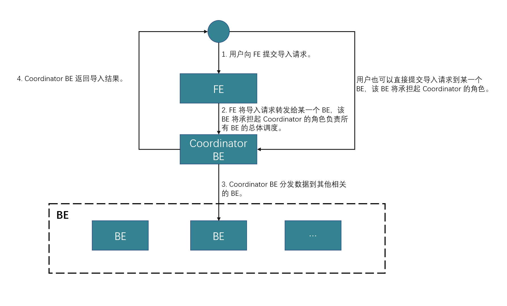
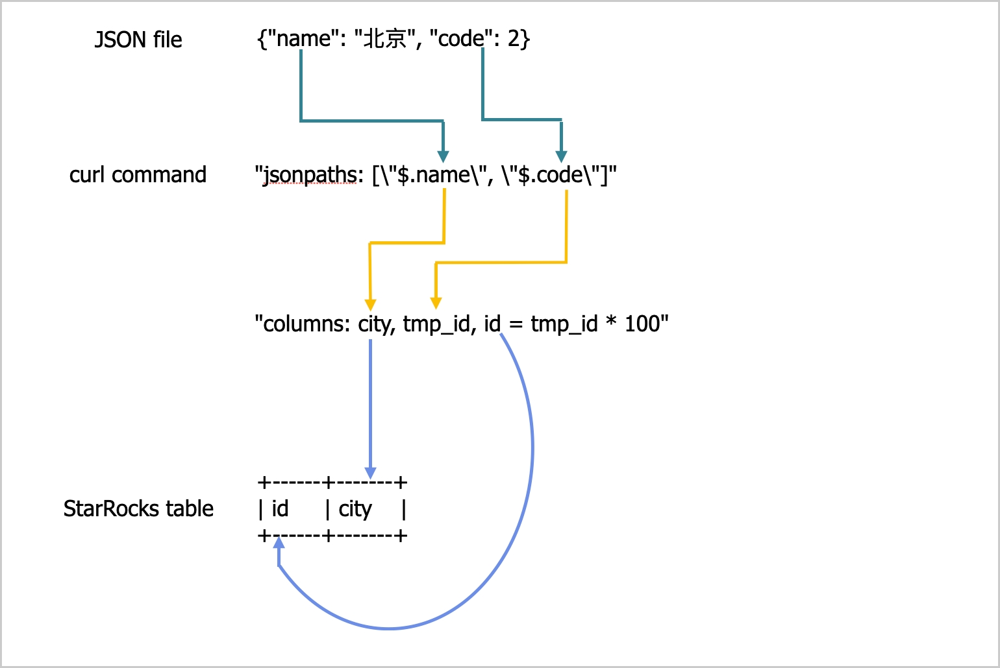

# 从本地文件系统导入数据

import InsertPrivNote from '../_assets/commonMarkdown/insertPrivNote.mdx'

StarRocks 提供了两种从本地文件系统导入数据的方法：

- 使用 [Stream Load](../sql-reference/sql-statements/loading_unloading/STREAM_LOAD.md) 的同步导入
- 使用 [Broker Load](../sql-reference/sql-statements/loading_unloading/BROKER_LOAD.md) 的异步导入

每种选项都有其自身的优势：

- Stream Load 支持 CSV 和 JSON 文件格式。如果您想从少量文件中导入数据，并且每个文件的大小不超过 10 GB，建议使用此方法。
- Broker Load 支持 Parquet、ORC、CSV 和 JSON 文件格式（从 v3.2.3 开始支持 JSON 文件格式）。如果您想从大量文件中导入数据，并且每个文件的大小超过 10 GB，或者文件存储在网络附加存储（NAS）设备中，建议使用此方法。**从 v2.5 开始支持使用 Broker Load 从本地文件系统导入数据。**

对于 CSV 数据，请注意以下几点：

- 您可以使用 UTF-8 字符串作为文本分隔符，例如逗号（,）、制表符或管道符（|），其长度不超过 50 字节。
- 空值用 `\N` 表示。例如，一个数据文件由三列组成，其中一条记录在第一列和第三列有数据，但第二列没有数据。在这种情况下，您需要在第二列使用 `\N` 表示空值。这意味着记录必须编写为 `a,\N,b` 而不是 `a,,b`。`a,,b` 表示记录的第二列包含一个空字符串。

Stream Load 和 Broker Load 都支持在数据导入时进行数据转换，并支持在数据导入时通过 UPSERT 和 DELETE 操作进行数据更改。有关更多信息，请参见 [在导入时转换数据](../loading/Etl_in_loading.md) 和 [通过导入更改数据](../loading/Load_to_Primary_Key_tables.md)。

## 开始之前

### 检查权限

<InsertPrivNote />

#### 检查网络配置

确保您要导入数据的机器可以通过 [`http_port`](../administration/management/FE_configuration.md#http_port)（默认：`8030`）和 [`be_http_port`](../administration/management/BE_configuration.md#be_http_port)（默认：`8040`）访问 StarRocks 集群的 FE 和 BE 节点。

## 通过 Stream Load 从本地文件系统导入

Stream Load 是一种基于 HTTP PUT 的同步导入方法。在您提交导入作业后，StarRocks 会同步运行该作业，并在作业完成后返回结果。您可以根据作业结果判断作业是否成功。

> **注意**
>
> 当您使用 Stream Load 将数据导入 StarRocks 表后，该表上创建的物化视图的数据也会被更新。

### 工作原理

您可以根据 HTTP 在客户端上向 FE 提交导入请求，然后 FE 使用 HTTP 重定向将导入请求转发到特定的 BE 或 CN。您也可以直接在客户端上向您选择的 BE 或 CN 提交导入请求。

:::note

如果您将导入请求提交给 FE，FE 会使用轮询机制决定哪个 BE 或 CN 将作为协调者接收和处理导入请求。轮询机制有助于实现 StarRocks 集群内的负载均衡。因此，我们建议您将导入请求发送给 FE。

:::

接收导入请求的 BE 或 CN 作为协调者 BE 或 CN，基于使用的 schema 将数据拆分为多个部分，并将每个部分的数据分配给其他参与的 BE 或 CN。导入完成后，协调者 BE 或 CN 将导入作业的结果返回给您的客户端。请注意，如果您在导入过程中停止协调者 BE 或 CN，导入作业将失败。

下图显示了 Stream Load 作业的工作流程。



### 限制

Stream Load 不支持导入包含 JSON 格式列的 CSV 文件的数据。

### 典型示例

本节使用 curl 作为示例，描述如何将 CSV 或 JSON 文件的数据从本地文件系统导入到 StarRocks。有关详细的语法和参数说明，请参见 [STREAM LOAD](../sql-reference/sql-statements/loading_unloading/STREAM_LOAD.md)。

请注意，在 StarRocks 中，某些字面量被 SQL 语言用作保留关键字。不要在 SQL 语句中直接使用这些关键字。如果您想在 SQL 语句中使用此类关键字，请将其用一对反引号（`）括起来。参见 [关键字](../sql-reference/sql-statements/keywords.md)。

#### 导入 CSV 数据

##### 准备数据集

在您的本地文件系统中，创建一个名为 `example1.csv` 的 CSV 文件。该文件由三列组成，依次表示用户 ID、用户名和用户分数。

```Plain
1,Lily,23
2,Rose,23
3,Alice,24
4,Julia,25
```

##### 创建数据库和表

创建一个数据库并切换到该数据库：

```SQL
CREATE DATABASE IF NOT EXISTS mydatabase;
USE mydatabase;
```

创建一个名为 `table1` 的主键表。该表由三列组成：`id`、`name` 和 `score`，其中 `id` 是主键。

```SQL
CREATE TABLE `table1`
(
    `id` int(11) NOT NULL COMMENT "user ID",
    `name` varchar(65533) NULL COMMENT "user name",
    `score` int(11) NOT NULL COMMENT "user score"
)
ENGINE=OLAP
PRIMARY KEY(`id`)
DISTRIBUTED BY HASH(`id`);
```

:::note

从 v2.5.7 开始，StarRocks 可以在创建表或添加分区时自动设置桶的数量（BUCKETS）。您不再需要手动设置桶的数量。有关详细信息，请参见 [设置桶的数量](../table_design/data_distribution/Data_distribution.md#set-the-number-of-buckets)。

:::

##### 启动 Stream Load

运行以下命令将 `example1.csv` 的数据导入到 `table1` 中：

```Bash
curl --location-trusted -u <username>:<password> -H "label:123" \
    -H "Expect:100-continue" \
    -H "column_separator:," \
    -H "columns: id, name, score" \
    -T example1.csv -XPUT \
    http://<fe_host>:<fe_http_port>/api/mydatabase/table1/_stream_load
```

:::note

- 如果您使用的账户未设置密码，则只需输入 `<username>:`。
- 您可以使用 [SHOW FRONTENDS](../sql-reference/sql-statements/cluster-management/nodes_processes/SHOW_FRONTENDS.md) 查看 FE 节点的 IP 地址和 HTTP 端口。

:::

`example1.csv` 由三列组成，以逗号（,）分隔，并可以按顺序映射到 `table1` 的 `id`、`name` 和 `score` 列。因此，您需要使用 `column_separator` 参数指定逗号（,）作为列分隔符。您还需要使用 `columns` 参数将 `example1.csv` 的三列临时命名为 `id`、`name` 和 `score`，并按顺序映射到 `table1` 的三列。

导入完成后，您可以查询 `table1` 以验证导入是否成功：

```SQL
SELECT * FROM table1;
+------+-------+-------+
| id   | name  | score |
+------+-------+-------+
|    1 | Lily  |    23 |
|    2 | Rose  |    23 |
|    3 | Alice |    24 |
|    4 | Julia |    25 |
+------+-------+-------+
4 rows in set (0.00 sec)
```

#### 导入 JSON 数据

从 v3.2.7 开始，Stream Load 支持在传输过程中压缩 JSON 数据，减少网络带宽开销。用户可以使用参数 `compression` 和 `Content-Encoding` 指定不同的压缩算法。支持的压缩算法包括 GZIP、BZIP2、LZ4_FRAME 和 ZSTD。有关语法，请参见 [STREAM LOAD](../sql-reference/sql-statements/loading_unloading/STREAM_LOAD.md)。

##### 准备数据集

在您的本地文件系统中，创建一个名为 `example2.json` 的 JSON 文件。该文件由两列组成，依次表示城市 ID 和城市名称。

```JSON
{"name": "Beijing", "code": 2}
```

##### 创建数据库和表

创建一个数据库并切换到该数据库：

```SQL
CREATE DATABASE IF NOT EXISTS mydatabase;
USE mydatabase;
```

创建一个名为 `table2` 的主键表。该表由两列组成：`id` 和 `city`，其中 `id` 是主键。

```SQL
CREATE TABLE `table2`
(
    `id` int(11) NOT NULL COMMENT "city ID",
    `city` varchar(65533) NULL COMMENT "city name"
)
ENGINE=OLAP
PRIMARY KEY(`id`)
DISTRIBUTED BY HASH(`id`);
```

:::note

从 v2.5.7 开始，StarRocks 可以在创建表或添加分区时自动设置桶的数量（BUCKETS）。您不再需要手动设置桶的数量。有关详细信息，请参见 [设置桶的数量](../table_design/data_distribution/Data_distribution.md#set-the-number-of-buckets)。

:::

##### 启动 Stream Load

运行以下命令将 `example2.json` 的数据导入到 `table2` 中：

```Bash
curl -v --location-trusted -u <username>:<password> -H "strict_mode: true" \
    -H "Expect:100-continue" \
    -H "format: json" -H "jsonpaths: [\"$.name\", \"$.code\"]" \
    -H "columns: city,tmp_id, id = tmp_id * 100" \
    -T example2.json -XPUT \
    http://<fe_host>:<fe_http_port>/api/mydatabase/table2/_stream_load
```

:::note

- 如果您使用的账户未设置密码，则只需输入 `<username>:`。
- 您可以使用 [SHOW FRONTENDS](../sql-reference/sql-statements/cluster-management/nodes_processes/SHOW_FRONTENDS.md) 查看 FE 节点的 IP 地址和 HTTP 端口。

:::

`example2.json` 由两个键 `name` 和 `code` 组成，映射到 `table2` 的 `id` 和 `city` 列，如下图所示。



上述图中的映射描述如下：

- StarRocks 提取 `example2.json` 的 `name` 和 `code` 键，并将它们映射到 `jsonpaths` 参数中声明的 `name` 和 `code` 字段。

- StarRocks 提取 `jsonpaths` 参数中声明的 `name` 和 `code` 字段，并按顺序将它们映射到 `columns` 参数中声明的 `city` 和 `tmp_id` 字段。

- StarRocks 提取 `columns` 参数中声明的 `city` 和 `tmp_id` 字段，并按名称将它们映射到 `table2` 的 `city` 和 `id` 列。

:::note

在上述示例中，`example2.json` 中 `code` 的值在加载到 `table2` 的 `id` 列之前乘以 100。

:::

有关 `jsonpaths`、`columns` 和 StarRocks 表列之间的详细映射，请参见 [STREAM LOAD](../sql-reference/sql-statements/loading_unloading/STREAM_LOAD.md) 中的“列映射”部分。

导入完成后，您可以查询 `table2` 以验证导入是否成功：

```SQL
SELECT * FROM table2;
+------+--------+
| id   | city   |
+------+--------+
| 200  | Beijing|
+------+--------+
4 rows in set (0.01 sec)
```

import Beta from '../_assets/commonMarkdown/_beta.mdx'

#### 合并 Stream Load 请求

<Beta />

从 v3.4.0 开始，系统支持合并多个 Stream Load 请求。

合并提交是 Stream Load 的一种优化，专为高并发、小批量（从 KB 到几十 MB）的实时加载场景设计。在早期版本中，每个 Stream Load 请求都会生成一个事务和一个数据版本，这在高并发加载场景中导致以下问题：

- 过多的数据版本影响查询性能，限制版本数量可能导致 `too many versions` 错误。
- 通过 Compaction 合并数据版本增加了资源消耗。
- 生成小文件，增加 IOPS 和 I/O 延迟。在存算分离集群中，这也增加了云对象存储成本。
- Leader FE 节点作为事务管理器，可能成为单点瓶颈。

合并提交通过在时间窗口内将多个并发 Stream Load 请求合并为一个事务来缓解这些问题。这减少了高并发请求生成的事务和版本数量，从而提高了加载性能。

合并提交支持同步和异步两种模式。每种模式都有其优缺点。您可以根据使用场景进行选择。

- **同步模式**

  服务器在合并事务提交后才返回，确保加载成功并可见。

- **异步模式**

  服务器在接收到数据后立即返回。此模式不保证加载成功。

| **模式**     | **优点**                                               | **缺点**                                            |
| ------------ | ------------------------------------------------------------ | ------------------------------------------------------------ |
| 同步模式  | <ul><li>确保请求返回时数据持久化和可见。</li><li>保证来自同一客户端的多个顺序加载请求按顺序执行。</li></ul> | 客户端的每个加载请求都被阻塞，直到服务器关闭合并窗口。如果窗口过大，可能会降低单个客户端的数据处理能力。 |
| 异步模式 | 允许单个客户端在不等待服务器关闭合并窗口的情况下发送后续加载请求，提高加载吞吐量。 | <ul><li>不保证返回时数据持久化或可见。客户端必须稍后验证事务状态。</li><li>不保证来自同一客户端的多个顺序加载请求按顺序执行。</li></ul> |

##### 启动 Stream Load

- 运行以下命令以同步模式启动启用合并提交的 Stream Load 作业，并将合并窗口设置为 `5000` 毫秒，并行度设置为 `2`：

  ```Bash
  curl --location-trusted -u <username>:<password> \
      -H "Expect:100-continue" \
      -H "column_separator:," \
      -H "columns: id, name, score" \
      -H "enable_merge_commit:true" \
      -H "merge_commit_interval_ms:5000" \
      -H "merge_commit_parallel:2" \
      -T example1.csv -XPUT \
      http://<fe_host>:<fe_http_port>/api/mydatabase/table1/_stream_load
  ```

- 运行以下命令以异步模式启动启用合并提交的 Stream Load 作业，并将合并窗口设置为 `60000` 毫秒，并行度设置为 `2`：

  ```Bash
  curl --location-trusted -u <username>:<password> \
      -H "Expect:100-continue" \
      -H "column_separator:," \
      -H "columns: id, name, score" \
      -H "enable_merge_commit:true" \
      -H "merge_commit_async:true" \
      -H "merge_commit_interval_ms:60000" \
      -H "merge_commit_parallel:2" \
      -T example1.csv -XPUT \
      http://<fe_host>:<fe_http_port>/api/mydatabase/table1/_stream_load
  ```

:::note

- 合并提交仅支持将**同质**加载请求合并到单个数据库和表中。“同质”表示 Stream Load 参数相同，包括：通用参数、JSON 格式参数、CSV 格式参数、`opt_properties` 和合并提交参数。
- 对于加载 CSV 格式的数据，您必须确保每行以行分隔符结束。不支持 `skip_header`。
- 服务器会自动生成事务的标签。如果指定，它们将被忽略。
- 合并提交将多个加载请求合并为一个事务。如果一个请求包含数据质量问题，事务中的所有请求都将失败。

:::

#### 检查 Stream Load 进度

在加载作业完成后，StarRocks 会以 JSON 格式返回作业的结果。有关更多信息，请参见 [STREAM LOAD](../sql-reference/sql-statements/loading_unloading/STREAM_LOAD.md) 中的“返回值”部分。

Stream Load 不允许您使用 SHOW LOAD 语句查询加载作业的结果。

#### 取消 Stream Load 作业

Stream Load 不允许您取消加载作业。如果加载作业超时或遇到错误，StarRocks 会自动取消作业。

### 参数配置

本节描述了一些系统参数，您需要配置这些参数以选择 Stream Load 作为加载方法。这些参数配置对所有 Stream Load 作业生效。

- `streaming_load_max_mb`：您要加载的每个数据文件的最大大小。默认最大大小为 10 GB。有关更多信息，请参见 [配置 BE 或 CN 动态参数](../administration/management/BE_configuration.md)。
  
  我们建议您一次不要加载超过 10 GB 的数据。如果数据文件的大小超过 10 GB，我们建议您将数据文件拆分为小于 10 GB 的小文件，然后逐个加载这些文件。如果您无法拆分大于 10 GB 的数据文件，可以根据文件大小增加此参数的值。

  在增加此参数的值后，新值仅在您重新启动 StarRocks 集群的 BEs 或 CNs 后生效。此外，系统性能可能会下降，并且在加载失败时重试的成本也会增加。

  :::note
  
  当您加载 JSON 文件的数据时，请注意以下几点：
  
  - 文件中每个 JSON 对象的大小不能超过 4 GB。如果文件中的任何 JSON 对象超过 4 GB，StarRocks 会抛出错误 "This parser can't support a document that big."
  
  - 默认情况下，HTTP 请求中的 JSON 正文不能超过 100 MB。如果 JSON 正文超过 100 MB，StarRocks 会抛出错误 "The size of this batch exceed the max size [104857600] of json type data data [8617627793]. Set ignore_json_size to skip check, although it may lead huge memory consuming." 为防止此错误，您可以在 HTTP 请求头中添加 `"ignore_json_size:true"` 来忽略对 JSON 正文大小的检查。

  :::

- `stream_load_default_timeout_second`：每个加载作业的超时时间。默认超时时间为 600 秒。有关更多信息，请参见 [配置 FE 动态参数](../administration/management/FE_configuration.md#configure-fe-dynamic-parameters)。
  
  如果您创建的许多加载作业超时，您可以根据以下公式计算结果增加此参数的值：

  **每个加载作业的超时时间 > 要加载的数据量/平均加载速度**

  例如，如果您要加载的数据文件大小为 10 GB，而 StarRocks 集群的平均加载速度为 100 MB/s，请将超时时间设置为超过 100 秒。

  :::note
  
  上述公式中的**平均加载速度**是您 StarRocks 集群的平均加载速度。它会根据磁盘 I/O 和 StarRocks 集群中 BEs 或 CNs 的数量而有所不同。

  :::

  Stream Load 还提供 `timeout` 参数，允许您指定单个加载作业的超时时间。有关更多信息，请参见 [STREAM LOAD](../sql-reference/sql-statements/loading_unloading/STREAM_LOAD.md)。

### 使用注意事项

如果您要加载的数据文件中的记录缺少字段，并且该字段在 StarRocks 表中映射的列被定义为 `NOT NULL`，StarRocks 会在加载记录时自动在 StarRocks 表的映射列中填充一个 `NULL` 值。您也可以使用 `ifnull()` 函数指定要填充的默认值。

例如，如果上述 `example2.json` 文件中表示城市 ID 的字段缺失，并且您想在 `table2` 的映射列中填充一个 `x` 值，您可以指定 `"columns: city, tmp_id, id = ifnull(tmp_id, 'x')"`。

## 通过 Broker Load 从本地文件系统导入

除了 Stream Load，您还可以使用 Broker Load 从本地文件系统导入数据。从 v2.5 开始支持此功能。

Broker Load 是一种异步导入方法。在您提交导入作业后，StarRocks 会异步运行该作业，并不会立即返回作业结果。您需要手动查询作业结果。请参见 [检查 Broker Load 进度](#check-broker-load-progress)。

### 限制

- 目前 Broker Load 仅支持通过单个 broker 从本地文件系统导入，broker 版本需为 v2.5 或更高。
- 针对单个 broker 的高并发查询可能导致超时和 OOM 等问题。为减轻影响，您可以使用 `pipeline_dop` 变量（请参见 [系统变量](../sql-reference/System_variable.md#pipeline_dop)）设置 Broker Load 的查询并行度。对于单个 broker 的查询，我们建议将 `pipeline_dop` 设置为小于 `16` 的值。

### 典型示例

Broker Load 支持从单个数据文件加载到单个表，从多个数据文件加载到单个表，以及从多个数据文件加载到多个表。本节以从多个数据文件加载到单个表为例。

请注意，在 StarRocks 中，某些字面量被 SQL 语言用作保留关键字。不要在 SQL 语句中直接使用这些关键字。如果您想在 SQL 语句中使用此类关键字，请将其用一对反引号（`）括起来。参见 [关键字](../sql-reference/sql-statements/keywords.md)。

#### 准备数据集

以 CSV 文件格式为例。登录到您的本地文件系统，并在特定存储位置（例如 `/home/disk1/business/`）创建两个 CSV 文件 `file1.csv` 和 `file2.csv`。两个文件都由三列组成，依次表示用户 ID、用户名和用户分数。

- `file1.csv`

  ```Plain
  1,Lily,21
  2,Rose,22
  3,Alice,23
  4,Julia,24
  ```

- `file2.csv`

  ```Plain
  5,Tony,25
  6,Adam,26
  7,Allen,27
  8,Jacky,28
  ```

#### 创建数据库和表

创建一个数据库并切换到该数据库：

```SQL
CREATE DATABASE IF NOT EXISTS mydatabase;
USE mydatabase;
```

创建一个名为 `mytable` 的主键表。该表由三列组成：`id`、`name` 和 `score`，其中 `id` 是主键。

```SQL
CREATE TABLE `mytable`
(
    `id` int(11) NOT NULL COMMENT "User ID",
    `name` varchar(65533) NULL DEFAULT "" COMMENT "User name",
    `score` int(11) NOT NULL DEFAULT "0" COMMENT "User score"
)
ENGINE=OLAP
PRIMARY KEY(`id`)
DISTRIBUTED BY HASH(`id`)
PROPERTIES("replication_num"="1");
```

#### 启动 Broker Load

运行以下命令启动一个 Broker Load 作业，将存储在本地文件系统 `/home/disk1/business/` 路径下的所有数据文件（`file1.csv` 和 `file2.csv`）的数据加载到 StarRocks 表 `mytable` 中：

```SQL
LOAD LABEL mydatabase.label_local
(
    DATA INFILE("file:///home/disk1/business/csv/*")
    INTO TABLE mytable
    COLUMNS TERMINATED BY ","
    (id, name, score)
)
WITH BROKER "sole_broker"
PROPERTIES
(
    "timeout" = "3600"
);
```

此作业有四个主要部分：

- `LABEL`：用于查询加载作业状态的字符串。
- `LOAD` 声明：源 URI、源数据格式和目标表名。
- `PROPERTIES`：加载作业的超时值和其他属性。

有关详细的语法和参数说明，请参见 [BROKER LOAD](../sql-reference/sql-statements/loading_unloading/BROKER_LOAD.md)。

#### 检查 Broker Load 进度

在 v3.0 及更早版本中，使用 [SHOW LOAD](../sql-reference/sql-statements/loading_unloading/SHOW_LOAD.md) 语句或 curl 命令查看 Broker Load 作业的进度。

在 v3.1 及更高版本中，您可以从 [`information_schema.loads`](../sql-reference/information_schema/loads.md) 视图中查看 Broker Load 作业的进度：

```SQL
SELECT * FROM information_schema.loads;
```

如果您提交了多个加载作业，可以根据与作业关联的 `LABEL` 进行过滤。示例：

```SQL
SELECT * FROM information_schema.loads WHERE LABEL = 'label_local';
```

在确认加载作业已完成后，您可以查询表以查看数据是否已成功加载。示例：

```SQL
SELECT * FROM mytable;
+------+-------+-------+
| id   | name  | score |
+------+-------+-------+
|    3 | Alice |    23 |
|    5 | Tony  |    25 |
|    6 | Adam  |    26 |
|    1 | Lily  |    21 |
|    2 | Rose  |    22 |
|    4 | Julia |    24 |
|    7 | Allen |    27 |
|    8 | Jacky |    28 |
+------+-------+-------+
8 rows in set (0.07 sec)
```

#### 取消 Broker Load 作业

当加载作业不处于 **CANCELLED** 或 **FINISHED** 阶段时，您可以使用 [CANCEL LOAD](../sql-reference/sql-statements/loading_unloading/CANCEL_LOAD.md) 语句取消作业。

例如，您可以执行以下语句取消数据库 `mydatabase` 中标签为 `label_local` 的加载作业：

```SQL
CANCEL LOAD
FROM mydatabase
WHERE LABEL = "label_local";
```

## 通过 Broker Load 从 NAS 导入

使用 Broker Load 从 NAS 导入数据有两种方式：

- 将 NAS 视为本地文件系统，并使用 broker 运行加载作业。请参见上一节“[通过 Broker Load 从本地系统导入](#loading-from-a-local-file-system-via-broker-load)”。
- （推荐）将 NAS 视为云存储系统，并在没有 broker 的情况下运行加载作业。

本节介绍第二种方式。详细操作如下：

1. 将您的 NAS 设备挂载到 StarRocks 集群的所有 BE 或 CN 节点和 FE 节点上的相同路径。这样，所有 BEs 或 CNs 可以像访问自己本地存储的文件一样访问 NAS 设备。

2. 使用 Broker Load 将数据从 NAS 设备加载到目标 StarRocks 表。示例：

   ```SQL
   LOAD LABEL test_db.label_nas
   (
       DATA INFILE("file:///home/disk1/sr/*")
       INTO TABLE mytable
       COLUMNS TERMINATED BY ","
   )
   WITH BROKER
   PROPERTIES
   (
       "timeout" = "3600"
   );
   ```

   此作业有四个主要部分：

   - `LABEL`：用于查询加载作业状态的字符串。
   - `LOAD` 声明：源 URI、源数据格式和目标表名。请注意，声明中的 `DATA INFILE` 用于指定 NAS 设备的挂载点文件夹路径，如上述示例中所示，其中 `file:///` 是前缀，`/home/disk1/sr` 是挂载点文件夹路径。
   - `BROKER`：您不需要指定 broker 名称。
   - `PROPERTIES`：加载作业的超时值和其他属性。

   有关详细的语法和参数说明，请参见 [BROKER LOAD](../sql-reference/sql-statements/loading_unloading/BROKER_LOAD.md)。

提交作业后，您可以根据需要查看加载进度或取消作业。有关详细操作，请参见本主题中的“[检查 Broker Load 进度](#check-broker-load-progress)”和“[取消 Broker Load 作业](#cancel-a-broker-load-job)”。
