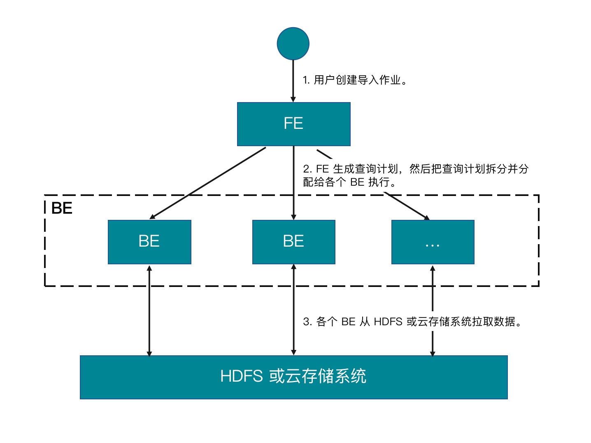

# 从 Microsoft Azure Storage 导入

import LoadMethodIntro from '../assets/commonMarkdown/loadMethodIntro.md'

import InsertPrivNote from '../assets/commonMarkdown/insertPrivNote.md'

StarRocks 支持通过以下方式从 AWS S3 导入数据：

<LoadMethodIntro />

## 准备工作

### 准备数据源

确保待导入数据已保存在您 Azure 服务账号（Service Account）下的容器（Container）。

本文中，我们提供了 Parquet 格式的样例数据集 `user_behavior_ten_million_rows.parquet`，保存在 Azure Data Lake Storage Gen2（简称 ADLS Gen2）服务账号 (`starrocks`) 下容器 (`starrocks-container`) 的根目录里。

### 查看权限

<InsertPrivNote />

### 获取资源访问配置

本文的示例使用基于 Shared Key 的认证方式。为确保您能顺利访问存储在 ADLS Gen2 中的数据，建议您参照“[Azure Data Lake Storage Gen2 > Shared Key (access key of storage account)](../integrations/authenticate_to_azure_storage.md#基于-shared-key-认证鉴权) 中的介绍，理解该认证方式下需要配置哪些认证参数。

概括来说，如果选择基于 Shared Key 的认证方式，您需要提前获取以下资源信息：

- ADLS Gen2 存储账号的用户名
- ADLS Gen2 账号的 Shared Key（即 Access Key）

有关 StarRocks 支持的其他认证方式，参见 [Authenticate to Azure cloud storage](../integrations/authenticate_to_azure_storage.md)。

## 通过 INSERT+FILES() 导入

该特性从 3.2 版本起支持。当前只支持 Parquet 和 ORC 文件格式。

### INSERT+FILES() 优势

`FILES()` 会根据给定的数据路径等参数读取数据，并自动根据数据文件的格式、列信息等推断出表结构，最终以数据行的形式返回文件中的数据。

通过 `FILES()`，您可以：

- 使用 [SELECT](../sql-reference/sql-statements/data-manipulation/SELECT.md) 语句直接从 AWS S3 查询数据。
- 通过 [CREATE TABLE AS SELECT](../sql-reference/sql-statements/data-definition/CREATE_TABLE_AS_SELECT.md)（简称 CTAS）语句实现自动建表和导入数据。
- 手动建表，然后通过 [INSERT](../sql-reference/sql-statements/data-manipulation/SELECT.md) 导入数据。

### 操作示例

#### 通过 SELECT 直接查询数据

您可以通过 SELECT+`FILES()` 直接查询 Azure 里的数据，从而在建表前对待导入数据有一个整体的了解，其优势包括：

- 您不需要存储数据就可以对其进行查看。
- 您可以查看数据的最大值、最小值，并确定需要使用哪些数据类型。
- 您可以检查数据中是否包含 `NULL` 值。

例如，查询样例数据集 `user_behavior_ten_million_rows.parquet` 中的数据：

```SQL
SELECT * FROM FILES
(
    "path" = "abfss://starrocks-container@starrocks.dfs.core.windows.net/user_behavior_ten_million_rows.parquet",
    "format" = "parquet",
    "azure.adls2.storage_account" = "starrocks",
    "azure.adls2.shared_key" = "xxxxxxxxxxxxxxxxxx"
)
LIMIT 3;
```

系统返回如下类似查询结果：

```Plain
+--------+---------+------------+--------------+---------------------+
| UserID | ItemID  | CategoryID | BehaviorType | Timestamp           |
+--------+---------+------------+--------------+---------------------+
| 543711 |  829192 |    2355072 | pv           | 2017-11-27 08:22:37 |
| 543711 | 2056618 |    3645362 | pv           | 2017-11-27 10:16:46 |
| 543711 | 1165492 |    3645362 | pv           | 2017-11-27 10:17:00 |
+--------+---------+------------+--------------+---------------------+
```

> **说明**
>
> 以上返回结果中的列名是源 Parquet 文件中定义的列名。

#### 通过 CTAS 自动建表并导入数据

该示例是上一个示例的延续。该示例中，通过在 CREATE TABLE AS SELECT (CTAS) 语句中嵌套上一个示例中的 SELECT 查询，StarRocks 可以自动推断表结构、创建表、并把数据导入新建的表中。Parquet 格式的文件自带列名和数据类型，因此您不需要指定列名或数据类型。

> **说明**
>
> 使用表结构推断功能时，CREATE TABLE 语句不支持设置副本数。如果您的集群为存算一体模式，您需要在建表前把副本数设置好。例如，您可以通过如下命令设置副本数为 `3`：
>
> ```SQL
> ADMIN SET FRONTEND CONFIG ('default_replication_num' = "3");
> ```

通过如下语句创建数据库、并切换至该数据库：

```SQL
CREATE DATABASE IF NOT EXISTS mydatabase;
USE mydatabase;
```

通过 CTAS 自动创建表、并把样例数据集 `user_behavior_ten_million_rows.parquet` 中的数据导入到新建表中：

```SQL
CREATE TABLE user_behavior_inferred AS
SELECT * FROM FILES
(
    "path" = "abfss://starrocks-container@starrocks.dfs.core.windows.net/user_behavior_ten_million_rows.parquet",
    "format" = "parquet",
    "azure.adls2.storage_account" = "starrocks",
    "azure.adls2.shared_key" = "xxxxxxxxxxxxxxxxxx"
);
```

建表完成后，您可以通过 [DESCRIBE](../sql-reference/sql-statements/Utility/DESCRIBE.md) 查看新建表的表结构：

```SQL
DESCRIBE user_behavior_inferred;
```

系统返回如下查询结果：

```Plain
+--------------+-----------+------+-------+---------+-------+
| Field        | Type      | Null | Key   | Default | Extra |
+--------------+-----------+------+-------+---------+-------+
| UserID       | bigint    | YES  | true  | NULL    |       |
| ItemID       | bigint    | YES  | true  | NULL    |       |
| CategoryID   | bigint    | YES  | true  | NULL    |       |
| BehaviorType | varbinary | YES  | false | NULL    |       |
| Timestamp    | varbinary | YES  | false | NULL    |       |
+--------------+-----------+------+-------+---------+-------+
```

将系统推断出来的表结构跟手动建表的表结构从以下几个方面进行对比：

- 数据类型
- 是否允许 `NULL` 值
- 定义为键的字段

在生产环境中，为更好地控制目标表的表结构、实现更高的查询性能，建议您手动创建表、指定表结构。

您可以查询新建表中的数据，验证数据已成功导入。例如：

```SQL
SELECT * from user_behavior_inferred LIMIT 3;
```

系统返回如下查询结果，表明数据已成功导入：

```Plain
+--------+--------+------------+--------------+---------------------+
| UserID | ItemID | CategoryID | BehaviorType | Timestamp           |
+--------+--------+------------+--------------+---------------------+
|     84 | 162325 |    2939262 | pv           | 2017-12-02 05:41:41 |
|     84 | 232622 |    4148053 | pv           | 2017-11-27 04:36:10 |
|     84 | 595303 |     903809 | pv           | 2017-11-26 08:03:59 |
+--------+--------+------------+--------------+---------------------+
```

#### 手动建表并通过 INSERT 导入数据

在实际业务场景中，您可能需要自定义目标表的表结构，包括：

- 各列的数据类型和默认值、以及是否允许 `NULL` 值
- 定义哪些列作为键、以及这些列的数据类型
- 数据分区分桶

> **说明**
>
> 要实现高效的表结构设计，您需要深度了解表中数据的用途、以及表中各列的内容。本文不对表设计做过多赘述，有关表设计的详细信息，参见[表设计](../table_design/StarRocks_table_design.md)。

该示例主要演示如何根据源 Parquet 格式文件中数据的特点、以及目标表未来的查询用途等对目标表进行定义和创建。在创建表之前，您可以先查看一下保存在 Azure 中的源文件，从而了解源文件中数据的特点，例如：

- 源文件中包含一个数据类型为 VARBINARY 的 `Timestamp` 列，因此建表语句中也应该定义这样一个数据类型为 VARBINARY 的 `Timestamp` 列。
- 源文件中的数据中没有 `NULL` 值，因此建表语句中也不需要定义任何列为允许 `NULL` 值。
- 根据查询到的数据类型，可以在建表语句中定义 `UserID` 列为排序键和分桶键。根据实际业务场景需要，您还可以定义其他列比如 `ItemID` 或者定义 `UserID` 与其他列的组合作为排序键。

通过如下语句创建数据库、并切换至该数据库：

```SQL
CREATE DATABASE IF NOT EXISTS mydatabase;
USE mydatabase;
```

通过如下语句手动创建表（建议表结构与您在 Azure 存储的待导入数据结构一致）：

```SQL
CREATE TABLE user_behavior_declared
(
    UserID int(11),
    ItemID int(11),
    CategoryID int(11),
    BehaviorType varchar(65533),
    Timestamp varbinary
)
ENGINE = OLAP 
DUPLICATE KEY(UserID)
DISTRIBUTED BY HASH(UserID);
```

建表完成后，您可以通过 INSERT INTO SELECT FROM FILES() 向表内导入数据：

```SQL
INSERT INTO user_behavior_declared
SELECT * FROM FILES
(
    "path" = "abfss://starrocks-container@starrocks.dfs.core.windows.net/user_behavior_ten_million_rows.parquet",
    "format" = "parquet",
    "azure.adls2.storage_account" = "starrocks",
    "azure.adls2.shared_key" = "xxxxxxxxxxxxxxxxxx"
);
```

导入完成后，您可以查询新建表中的数据，验证数据已成功导入。例如：

```SQL
SELECT * from user_behavior_declared LIMIT 3;
```

系统返回类似如下查询结果，表明数据已成功导入：

```Plain
 +--------+---------+------------+--------------+---------------------+
| UserID | ItemID  | CategoryID | BehaviorType | Timestamp           |
+--------+---------+------------+--------------+---------------------+
|    142 | 2869980 |    2939262 | pv           | 2017-11-25 03:43:22 |
|    142 | 2522236 |    1669167 | pv           | 2017-11-25 15:14:12 |
|    142 | 3031639 |    3607361 | pv           | 2017-11-25 15:19:25 |
+--------+---------+------------+--------------+---------------------+
```

#### 查看导入进度

通过 StarRocks Information Schema 库中的 [`loads`](../reference/information_schema/loads.md) 视图查看导入作业的进度。该功能自 3.1 版本起支持。例如：

```SQL
SELECT * FROM information_schema.loads ORDER BY JOB_ID DESC;
```

如果您提交了多个导入作业，您可以通过 `LABEL` 过滤出想要查看的作业。例如：

```SQL
SELECT * FROM information_schema.loads WHERE LABEL = 'insert_f3fc2298-a553-11ee-92f4-00163e0842bd' \G
*************************** 1. row ***************************
              JOB_ID: 10193
               LABEL: insert_f3fc2298-a553-11ee-92f4-00163e0842bd
       DATABASE_NAME: mydatabase
               STATE: FINISHED
            PROGRESS: ETL:100%; LOAD:100%
                TYPE: INSERT
            PRIORITY: NORMAL
           SCAN_ROWS: 10000000
       FILTERED_ROWS: 0
     UNSELECTED_ROWS: 0
           SINK_ROWS: 10000000
            ETL_INFO:
           TASK_INFO: resource:N/A; timeout(s):300; max_filter_ratio:0.0
         CREATE_TIME: 2023-12-28 15:37:38
      ETL_START_TIME: 2023-12-28 15:37:38
     ETL_FINISH_TIME: 2023-12-28 15:37:38
     LOAD_START_TIME: 2023-12-28 15:37:38
    LOAD_FINISH_TIME: 2023-12-28 15:39:35
         JOB_DETAILS: {"All backends":{"f3fc2298-a553-11ee-92f4-00163e0842bd":[10120]},"FileNumber":0,"FileSize":0,"InternalTableLoadBytes":581730322,"InternalTableLoadRows":10000000,"ScanBytes":581574034,"ScanRows":10000000,"TaskNumber":1,"Unfinished backends":{"f3fc2298-a553-11ee-92f4-00163e0842bd":[]}}
           ERROR_MSG: NULL
        TRACKING_URL: NULL
        TRACKING_SQL: NULL
REJECTED_RECORD_PATH: NULL
```

有关 `loads` 视图提供的字段详情，参见 [`loads`](../reference/information_schema/loads.md)。

> **NOTE**
>
> 由于 INSERT 语句是一个同步命令，因此，如果作业还在运行当中，您需要打开另一个会话来查看 INSERT 作业的执行情况。

## 通过 Broker Load 导入

作为一种异步的导入方式，Broker Load 负责建立与 Azure 的连接、拉取数据、并将数据存储到 StarRocks 中。

当前支持以下文件格式：

- Parquet
- ORC
- CSV
- JSON（自 3.2.3 版本起支持）

### Broker Load 优势

- Broker Load 在后台运行，客户端不需要保持连接也能确保导入作业不中断。
- Broker Load 作业默认超时时间为 4 小时，适合导入数据较大、导入运行时间较长的场景。
- 除 Parquet 和 ORC 文件格式，Broker Load 还支持 CSV 文件格式和 JSON 文件格式（JSON 文件格式自 3.2.3 版本起支持）。

### 工作原理



1. 用户创建导入作业。
2. FE 生成查询计划，然后把查询计划拆分并分分配给各个 BE 执行。
3. 各个 BE 从数据源拉取数据并把数据导入到 StarRocks 中。

### 操作示例

创建 StarRocks 表，启动导入作业从 Azure 拉取样例数据集 `user_behavior_ten_million_rows.parquet` 的数据，然后验证导入过程和结果是否成功。

#### 建库建表

登录目标 StarRocks 集群，然后通过如下语句创建数据库、并切换至该数据库：

```SQL
CREATE DATABASE IF NOT EXISTS mydatabase;
USE mydatabase;
```

通过如下语句手动创建表（建议表结构与您在 Azure 存储的待导入数据结构一致）：

```SQL
CREATE TABLE user_behavior
(
    UserID int(11),
    ItemID int(11),
    CategoryID int(11),
    BehaviorType varchar(65533),
    Timestamp varbinary
)
ENGINE = OLAP 
DUPLICATE KEY(UserID)
DISTRIBUTED BY HASH(UserID);
```

#### 提交导入作业

执行如下命令创建 Broker Load 作业，把样例数据集 `user_behavior_ten_million_rows.parquet` 中的数据导入到表 `user_behavior`中：

```SQL
LOAD LABEL user_behavior
(
    DATA INFILE("abfss://starrocks-container@starrocks.dfs.core.windows.net/user_behavior_ten_million_rows.parquet")
    INTO TABLE user_behavior
    FORMAT AS "parquet"
)
WITH BROKER
(
    "azure.adls2.storage_account" = "starrocks",
    "azure.adls2.shared_key" = "xxxxxxxxxxxxxxxxxx"
)
PROPERTIES
(
    "timeout" = "3600"
);
```

导入语句包含四个部分：

- `LABEL`：导入作业的标签，字符串类型，可用于查询导入作业的状态。
- `LOAD` 声明：包括源数据文件所在的 URI、源数据文件的格式、以及目标表的名称等作业描述信息。
- `BROKER`：连接数据源的认证信息配置。
- `PROPERTIES`：用于指定超时时间等可选的作业属性。

有关详细的语法和参数说明，参见 [BROKER LOAD](../sql-reference/sql-statements/data-manipulation/BROKER_LOAD.md)。

#### 查看导入进度

通过 StarRocks Information Schema 库中的 [`loads`](../reference/information_schema/loads.md) 视图查看导入作业的进度。该功能自 3.1 版本起支持。

```SQL
SELECT * FROM information_schema.loads \G
```

如果您提交了多个导入作业，您可以通过 `LABEL` 过滤出想要查看的作业。例如：

```SQL
SELECT * FROM information_schema.loads WHERE LABEL = 'user_behavior' \G
*************************** 1. row ***************************
              JOB_ID: 10250
               LABEL: user_behavior
       DATABASE_NAME: mydatabase
               STATE: FINISHED
            PROGRESS: ETL:100%; LOAD:100%
                TYPE: BROKER
            PRIORITY: NORMAL
           SCAN_ROWS: 10000000
       FILTERED_ROWS: 0
     UNSELECTED_ROWS: 0
           SINK_ROWS: 10000000
            ETL_INFO:
           TASK_INFO: resource:N/A; timeout(s):3600; max_filter_ratio:0.0
         CREATE_TIME: 2023-12-28 16:15:19
      ETL_START_TIME: 2023-12-28 16:15:25
     ETL_FINISH_TIME: 2023-12-28 16:15:25
     LOAD_START_TIME: 2023-12-28 16:15:25
    LOAD_FINISH_TIME: 2023-12-28 16:16:31
         JOB_DETAILS: {"All backends":{"6a8ef4c0-1009-48c9-8d18-c4061d2255bf":[10121]},"FileNumber":1,"FileSize":132251298,"InternalTableLoadBytes":311710786,"InternalTableLoadRows":10000000,"ScanBytes":132251298,"ScanRows":10000000,"TaskNumber":1,"Unfinished backends":{"6a8ef4c0-1009-48c9-8d18-c4061d2255bf":[]}}
           ERROR_MSG: NULL
        TRACKING_URL: NULL
        TRACKING_SQL: NULL
REJECTED_RECORD_PATH: NULL
```

有关 `loads` 视图提供的字段详情，参见 [`loads`](../reference/information_schema/loads.md)。

导入作业完成后，您可以从表内查询数据，验证数据是否已成功导入。例如：

```SQL
SELECT * from user_behavior LIMIT 3;
```

系统返回类似如下查询结果，表明数据已经成功导入：

```SQL
+--------+---------+------------+--------------+---------------------+
| UserID | ItemID  | CategoryID | BehaviorType | Timestamp           |
+--------+---------+------------+--------------+---------------------+
|    142 | 2869980 |    2939262 | pv           | 2017-11-25 03:43:22 |
|    142 | 2522236 |    1669167 | pv           | 2017-11-25 15:14:12 |
|    142 | 3031639 |    3607361 | pv           | 2017-11-25 15:19:25 |
+--------+---------+------------+--------------+---------------------+
```
