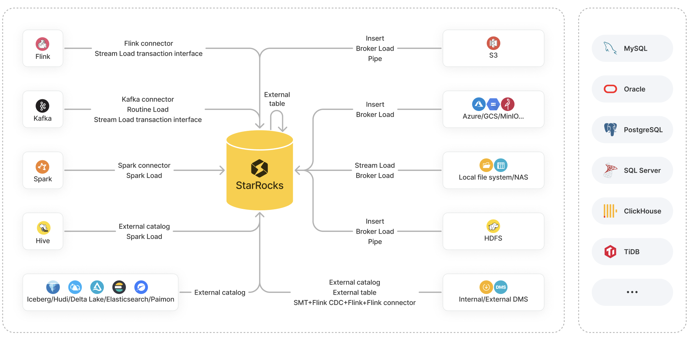

# 导入方案

数据导入是指将原始数据按照业务需求进行清洗、转换、并加载到 StarRocks 中的过程，从而可以在 StarRocks 系统中进行极速统一的数据分析。

StarRocks 提供以下各种导入方案供您选择：

- 导入方式：包括 Insert、Stream Load、Broker Load、Pipe、Routine Load、Spark Load。
- 生态工具：包括 StarRocks Connector for Apache Kafka®（简称 Kafka Connector）、StarRocks Connector for Apache Spark™（简称 Spark Connector）、StarRocks Connector for Apache Flink®（简称 Flink Connector）、以及其他工具（比如 SMT、DataX、CloudCanal、Kettle Connector）。
- API：Stream Load 事务接口。

每种导入方案都有其特定的优势，并且支持不同的数据源。

本文旨在对各种导入方案做一个总体介绍和详细对比，帮助您根据数据源、数据量、数据文件格式、以及导入频率等实际场景需要选择最适合您的导入方案。

## 导入方案介绍

这里主要介绍各种导入方案的特点及其适用场景。

:::note

本文中，“batch”和“batch loading”指一次性、批量导入大量数据，“stream”和“streaming”指实时、持续地导入数据。

:::

## 导入方式

### [Insert](../InsertInto.md)

**适用场景：**

- INSERT INTO VALUES：往内部表写入少量数据。
- INSERT INTO SELECT：
  - INSERT INTO SELECT FROM `<table_name>`：往目标表写入另外一张表（内部表或外部表）的查询结果。
  - INSERT INTO SELECT FROM FILES()：往目标表写入远端存储的数据文件的查询结果。

    :::note

    该特性自 3.1 版本起支持 AWS S3 数据源，自 3.2 版本起支持 HDFS、Microsoft Azure Storage、Google GCS、及其他兼容 S3 协议的对象存储（如 MinIO）等数据源。

    :::

**支持的文件格式：**

- INSERT INTO VALUES：SQL
- INSERT INTO SELECT：
  - INSERT INTO SELECT FROM `<table_name>`：StarRocks 表
  - INSERT INTO SELECT FROM FILES()：Parquet 和 ORC

**单次导入数据量限制：** 根据内存大小的不同而不同

### [Stream Load](../../sql-reference/sql-statements/loading_unloading/STREAM_LOAD.md)

**适用场景：** 从本地文件系统批量导入数据。

**支持的文件格式：** CSV、JSON

**单次导入数据量限制：** 10 GB 以内

### [Broker Load](../../sql-reference/sql-statements/loading_unloading/BROKER_LOAD.md)

**适用场景：**

- 从 HDFS 或 AWS S3、Microsoft Azure Storage、Google GCS、其他兼容 S3 协议的云存储（如MinIO）、Alibaba Cloud OSS、Tencent Cloud COS、Huawei Cloud OBS 等数据源批量导入数据。
- 从本地文件系统或 NAS 批量导入数据。

**支持的文件格式：** CSV、Parquet、ORC、JSON（自 3.2.3 版本起支持）

**单次导入数据量限制：** 数十到数百 GB

### [Pipe](../../sql-reference/sql-statements/loading_unloading/pipe/CREATE_PIPE.md)

**适用场景：** 从 HDFS 或 AWS S3 批量或实时导入数据。

:::note

该特性自 3.2 版本起支持。

:::

**支持的文件格式：** Parquet、ORC

**单次导入数据量限制：** 100 GB 到 TB 级别

### [Routine Load](../../sql-reference/sql-statements/loading_unloading/routine_load/CREATE_ROUTINE_LOAD.md)

**适用场景：** 从 Kafka 实时导入数据。

**支持的文件格式：** CSV、JSON、Avro（自 3.0.1 版本起支持）

**单次导入数据量限制：** 微批导入 MB 到 GB 级别

### [Spark Load](../../sql-reference/sql-statements/loading_unloading/SPARK_LOAD.md)

**适用场景：** 通过 Spark 集群从 HDFS 批量导入 Apache Hive™ 表的数据。

**支持的文件格式：** CSV、Parquet（自 2.0 版本起支持）、ORC（自 2.0 版本起支持）

**单次导入数据量限制：** 数十 GB 到 TB 级别

## 生态工具

### [Kafka connector](../Kafka-connector-starrocks.md)

**适用场景：** 从 Kafka 实时导入数据。

### [Spark connector](../Spark-connector-starrocks.md)

**适用场景：** 从 Spark 批量导入数据。

### [Flink connector](../Flink-connector-starrocks.md)

**适用场景：** 从 Flink 实时导入数据。

### [SMT](../../integrations/loading_tools/SMT.md)

**适用场景：** 通过 Flink 从 MySQL、PostgreSQL、SQL Server、Oracle、Hive、ClickHouse、TiDB 等数据源导入数据。

### [DataX](../../integrations/loading_tools/DataX-starrocks-writer.md)

**适用场景：** 在 MySQL、Oracle 等关系型数据库、HDFS、及 Hive 等各种数据源之间同步数据。

### [CloudCanal](../../integrations/loading_tools/CloudCanal.md)

**适用场景：** 从 MySQL、Oracle、PostgreSQL 等数据库往 StarRocks 迁移或同步数据。

### [Kettle Connector](https://github.com/StarRocks/starrocks-connector-for-kettle)

**适用场景：** 集成 Kettle。通过 Kettle 强大的数据处理和转换功能与 StarRocks 高性能的数据存储和分析能力，实现更加灵活和高效的数据处理流程。

## API

### [Stream Load transaction interface](../Stream_Load_transaction_interface.md)

**适用场景：** 从 Apache Flink®、Apache Kafka® 等外部系统导入数据时，实现跨系统的两阶段（2PC）提交。该特性自 2.4 版本起支持。

**支持的文件格式：** CSV and JSON

**单次导入数据量限制：** 10 GB 以内

## 导入方案选择

这里主要介绍常见数据源支持哪些导入方案，帮助您结合实际场景快速选择合适的导入方案。

### 对象存储

| **数据源**                             | **支持的导入方案**                                           |
| -------------------------------------- | ------------------------------------------------------------ |
| AWS S3                                 | <ul><li>(Batch) INSERT INTO SELECT FROM FILES()（自 3.1 版本起支持）</li><li>(Batch) Broker Load</li><li>(Batch or streaming) Pipe（自 3.2 版本起支持）</li></ul>参见[从 AWS S3 导入数据](../s3.md)。 |
| Microsoft Azure Storage                | <ul><li>(Batch) INSERT INTO SELECT FROM FILES()（自 3.2 版本起支持）</li><li>(Batch) Broker Load</li></ul>参见[从 Microsoft Azure Storage 导入数据](../azure.md)。 |
| Google GCS                             | <ul><li>(Batch) INSERT INTO SELECT FROM FILES()（自 3.2 版本起支持）</li><li>(Batch) Broker Load</li></ul>参见[从 GCS 导入数据](../gcs.md)。 |
| 其他兼容 S3 协议的对象存储（如 MinIO） | <ul><li>(Batch) INSERT INTO SELECT FROM FILES()（自 3.2 版本起支持）</li><li>(Batch) Broker Load</li></ul>参见[从 MinIO 导入数据](../minio.md)。 |
| Alibaba Cloud OSS                      | (Batch) Broker Load  参见[从云存储导入](../cloud_storage_load.md)。                                          |
| Tencent Cloud COS                      | (Batch) Broker Load  参见[从云存储导入](../cloud_storage_load.md)。                                          |
| Huawei Cloud OBS                       | (Batch) Broker Load  参见[从云存储导入](../cloud_storage_load.md)。                                          |

### 本地文件系统（包括 NAS）

| **数据源**                        | **支持的导入方案**                                           |
| --------------------------------- | ------------------------------------------------------------ |
| Local file system (including NAS) | <ul><li>(Batch) Stream Load</li><li>(Batch) Broker Load</li></ul>参见[从本地文件系统导入数据](../StreamLoad.md)。 |

### HDFS

| **数据源** | **支持的导入方案**                                           |
| ---------- | ------------------------------------------------------------ |
| HDFS       | <ul><li>(Batch) INSERT INTO SELECT FROM FILES()（自 3.2 版本起支持）</li><li>(Batch) Broker Load</li><li>(Batch or streaming) Pipe（自 3.2 版本起支持）</li></ul>参见[从 HDFS 导入数据](../hdfs_load.md)。 |

### Flink、Kafka、及 Spark

| **数据源**    | **支持的导入方案**                                           |
| ------------- | ------------------------------------------------------------ |
| Apache Flink® | <ul><li>[Flink connector](../Flink-connector-starrocks.md)</li><li>[Stream Load transaction interface](../Stream_Load_transaction_interface.md)</li></ul> |
| Apache Kafka® | <ul><li>(Streaming) [Kafka connector](../Kafka-connector-starrocks.md)</li><li>(Streaming) [Routine Load](../RoutineLoad.md)</li><li>[Stream Load transaction interface](../Stream_Load_transaction_interface.md)</li></ul> **NOTE** 如果导入过程中有复杂的多表关联和 ETL 预处理，建议先使用 Flink 从 Kafka 读取数据并对数据进行处理，然后再通过 StarRocks 提供的标准插件 [Flink connector](../Flink-connector-starrocks.md) 把处理后的数据导入到 StarRocks 中。 |
| Apache Spark™ | <ul><li>[Spark connector](../Spark-connector-starrocks.md)</li><li>[Spark Load](../SparkLoad.md)</li></ul> |

### 数据湖

| **数据源**     | **支持的导入方案**                                           |
| -------------- | ------------------------------------------------------------ |
| Apache Hive™   | <ul><li>(Batch) 创建 [Hive Catalog](../../data_source/catalog/hive_catalog.md)，然后通过 [INSERT INTO SELECT FROM `<table_name>`](../InsertInto.md#通过-insert-into-select-将内外表数据导入内表) 实现数据导入。</li><li>(Batch) [Spark Load](../SparkLoad.md).</li></ul> |
| Apache Iceberg | (Batch) 创建 [Iceberg Catalog](../../data_source/catalog/iceberg_catalog.md)，然后通过 [INSERT INTO SELECT FROM `<table_name>`](../InsertInto.md#通过-insert-into-select-将内外表数据导入内表) 实现数据导入。 |
| Apache Hudi    | (Batch) 创建 [Hudi Catalog](../../data_source/catalog/hudi_catalog.md)，然后通过 [INSERT INTO SELECT FROM `<table_name>`](../InsertInto.md#通过-insert-into-select-将内外表数据导入内表) 实现数据导入。 |
| Delta Lake     | (Batch) 创建 [Delta Lake Catalog](../../data_source/catalog/deltalake_catalog.md)，然后通过 [INSERT INTO SELECT FROM `<table_name>`](../InsertInto.md#通过-insert-into-select-将内外表数据导入内表) 实现数据导入。 |
| Elasticsearch  | (Batch) 创建 [Elasticsearch Catalog](../../data_source/catalog/elasticsearch_catalog.md)，然后通过 [INSERT INTO SELECT FROM `<table_name>`](../InsertInto.md#通过-insert-into-select-将内外表数据导入内表) 实现数据导入。 |
| Apache Paimon  | (Batch) 创建 [Paimon Catalog](../../data_source/catalog/paimon_catalog.md)，然后通过 [INSERT INTO SELECT FROM `<table_name>`](../InsertInto.md#通过-insert-into-select-将内外表数据导入内表) 实现数据导入。 |

StarRocks 从 3.2 版本起支持 [Unified Catalog](../../data_source/catalog/unified_catalog.md)。通过 Unified Catalog，您无需执行数据导入即可统一管理存储在 Hive、Iceberg、Hudi、Delta Lake 数据源里的表数据。

### 内外部数据库

| **数据源**                                                   | **支持的导入方案**                                           |
| ------------------------------------------------------------ | ------------------------------------------------------------ |
| StarRocks                                                    | (Batch) 创建 [StarRocks External Table](../../data_source/External_table.md#starrocks-外部表)，然后通过 [INSERT INTO VALUES](../InsertInto.md#通过-insert-into-values-语句导入数据) 写入少量数据、或通过 [INSERT INTO SELECT FROM `<table_name>`](../InsertInto.md#通过-insert-into-select-将内外表数据导入内表) 写入整张表的数据。 **NOTE** StarRocks 外部表只支持数据写入，不支持数据读取。 |
| MySQL                                                        | <ul><li>(Batch) 创建 [JDBC Catalog](../../data_source/catalog/jdbc_catalog.md)（推荐）或 [MySQL 外部表](../../data_source/External_table.md#deprecated-mysql-外部表)，然后通过 [INSERT INTO SELECT FROM `<table_name>`](../InsertInto.md#通过-insert-into-select-将内外表数据导入内表) 实现数据导入。</li><li>(Streaming) 通过 [SMT、Flink CDC Connector、Flink、Flink Connector](../Flink_cdc_load.md) 实现数据导入。</li></ul> |
| Other databases such as Oracle, PostgreSQL, SQL Server, ClickHouse, and TiDB | <ul><li>(Batch) 创建 [JDBC Catalog](../../data_source/catalog/iceberg_catalog.md)（推荐）或 [JDBC 外部表](../../data_source/External_table.md#更多数据库jdbc的外部表)，然后通过 [INSERT INTO SELECT FROM `<table_name>`](../InsertInto.md#通过-insert-into-select-将内外表数据导入内表) 实现数据导入。</li><li>(Streaming) 通过 [SMT、Flink CDC Connector、Flink、Flink Connector](../../integrations/loading_tools/SMT.md) 实现数据导入。</li></ul> |
