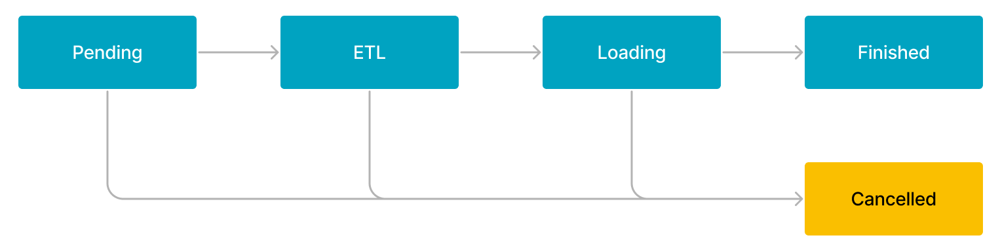

# 概念介绍

import InsertPrivNote from '../../_assets/commonMarkdown/insertPrivNote.md'

本文介绍数据导入相关的一些概念和信息。

## 权限说明

<InsertPrivNote />

## 标签机制

StarRocks 通过导入作业实现数据导入。每个导入作业都有一个标签 (Label)，由用户指定或系统自动生成，用于标识该导入作业。每个标签在一个数据库内都是唯一的，仅可用于一个成功的导入作业。一个导入作业成功后，其标签不可再用于提交其他导入作业。只有失败的导入作业的标签，才可再用于提交其他导入作业。

## 原子性

StarRocks 中所有导入方式都提供原子性保证，即同一个导入作业内的所有有效数据要么全部生效，要么全部不生效，不会出现仅导入部分数据的情况。这里的有效数据不包括由于类型转换错误等数据质量问题而被过滤掉的数据。

## 访问协议

StarRocks 支持通过以下两种访问协议来提交导入作业：MySQL 和 HTTP。当前只有 Stream Load 支持 HTTP 协议，其余导入方式均支持 MySQL 协议。

## 支持的数据类型

StarRocks 支持导入所有数据类型。个别数据类型的导入可能会存在一些限制，具体请参见[数据类型](../../sql-reference/data-types/README.md)。

## 严格模式

严格模式 (Strict Mode) 是导入操作中的一个选配项，其设置会影响 StarRocks 对某些数据的导入行为和最终导入到 StarRocks 中的结果数据。详细内容参见[严格模式](../load_concept/strict_mode.md)文档。

## 导入模式

StarRocks 支持两种导入模式：同步导入和异步导入。

:::note

如果是外部程序接入 StarRocks 的导入，需要先判断使用哪种导入模式，然后再确定接入逻辑。

:::

### 同步导入

同步导入是指您创建导入作业以后，StarRocks 同步执行作业，并在作业执行完成以后返回导入结果。您可以通过返回的导入结果判断导入作业是否成功。

支持同步模式的导入方式有 Stream Load 和 INSERT。

用户操作过程如下：

1. 创建导入作业。

2. 查看 StarRocks 返回的导入结果。

3. 判断导入结果。如果导入结果为失败，可以重试导入作业。

### 异步导入

异步导入是指您创建导入作业以后，StarRocks 直接返回作业创建结果。

- 如果导入作业创建成功，StarRocks 会异步执行导入作业。但作业创建成功并不代表数据导入已经成功。您需要通过语句或命令来查看导入作业的状态，并且根据导入作业的状态来判断数据导入是否成功。
- 如果导入作业创建失败，可以根据失败信息，判断是否需要重试。

:::tip

如果您的 StarRocks 集群有多数据副本，您可以根据业务需求为表设置不同导入数据安全等级，即设置需要多少数据副本导入成功后 StarRocks 可返回导入成功。您可在 [CREATE TABLE](../../sql-reference/sql-statements/table_bucket_part_index/CREATE_TABLE.md) 时通过增加属性（PROPERTIES） `write_quorum` 指定导入数据安全等级，或通过 [ALTER TABLE](../../sql-reference/sql-statements/table_bucket_part_index/ALTER_TABLE.md) 语句为已有 Table 添加该属性。该属性从 2.5 版本开始支持。

:::

支持异步模式的导入方式有 [Broker Load](../../sql-reference/sql-statements/loading_unloading/BROKER_LOAD.md)、[Pipe](../../sql-reference/sql-statements/loading_unloading/pipe/CREATE_PIPE.md)、[Routine Load](../../sql-reference/sql-statements/loading_unloading/routine_load/CREATE_ROUTINE_LOAD.md) 和 [Spark Load](../../sql-reference/sql-statements/loading_unloading/SPARK_LOAD.md)。

用户操作过程如下：

1. 创建导入作业。

2. 根据 StarRocks 返回的作业创建结果，判断作业是否创建成功。

   - 如果作业创建成功，进入步骤 3。

   - 如果作业创建失败，可以回到步骤 1，尝试重试导入作业。

3. 轮询查看导入作业的状态，直到状态变为 **FINISHED** 或 **CANCELLED**。

#### Broker Load 及 Spark Load 执行流程

Broker Load 和 Spark Load 导入作业的执行流程主要分为 5 个阶段，如下图所示。

每个阶段的描述如下：

1. **PENDING**

   该阶段是指提交导入作业后，等待 FE 调度执行。

2. **ETL**

   该阶段执行数据的预处理，包括清洗、分区、排序、聚合等。

   只有 Spark Load 作业包含 ETL 阶段。Broker Load 作业会跳过该阶段。

3. **LOADING**

   该阶段先对数据进行清洗和转换，然后将数据发送给 BE（或 CN）处理。当数据全部导入后，进入等待生效过程，此时，导入作业的状态依旧是 **LOADING**。

4. **FINISHED**

   在导入作业完成、并且涉及的所有数据均生效后，作业的状态变成 **FINISHED**，此时，导入的数据均可查询。**FINISHED** 是导入作业的最终状态。

5. **CANCELLED**

   在导入作业的状态变为 **FINISHED** 之前，您可以随时取消作业。另外，如果导入出现错误，StarRocks 系统也会自动取消导入作业。作业取消后，进入 **CANCELLED** 状态，同时系统会撤销所有在取消操作之前所做的数据更新。**CANCELLED** 也是导入作业的一种最终状态。

#### Pipe 执行流程

Pipe 导入作业的执行流程描述如下：

1. 用户通过支持 MySQL 协议的客户端向 FE 提交一个导入作业。

2. FE 为作业创建若干任务，并将文件按照数量或大小拆分为若干部分， 分配给每个任务。任务创建完成后，进入队列等待调度。

3. FE 从任务队列中获取任务，通过 INSERT INTO SELECT FROM FILES 语句逐个执行导入任务。

4. 数据导入完成：

   - 如果创建作业时指定了 `"AUTO_INGEST" = "FALSE"`，则完成作业启动时指定的文件后，作业自动终止。

   - 如果创建作业时指定了 `"AUTO_INGEST" = "TRUE"`，FE 会继续监听文件的数据变化，并持续导入有变化的文件数据。

#### Routine Load 执行流程

Routine Load 导入作业的执行流程描述如下：

1. 用户通过支持 MySQL 协议的客户端向 FE 提交一个导入作业。

2. FE 将该导入作业拆分成若干个任务，每个任务负责导入若干个分区的数据。

3. FE 将各个任务分配到指定的 BE（或 CN）上执行。

4. BE（或 CN）完成分配的任务后，向 FE 汇报。

5. FE 根据汇报结果，继续生成后续新的任务，或者对失败的任务进行重试，或者暂停任务的调度。
