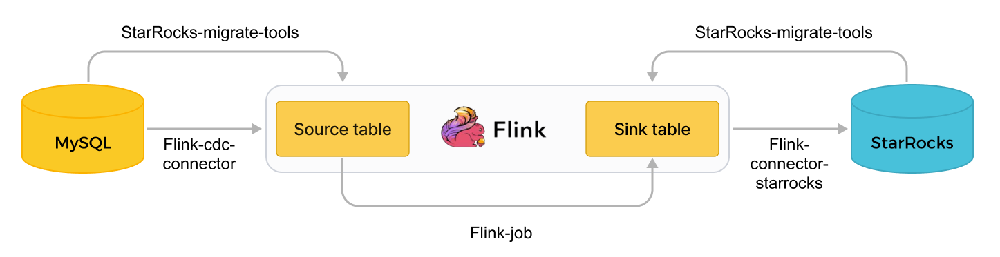

# 使用工具导入

除了导入章节上面重点介绍的几种导入方式外，StarRocks 和生态伙伴还提供如下工具支持帮助您轻松实现 StarRocks 与外部数据库的集成。

## [SMT](../integrations/loading_tools/SMT.md)

SMT（StarRocks Migration Tool）是 StarRocks 提供的数据迁移工具，用于数据导入链路：源数据库（比如 MySQL、Oracle、PostgreSQL） ---> Flink ---> 目标 StarRocks 集群。SMT 主要功能如下：

- 根据外部数据库和目标 StarRocks 集群的信息，生成 StarRocks 建表语句，帮助您轻松建表。
- 生成 Flink 的 [SQL 客户端](https://nightlies.apache.org/flink/flink-docs-release-1.14/zh/docs/dev/table/sqlclient/) 可执行的 SQL 语句，以提交同步数据的 Flink job，简化整条链路中全量或增量数据同步流程。

下图展示了数据从 MySQL 经由 Flink 导入 StarRocks 的过程，以及 SMT 的作用。

## [DataX](../integrations/loading_tools/DataX-starrocks-writer.md)

DataX 是阿里开源的一个异构数据源离线同步工具，能够实现包括关系型数据库（MySQL、Oracle 等）、HDFS、Hive 等各种异构数据源之间的数据同步功能。

DataX 开发了 StarRocks Writer 插件，可以将 DataX 数据源中的数据同步至 StarRocks。 

## [CloudCanal](../integrations/loading_tools/CloudCanal.md)

CloudCanal 社区版是一款由 [ClouGence 公司](https://www.clougence.com/) 发行的集结构迁移、数据全量迁移/校验/订正、增量实时同步为一体的免费数据迁移同步平台。

您可以直接在 CloudCanal 的可视化界面上，添加 StarRocks 为数据源 ，并且创建任务，自动将源端数据（例如 MySQL、Oracle、PostgreSQL）迁移或者同步至 StarRocks。

## [Kettle connector](https://github.com/StarRocks/starrocks-connector-for-kettle)

Kettle 是一个 ETL 工具，提供可视化的图形界面，用户可以通过拖拽组件、配置参数等方式来构建数据处理流程。这种直观的操作方式大大简化了数据处理和导入的过程，使得用户可以更加便捷地处理数据。此外，Kettle还提供了丰富的操作组件库，用户可以根据自己的需求选择合适的组件，实现各种复杂的数据处理任务。

StarRocks 提供 Kettle connector 来集成 Kettle。通过结合 Kettle 的强大数据处理和转换功能与 StarRocks 的高性能数据存储和分析能力，可以实现更加灵活和高效的数据处理流程。
