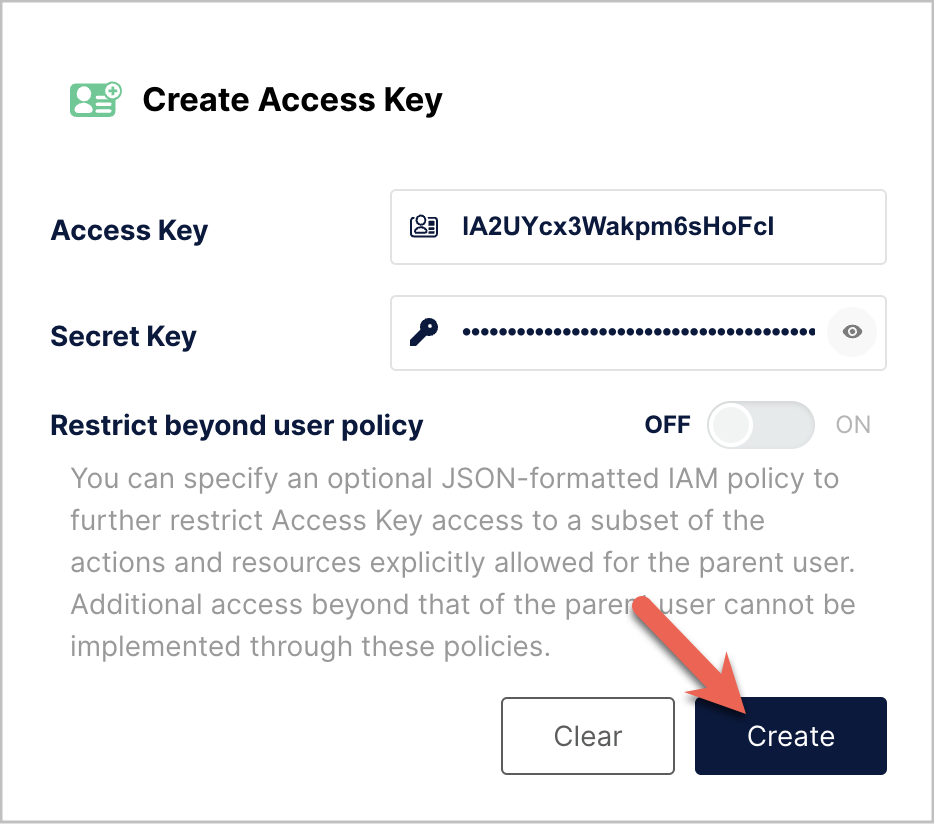
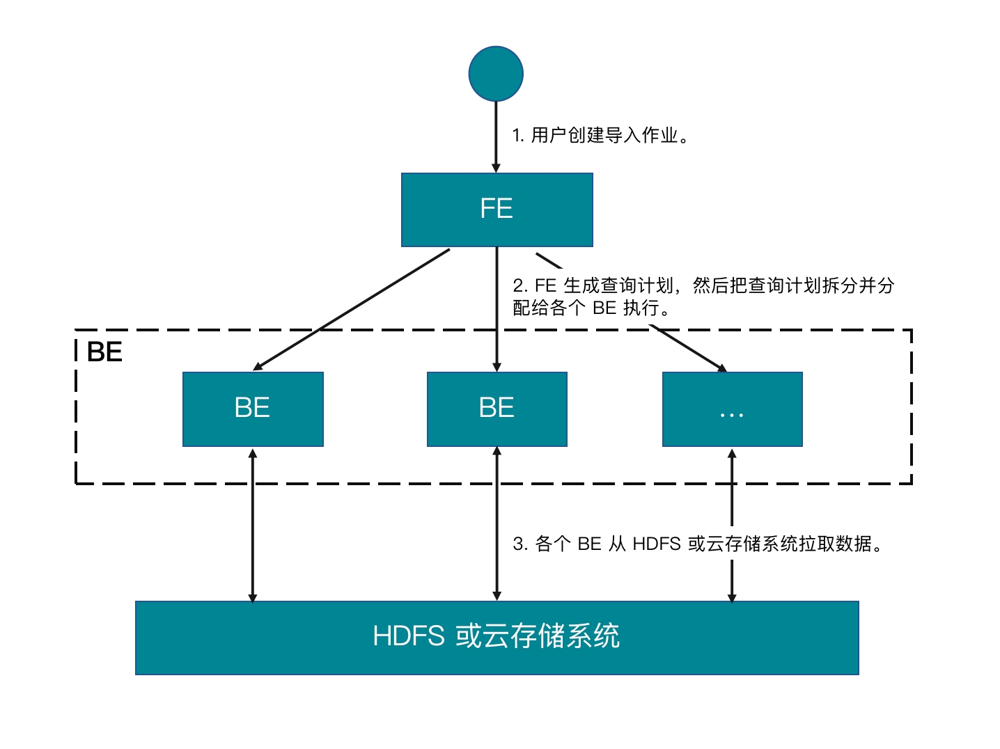

# 从 MinIO 导入

import InsertPrivNote from '../_assets/commonMarkdown/insertPrivNote.md'

StarRocks 支持通过以下方式从 MinIO 导入数据：

- 使用 [INSERT](../sql-reference/sql-statements/loading_unloading/INSERT.md)+[`FILES()`](../sql-reference/sql-functions/table-functions/files.md) 进行同步导入。
- 使用 [Broker Load](../sql-reference/sql-statements/loading_unloading/BROKER_LOAD.md) 进行异步导入。

两种导入方式各有优势，具体将在下面分章节详细阐述。

一般情况下，建议您使用 INSERT+`FILES()`，更为方便易用。

但是，INSERT+`FILES()` 当前只支持 Parquet、ORC 和 CSV 文件格式。因此，如果您需要导入其他格式（如 JSON）的数据、或者需要[在导入过程中执行 DELETE 等数据变更操作](../loading/Load_to_Primary_Key_tables.md)，可以使用 Broker Load。

## 准备工作

### 准备数据源

确保待导入数据已保存在 MinIO 存储桶。建议您将数据保存在与 StarRocks 集群同处一个地域（Region）的 MinIO 存储桶，这样可以降低数据传输成本。

本文中，我们提供了 Parquet 格式的样例数据集 `user_behavior_ten_million_rows.parquet`，您可以通过 `curl` 实现数据导入：

```Bash
curl -O https://starrocks-examples.s3.amazonaws.com/user_behavior_ten_million_rows.parquet
```

将 Parquet 文件导入 MinIO，注意存储桶名称的正确性。上述示例以存储桶 `/starrocks` 为例。

### 查看权限

<InsertPrivNote />

### 获取资源访问配置

概括来说，如果选择使用 MinIO Access Key 认证方式，您需要提前获取以下 MinIO 资源信息：

- 数据所在的 MinIO 存储桶
- MinIO 对象键（或“对象名称”）（只在访问 MinIO 存储桶中某个特定数据对象时才需要。）
- MinIO 终端节点（Endpoint）
- 作为访问凭证的 Access Key 和 Secret Key



## 通过 INSERT+FILES() 导入

该特性从 3.1 版本起支持。当前只支持 Parquet、ORC 和 CSV（自 v3.3.0 起）文件格式。

### INSERT+FILES() 优势

`FILES()` 会根据给定的数据路径等参数读取数据，并自动根据数据文件的格式、列信息等推断出表结构，最终以数据行的形式返回文件中的数据。

通过 `FILES()`，您可以：

- 使用 [SELECT](../sql-reference/sql-statements/table_bucket_part_index/SELECT.md) 语句直接从 MinIO 查询数据。
- 通过 [CREATE TABLE AS SELECT](../sql-reference/sql-statements/table_bucket_part_index/CREATE_TABLE_AS_SELECT.md)（简称 CTAS）语句实现自动建表和导入数据。
- 手动建表，然后通过 [INSERT](../sql-reference/sql-statements/loading_unloading/INSERT.md) 导入数据。

### 操作示例

#### 通过 SELECT 直接查询数据

您可以通过 SELECT+`FILES()` 直接查询 MinIO 里的数据，从而在建表前对待导入数据有一个整体的了解，其优势包括：

- 您不需要存储数据就可以对其进行查看。
- 您可以查看数据的最大值、最小值，并确定需要使用哪些数据类型。
- 您可以检查数据中是否包含 `NULL` 值。

下面示例查询您保存在 MinIO 系统里的 Parquet 文件：

:::tip

下面命令示例中灰色底纹强化显示的参数配置，需要您根据情况进行替换：

- `endpoint` 和 `path` 需要设置为 MinIO 系统的终端节点和文件存储路径。
- 如果 MinIO 系统启用了 SSL，须把 `enable_ssl` 设置为 `true`。
- 把 `AAA` 和 `BBB` 替换为可以用于访问 MinIO 系统的真实有效的 Access Key 和 Secret Key。

:::

```SQL
SELECT * FROM FILES
(
    -- highlight-start
    "aws.s3.endpoint" = "http://minio:9000",
    "path" = "s3://starrocks/user_behavior_ten_million_rows.parquet",
    "aws.s3.enable_ssl" = "false",
    "aws.s3.access_key" = "AAAAAAAAAAAAAAAAAAAA",
    "aws.s3.secret_key" = "BBBBBBBBBBBBBBBBBBBBBBBBBBBBBBBBBBBBBBBB",
    -- highlight-end
    "format" = "parquet",
    "aws.s3.use_aws_sdk_default_behavior" = "false",
    "aws.s3.use_instance_profile" = "false",
    "aws.s3.enable_path_style_access" = "true"
)
LIMIT 3;
```

系统返回如下查询结果：

```Plain
+--------+---------+------------+--------------+---------------------+
| UserID | ItemID  | CategoryID | BehaviorType | Timestamp           |
+--------+---------+------------+--------------+---------------------+
| 543711 |  829192 |    2355072 | pv           | 2017-11-27 08:22:37 |
| 543711 | 2056618 |    3645362 | pv           | 2017-11-27 10:16:46 |
| 543711 | 1165492 |    3645362 | pv           | 2017-11-27 10:17:00 |
+--------+---------+------------+--------------+---------------------+
3 rows in set (0.41 sec)
```

:::info

以上返回结果中的列名是源 Parquet 文件中定义的列名。

:::

#### 通过 CTAS 自动建表并导入数据

该示例是上一个示例的延续。该示例中，通过在 CREATE TABLE AS SELECT (CTAS) 语句中嵌套上一个示例中的 SELECT 查询，StarRocks 可以自动推断表结构、创建表、并把数据导入新建的表中。Parquet 格式的文件自带列名和数据类型，因此您不需要指定列名或数据类型。

:::note

使用表结构推断功能时，CREATE TABLE 语句不支持设置副本数，因此您需要在建表前把副本数设置好。例如，您可以通过如下命令设置副本数为 `1`：

```SQL
ADMIN SET FRONTEND CONFIG ('default_replication_num' = '1');
```

:::

通过如下语句创建数据库、并切换至该数据库：

```SQL
CREATE DATABASE IF NOT EXISTS mydatabase;
USE mydatabase;
```

通过 CTAS 自动创建表、并把保存在 MinIO 里的样例数据集 `user_behavior_ten_million_rows.parquet` 中的数据导入到新建表中：

:::tip

下面命令示例中灰色底纹强化显示的参数配置，需要您根据情况进行替换：

- `endpoint` 和 `path` 需要设置为 MinIO 系统的终端节点和文件存储路径。
- 如果 MinIO 系统启用了 SSL，须把 `enable_ssl` 设置为 `true`。
- 把 `AAA` 和 `BBB` 替换为可以用于访问 MinIO 系统的真实有效的 Access Key 和 Secret Key。

:::

```sql
CREATE TABLE user_behavior_inferred AS
SELECT * FROM FILES
(
    -- highlight-start
    "aws.s3.endpoint" = "http://minio:9000",
    "path" = "s3://starrocks/user_behavior_ten_million_rows.parquet",
    "aws.s3.enable_ssl" = "false",
    "aws.s3.access_key" = "AAAAAAAAAAAAAAAAAAAA",
    "aws.s3.secret_key" = "BBBBBBBBBBBBBBBBBBBBBBBBBBBBBBBBBBBBBBBB",
    -- highlight-end
    "format" = "parquet",
    "aws.s3.use_aws_sdk_default_behavior" = "false",
    "aws.s3.use_instance_profile" = "false",
    "aws.s3.enable_path_style_access" = "true"
);
```

```plaintext
Query OK, 10000000 rows affected (3.17 sec)
{'label':'insert_a5da3ff5-9ee4-11ee-90b0-02420a060004', 'status':'VISIBLE', 'txnId':'17'}
```

建表完成后，您可以通过 [DESCRIBE](https://docs.starrocks.io/zh/docs/sql-reference/sql-statements/Utility/DESCRIBE/) 查看新建表的表结构：

```SQL
DESCRIBE user_behavior_inferred;
```

系统返回如下查询结果：

```Plain
+--------------+------------------+------+-------+---------+-------+
| Field        | Type             | Null | Key   | Default | Extra |
+--------------+------------------+------+-------+---------+-------+
| UserID       | bigint           | YES  | true  | NULL    |       |
| ItemID       | bigint           | YES  | true  | NULL    |       |
| CategoryID   | bigint           | YES  | true  | NULL    |       |
| BehaviorType | varchar(1048576) | YES  | false | NULL    |       |
| Timestamp    | varchar(1048576) | YES  | false | NULL    |       |
+--------------+------------------+------+-------+---------+-------+
```

您可以查询新建表中的数据，验证数据已成功导入。例如：

```SQL
SELECT * from user_behavior_inferred LIMIT 3;
```

系统返回如下查询结果，表明数据已成功导入：

```Plain
+--------+--------+------------+--------------+---------------------+
| UserID | ItemID | CategoryID | BehaviorType | Timestamp           |
+--------+--------+------------+--------------+---------------------+
|     58 | 158350 |    2355072 | pv           | 2017-11-27 13:06:51 |
|     58 | 158590 |    3194735 | pv           | 2017-11-27 02:21:04 |
|     58 | 215073 |    3002561 | pv           | 2017-11-30 10:55:42 |
+--------+--------+------------+--------------+---------------------+
```

#### 手动建表并通过 INSERT 导入数据

在实际业务场景中，您可能需要自定义目标表的表结构，包括：

- 各列的数据类型和默认值、以及是否允许 `NULL` 值
- 定义哪些列作为键、以及这些列的数据类型
- 数据分区分桶

:::tip

要实现高效的表结构设计，您需要深度了解表中数据的用途、以及表中各列的内容。本文不对表设计做过多赘述，有关表设计的详细信息，参见[表设计](../table_design/StarRocks_table_design.md)。

:::

该示例主要演示如何根据源 Parquet 文件中数据的特点、以及目标表未来的查询用途等对目标表进行定义和创建。在创建表之前，您可以先查看一下保存在 MinIO 中的源文件，从而了解源文件中数据的特点，例如：

- 源文件中包含一个数据类型为 `datetime` 的 `Timestamp` 列，因此建表语句中也应该定义这样一个数据类型为 `datetime` 的 `Timestamp` 列。
- 源文件中的数据中没有 `NULL` 值，因此建表语句中也不需要定义任何列为允许 `NULL` 值。
- 根据未来的查询类型，可以在建表语句中定义 `UserID` 列为排序键和分桶键。根据实际业务场景需要，您还可以定义其他列比如 `ItemID` 或者定义 `UserID` 与其他列的组合作为排序键。

通过如下语句创建数据库、并切换至该数据库：

```SQL
CREATE DATABASE IF NOT EXISTS mydatabase;
USE mydatabase;
```

通过如下语句手动创建表（建议表结构与您在 MinIO 存储的待导入数据结构一致）：

```SQL
CREATE TABLE user_behavior_declared
(
    UserID int(11) NOT NULL,
    ItemID int(11) NOT NULL,
    CategoryID int(11) NOT NULL,
    BehaviorType varchar(65533) NOT NULL,
    Timestamp datetime NOT NULL
)
ENGINE = OLAP 
DUPLICATE KEY(UserID)
DISTRIBUTED BY HASH(UserID)
PROPERTIES
(
    'replication_num' = '1'
);
```

通过 [DESCRIBE](../sql-reference/sql-statements/table_bucket_part_index/DESCRIBE.md) 查看新建表的表结构：

```SQL
DESCRIBE user_behavior_declared;
+--------------+----------------+------+-------+---------+-------+
| Field        | Type           | Null | Key   | Default | Extra |
+--------------+----------------+------+-------+---------+-------+
| UserID       | int            | NO   | true  | NULL    |       |
| ItemID       | int            | NO   | false | NULL    |       |
| CategoryID   | int            | NO   | false | NULL    |       |
| BehaviorType | varchar(65533) | NO   | false | NULL    |       |
| Timestamp    | datetime       | NO   | false | NULL    |       |
+--------------+----------------+------+-------+---------+-------+
5 rows in set (0.00 sec)
```

:::tip

您可以从以下几个方面来对比手动建表的表结构与 `FILES()` 函数自动推断出来的表结构之间具体有哪些不同:

- 数据类型
- 是否允许 `NULL` 值
- 定义为键的字段

在生产环境中，为更好地控制目标表的表结构、实现更高的查询性能，建议您手动创建表、指定表结构。

在本示例中，`Timestamp` 列的数据类型定义为 `datetime` 比定义为 `varchar` 更能提高查询效率。

:::

建表完成后，您可以通过 INSERT INTO SELECT FROM FILES() 向表内导入数据：

:::tip

下面命令示例中灰色底纹强化显示的参数配置，需要您根据情况进行替换：

- `endpoint` 和 `path` 需要设置为 MinIO 系统的终端节点和文件存储路径。
- 如果 MinIO 系统启用了 SSL，须把 `enable_ssl` 设置为 `true`。
- 把 `AAA` 和 `BBB` 替换为可以用于访问 MinIO 系统的真实有效的 Access Key 和 Secret Key。

:::

```SQL
INSERT INTO user_behavior_declared
SELECT * FROM FILES
(
    -- highlight-start
    "aws.s3.endpoint" = "http://minio:9000",
    "path" = "s3://starrocks/user_behavior_ten_million_rows.parquet",
    "aws.s3.enable_ssl" = "false",
    "aws.s3.access_key" = "AAAAAAAAAAAAAAAAAAAA",
    "aws.s3.secret_key" = "BBBBBBBBBBBBBBBBBBBBBBBBBBBBBBBBBBBBBBBB",
    -- highlight-end
    "format" = "parquet",
    "aws.s3.use_aws_sdk_default_behavior" = "false",
    "aws.s3.use_instance_profile" = "false",
    "aws.s3.enable_path_style_access" = "true"
);
```

导入完成后，您可以查询新建表中的数据，验证数据已成功导入。例如：

```SQL
SELECT * from user_behavior_declared LIMIT 3;
```

系统返回如下查询结果，表明数据已成功导入：

```Plain
+--------+---------+------------+--------------+---------------------+
| UserID | ItemID  | CategoryID | BehaviorType | Timestamp           |
+--------+---------+------------+--------------+---------------------+
|     58 | 4309692 |    1165503 | pv           | 2017-11-25 14:06:52 |
|     58 |  181489 |    1165503 | pv           | 2017-11-25 14:07:22 |
|     58 | 3722956 |    1165503 | pv           | 2017-11-25 14:09:28 |
+--------+---------+------------+--------------+---------------------+
```

#### 查看导入进度

通过 StarRocks Information Schema 库中的 [`loads`](../sql-reference/information_schema/loads.md) 视图查看导入作业的进度。该功能自 3.1 版本起支持。例如：

```SQL
SELECT * FROM information_schema.loads ORDER BY JOB_ID DESC;
```

有关 `loads` 视图提供的字段详情，参见 [`loads`](../sql-reference/information_schema/loads.md)。

如果您提交了多个导入作业，您可以通过 `LABEL` 过滤出想要查看的作业。例如：

```SQL
SELECT * FROM information_schema.loads WHERE LABEL = 'insert_e3b882f5-7eb3-11ee-ae77-00163e267b60' \G
*************************** 1. row ***************************
              JOB_ID: 10243
               LABEL: insert_e3b882f5-7eb3-11ee-ae77-00163e267b60
       DATABASE_NAME: mydatabase
               STATE: FINISHED
            PROGRESS: ETL:100%; LOAD:100%
                TYPE: INSERT
            PRIORITY: NORMAL
           SCAN_ROWS: 10000000
       FILTERED_ROWS: 0
     UNSELECTED_ROWS: 0
           SINK_ROWS: 10000000
            ETL_INFO:
           TASK_INFO: resource:N/A; timeout(s):300; max_filter_ratio:0.0
         CREATE_TIME: 2023-11-09 11:56:01
      ETL_START_TIME: 2023-11-09 11:56:01
     ETL_FINISH_TIME: 2023-11-09 11:56:01
     LOAD_START_TIME: 2023-11-09 11:56:01
    LOAD_FINISH_TIME: 2023-11-09 11:56:44
         JOB_DETAILS: {"All backends":{"e3b882f5-7eb3-11ee-ae77-00163e267b60":[10142]},"FileNumber":0,"FileSize":0,"InternalTableLoadBytes":311710786,"InternalTableLoadRows":10000000,"ScanBytes":581574034,"ScanRows":10000000,"TaskNumber":1,"Unfinished backends":{"e3b882f5-7eb3-11ee-ae77-00163e267b60":[]}}
           ERROR_MSG: NULL
        TRACKING_URL: NULL
        TRACKING_SQL: NULL
REJECTED_RECORD_PATH: NULL
```

:::tip

由于 INSERT 语句是一个同步命令，因此，如果作业还在运行当中，您需要打开另一个会话来查看 INSERT 作业的执行情况。

:::

### 手动建表与自动推断建表的大小比较

下面的查询旨在比较手动建表的表结构与自动推断的表结构。通过查询结果可以看出，自动推断的表结构允许数据列中存在 `NULL` 值，并且 `Timestamp` 列为 `varchar` 数据类型，因此跟手动建表的表结构相比，数据量要更大一些。

```SQL
SELECT TABLE_NAME,
       TABLE_ROWS,
       AVG_ROW_LENGTH,
       DATA_LENGTH
FROM information_schema.tables
WHERE TABLE_NAME like 'user_behavior%'\G
*************************** 1. row ***************************
    TABLE_NAME: user_behavior_declared
    TABLE_ROWS: 10000000
AVG_ROW_LENGTH: 10
   DATA_LENGTH: 102562516
*************************** 2. row ***************************
    TABLE_NAME: user_behavior_inferred
    TABLE_ROWS: 10000000
AVG_ROW_LENGTH: 17
   DATA_LENGTH: 176803880
2 rows in set (0.04 sec)
```

## 通过 Broker Load 导入

作为一种异步的导入方式，Broker Load 负责建立与 MinIO 的连接、拉取数据、并将数据存储到 StarRocks 中。

当前支持以下文件格式：

- Parquet
- ORC
- CSV
- JSON（自 3.2.3 版本起支持）

### Broker Load 优势

- Broker Load 在后台运行，客户端不需要保持连接也能确保导入作业不中断。
- Broker Load 作业默认超时时间为 4 小时，适合导入数据较大、导入运行时间较长的场景。
- 除 Parquet 和 ORC 文件格式，Broker Load 还支持 CSV 文件格式和 JSON 文件格式（JSON 文件格式自 3.2.3 版本起支持）。

### 工作原理



1. 用户创建导入作业。
2. FE 生成查询计划，然后把查询计划拆分并分分配给各个 BE（或 CN）执行。
3. 各个 BE（或 CN）从数据源拉取数据并把数据导入到 StarRocks 中。

### 操作示例

创建 StarRocks 表，启动导入作业从 MinIO 拉取样例数据集 `user_behavior_ten_million_rows.parquet` 中的数据，然后验证导入过程和结果是否成功。

#### 建库建表

通过如下语句创建数据库、并切换至该数据库：

```SQL
CREATE DATABASE IF NOT EXISTS mydatabase;
USE mydatabase;
```

通过如下语句手动创建表（建议表结构与您在 MinIO 存储的待导入数据结构一致）：

```SQL
CREATE TABLE user_behavior
(
    UserID int(11) NOT NULL,
    ItemID int(11) NOT NULL,
    CategoryID int(11) NOT NULL,
    BehaviorType varchar(65533) NOT NULL,
    Timestamp datetime NOT NULL
)
ENGINE = OLAP 
DUPLICATE KEY(UserID)
DISTRIBUTED BY HASH(UserID)
PROPERTIES
(
    'replication_num' = '1'
);
```

#### 提交导入作业

执行如下命令创建 Broker Load 作业，把样例数据集 `user_behavior_ten_million_rows.parquet` 中的数据导入到表 `user_behavior` 中：

:::tip

下面命令示例中灰色底纹强化显示的参数配置，需要您根据情况进行替换：

- `endpoint` 和 `DATA INFILE` 需要设置为您的 MinIO 系统的终端节点。
- 如果 MinIO 系统启用了 SSL，须把 `enable_ssl` 设置为 `true`。
- 把 `AAA` 和 `BBB` 替换为可以用于访问 MinIO 系统的真实有效的 Access Key 和 Secret Key。

:::

```SQL
LOAD LABEL UserBehavior
(
    -- highlight-start
    DATA INFILE("s3://starrocks/user_behavior_ten_million_rows.parquet")
    -- highlight-end
    INTO TABLE user_behavior
 )
 WITH BROKER
 (
    -- highlight-start
    "aws.s3.endpoint" = "http://minio:9000",
    "aws.s3.enable_ssl" = "false",
    "aws.s3.access_key" = "AAAAAAAAAAAAAAAAAAAA",
    "aws.s3.secret_key" = "BBBBBBBBBBBBBBBBBBBBBBBBBBBBBBBBBBBBBBBB",
    -- highlight-end
    "aws.s3.use_aws_sdk_default_behavior" = "false",
    "aws.s3.use_instance_profile" = "false",
    "aws.s3.enable_path_style_access" = "true"
 )
PROPERTIES
(
    "timeout" = "72000"
);
```

导入语句包含四个部分：

- `LABEL`：导入作业的标签，字符串类型，可用于查询导入作业的状态。
- `LOAD` 声明：包括源数据文件所在的 URI、源数据文件的格式、以及目标表的名称等作业描述信息。
- `BROKER`：连接数据源的认证信息配置。
- `PROPERTIES`：用于指定超时时间等可选的作业属性。

有关详细的语法和参数说明，参见 [BROKER LOAD](../sql-reference/sql-statements/loading_unloading/BROKER_LOAD.md)。

#### 查看导入进度

通过 StarRocks Information Schema 库中的 [`loads`](../sql-reference/information_schema/loads.md) 视图查看导入作业的进度。该功能自 3.1 版本起支持。例如：

```SQL
SELECT * FROM information_schema.loads;
```

有关 `loads` 视图提供的字段详情，参见 [`loads`](../sql-reference/information_schema/loads.md)。

如果您提交了多个导入作业，您可以通过 `LABEL` 过滤出想要查看的作业。例如：

```SQL
SELECT * FROM information_schema.loads
WHERE LABEL = 'UserBehavior'\G
*************************** 1. row ***************************
              JOB_ID: 10176
               LABEL: userbehavior
       DATABASE_NAME: mydatabase
               STATE: FINISHED
            PROGRESS: ETL:100%; LOAD:100%
                TYPE: BROKER
            PRIORITY: NORMAL
           SCAN_ROWS: 10000000
       FILTERED_ROWS: 0
     UNSELECTED_ROWS: 0
           SINK_ROWS: 10000000
            ETL_INFO:
           TASK_INFO: resource:N/A; timeout(s):72000; max_filter_ratio:0.0
         CREATE_TIME: 2023-12-19 23:02:41
      ETL_START_TIME: 2023-12-19 23:02:44
     ETL_FINISH_TIME: 2023-12-19 23:02:44
     LOAD_START_TIME: 2023-12-19 23:02:44
    LOAD_FINISH_TIME: 2023-12-19 23:02:46
         JOB_DETAILS: {"All backends":{"4aeec563-a91e-4c1e-b169-977b660950d1":[10004]},"FileNumber":1,"FileSize":132251298,"InternalTableLoadBytes":311710786,"InternalTableLoadRows":10000000,"ScanBytes":132251298,"ScanRows":10000000,"TaskNumber":1,"Unfinished backends":{"4aeec563-a91e-4c1e-b169-977b660950d1":[]}}
           ERROR_MSG: NULL
        TRACKING_URL: NULL
        TRACKING_SQL: NULL
REJECTED_RECORD_PATH: NULL
1 row in set (0.02 sec)
```

导入作业完成后，您可以从表内查询数据，验证数据是否已成功导入。例如：

```SQL
SELECT * from user_behavior LIMIT 3;
```

系统返回如下查询结果，表明数据已经成功导入：

```Plain
+--------+---------+------------+--------------+---------------------+
| UserID | ItemID  | CategoryID | BehaviorType | Timestamp           |
+--------+---------+------------+--------------+---------------------+
|    142 | 2869980 |    2939262 | pv           | 2017-11-25 03:43:22 |
|    142 | 2522236 |    1669167 | pv           | 2017-11-25 15:14:12 |
|    142 | 3031639 |    3607361 | pv           | 2017-11-25 15:19:25 |
+--------+---------+------------+--------------+---------------------+
```
