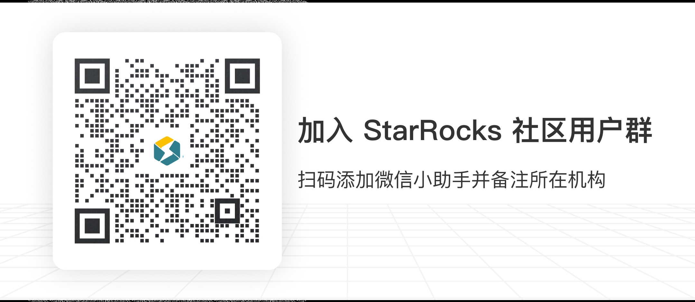

# 社区聊天（通过Slack）

<<<<<<< HEAD
StarRocks项目使用Slack进行社区聊天。您可以在 [starrocks.slack.com](https://join.slack.com/t/starrocks/shared_invite/zt-z5zxqr0k-U5lrTVlgypRIV8RbnCIAzg) 找到我们的社区。
=======
## StarRocks 数据库论坛

如果您在使用 StarRocks 时遇到问题，可以在 [StarRocks 数据库论坛](https://forum.mirrorship.cn/)上提交详细的问题描述，会有专门的技术支持人员进行答复。

## GitHub

您也可以在 [StarRocks Github 仓库](https://github.com/StarRocks/starrocks) 提交 Issue。

## 微信社区群

您也可以扫码加入微信社区群，与其他社区用户一起进行开放讨论，寻求实时技术支持。

在微信搜索 StarRocks 公众号并关注，可以获取最新的技术文档和活动推送。
>>>>>>> e4503836df ([Doc] update image for wechat group scan (#39764))
