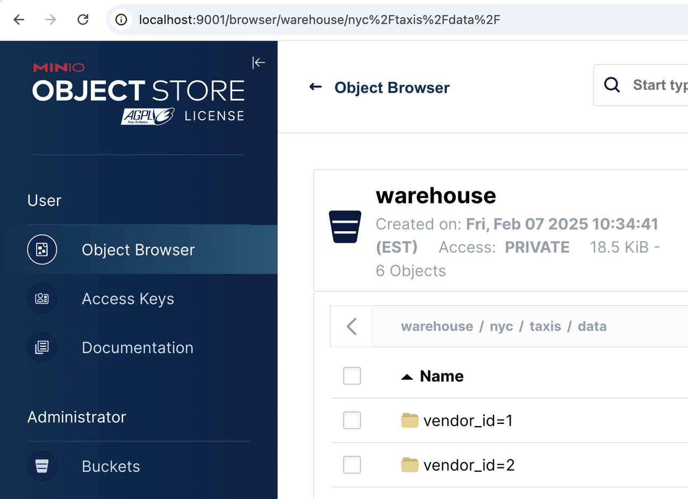

import DataLakeIntro from '../_assets/commonMarkdown/datalakeIntro.mdx'
import Clients from '../_assets/quick-start/_clientsCompose.mdx'

# Apache Iceberg Lakehouse

本指南将帮助您使用 StarRocks™ 快速上手 Apache Iceberg™，包括一些示例代码以突出其强大功能。

### Docker-Compose

最快的入门方式是使用一个 docker-compose 文件，该文件使用包含已配置 Iceberg catalog 的本地 StarRocks 集群的 `starrocks/fe-ubuntu` 和 `starrocks/be-ubuntu` 镜像。要使用它，您需要安装 Docker CLI。

安装 Docker 后，将下面的 yaml 保存为名为 docker-compose.yml 的文件：

```yml
services:

  starrocks-fe:
    image: starrocks/fe-ubuntu:3.3.5
    hostname: starrocks-fe
    container_name: starrocks-fe
    user: root
    command: |
      bash /opt/starrocks/fe/bin/start_fe.sh --host_type FQDN
    ports:
      - 8030:8030
      - 9020:9020
      - 9030:9030
    networks:
      iceberg_net:
    environment:
      - AWS_ACCESS_KEY_ID=admin
      - AWS_SECRET_ACCESS_KEY=password
      - AWS_REGION=us-east-1
    healthcheck:
      test: 'mysql -u root -h starrocks-fe -P 9030 -e "SHOW FRONTENDS\G" |grep "Alive: true"'
      interval: 10s
      timeout: 5s
      retries: 3

  starrocks-be:
    image: starrocks/be-ubuntu:3.3.5
    command:
      - /bin/bash
      - -c
      - |
        ulimit -n 65535;
        echo "# Enable data cache"  >> /opt/starrocks/be/conf/be.conf
        echo "block_cache_enable = true"  >> /opt/starrocks/be/conf/be.conf
        echo "block_cache_mem_size = 536870912" >> /opt/starrocks/be/conf/be.conf
        echo "block_cache_disk_size = 1073741824" >> /opt/starrocks/be/conf/be.conf
        sleep 15s
        mysql --connect-timeout 2 -h starrocks-fe -P 9030 -u root -e "ALTER SYSTEM ADD BACKEND \"starrocks-be:9050\";"
        bash /opt/starrocks/be/bin/start_be.sh
    ports:
      - 8040:8040
    hostname: starrocks-be
    container_name: starrocks-be
    user: root
    depends_on:
      starrocks-fe:
        condition: service_healthy
    healthcheck:
      test: 'mysql -u root -h starrocks-fe -P 9030 -e "SHOW BACKENDS\G" |grep "Alive: true"'
      interval: 10s
      timeout: 5s
      retries: 3
    networks:
      iceberg_net:
    environment:
      - HOST_TYPE=FQDN

  rest:
    image: apache/iceberg-rest-fixture
    container_name: iceberg-rest
    networks:
      iceberg_net:
        aliases:
          - iceberg-rest.minio
    ports:
      - 8181:8181
    environment:
      - AWS_ACCESS_KEY_ID=admin
      - AWS_SECRET_ACCESS_KEY=password
      - AWS_REGION=us-east-1
      - CATALOG_WAREHOUSE=s3://warehouse/
      - CATALOG_IO__IMPL=org.apache.iceberg.aws.s3.S3FileIO
      - CATALOG_S3_ENDPOINT=http://minio:9000

  minio:
    image: minio/minio:RELEASE.2024-10-29T16-01-48Z
    container_name: minio
    environment:
      - MINIO_ROOT_USER=admin
      - MINIO_ROOT_PASSWORD=password
      - MINIO_DOMAIN=minio
    networks:
      iceberg_net:
        aliases:
          - warehouse.minio
    ports:
      - 9001:9001
      - 9000:9000
    command: ["server", "/data", "--console-address", ":9001"]
  mc:
    depends_on:
      - minio
    image: minio/mc:RELEASE.2024-10-29T15-34-59Z
    container_name: mc
    networks:
      iceberg_net:
    environment:
      - AWS_ACCESS_KEY_ID=admin
      - AWS_SECRET_ACCESS_KEY=password
      - AWS_REGION=us-east-1
    entrypoint: >
      /bin/sh -c "
      until (/usr/bin/mc config host add minio http://minio:9000 admin password) do echo '...waiting...' && sleep 1; done;
      /usr/bin/mc rm -r --force minio/warehouse;
      /usr/bin/mc mb minio/warehouse;
      /usr/bin/mc policy set public minio/warehouse;
      tail -f /dev/null
      "
networks:
  iceberg_net:
```

接下来，使用以下命令启动 docker 容器：

```Plain
docker compose up --detach --wait --wait-timeout 400
```

然后，您可以运行以下任一命令来启动 StarRocks 会话。

```bash
docker exec -it starrocks-fe \
mysql -P 9030 -h 127.0.0.1 -u root --prompt="StarRocks > "
```

### 添加和使用 Catalog

```SQL
CREATE EXTERNAL CATALOG 'demo'
COMMENT "External catalog to Apache Iceberg on MinIO"
PROPERTIES
(
  "type"="iceberg",
  "iceberg.catalog.type"="rest",
  "iceberg.catalog.uri"="http://iceberg-rest:8181",
  "iceberg.catalog.warehouse"="warehouse",
  "aws.s3.access_key"="admin",
  "aws.s3.secret_key"="password",
  "aws.s3.endpoint"="http://minio:9000",
  "aws.s3.enable_path_style_access"="true",
  "client.factory"="com.starrocks.connector.iceberg.IcebergAwsClientFactory"  
);
```

```SQL
SHOW CATALOGS\G
```

```SQL
*************************** 1. row ***************************
Catalog: default_catalog
   Type: Internal
Comment: An internal catalog contains this cluster's self-managed tables.
*************************** 2. row ***************************
Catalog: demo
   Type: Iceberg
Comment: External catalog to Apache Iceberg on MinIO
2 rows in set (0.00 sec)
```

```SQL
SET CATALOG demo;
```

### 创建和使用数据库

```SQL
CREATE DATABASE nyc;
```

```SQL
USE nyc;
```

### 创建表

```SQL
CREATE TABLE demo.nyc.taxis
(
    trip_id            bigint,
    trip_distance      float,
    fare_amount double,
    store_and_fwd_flag string,
    vendor_id          bigint
) PARTITION BY (vendor_id);
```

### 写入数据到表

```SQL
INSERT INTO demo.nyc.taxis
VALUES (1000371, 1.8, 15.32, 'N', 1),
       (1000372, 2.5, 22.15, 'N', 2),
       (1000373, 0.9, 9.01, 'N', 2),
       (1000374, 8.4, 42.13, 'Y', 1);
```

### 从表中读取数据

```SQL
SELECT *
FROM demo.nyc.taxis;
```

### 验证数据是否存储在对象存储中

当您添加并使用 external catalog 时，StarRocks 开始使用 MinIO 作为 `demo.nyc.taxis` 表的对象存储。如果您导航到 http://localhost:9001 然后通过对象浏览器菜单导航到 `warehouse/nyc/taxis/`，您可以确认 StarRocks 正在使用 MinIO 进行存储。

:::tip

MinIO 的用户名和密码在 docker-compose.yml 文件中。系统会提示您将密码更改为更好的密码，在本教程中请忽略此建议。


:::

### 下一步

#### 将 Iceberg 添加到 StarRocks

如果您已经有一个 StarRocks 3.2.0 或更高版本的环境，它已包含 Iceberg 1.6.0。无需额外下载或 jar 文件。

#### 了解更多

现在您已经使用 Iceberg 和 StarRocks 运行起来了，请查看 [StarRocks-Iceberg 文档](../data_source/catalog/iceberg/iceberg_catalog.md) 以了解更多信息！
