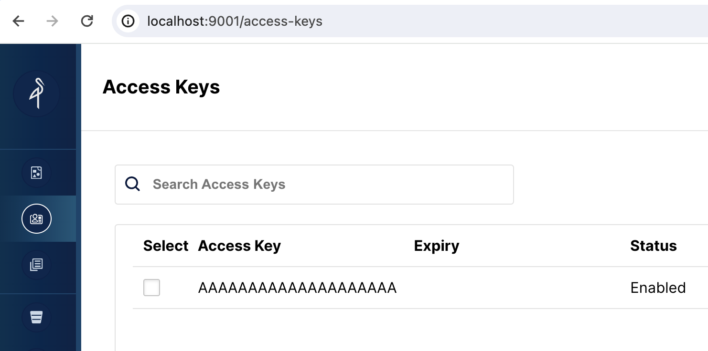

# 通过 Routine Load 向 StarRocks 存算分离集群 导入 Kafka 数据

import Clients from '../_assets/quick-start/_clientsCompose.mdx'
import SQL from '../_assets/quick-start/_SQL.mdx'

## 关于 Routine Load

Routine load 是一种使用 Apache Kafka 或在本实验中使用 Redpanda，将数据持续流式传输到 StarRocks 的方法。数据被流式传输到 Kafka 主题中，然后由 Routine Load 作业将数据导入到 StarRocks。更多关于 Routine Load 的详细信息将在实验结束时提供。

## 关于存算分离

在存算分离系统中，数据存储在低成本可靠的远端存储系统中，如 Amazon S3、Google Cloud Storage、Azure Blob Storage 和其他兼容 S3 的存储如 MinIO。热数据会被本地缓存，当缓存命中时，查询性能与存算一体架构相当。计算节点（CN）可以在几秒钟内按需添加或移除。这种架构降低了存储成本，确保了更好的资源隔离，并提供了弹性和可扩展性。

本教程涵盖：

- 使用 Docker Compose 运行 StarRocks、Redpanda 和 MinIO
- 使用 MinIO 作为 StarRocks 的存储层
- 配置 StarRocks 以使用 shared-data
- 添加一个 Routine Load 作业以从 Redpanda 消费数据

所使用的数据是合成数据。

本文档中包含大量信息，内容以步骤形式呈现于开头，技术细节在结尾。这是为了按以下顺序服务于这些目的：

1. 配置 Routine Load。
2. 允许读者在 shared-data 部署中导入数据并分析这些数据。
3. 提供 shared-data 部署的配置细节。

---

## 前提条件

### Docker

- [Docker](https://docs.docker.com/engine/install/)
- 为 Docker 分配 4 GB RAM
- 为 Docker 分配 10 GB 可用磁盘空间

### SQL 客户端

您可以使用 Docker 环境中提供的 SQL 客户端，或者使用系统上的客户端。许多 MySQL 兼容的客户端都可以使用，本指南涵盖了 DBeaver 和 MySQL Workbench 的配置。

### curl

`curl` 用于下载 Compose 文件和生成数据的脚本。通过在操作系统提示符下运行 `curl` 或 `curl.exe` 检查是否已安装 curl。如果未安装 curl，[在此获取 curl](https://curl.se/dlwiz/?type=bin)。

### Python

需要 Python 3 和 Apache Kafka 的 Python 客户端 `kafka-python`。

- [Python](https://www.python.org/)
- [`kafka-python`](https://pypi.org/project/kafka-python/)

---

## 术语

### FE

前端节点负责元数据管理、客户端连接管理、查询计划和查询调度。每个 FE 在其内存中存储和维护完整的元数据副本，确保 FEs 之间的服务无差异。

### CN

计算节点负责在 shared-data 部署中执行查询计划。

### BE

后端节点负责在 shared-nothing 部署中进行数据存储和执行查询计划。

:::note
本指南不使用 BEs，此信息仅为帮助您理解 BEs 和 CNs 之间的区别。
:::

---

## 启动 StarRocks

要使用对象存储运行 StarRocks 的 shared-data，您需要：

- 一个前端引擎（FE）
- 一个计算节点（CN）
- 对象存储

本指南使用 MinIO，它是兼容 S3 的对象存储提供商。MinIO 根据 GNU Affero 通用公共许可证提供。

### 下载实验文件

#### `docker-compose.yml`

```bash
mkdir routineload
cd routineload
curl -O https://raw.githubusercontent.com/StarRocks/demo/master/documentation-samples/routine-load-shared-data/docker-compose.yml
```

#### `gen.py`

`gen.py` 是一个使用 Apache Kafka 的 Python 客户端将数据发布（生产）到 Kafka 主题的脚本。该脚本已写入 Redpanda 容器的地址和端口。

```bash
curl -O https://raw.githubusercontent.com/StarRocks/demo/master/documentation-samples/routine-load-shared-data/gen.py
```

## 启动 StarRocks、MinIO 和 Redpanda

```bash
docker compose up --detach --wait --wait-timeout 120
```

检查服务的进度。容器变为健康状态可能需要 30 秒或更长时间。`routineload-minio_mc-1` 容器不会显示健康指示器，并将在配置 MinIO 以供 StarRocks 使用访问密钥后退出。等待 `routineload-minio_mc-1` 以 `0` 代码退出，其余服务为 `Healthy`。

运行 `docker compose ps` 直到服务健康：

```bash
docker compose ps
```

```plaintext
WARN[0000] /Users/droscign/routineload/docker-compose.yml: `version` is obsolete
[+] Running 6/7
 ✔ Network routineload_default       Crea...          0.0s
 ✔ Container minio                   Healthy          5.6s
 ✔ Container redpanda                Healthy          3.6s
 ✔ Container redpanda-console        Healt...         1.1s
 ⠧ Container routineload-minio_mc-1  Waiting          23.1s
 ✔ Container starrocks-fe            Healthy          11.1s
 ✔ Container starrocks-cn            Healthy          23.0s
container routineload-minio_mc-1 exited (0)
```

---

## 检查 MinIO 凭证

为了使用 MinIO 作为 StarRocks 的对象存储，StarRocks 需要一个 MinIO 访问密钥。访问密钥是在 Docker 服务启动期间生成的。为了帮助您更好地理解 StarRocks 如何连接到 MinIO，您应该验证密钥是否存在。

### 打开 MinIO Web UI

浏览到 http://localhost:9001/access-keys 用户名和密码在 Docker compose 文件中指定，分别是 `miniouser` 和 `miniopassword`。您应该看到有一个访问密钥。密钥是 `AAAAAAAAAAAAAAAAAAAA`，您无法在 MinIO 控制台中看到密钥，但它在 Docker compose 文件中，是 `BBBBBBBBBBBBBBBBBBBBBBBBBBBBBBBBBBBBBBBB`：



---

### 为您的数据创建一个 bucket

当您在 StarRocks 中创建一个存储卷时，您将指定数据的 `LOCATION`：

```sh
    LOCATIONS = ("s3://my-starrocks-bucket/")
```

打开 [http://localhost:9001/buckets](http://localhost:9001/buckets) 并为存储卷添加一个 bucket。将 bucket 命名为 `my-starrocks-bucket`。接受列出的三个选项的默认值。

---

## SQL 客户端

<Clients />

---

## StarRocks 的 shared-data 配置

此时您已经运行了 StarRocks，并且 MinIO 也在运行。MinIO 访问密钥用于连接 StarRocks 和 MinIO。

这是 `FE` 配置的一部分，指定了 StarRocks 部署将使用 shared data。这是在 Docker Compose 创建部署时添加到文件 `fe.conf` 中的。

```sh
# enable the shared data run mode
run_mode = shared_data
cloud_native_storage_type = S3
```

:::info
您可以通过从 `quickstart` 目录运行此命令并查看文件末尾来验证这些设置：
:::

```sh
docker compose exec starrocks-fe \
  cat /opt/starrocks/fe/conf/fe.conf
```
:::

### 使用 SQL 客户端连接到 StarRocks

:::tip

从包含 `docker-compose.yml` 文件的目录运行此命令。

如果您使用的是 mysql CLI 以外的客户端，请立即打开它。
:::

```sql
docker compose exec starrocks-fe \
mysql -P9030 -h127.0.0.1 -uroot --prompt="StarRocks > "
```

#### 检查存储卷

```sql
SHOW STORAGE VOLUMES;
```

:::tip
应该没有存储卷，您将接下来创建一个。
:::

```sh
Empty set (0.04 sec)
```

#### 创建一个 shared-data 存储卷

早些时候，您在 MinIO 中创建了一个名为 `my-starrocks-volume` 的 bucket，并验证了 MinIO 有一个名为 `AAAAAAAAAAAAAAAAAAAA` 的访问密钥。以下 SQL 将使用访问密钥和密钥在 MionIO bucket 中创建一个存储卷。

```sql
CREATE STORAGE VOLUME s3_volume
    TYPE = S3
    LOCATIONS = ("s3://my-starrocks-bucket/")
    PROPERTIES
    (
         "enabled" = "true",
         "aws.s3.endpoint" = "minio:9000",
         "aws.s3.access_key" = "AAAAAAAAAAAAAAAAAAAA",
         "aws.s3.secret_key" = "BBBBBBBBBBBBBBBBBBBBBBBBBBBBBBBBBBBBBBBB",
         "aws.s3.use_instance_profile" = "false",
         "aws.s3.use_aws_sdk_default_behavior" = "false"
     );
```

现在您应该看到一个存储卷列出，之前它是一个空集：

```
SHOW STORAGE VOLUMES;
```

```
+----------------+
| Storage Volume |
+----------------+
| s3_volume      |
+----------------+
1 row in set (0.02 sec)
```

查看存储卷的详细信息，并注意这还不是默认卷，并且它被配置为使用您的 bucket：

```
DESC STORAGE VOLUME s3_volume\G
```

:::tip
本文档中的一些 SQL，以及 StarRocks 文档中的许多其他文档，以 `\G` 结尾而不是分号。`\G` 使 mysql CLI 垂直呈现查询结果。

许多 SQL 客户端不解释垂直格式输出，因此您应该将 `\G` 替换为 `;`。
:::

```sh
*************************** 1. row ***************************
     Name: s3_volume
     Type: S3
# highlight-start
IsDefault: false
 Location: s3://my-starrocks-bucket/
# highlight-end
   Params: {"aws.s3.access_key":"******","aws.s3.secret_key":"******","aws.s3.endpoint":"minio:9000","aws.s3.region":"us-east-1","aws.s3.use_instance_profile":"false","aws.s3.use_web_identity_token_file":"false","aws.s3.use_aws_sdk_default_behavior":"false"}
  Enabled: true
  Comment:
1 row in set (0.02 sec)
```

## 设置默认存储卷

```
SET s3_volume AS DEFAULT STORAGE VOLUME;
```

```
DESC STORAGE VOLUME s3_volume\G
```

```sh
*************************** 1. row ***************************
     Name: s3_volume
     Type: S3
# highlight-next-line
IsDefault: true
 Location: s3://my-starrocks-bucket/
   Params: {"aws.s3.access_key":"******","aws.s3.secret_key":"******","aws.s3.endpoint":"minio:9000","aws.s3.region":"us-east-1","aws.s3.use_instance_profile":"false","aws.s3.use_web_identity_token_file":"false","aws.s3.use_aws_sdk_default_behavior":"false"}
  Enabled: true
  Comment:
1 row in set (0.02 sec)
```

---

## 创建一个表

这些 SQL 命令在您的 SQL 客户端中运行。

```SQL
CREATE DATABASE IF NOT EXISTS quickstart;
```

验证数据库 `quickstart` 是否使用存储卷 `s3_volume`：

```
SHOW CREATE DATABASE quickstart \G
```

```sh
*************************** 1. row ***************************
       Database: quickstart
Create Database: CREATE DATABASE `quickstart`
# highlight-next-line
PROPERTIES ("storage_volume" = "s3_volume")
```

```SQL
USE quickstart;
```

```SQL
CREATE TABLE site_clicks (
    `uid` bigint NOT NULL COMMENT "uid",
    `site` string NOT NULL COMMENT "site url",
    `vtime` bigint NOT NULL COMMENT "vtime"
)
DISTRIBUTED BY HASH(`uid`)
PROPERTIES("replication_num"="1");
```

---

### 打开 Redpanda 控制台

目前还没有主题，下一步将创建一个主题。

http://localhost:8080/overview

### 将数据发布到 Redpanda 主题

在 `routineload/` 文件夹中的命令行中运行此命令以生成数据：

```python
python gen.py 5
```

:::tip

在您的系统上，您可能需要在命令中使用 `python3` 代替 `python`。

如果缺少 `kafka-python`，请尝试：

```
pip install kafka-python
```
 或

```
pip3 install kafka-python
```

:::

```plaintext
b'{ "uid": 6926, "site": "https://docs.starrocks.io/", "vtime": 1718034793 } '
b'{ "uid": 3303, "site": "https://www.starrocks.io/product/community", "vtime": 1718034793 } '
b'{ "uid": 227, "site": "https://docs.starrocks.io/", "vtime": 1718034243 } '
b'{ "uid": 7273, "site": "https://docs.starrocks.io/", "vtime": 1718034794 } '
b'{ "uid": 4666, "site": "https://www.starrocks.io/", "vtime": 1718034794 } '
```

### 在 Redpanda 控制台中验证

导航到 http://localhost:8080/topics 在 Redpanda 控制台中，您将看到一个名为 `test2` 的主题。选择该主题，然后选择 **Messages** 选项卡，您将看到五条与 `gen.py` 输出匹配的消息。

## 消费消息

在 StarRocks 中，您将创建一个 Routine Load 作业来：

1. 从 Redpanda 主题 `test2` 消费消息
2. 将这些消息加载到表 `site_clicks` 中

StarRocks 被配置为使用 MinIO 进行存储，因此插入到 `site_clicks` 表中的数据将存储在 MinIO 中。

### 创建一个 Routine Load 作业

在 SQL 客户端中运行此命令以创建 Routine Load 作业，命令将在实验结束时详细解释。

```SQL
CREATE ROUTINE LOAD quickstart.clicks ON site_clicks
PROPERTIES
(
    "format" = "JSON",
    "jsonpaths" ="[\"$.uid\",\"$.site\",\"$.vtime\"]"
)
FROM KAFKA
(     
    "kafka_broker_list" = "redpanda:29092",
    "kafka_topic" = "test2",
    "kafka_partitions" = "0",
    "kafka_offsets" = "OFFSET_BEGINNING"
);
```

### 验证 Routine Load 作业

```SQL
SHOW ROUTINE LOAD\G
```

验证三个高亮行：

1. 状态应为 `RUNNING`
2. 主题应为 `test2`，代理应为 `redpanda:2092`
3. 统计信息应显示 0 或 5 行已加载，具体取决于您运行 `SHOW ROUTINE LOAD` 命令的时间。如果有 0 行已加载，请再次运行。

```SQL
*************************** 1. row ***************************
                  Id: 10078
                Name: clicks
          CreateTime: 2024-06-12 15:51:12
           PauseTime: NULL
             EndTime: NULL
              DbName: quickstart
           TableName: site_clicks
           -- highlight-next-line
               State: RUNNING
      DataSourceType: KAFKA
      CurrentTaskNum: 1
       JobProperties: {"partitions":"*","partial_update":"false","columnToColumnExpr":"*","maxBatchIntervalS":"10","partial_update_mode":"null","whereExpr":"*","dataFormat":"json","timezone":"Etc/UTC","format":"json","log_rejected_record_num":"0","taskTimeoutSecond":"60","json_root":"","maxFilterRatio":"1.0","strict_mode":"false","jsonpaths":"[\"$.uid\",\"$.site\",\"$.vtime\"]","taskConsumeSecond":"15","desireTaskConcurrentNum":"5","maxErrorNum":"0","strip_outer_array":"false","currentTaskConcurrentNum":"1","maxBatchRows":"200000"}
       -- highlight-next-line
DataSourceProperties: {"topic":"test2","currentKafkaPartitions":"0","brokerList":"redpanda:29092"}
    CustomProperties: {"group.id":"clicks_ea38a713-5a0f-4abe-9b11-ff4a241ccbbd"}
    -- highlight-next-line
           Statistic: {"receivedBytes":0,"errorRows":0,"committedTaskNum":0,"loadedRows":0,"loadRowsRate":0,"abortedTaskNum":0,"totalRows":0,"unselectedRows":0,"receivedBytesRate":0,"taskExecuteTimeMs":1}
            Progress: {"0":"OFFSET_ZERO"}
   TimestampProgress: {}
ReasonOfStateChanged:
        ErrorLogUrls:
         TrackingSQL:
            OtherMsg:
LatestSourcePosition: {}
1 row in set (0.00 sec)
```

```SQL
SHOW ROUTINE LOAD\G
```

```SQL
*************************** 1. row ***************************
                  Id: 10076
                Name: clicks
          CreateTime: 2024-06-12 18:40:53
           PauseTime: NULL
             EndTime: NULL
              DbName: quickstart
           TableName: site_clicks
               State: RUNNING
      DataSourceType: KAFKA
      CurrentTaskNum: 1
       JobProperties: {"partitions":"*","partial_update":"false","columnToColumnExpr":"*","maxBatchIntervalS":"10","partial_update_mode":"null","whereExpr":"*","dataFormat":"json","timezone":"Etc/UTC","format":"json","log_rejected_record_num":"0","taskTimeoutSecond":"60","json_root":"","maxFilterRatio":"1.0","strict_mode":"false","jsonpaths":"[\"$.uid\",\"$.site\",\"$.vtime\"]","taskConsumeSecond":"15","desireTaskConcurrentNum":"5","maxErrorNum":"0","strip_outer_array":"false","currentTaskConcurrentNum":"1","maxBatchRows":"200000"}
DataSourceProperties: {"topic":"test2","currentKafkaPartitions":"0","brokerList":"redpanda:29092"}
    CustomProperties: {"group.id":"clicks_a9426fee-45bb-403a-a1a3-b3bc6c7aa685"}
               -- highlight-next-line
           Statistic: {"receivedBytes":372,"errorRows":0,"committedTaskNum":1,"loadedRows":5,"loadRowsRate":0,"abortedTaskNum":0,"totalRows":5,"unselectedRows":0,"receivedBytesRate":0,"taskExecuteTimeMs":519}
            Progress: {"0":"4"}
   TimestampProgress: {"0":"1718217035111"}
ReasonOfStateChanged:
        ErrorLogUrls:
         TrackingSQL:
            OtherMsg:
                       -- highlight-next-line
LatestSourcePosition: {"0":"5"}
1 row in set (0.00 sec)
```

---

## 验证数据是否存储在 MinIO 中

打开 MinIO [http://localhost:9001/browser/](http://localhost:9001/browser/) 并验证 `my-starrocks-bucket` 下是否存储了对象。

---

## 从 StarRocks 查询数据

```SQL
USE quickstart;
SELECT * FROM site_clicks;
```

```SQL
+------+--------------------------------------------+------------+
| uid  | site                                       | vtime      |
+------+--------------------------------------------+------------+
| 4607 | https://www.starrocks.io/blog              | 1718031441 |
| 1575 | https://www.starrocks.io/                  | 1718031523 |
| 2398 | https://docs.starrocks.io/                 | 1718033630 |
| 3741 | https://www.starrocks.io/product/community | 1718030845 |
| 4792 | https://www.starrocks.io/                  | 1718033413 |
+------+--------------------------------------------+------------+
5 rows in set (0.07 sec)
```

## 发布更多数据

再次运行 `gen.py` 将向 Redpanda 发布另外五条记录。

```bash
python gen.py 5
```

### 验证数据是否已添加

由于 Routine Load 作业按计划运行（默认每 10 秒），数据将在几秒钟内加载。

```SQL
SELECT * FROM site_clicks;
````

```
+------+--------------------------------------------+------------+
| uid  | site                                       | vtime      |
+------+--------------------------------------------+------------+
| 6648 | https://www.starrocks.io/blog              | 1718205970 |
| 7914 | https://www.starrocks.io/                  | 1718206760 |
| 9854 | https://www.starrocks.io/blog              | 1718205676 |
| 1186 | https://www.starrocks.io/                  | 1718209083 |
| 3305 | https://docs.starrocks.io/                 | 1718209083 |
| 2288 | https://www.starrocks.io/blog              | 1718206759 |
| 7879 | https://www.starrocks.io/product/community | 1718204280 |
| 2666 | https://www.starrocks.io/                  | 1718208842 |
| 5801 | https://www.starrocks.io/                  | 1718208783 |
| 8409 | https://www.starrocks.io/                  | 1718206889 |
+------+--------------------------------------------+------------+
10 rows in set (0.02 sec)
```

---

## 配置详情

现在您已经体验了使用 StarRocks 的 shared-data，了解配置非常重要。

### CN 配置

此处使用的 CN 配置是默认配置，因为 CN 设计用于 shared-data 使用。默认配置如下所示。您无需进行任何更改。

```bash
sys_log_level = INFO

# ports for admin, web, heartbeat service
be_port = 9060
be_http_port = 8040
heartbeat_service_port = 9050
brpc_port = 8060
starlet_port = 9070
```

### FE 配置

FE 配置与默认配置略有不同，因为 FE 必须配置为期望数据存储在对象存储中，而不是存储在 BE 节点的本地磁盘上。

`docker-compose.yml` 文件在 `command` 中生成 FE 配置。

```plaintext
# enable shared data, set storage type, set endpoint
run_mode = shared_data
cloud_native_storage_type = S3
```

:::note
此配置文件不包含 FE 的默认条目，仅显示 shared-data 配置。
:::

非默认 FE 配置设置：

:::note
许多配置参数以 `s3_` 为前缀。此前缀用于所有 Amazon S3 兼容的存储类型（例如：S3、GCS 和 MinIO）。使用 Azure Blob Storage 时，前缀为 `azure_`。
:::

#### `run_mode=shared_data`

这启用 shared-data 使用。

#### `cloud_native_storage_type=S3`

这指定使用 S3 兼容存储或 Azure Blob Storage。对于 MinIO，这始终是 S3。

### `CREATE storage volume` 的详细信息

```sql
CREATE STORAGE VOLUME s3_volume
    TYPE = S3
    LOCATIONS = ("s3://my-starrocks-bucket/")
    PROPERTIES
    (
         "enabled" = "true",
         "aws.s3.endpoint" = "minio:9000",
         "aws.s3.access_key" = "AAAAAAAAAAAAAAAAAAAA",
         "aws.s3.secret_key" = "BBBBBBBBBBBBBBBBBBBBBBBBBBBBBBBBBBBBBBBB",
         "aws.s3.use_instance_profile" = "false",
         "aws.s3.use_aws_sdk_default_behavior" = "false"
     );
```

#### `aws_s3_endpoint=minio:9000`

MinIO 端点，包括端口号。

#### `aws_s3_path=starrocks`

bucket 名称。

#### `aws_s3_access_key=AAAAAAAAAAAAAAAAAAAA`

MinIO 访问密钥。

#### `aws_s3_secret_key=BBBBBBBBBBBBBBBBBBBBBBBBBBBBBBBBBBBBBBBB`

MinIO 访问密钥密钥。

#### `aws_s3_use_instance_profile=false`

使用 MinIO 时使用访问密钥，因此 MinIO 不使用实例配置文件。

#### `aws_s3_use_aws_sdk_default_behavior=false`

使用 MinIO 时，此参数始终设置为 false。

---

## 关于 Routine Load 命令的说明

StarRocks Routine Load 接受许多参数。这里只描述了本教程中使用的参数，其余将在更多信息部分中链接。

```SQL
CREATE ROUTINE LOAD quickstart.clicks ON site_clicks
PROPERTIES
(
    "format" = "JSON",
    "jsonpaths" ="[\"$.uid\",\"$.site\",\"$.vtime\"]"
)
FROM KAFKA
(     
    "kafka_broker_list" = "redpanda:29092",
    "kafka_topic" = "test2",
    "kafka_partitions" = "0",
    "kafka_offsets" = "OFFSET_BEGINNING"
);
```

### 参数

```
CREATE ROUTINE LOAD quickstart.clicks ON site_clicks
```

`CREATE ROUTINE LOAD ON` 的参数为：
- database_name.job_name
- table_name

`database_name` 是可选的。在本实验中，它是 `quickstart` 并被指定。

`job_name` 是必需的，为 `clicks`

`table_name` 是必需的，为 `site_clicks`

### 作业属性

#### 属性 `format`

```
"format" = "JSON",
```

在这种情况下，数据是 JSON 格式的，因此属性设置为 `JSON`。其他有效格式为：`CSV`、`JSON` 和 `Avro`。`CSV` 是默认格式。

#### 属性 `jsonpaths`

```
"jsonpaths" ="[\"$.uid\",\"$.site\",\"$.vtime\"]"
```

您希望从 JSON 格式数据中加载的字段名称。此参数的值是一个有效的 JsonPath 表达式。更多信息可在页面末尾获得。

### 数据源属性

#### `kafka_broker_list`

```
"kafka_broker_list" = "redpanda:29092",
```

Kafka 的代理连接信息。格式为 `<kafka_broker_name_or_ip>:<broker_ port>`。多个代理用逗号分隔。

#### `kafka_topic`

```
"kafka_topic" = "test2",
```

要消费的 Kafka 主题。

#### `kafka_partitions` 和 `kafka_offsets`

```
"kafka_partitions" = "0",
"kafka_offsets" = "OFFSET_BEGINNING"
```

这些属性一起呈现，因为每个 `kafka_partitions` 条目需要一个 `kafka_offset`。

`kafka_partitions` 是要消费的一个或多个分区的列表。如果未设置此属性，则消费所有分区。

`kafka_offsets` 是一个偏移量列表，每个分区在 `kafka_partitions` 中列出。在这种情况下，值为 `OFFSET_BEGINNING`，这会导致消费所有数据。默认情况下仅消费新数据。

---

## 总结

在本教程中，您：

- 在 Docker 中部署了 StarRocks、Reedpanda 和 Minio
- 创建了一个 Routine Load 作业以从 Kafka 主题消费数据
- 学习了如何配置使用 MinIO 的 StarRocks 存储卷

## 更多信息

[StarRocks 架构](../introduction/Architecture.md)

本实验使用的示例非常简单。Routine Load 具有更多选项和功能。[了解更多](../loading/RoutineLoad.md)。

[JSONPath](https://goessner.net/articles/JsonPath/)
```
