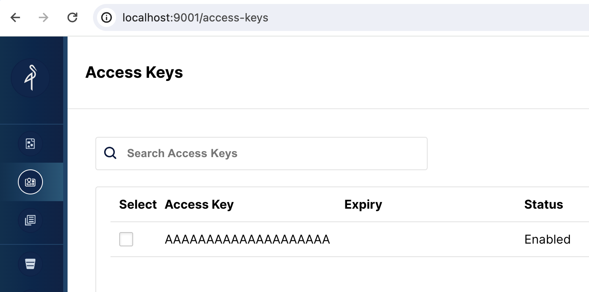

displayed_sidebar: docs
sidebar_position: 2
description: Separate compute and storage
---

# 存算分离

import DDL from '../_assets/quick-start/_DDL.mdx'
import Clients from '../_assets/quick-start/_clientsCompose.mdx'
import SQL from '../_assets/quick-start/_SQL.mdx'
import Curl from '../_assets/quick-start/_curl.mdx'

在存算分离的系统中，数据存储在低成本、高可靠性的远程存储系统中，例如 Amazon S3、Google Cloud Storage、Azure Blob Storage 和其他 S3 兼容的存储（如 MinIO）。热数据缓存在本地，当缓存命中时，查询性能与存算一体架构相当。计算节点 (CN) 可以根据需要在几秒钟内添加或删除。这种架构降低了存储成本，确保了更好的资源隔离，并提供了弹性和可扩展性。

本教程包括：

- 在 Docker 容器中运行 StarRocks
- 使用 MinIO 作为对象存储
- 配置 StarRocks 以支持存算分离
- 加载两个公共数据集
- 使用 SELECT 和 JOIN 分析数据
- 基本数据转换（ETL 中的 **T**）

所使用的数据由 NYC OpenData 和 NOAA 的国家环境信息中心提供。

这两个数据集都非常大，并且由于本教程旨在帮助您了解如何使用 StarRocks，因此我们不会加载过去 120 年的数据。您可以在分配给 Docker 的 4 GB RAM 的机器上运行 Docker 镜像并加载此数据。对于更大规模的容错和可扩展部署，我们有其他文档，稍后会提供。

本文档包含大量信息，内容按步骤呈现于开头，结尾是技术细节。这样做是为了按以下顺序实现这些目的：

1. 允许读者在存算分离部署中加载数据并分析该数据。
2. 提供存算分离部署的配置详细信息。
3. 解释导入期间数据转换的基础知识。

---

## 前提条件

### Docker

- [Docker](https://docs.docker.com/engine/install/)
- 分配给 Docker 的 4 GB RAM
- 分配给 Docker 的 10 GB 可用磁盘空间

### SQL 客户端

您可以使用 Docker 环境中提供的 SQL 客户端，也可以使用系统上的 SQL 客户端。许多 MySQL 兼容的客户端都可以工作，本指南介绍了 DBeaver 和 MySQL Workbench 的配置。

### curl

`curl` 用于向 StarRocks 发出数据导入作业，并下载数据集。通过在操作系统提示符下运行 `curl` 或 `curl.exe` 来检查是否已安装。如果未安装 curl，请[在此处获取 curl](https://curl.se/dlwiz/?type=bin)。

### `/etc/hosts`

本指南中使用的提取方法是 Stream Load。Stream Load 连接到 FE 服务以启动导入作业。然后，FE 将作业分配给后端节点，即本指南中的 CN。为了使提取作业能够连接到 CN，CN 的名称必须可用于您的操作系统。将此行添加到 `/etc/hosts`：

```bash
127.0.0.1 starrocks-cn
```

---

## 术语

### FE

前端节点负责元数据管理、客户端连接管理、查询规划和查询调度。每个 FE 在其内存中存储和维护元数据的完整副本，这保证了 FE 之间的无差别服务。

### CN

Compute Node 负责在存算分离部署中执行查询计划。

### BE

后端节点负责数据存储和在存算一体部署中执行查询计划。

:::note
本指南不使用 BEs，此信息仅供您了解 BEs 和 CNs 之间的区别。
:::

---

## 编辑您的 hosts 文件

本指南中使用的导入方法是 Stream Load。Stream Load 连接到 FE 服务以启动导入任务。然后 FE 将任务分配给后端节点——本指南中的 CN。为了使导入任务能够连接到 CN，CN 的名称必须在您的操作系统中可用。将以下行添加到 `/etc/hosts`：

```bash
127.0.0.1 starrocks-cn
```

## 下载实验文件

有三个文件要下载：

- 部署 StarRocks 和 MinIO 环境的 Docker Compose 文件
- 纽约市交通事故数据
- 天气数据

本指南使用 MinIO，它是根据 GNU Affero 通用公共许可证提供的兼容 S3 的对象存储。

### 创建一个目录来存储实验文件

```bash
mkdir quickstart
cd quickstart
```

### 下载 Docker Compose 文件

```bash
curl -O https://raw.githubusercontent.com/StarRocks/demo/master/documentation-samples/quickstart/docker-compose.yml
```

### 下载数据

下载这两个数据集：

#### 纽约市交通事故数据

```bash
curl -O https://raw.githubusercontent.com/StarRocks/demo/master/documentation-samples/quickstart/datasets/NYPD_Crash_Data.csv
```

#### 天气数据

```bash
curl -O https://raw.githubusercontent.com/StarRocks/demo/master/documentation-samples/quickstart/datasets/72505394728.csv
```

---

## 部署 StarRocks 和 MinIO

```bash
docker compose up --detach --wait --wait-timeout 120
```

FE、CN 和 MinIO 服务大约需要 30 秒才能变为健康状态。`quickstart-minio_mc-1` 容器将显示 `Waiting` 状态以及退出代码。退出代码 `0` 表示成功。

```bash
[+] Running 4/5
 ✔ Network quickstart_default       Created    0.0s
 ✔ Container minio                  Healthy    6.8s
 ✔ Container starrocks-fe           Healthy    29.3s
 ⠼ Container quickstart-minio_mc-1  Waiting    29.3s
 ✔ Container starrocks-cn           Healthy    29.2s
container quickstart-minio_mc-1 exited (0)
```

---

## MinIO

此快速入门使用 MinIO 进行共享存储。

### 验证 MinIO 凭据

要将 MinIO 用作 StarRocks 的对象存储，StarRocks 需要一个 MinIO 访问密钥。访问密钥是在 Docker 服务启动时生成的。为了帮助您更好地理解 StarRocks 如何连接到 MinIO，您应该验证密钥是否存在。

浏览到 [http://localhost:9001/access-keys](http://localhost:9001/access-keys) 用户名和密码在 Docker compose 文件中指定，分别是 `miniouser` 和 `miniopassword`。您应该看到有一个访问密钥。密钥是 `AAAAAAAAAAAAAAAAAAAA`，您无法在 MinIO 控制台中看到密钥，但它在 Docker compose 文件中是 `BBBBBBBBBBBBBBBBBBBBBBBBBBBBBBBBBBBBBBBB`：



:::tip
如果在 MinIO Web UI 中没有显示访问密钥，请检查 `minio_mc` 服务的日志：

```bash
docker compose logs minio_mc
```

尝试重新运行 `minio_mc` pod：

```bash
docker compose run minio_mc
```
:::

### 为您的数据创建一个存储桶

当您在 StarRocks 中创建一个存储卷时，您将指定数据的 `LOCATION`：

```sh
    LOCATIONS = ("s3://my-starrocks-bucket/")
```

打开 [http://localhost:9001/buckets](http://localhost:9001/buckets) 并为存储卷添加一个存储桶。将存储桶命名为 `my-starrocks-bucket`。接受三个列出选项的默认值。

---

## SQL 客户端

<Clients />

---

## 用于存算分离的 StarRocks 配置

此时，您已经运行了 StarRocks，并且 MinIO 也在运行。MinIO 访问密钥用于连接 StarRocks 和 MinIO。

这是 `FE` 配置的一部分，它指定 StarRocks 部署将使用共享数据。这是在 Docker Compose 创建部署时添加到文件 `fe.conf` 中的。

```sh
# 启用共享数据运行模式
run_mode = shared_data
cloud_native_storage_type = S3
```

:::info
您可以通过从 `quickstart` 目录运行此命令并查看文件末尾来验证这些设置：
:::

```sh
docker compose exec starrocks-fe \
  cat /opt/starrocks/fe/conf/fe.conf
```
:::

### 使用 SQL 客户端连接到 StarRocks

:::tip

从包含 `docker-compose.yml` 文件的目录运行此命令。

如果您使用的是 MySQL 命令行客户端以外的客户端，请现在打开它。
:::

```sql
docker compose exec starrocks-fe \
mysql -P9030 -h127.0.0.1 -uroot --prompt="StarRocks > "
```

#### 检查存储卷

```sql
SHOW STORAGE VOLUMES;
```

:::tip
应该没有存储卷，您将在下一步创建一个。
:::

```sh
Empty set (0.04 sec)
```

#### 创建一个共享数据存储卷

之前您在 MinIO 中创建了一个名为 `my-starrocks-volume` 的存储桶，并且您验证了 MinIO 是否有一个名为 `AAAAAAAAAAAAAAAAAAAA` 的访问密钥。以下 SQL 将使用访问密钥和密钥在 MinIO 存储桶中创建一个存储卷。

```sql
CREATE STORAGE VOLUME s3_volume
    TYPE = S3
    LOCATIONS = ("s3://my-starrocks-bucket/")
    PROPERTIES
    (
         "enabled" = "true",
         "aws.s3.endpoint" = "minio:9000",
         "aws.s3.access_key" = "AAAAAAAAAAAAAAAAAAAA",
         "aws.s3.secret_key" = "BBBBBBBBBBBBBBBBBBBBBBBBBBBBBBBBBBBBBBBB",
         "aws.s3.use_instance_profile" = "false",
         "aws.s3.use_aws_sdk_default_behavior" = "false"
     );
```

现在您应该看到列出的存储卷，之前它是一个空集：

```
SHOW STORAGE VOLUMES;
```

```
+----------------+
| Storage Volume |
+----------------+
| s3_volume      |
+----------------+
1 row in set (0.02 sec)
```

查看存储卷的详细信息，并注意这还不是默认卷，并且它被配置为使用您的 bucket：

```
DESC STORAGE VOLUME s3_volume\G
```

:::tip
本文档中的一些 SQL 以及 StarRocks 文档中的许多其他文档以 `\G` 而不是分号结束。` \G` 使 mysql CLI 垂直呈现查询结果。

许多 SQL 客户端不解释垂直格式输出，因此您应将 `\G` 替换为 `;`。
:::

```sh
*************************** 1. row ***************************
     Name: s3_volume
     Type: S3
# highlight-start
IsDefault: false
 Location: s3://my-starrocks-bucket/
# highlight-end
   Params: {"aws.s3.access_key":"******","aws.s3.secret_key":"******","aws.s3.endpoint":"minio:9000","aws.s3.region":"us-east-1","aws.s3.use_instance_profile":"false","aws.s3.use_web_identity_token_file":"false","aws.s3.use_aws_sdk_default_behavior":"false"}
  Enabled: true
  Comment:
1 row in set (0.02 sec)
```

## 设置默认存储卷

```
SET s3_volume AS DEFAULT STORAGE VOLUME;
```

```
DESC STORAGE VOLUME s3_volume\G
```

```sh
*************************** 1. row ***************************
     Name: s3_volume
     Type: S3
# highlight-next-line
IsDefault: true
 Location: s3://my-starrocks-bucket/
   Params: {"aws.s3.access_key":"******","aws.s3.secret_key":"******","aws.s3.endpoint":"minio:9000","aws.s3.region":"us-east-1","aws.s3.use_instance_profile":"false","aws.s3.use_web_identity_token_file":"false","aws.s3.use_aws_sdk_default_behavior":"false"}
  Enabled: true
  Comment:
1 row in set (0.02 sec)
```

## 创建数据库

```
CREATE DATABASE IF NOT EXISTS quickstart;
```

验证数据库 `quickstart` 是否正在使用存储卷 `s3_volume`：

```
SHOW CREATE DATABASE quickstart \G
```

```sh
*************************** 1. row ***************************
       Database: quickstart
Create Database: CREATE DATABASE `quickstart`
# highlight-next-line
PROPERTIES ("storage_volume" = "s3_volume")
```

---

## 创建一些表

<DDL />

---

## 导入两个数据集

有很多方法可以将数据加载到 StarRocks 中。对于本教程，最简单的方法是使用 curl 和 StarRocks Stream Load。

:::tip

从您下载数据集的目录运行这些 curl 命令。

系统可能会提示您输入密码。您可能没有为 MySQL `root` 用户分配密码，因此只需按回车键。

:::

`curl` 命令看起来很复杂，但在教程末尾会详细解释。现在，我们建议运行命令并运行一些 SQL 来分析数据，然后在最后阅读有关数据加载详细信息的信息。

### 纽约市碰撞数据 - 事故

```bash
curl --location-trusted -u root             \
    -T ./NYPD_Crash_Data.csv                \
    -H "label:crashdata-0"                  \
    -H "column_separator:,"                 \
    -H "skip_header:1"                      \
    -H "enclose:\""                         \
    -H "max_filter_ratio:1"                 \
    -H "columns:tmp_CRASH_DATE, tmp_CRASH_TIME, CRASH_DATE=str_to_date(concat_ws(' ', tmp_CRASH_DATE, tmp_CRASH_TIME), '%m/%d/%Y %H:%i'),BOROUGH,ZIP_CODE,LATITUDE,LONGITUDE,LOCATION,ON_STREET_NAME,CROSS_STREET_NAME,OFF_STREET_NAME,NUMBER_OF_PERSONS_INJURED,NUMBER_OF_PERSONS_KILLED,NUMBER_OF_PEDESTRIANS_INJURED,NUMBER_OF_PEDESTRIANS_KILLED,NUMBER_OF_CYCLIST_INJURED,NUMBER_OF_CYCLIST_KILLED,NUMBER_OF_MOTORIST_INJURED,NUMBER_OF_MOTORIST_KILLED,CONTRIBUTING_FACTOR_VEHICLE_1,CONTRIBUTING_FACTOR_VEHICLE_2,CONTRIBUTING_FACTOR_VEHICLE_3,CONTRIBUTING_FACTOR_VEHICLE_4,CONTRIBUTING_FACTOR_VEHICLE_5,COLLISION_ID,VEHICLE_TYPE_CODE_1,VEHICLE_TYPE_CODE_2,VEHICLE_TYPE_CODE_3,VEHICLE_TYPE_CODE_4,VEHICLE_TYPE_CODE_5" \
    -XPUT http://localhost:8030/api/quickstart/crashdata/_stream_load
```

这是上述命令的输出。第一个高亮部分显示了您应该看到的内容（OK 和除一行外的所有行都已插入）。有一行被过滤掉，因为它不包含正确数量的列。

```bash
Enter host password for user 'root':
{
    "TxnId": 2,
    "Label": "crashdata-0",
    "Status": "Success",
    # highlight-start
    "Message": "OK",
    "NumberTotalRows": 423726,
    "NumberLoadedRows": 423725,
    # highlight-end
    "NumberFilteredRows": 1,
    "NumberUnselectedRows": 0,
    "LoadBytes": 96227746,
    "LoadTimeMs": 1013,
    "BeginTxnTimeMs": 21,
    "StreamLoadPlanTimeMs": 63,
    "ReadDataTimeMs": 563,
    "WriteDataTimeMs": 870,
    "CommitAndPublishTimeMs": 57,
    # highlight-start
    "ErrorURL": "http://starrocks-cn:8040/api/_load_error_log?file=error_log_da41dd88276a7bfc_739087c94262ae9f"
    # highlight-end
}%
```

如果有错误，输出会提供一个 URL 来查看错误消息。错误消息还包含 Stream Load 任务分配到的后端节点（`starrocks-cn`）。由于您在 `/etc/hosts` 文件中添加了 `starrocks-cn` 的条目，因此您应该能够导航到它并读取错误消息。

展开本教程开发过程中看到的内容摘要：

<details>

<summary>在浏览器中读取错误消息</summary>

```bash
Error: Value count does not match column count. Expect 29, but got 32.

Column delimiter: 44,Row delimiter: 10.. Row: 09/06/2015,14:15,,,40.6722269,-74.0110059,"(40.6722269, -74.0110059)",,,"R/O 1 BEARD ST. ( IKEA'S 
09/14/2015,5:30,BRONX,10473,40.814551,-73.8490955,"(40.814551, -73.8490955)",TORRY AVENUE                    ,NORTON AVENUE                   ,,0,0,0,0,0,0,0,0,Driver Inattention/Distraction,Unspecified,,,,3297457,PASSENGER VEHICLE,PASSENGER VEHICLE,,,
```

</details>

### 天气数据

以与加载事故数据相同的方式加载天气数据集。

```bash
curl --location-trusted -u root             \
    -T ./72505394728.csv                    \
    -H "label:weather-0"                    \
    -H "column_separator:,"                 \
    -H "skip_header:1"                      \
    -H "enclose:\""                         \
    -H "max_filter_ratio:1"                 \
    -H "columns: STATION, DATE, LATITUDE, LONGITUDE, ELEVATION, NAME, REPORT_TYPE, SOURCE, HourlyAltimeterSetting, HourlyDewPointTemperature, HourlyDryBulbTemperature, HourlyPrecipitation, HourlyPresentWeatherType, HourlyPressureChange, HourlyPressureTendency, HourlyRelativeHumidity, HourlySkyConditions, HourlySeaLevelPressure, HourlyStationPressure, HourlyVisibility, HourlyWetBulbTemperature, HourlyWindDirection, HourlyWindGustSpeed, HourlyWindSpeed, Sunrise, Sunset, DailyAverageDewPointTemperature, DailyAverageDryBulbTemperature, DailyAverageRelativeHumidity, DailyAverageSeaLevelPressure, DailyAverageStationPressure, DailyAverageWetBulbTemperature, DailyAverageWindSpeed, DailyCoolingDegreeDays, DailyDepartureFromNormalAverageTemperature, DailyHeatingDegreeDays, DailyMaximumDryBulbTemperature, DailyMinimumDryBulbTemperature, DailyPeakWindDirection, DailyPeakWindSpeed, DailyPrecipitation, DailySnowDepth, DailySnowfall, DailySustainedWindDirection, DailySustainedWindSpeed, DailyWeather, MonthlyAverageRH, MonthlyDaysWithGT001Precip, MonthlyDaysWithGT010Precip, MonthlyDaysWithGT32Temp, MonthlyDaysWithGT90Temp, MonthlyDaysWithLT0Temp, MonthlyDaysWithLT32Temp, MonthlyDepartureFromNormalAverageTemperature, MonthlyDepartureFromNormalCoolingDegreeDays, MonthlyDepartureFromNormalHeatingDegreeDays, MonthlyDepartureFromNormalMaximumTemperature, MonthlyDepartureFromNormalMinimumTemperature, MonthlyDepartureFromNormalPrecipitation, MonthlyDewpointTemperature, MonthlyGreatestPrecip, MonthlyGreatestPrecipDate, MonthlyGreatestSnowDepth, MonthlyGreatestSnowDepthDate, MonthlyGreatestSnowfall, MonthlyGreatestSnowfallDate, MonthlyMaxSeaLevelPressureValue, MonthlyMaxSeaLevelPressureValueDate, MonthlyMaxSeaLevelPressureValueTime, MonthlyMaximumTemperature, MonthlyMeanTemperature, MonthlyMinSeaLevelPressureValue, MonthlyMinSeaLevelPressureValueDate, MonthlyMinSeaLevelPressureValueTime, MonthlyMinimumTemperature, MonthlySeaLevelPressure, MonthlyStationPressure, MonthlyTotalLiquidPrecipitation, MonthlyTotalSnowfall, MonthlyWetBulb, AWND, CDSD, CLDD, DSNW, HDSD, HTDD, NormalsCoolingDegreeDay, NormalsHeatingDegreeDay, ShortDurationEndDate005, ShortDurationEndDate010, ShortDurationEndDate015, ShortDurationEndDate020, ShortDurationEndDate030, ShortDurationEndDate045, ShortDurationEndDate060, ShortDurationEndDate080, ShortDurationEndDate100, ShortDurationEndDate120, ShortDurationEndDate150, ShortDurationEndDate180, ShortDurationPrecipitationValue005, ShortDurationPrecipitationValue010, ShortDurationPrecipitationValue015, ShortDurationPrecipitationValue020, ShortDurationPrecipitationValue030, ShortDurationPrecipitationValue045, ShortDurationPrecipitationValue060, ShortDurationPrecipitationValue080, ShortDurationPrecipitationValue100, ShortDurationPrecipitationValue120, ShortDurationPrecipitationValue150, ShortDurationPrecipitationValue180, REM, BackupDirection, BackupDistance, BackupDistanceUnit, BackupElements, BackupElevation, BackupEquipment, BackupLatitude, BackupLongitude, BackupName, WindEquipmentChangeDate" \
    -XPUT http://localhost:8030/api/quickstart/weatherdata/_stream_load
```

---

## 验证数据是否存储在 MinIO 中

打开 MinIO [http://localhost:9001/browser/my-starrocks-bucket](http://localhost:9001/browser/my-starrocks-bucket) 并验证您在 `my-starrocks-bucket/` 下是否有条目

:::tip
`my-starrocks-bucket/` 下方的文件夹名称是在您加载数据时生成的。您应该在 `my-starrocks-bucket` 下方看到一个目录，然后在该目录下方看到两个目录。在这些目录中，您将找到数据、元数据或架构条目。


:::

---

## 回答一些问题

<SQL />

---

## 配置 StarRocks 以实现共享数据

现在您已经体验了将 StarRocks 与共享数据一起使用，了解配置非常重要。

### CN 配置

此处使用的 CN 配置是默认配置，因为 CN 设计用于共享数据使用。默认配置如下所示。您无需进行任何更改。

```bash
sys_log_level = INFO

# Admin、Web、心跳服务的端口
be_port = 9060
be_http_port = 8040
heartbeat_service_port = 9050
brpc_port = 8060
starlet_port = 9070
```

### FE 配置

FE 配置与默认配置略有不同，因为 FE 必须配置为期望数据存储在对象存储中，而不是 BE 节点上的本地磁盘上。

`docker-compose.yml` 文件在 `command` 中生成 FE 配置。

```plaintext
# 启用存算分离，设置存储类型，设置端点
run_mode = shared_data
cloud_native_storage_type = S3
```

:::note
此配置文件不包含 FE 的默认条目，仅显示共享数据配置。
:::

非默认 FE 配置设置：

:::note
许多配置参数都以 `s3_` 为前缀。此前缀用于所有 Amazon S3 兼容的存储类型（例如：S3、GCS 和 MinIO）。使用 Azure Blob Storage 时，前缀为 `azure_`。
:::

#### `run_mode=shared_data`

启用存算分离。

#### `cloud_native_storage_type=S3`

这指定了使用 S3 兼容存储还是 Azure Blob Storage。对于 MinIO，这始终是 S3。

### `CREATE storage volume` 的详细信息

```sql
CREATE STORAGE VOLUME s3_volume
    TYPE = S3
    LOCATIONS = ("s3://my-starrocks-bucket/")
    PROPERTIES
    (
         "enabled" = "true",
         "aws.s3.endpoint" = "minio:9000",
         "aws.s3.access_key" = "AAAAAAAAAAAAAAAAAAAA",
         "aws.s3.secret_key" = "BBBBBBBBBBBBBBBBBBBBBBBBBBBBBBBBBBBBBBBB",
         "aws.s3.use_instance_profile" = "false",
         "aws.s3.use_aws_sdk_default_behavior" = "false"
     );
```

#### `aws_s3_endpoint=minio:9000`

MinIO 端点，包括端口号。

#### `aws_s3_path=starrocks`

存储桶名称。

#### `aws_s3_access_key=AAAAAAAAAAAAAAAAAAAA`

MinIO 访问密钥。

#### `aws_s3_secret_key=BBBBBBBBBBBBBBBBBBBBBBBBBBBBBBBBBBBBBBBB`

MinIO 访问密钥密钥。

#### `aws_s3_use_instance_profile=false`

使用 MinIO 时，将使用访问密钥，因此实例配置文件不与 MinIO 一起使用。

#### `aws_s3_use_aws_sdk_default_behavior=false`

使用 MinIO 时，此参数始终设置为 false。

### 配置 FQDN 模式

启动 FE 的命令也会更改。Docker Compose 文件中的 FE 服务命令添加了选项 `--host_type FQDN`。通过将 `host_type` 设置为 `FQDN`，Stream Load 作业将转发到 CN pod 的完全限定域名，而不是 IP 地址。这样做是因为 IP 地址位于分配给 Docker 环境的范围内，并且通常无法从主机访问。

以下三个更改允许主机网络和 CN 之间的流量：

- 将 `--host_type` 设置为 `FQDN`
- 将 CN 端口 8040 暴露给主机网络
- 向 hosts 文件添加 `starrocks-cn` 的条目，指向 `127.0.0.1`

---

## 总结

在本教程中，您：

- 在 Docker 中部署了 StarRocks 和 MinIO
- 创建了一个 MinIO 访问密钥
- 配置了一个使用 MinIO 的 StarRocks Storage Volume
- 导入了纽约市提供的事故数据和 NOAA 提供的天气数据
- 使用 SQL JOIN 分析了数据，发现低能见度或冰冷的街道上开车不是一个好主意

还有更多内容需要学习；我们有意地忽略了在 Stream Load 期间完成的数据转换。有关该内容的详细信息，请参见下面的 curl 命令注释。

## 关于 curl 命令的注释

<Curl />

## 更多信息

[StarRocks 表设计](../table_design/StarRocks_table_design.md)

[Stream Load](../sql-reference/sql-statements/loading_unloading/STREAM_LOAD.md)

[机动车碰撞 - 事故](https://data.cityofnewyork.us/Public-Safety/Motor-Vehicle-Collisions-Crashes/h9gi-nx95) 数据集由纽约市提供，但须遵守这些 [使用条款](https://www.nyc.gov/home/terms-of-use.page) 和 [隐私政策](https://www.nyc.gov/home/privacy-policy.page)。

[本地气候数据](https://www.ncdc.noaa.gov/cdo-web/datatools/lcd)(LCD) 由 NOAA 提供，并附带此 [免责声明](https://www.noaa.gov/disclaimer) 和此 [隐私政策](https://www.noaa.gov/protecting-your-privacy)。
