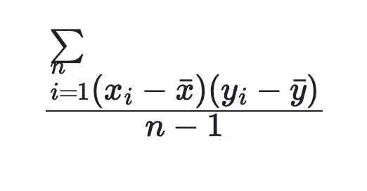

# COVAR_SAMP

## 功能

返回两个随机变量的样本协方差。该函数从 2.5.10 版本开始支持，也可用作窗口函数。

## 语法

```Haskell
COVAR_SAMP(expr1, expr2)
```

## 参数说明

`expr1`: 选取的表达式 1。

`expr2`: 选取的表达式 2。

当表达式为表中一列时，用于计算两列值之间的样本协方差。支持以下数据类型: TINYINT、SMALLINT、INT、BIGINT、LARGEINT、FLOAT、DOUBLE、DECIMAL。

## 返回值说明

返回值为 DOUBLE 类型。计算公式如下，其中 `n` 为该表的行数：



<!--$$
\frac{\sum_{i=1}^{n} (x_i - \bar{x})(y_i - \bar{y})}{n-1}
$$ -->

## 使用说明

* 计算样本协方差时，只有同一行的两列数据都不为 null 时，该行数据才会被统计到最终结果中，否则该行数据会被忽略。

* 当 `n` 为 1 时，返回值为 0。

## 示例

对于以下数据表：

```plaintext
mysql> select * from agg;
+------+-------+-------+
| no   | k     | v     |
+------+-------+-------+
|    1 | 10.00 |  NULL |
|    2 | 10.00 | 11.00 |
|    2 | 20.00 | 22.00 |
|    2 | 25.00 |  NULL |
|    2 | 30.00 | 35.00 |
+------+-------+-------+
```

计算列 `k` 和列 `v` 的样本协方差:

```plaintext
mysql> select no,COVAR_SAMP(k,v) from agg group by no;
+------+--------------------+
| no   | covar_samp(k, v)   |
+------+--------------------+
|    1 |               NULL |
|    2 | 119.99999999999999 |
+------+--------------------+
```
