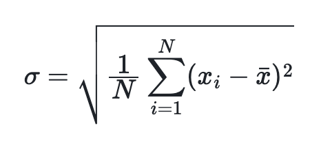

<<<<<<< HEAD
# stddev, stddev_pop

## 功能

返回 `expr` 表达式的总体标准差。
=======
# stddev, stddev_pop, std


返回 `expr` 表达式的总体标准差。从 2.5.10 版本开始，该函数也可以用作窗口函数。
>>>>>>> b42eff7ae3 ([Doc] Add meaning of 0 for variables (#53714))

### 语法

```Haskell
STDDEV(expr)
```

## 参数说明

<<<<<<< HEAD
`epxr`: 被选取的表达式。
=======
`expr`: 被选取的表达式。当表达式为表中一列时，支持以下数据类型: TINYINT、SMALLINT、INT、BIGINT、LARGEINT、FLOAT、DOUBLE、DECIMAL。
>>>>>>> b42eff7ae3 ([Doc] Add meaning of 0 for variables (#53714))

## 返回值说明

返回值为 DOUBLE 类型。计算公式如下，其中 `n` 为该表的行数：



<!--$$
\sigma = \sqrt{\frac{1}{N} \sum_{i=1}^{N} (x_i - \bar{x})^2}
$$ -->

<<<<<<< HEAD
## 示例

```plain text
mysql> SELECT  stddev(lo_quantity), stddev_pop(lo_quantity) from lineorder;
=======

## 示例

```plaintext
mysql> SELECT stddev(lo_quantity), stddev_pop(lo_quantity) from lineorder;
>>>>>>> b42eff7ae3 ([Doc] Add meaning of 0 for variables (#53714))
+---------------------+-------------------------+
| stddev(lo_quantity) | stddev_pop(lo_quantity) |
+---------------------+-------------------------+
|   14.43100708360797 |       14.43100708360797 |
+---------------------+-------------------------+
```

## 相关函数

[stddev_samp](./stddev_samp.md)
