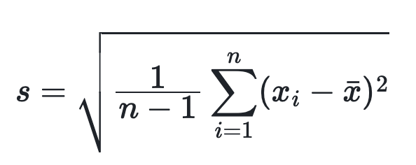

# stddev_samp

## 功能

返回 expr 表达式的样本标准差。

## 语法

```Haskell
STDDEV_SAMP(expr)
```

## 参数说明

`epxr`: 被选取的表达式。

## 返回值说明

返回值为 DOUBLE 类型。计算公式如下，其中 `n` 为该表的行数：



<!--$$
s = \sqrt{\frac{1}{n-1} \sum_{i=1}^{n} (x_i - \bar{x})^2}
$$ -->

## 示例

```plain text
MySQL > select stddev_samp(scan_rows)
from log_statis
group by datetime;
+--------------------------+
| stddev_samp(`scan_rows`) |
+--------------------------+
|        2.372044195280762 |
+--------------------------+
```

## 相关函数

[stddev](./stddev.md)
