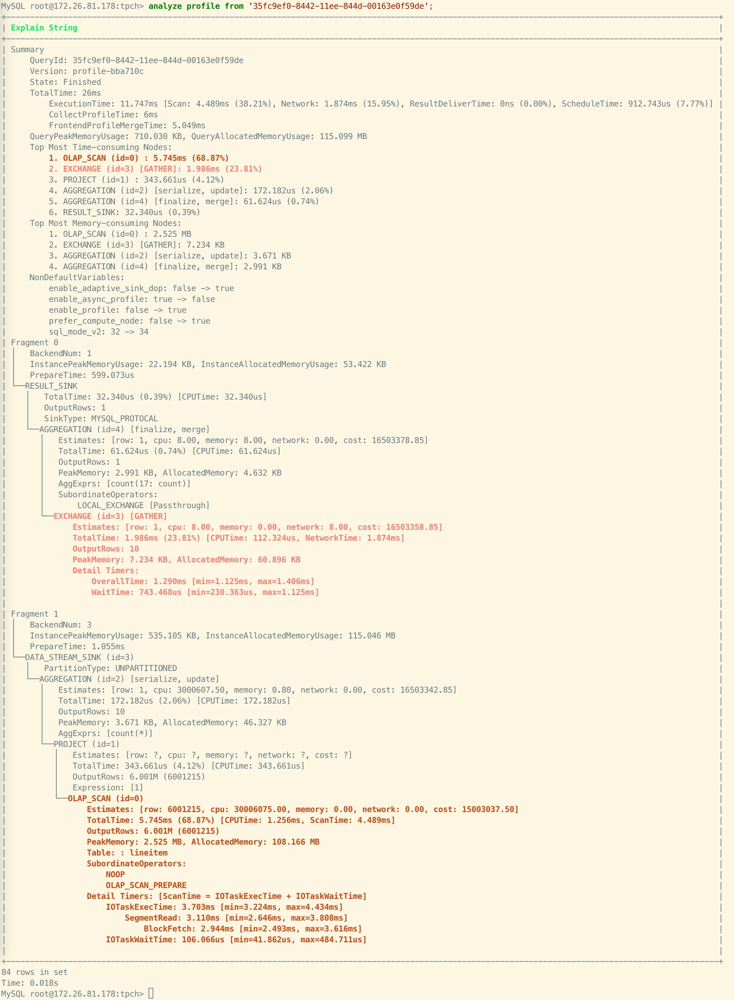

# ANALYZE PROFILE

## 功能

以 Fragment 为单位分析指定 Query Profile，并以树形结构展示。更多信息，参考 [Query Profile 概述](../../../../administration/query_profile_overview.md)。

此功能自 v3.1 起支持。

> **注意**
>
> 该操作需要有指定表的 SELECT 权限。

## 语法

```SQL
ANALYZE PROFILE FROM '<query_id>', [<plan_node_id>[, ...] ]
```

## 参数说明

| **参数**     | **说明**                                                     |
| ------------ | ------------------------------------------------------------ |
| query_id     | 查询 ID。您可以通过 [SHOW PROFILELIST](SHOW_PROFILELIST.md) 获得。              |
| plan_node_id | Query Profile 中的计划节点 ID。您可以指定此参数以查看相应计划节点的详细指标。如果未指定此参数，则仅显示所有计划节点的摘要指标。 |

## 示例

示例一：查询 Query Profile，不指定节点 ID。



示例二：查询 Query Profile，并指定节点 ID 为 `0`。StarRocks 会返回 Node ID 为 `0` 的节点的所有详细指标，并且高亮显示使用占比较高的指标，便于定位问题。


## 相关 SQL

- [SHOW PROFILELIST](SHOW_PROFILELIST.md)
- [EXPLAIN ANALYZE](EXPLAIN_ANALYZE.md)

