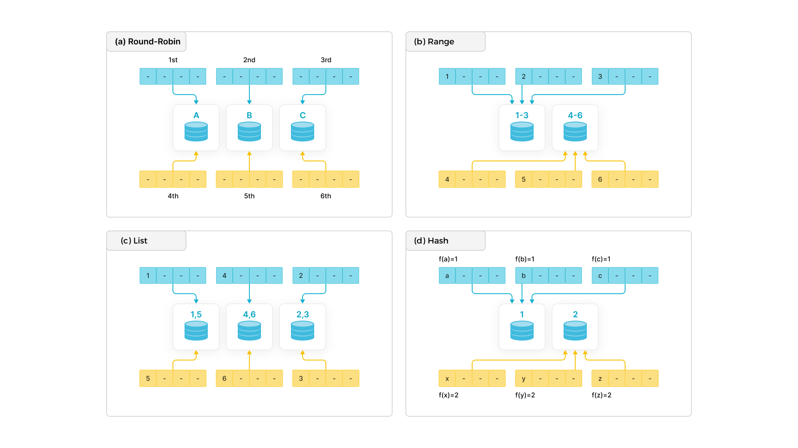

# 数据分布

建表时，您需要通过设置分区和分桶，指定数据分布方式，并且建议您合理设置分区和分桶，实现数据均匀的分布。数据分布是指数据划分为子集，并按一定规则均衡地分布在不同节点上，能够有效裁剪数据扫描量，最大限度地利用集群的并发性能，从而提升查询性能。
> **说明**
>
> 自 2.5.7 版本起，您在建表和新增分区时可以不设置分桶数量 (BUCKETS)。StarRocks 默认自动设置分桶数量，如果自动设置分桶数量后性能未能达到预期，并且您比较熟悉分桶机制，则您也可以[手动设置分桶数量](#确定分桶数量)。

## 数据分布概览

### 常见的数据分布方式

现代分布式数据库中，常见的数据分布方式有如下四种：Round-Robin、Range、List 和 Hash。如下图所示：



- Round-Robin：以轮询的方式把数据逐个放置在相邻节点上。

- Range：按区间进行数据分布。如上图所示，区间 [1-3]、[4-6] 分别对应不同的范围 (Range)。

- List：直接基于离散的各个取值做数据分布，性别、省份等数据就满足这种离散的特性。每个离散值会映射到一个节点上，多个不同的取值可能也会映射到相同节点上。

- Hash：通过哈希函数把数据映射到不同节点上。

为了更灵活地划分数据，除了单独采用上述四种数据分布方式之一以外，您还可以根据具体的业务场景需求组合使用这些数据分布方式。常见的组合方式有 Hash+Hash、Range+Hash、Hash+List。

### StarRocks 的数据分布方式

StarRocks 支持如下两种数据分布方式：

- Hash 数据分布方式：一张表为一个分区，分区按照分桶键和分桶数量进一步进行数据划分。

- Range+Hash 数据分布方式：一张表拆分成多个分区，每个分区按照分桶键和分桶数量进一步进行数据划分。

采用 Hash 分布的建表语句如下，其中分桶键为 `site_id`：

```SQL
CREATE TABLE site_access(
    site_id INT DEFAULT '10',
    city_code SMALLINT,
    user_name VARCHAR(32) DEFAULT '',
    pv BIGINT SUM DEFAULT '0'
)
AGGREGATE KEY(site_id, city_code, user_name)
DISTRIBUTED BY HASH(site_id) BUCKETS 10;
```

采用Range+Hash组合分布的建表语句如下，其中分区键为 `event_day`，分桶键为 `site_id`：

```SQL
CREATE TABLE site_access(
    event_day DATE,
    site_id INT DEFAULT '10',
    city_code VARCHAR(100),
    user_name VARCHAR(32) DEFAULT '',
    pv BIGINT SUM DEFAULT '0'
)
AGGREGATE KEY(event_day, site_id, city_code, user_name)
PARTITION BY RANGE(event_day)
(
    PARTITION p1 VALUES LESS THAN ("2020-01-31"),
    PARTITION p2 VALUES LESS THAN ("2020-02-29"),
    PARTITION p3 VALUES LESS THAN ("2020-03-31")
)
DISTRIBUTED BY HASH(site_id) BUCKETS 10;
```

#### 分区

分区用于将数据划分成不同的区间。分区的主要作用是将一张表按照分区键拆分成不同的管理单元，针对每一个管理单元选择相应的存储策略，比如副本数、分桶数、冷热策略和存储介质等。StarRocks 支持在一个集群内使用多种存储介质，您可以将新数据所在分区放在 SSD 盘上，利用 SSD 优秀的随机读写性能来提高查询性能，将旧数据存放在 SATA 盘上，以节省数据存储的成本。

业务系统中⼀般会选择根据时间进行分区，以优化大量删除过期数据带来的性能问题，同时也方便冷热数据分级存储。

StarRocks 支持动态分区。您可以按需为新数据动态创建分区，同时 StarRocks 会自动删除过期分区，从而确保数据的实效性，实现对分区的生命周期管理（Time to Life，简称 “TTL”），大幅减少运维管理的成本。

StarRocks 还支持手动创建分区和批量创建分区。

分区单位的选择，需要综合考虑数据量、查询特点、数据管理粒度等因素。

实例1: 表单月数据量很小，可以按月分区，相比于按天分区，可以减少元数据数量，从而减少元数据管理和调度的资源消耗。

实例2: 表单月数据量很大，而大部分查询条件精确到天，如果按天分区，可以做有效的分区裁减，减少查询扫描的数据量。

实例3: 数据要求按天过期，可以按天分区。

#### 分桶

分区的下一级是分桶，StarRocks 采⽤ Hash 算法作为分桶算法。在同一分区内，分桶键哈希值相同的数据形成 Tablet，Tablet 以多副本冗余的形式存储，是数据均衡和恢复的最⼩单位。Tablet 的副本由一个单独的本地存储引擎管理，数据导入和查询最终都下沉到所涉及的 Tablet 副本上。

**建表时，必须指定分桶键**。

## 创建和管理分区

### 动态分区

推荐您使用[动态分区](./dynamic_partitioning.md)。您可以按需为新数据动态创建分区，同时 StarRocks 会⾃动删除过期分区，从而确保数据的实效性，实现对分区的⽣命周期管理（Time to Life，简称 “TTL”），⼤幅减少运维管理的成本。

### 手动创建分区

选择合理的分区键可以有效的裁剪扫描的数据量。**目前仅支持分区键的数据类型为日期和整数类型**。在实际业务场景中，一般从数据管理的角度选择分区键，常见的分区键为时间或者区域。

```SQL
CREATE TABLE site_access(
    event_day DATE,
    site_id INT DEFAULT '10',
    city_code VARCHAR(100),
    user_name VARCHAR(32) DEFAULT '',
    pv BIGINT SUM DEFAULT '0'
)
AGGREGATE KEY(event_day, site_id, city_code, user_name)
PARTITION BY RANGE(event_day)
(
    PARTITION p1 VALUES LESS THAN ("2020-01-31"),
    PARTITION p2 VALUES LESS THAN ("2020-02-29"),
    PARTITION p3 VALUES LESS THAN ("2020-03-31")
)
DISTRIBUTED BY HASH(site_id) BUCKETS 10;
```

### 批量创建分区

> StarRocks 1.16 及以后版本支持该功能。

建表时和建表后，支持批量创建分区，通过 START、END 指定批量分区的开始和结束，EVERY 子句指定分区增量值。其中，批量分区包含 START 的值，但是不包含 END 的值。分区的命名规则同动态分区一样。

**建表时批量创建日期分区**

当分区键为日期类型时，建表时通过 START、END 指定批量分区的开始日期和结束日期，EVERY 子句指定分区增量值。并且 EVERY 子句中用 INTERVAL 关键字表示日期间隔，目前仅支持日期间隔的单位为 DAY、WEEK、MONTH、YEAR。

如下示例中，批量分区的开始日期为 `2021-01-01` 和结束日期为 `2021-01-04`，增量值为一天：

```SQL
CREATE TABLE site_access (
    datekey DATE,
    site_id INT,
    city_code SMALLINT,
    user_name VARCHAR(32),
    pv BIGINT DEFAULT '0'
)
ENGINE=olap
DUPLICATE KEY(datekey, site_id, city_code, user_name)
PARTITION BY RANGE (datekey) (
    START ("2021-01-01") END ("2021-01-04") EVERY (INTERVAL 1 DAY)
)
DISTRIBUTED BY HASH(site_id) BUCKETS 10
PROPERTIES (
    "replication_num" = "3" 
);
```

则相当于在建表语句中使用如下 PARTITION BY 子句：

```SQL
PARTITION BY RANGE (datekey) (
    PARTITION p20210101 VALUES [('2021-01-01'), ('2021-01-02')),
    PARTITION p20210102 VALUES [('2021-01-02'), ('2021-01-03')),
    PARTITION p20210103 VALUES [('2021-01-03'), ('2021-01-04'))
)
```

**建表时批量创建不同日期间隔的日期分区**

建表时批量创建日期分区时，支持针对不同的日期分区区间（日期分区区间不能相重合），使用不同的 EVERY 子句指定日期间隔。一个日期分区区间，按照对应 EVERY 子句定义的日期间隔，批量创建分区，例如：

```SQL
CREATE TABLE site_access (
    datekey DATE,
    site_id INT,
    city_code SMALLINT,
    user_name VARCHAR(32),
    pv BIGINT DEFAULT '0'
)
ENGINE=olap
DUPLICATE KEY(datekey, site_id, city_code, user_name)
PARTITION BY RANGE (datekey) (
    START ("2019-01-01") END ("2021-01-01") EVERY (INTERVAL 1 YEAR),
    START ("2021-01-01") END ("2021-05-01") EVERY (INTERVAL 1 MONTH),
    START ("2021-05-01") END ("2021-05-04") EVERY (INTERVAL 1 DAY)
)
DISTRIBUTED BY HASH(site_id) BUCKETS 10
PROPERTIES (
    "replication_num" = "3"
);
```

则相当于在建表语句中使用如下 PARTITION BY 子句：

```SQL
PARTITION BY RANGE (datekey) (
    PARTITION p2019 VALUES [('2019-01-01'), ('2020-01-01')),
    PARTITION p2020 VALUES [('2020-01-01'), ('2021-01-01')),
    PARTITION p202101 VALUES [('2021-01-01'), ('2021-02-01')),
    PARTITION p202102 VALUES [('2021-02-01'), ('2021-03-01')),
    PARTITION p202103 VALUES [('2021-03-01'), ('2021-04-01')),
    PARTITION p202104 VALUES [('2021-04-01'), ('2021-05-01')),
    PARTITION p20210501 VALUES [('2021-05-01'), ('2021-05-02')),
    PARTITION p20210502 VALUES [('2021-05-02'), ('2021-05-03')),
    PARTITION p20210503 VALUES [('2021-05-03'), ('2021-05-04'))
)
```

**建表时批量创建数字分区**

当分区键为整数类型时，建表时通过 START、END 指定批量分区的开始值和结束值，EVERY 子句指定分区增量值。

> 说明：START、END 所指定的分区列的值需要使用英文引号包裹，而 EVERY 子句中的分区增量值不用英文引号包裹。

如下示例中，批量分区的开始值为 `1` 和结束值为 `5`，分区增量值为 `1`：

```SQL
CREATE TABLE site_access (
    datekey INT,
    site_id INT,
    city_code SMALLINT,
    user_name VARCHAR(32),
    pv BIGINT DEFAULT '0'
)
ENGINE=olap
DUPLICATE KEY(datekey, site_id, city_code, user_name)
PARTITION BY RANGE (datekey) (
    START ("1") END ("5") EVERY (1)
)
DISTRIBUTED BY HASH(site_id) BUCKETS 10
PROPERTIES (
    "replication_num" = "3"
);
```

则相当于在建表语句中使用如下 PARTITION BY 子句：

```SQL
PARTITION BY RANGE (datekey) (
    PARTITION p1 VALUES [("1"), ("2")),
    PARTITION p2 VALUES [("2"), ("3")),
    PARTITION p3 VALUES [("3"), ("4")),
    PARTITION p4 VALUES [("4"), ("5"))
)
```

**建表后批量创建分区**

建表后，支持通过ALTER TABLE 语句批量创建分区。相关语法与建表时批量创建分区类似，通过指定 ADD PARTITIONS 关键字，以及 START、END 以及 EVERY 子句来批量创建分区。示例如下：

```SQL
ALTER TABLE site_access 
ADD PARTITIONS START ("2021-01-04") END ("2021-01-06") EVERY (INTERVAL 1 DAY);
```

### 管理分区

#### 增加分区

增加新的分区，用于存储新的数据。新增分区的默认分桶数量和原分区相同。您也可以根据新分区的数据规模调整分桶数量。

如下示例中，在 `site_access` 表添加新的分区，用于存储新月份的数据，并且调整分桶数量为 20：

```SQL
ALTER TABLE site_access
ADD PARTITION p4 VALUES LESS THAN ("2020-04-30")
DISTRIBUTED BY HASH(site_id) BUCKETS 20;
```

#### 删除分区

执行如下语句，删除 `site_access` 表中分区 p1 及数据：

> 说明：分区中的数据不会立即删除，会在 Trash 中保留一段时间（默认为一天）。如果误删分区，可以通过 RECOVER 命令恢复分区及数据。

```SQL
ALTER TABLE site_access
DROP PARTITION p1;
```

#### 恢复分区

执行如下语句，恢复 `site_access` 表中分区 `p1` 及数据：

```SQL
RECOVER PARTITION p1 FROM site_access;
```

#### 查看分区

执行如下语句，查看 `site_access` 表中分区情况：

```SQL
SHOW PARTITIONS FROM site_access;
```

## 设置分桶

### 选择分桶键

对每个分区的数据，StarRocks 会根据分桶键和分桶数量进行哈希分桶。
假设存在列同时满足高基数和经常作为查询条件，则优先选择其为分桶键，进行哈希分桶。
如果不存在这些同时满足两个条件的列，则需要根据查询进行判断。

- 如果查询比较复杂，则建议选择高基数的列为分桶键，保证数据在各个分桶中尽量均衡，提高集群资源利用率。
- 如果查询比较简单，则建议选择经常作为查询条件的列为分桶键，提高查询效率。

并且，如果数据倾斜情况严重，您还可以使用多个列作为数据的分桶键，但是建议不超过 3 个列。

**注意**

- **建表时，如果使用哈希分桶，则必须指定分桶键**。
- 组成分桶键的列仅支持整型、DECIMAL、DATE/DATETIME、CHAR/VARCHAR/STRING 数据类型。
- 分桶键指定后不支持修改。
- 组成分桶键的列，该列的值不能够更新。

还是以上述 Range+Hash 组合分布的建表语句为例：

```SQL
CREATE TABLE site_access(
    event_day DATE,
    site_id INT DEFAULT '10',
    city_code VARCHAR(100),
    user_name VARCHAR(32) DEFAULT '',
    pv BIGINT SUM DEFAULT '0'
)
AGGREGATE KEY(event_day, site_id, city_code, user_name)
PARTITION BY RANGE(event_day)
(
    PARTITION p1 VALUES LESS THAN ("2020-01-31"),
    PARTITION p2 VALUES LESS THAN ("2020-02-29"),
    PARTITION p3 VALUES LESS THAN ("2020-03-31")
)
DISTRIBUTED BY HASH(site_id) BUCKETS 10;
```

如上示例中，`site_access` 表采用 `site_id` 作为分桶键，其原因在于， `site_id` 为高基数列。此外，针对 `site_access` 表的查询请求，基本上都以站点作为查询过滤条件，采用 `site_id` 作为分桶键，还可以在查询时裁剪掉大量无关分桶。如下查询中，10 个分桶中的 9 个分桶被裁减，因而系统只需要扫描 `site_access` 表中 1/10 的数据：

```SQL
select sum(pv)
from site_access
where site_id = 54321;
```

但是如果 `site_id` 分布十分不均匀，大量的访问数据是关于少数网站的（幂律分布，二八规则），那么采用上述分桶方式会造成数据分布出现严重的倾斜，进而导致系统局部的性能瓶颈。此时，您需要适当调整分桶的字段，以将数据打散，避免性能问题。例如，可以采用 `site_id`、`city_code` 组合作为分桶键，将数据划分得更加均匀。相关建表语句如下：

```SQL
CREATE TABLE site_access
(
    site_id INT DEFAULT '10',
    city_code SMALLINT,
    user_name VARCHAR(32) DEFAULT '',
    pv BIGINT SUM DEFAULT '0'
)
AGGREGATE KEY(site_id, city_code, user_name)
DISTRIBUTED BY HASH(site_id,city_code) BUCKETS 10;
```

在实际使用中，您可以依据自身的业务特点选择以上两种分桶方式。采用 `site_id` 的分桶方式对于短查询十分有利，能够减少节点之间的数据交换，提高集群整体性能；采用 `site_id`、`city_code` 的组合分桶方式对于长查询有利，能够利用分布式集群的整体并发性能。

> 说明：
>
> - 短查询是指扫描数据量不大、单机就能完成扫描的查询。
>
> - 长查询是指扫描数据量大、多机并行扫描能显著提升性能的查询。

### 确定分桶数量

在 StarRocks 中，分桶是实际物理文件组织的单元。

- 建表时如何设置分桶数量
  
  - 方式一：自动设置分桶数量

    自 2.5.7 版本起， StarRocks 能够自动设置分桶数量。假设 BE 数量为 X，StarRocks 推断分桶数量的策略如下：
    > 如果需要启用该功能，则您需要执行 `ADMIN SET FRONTEND CONFIG ("enable_auto_tablet_distribution" = "true");` 以开启该 FE 动态参数。

    ```plaintext
    X <= 12  tablet_num = 2X
    X <= 24  tablet_num = 1.5X
    X <= 36 tablet_num = 36
    X > 36  tablet_num = min(X, 48)
    ```

    ```SQL
    CREATE TABLE site_access(
        site_id INT DEFAULT '10',
        city_code SMALLINT,
        user_name VARCHAR(32) DEFAULT '',
        pv BIGINT SUM DEFAULT '0'
    )
    AGGREGATE KEY(site_id, city_code, user_name)
    DISTRIBUTED BY HASH(site_id,city_code); --无需手动设置分桶数量
    ```

    如果需要开启该功能，则您需要确保 FE 动态参数 `enable_auto_tablet_distribution` 为 `true`。
    建表后，您可以执行 [SHOW PARTITIONS](../sql-reference/sql-statements/data-manipulation/SHOW_PARTITIONS.md) 来查看 StarRock 为分区自动设置的分桶数量。

    > 如您的表单个分区原始数据规模预计超过100GB，建议您使用下述方式手动设置分桶数量。

  - 方式二：手动设置分桶数量

    自 2.4 版本起，StarRocks 提供了自适应的 Tablet 并行扫描能力，即一个查询中涉及到的任意一个 Tablet 可能是由多个线程并行地分段扫描，减少了 Tablet 数量对查询能力的限制，从而可以简化对分桶数量的设置。简化后，确定分桶数量方式可以是：首先预估每个分区的数据量，然后按照每 10 GB 原始数据一个 Tablet 计算，从而确定分桶数量。

    > **注意**
    >
    > 您需要设置全局系统变量 `SET GLOBAL enable_tablet_internal_parallel = true;`，以开启并行扫描 Tablet。

- 新增分区时如何设置分桶数量
  > **注意**
  >
  > 不支持修改已创建分区的分桶数量。
  
  - 自动设置分桶数量

      自 2.5.7 版本起，StarRocks 能够自动设置分桶数量。并且 StarRocks 推断新增分区的分桶数量的策略：数据量以最近5个导入的分区中数据量最多的分区来为基准，每 10 GB 原始数据，算一个 Tablet。如果需要启用该功能，则您需要执行 `ADMIN SET FRONTEND CONFIG ("enable_auto_tablet_distribution" = "true");` 以开启该 FE 动态参数。<br />如果 `enable_auto_tablet_distribution` 为 `false`，且您新增分区的时候未指定分桶数量，则新增分区的分桶数量会继承建表时候的分桶数量。

  - 手动设置分桶数量

    您新增分区的时候，也可以手动指定分桶数量。新增分区的分桶数量的计算方式可以参考如上建表时手动设置分桶数量。

    ```SQL
    ALTER TABLE <table_name> ADD PARTITION <partition_name>
    [DISTRIBUTED BY HASH (k1[,k2 ...]) [BUCKETS num]];
    ```

## 最佳实践

对于 StarRocks 而言，分区和分桶的选择是非常关键的。在建表时选择合理的分区键和分桶键，可以有效提高集群整体性能。因此建议在选择分区键和分桶键时，根据业务情况进行调整。

- **数据倾斜**
  
  如果业务场景中单独采用倾斜度大的列做分桶，很大程度会导致访问数据倾斜，那么建议采用多列组合的方式进行数据分桶。

- **高并发**
  
  分区和分桶应该尽量覆盖查询语句所带的条件，这样可以有效减少扫描数据，提高并发。

- **高吞吐**
  
  尽量把数据打散，让集群以更高的并发扫描数据，完成相应计算。

- **元数据管理**

  Tablet 过多会增加 FE/BE 的元数据管理和调度的资源消耗。
