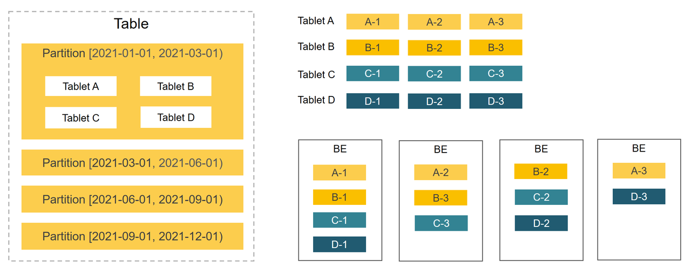

# 表概览

import Replicanum from '../assets/commonMarkdown/replicanum.md'

表是数据存储单元。理解 StarRocks 中的表结构，以及如何设计合理的表结构，有利于优化数据组织，提高查询效率。相比于传统的数据库，StarRocks 会以列的方式存储 JSON、ARRAY 等复杂的半结构化数据，保证高效查询。
本文由浅入深介绍表结构。

## 表结构入门

与其他关系型数据库一样，StarRocks 表在逻辑上由行（Row）和列（Column）构成：

- 行：每一行代表一条记录，包含了一组相关联的数据。
- 列：列定义了一条记录所包含的属性。每一列代表了特定属性的数据，例如，一个员工表可能包含姓名、工号、部门、薪水等列，每一列存储对应的数据，每列数据具有相同的数据类型。所有行的列数相同。

StarRocks 中建表操作简单易用，您只需要在 CREATE TABLE 语句中定义列和列的数据类型，即可创建一张表。

```SQL
CREATE DATABASE example_db;

USE example_db;

CREATE TABLE user_access (
    uid int,
    name varchar(64),
    age int, 
    phone varchar(16),
    last_access datetime,
    credits double
)
DUPLICATE KEY(uid, name);
```

上述建表示例创建了明细表，该表中数据不具有任何约束，相同的数据行可能会重复存在。并且指定明细表中前两列为排序列，构成排序键。数据按排序键排序后存储，有助于查询时的快速索引。 

<Replicanum />

执行 [DESCRIBE](../sql-reference/sql-statements/Utility/DESCRIBE.md) 查看表结构。

```SQL
MySQL [example_db]> DESCRIBE user_access;
+-------------+-------------+------+-------+---------+-------+
| Field       | Type        | Null | Key   | Default | Extra |
+-------------+-------------+------+-------+---------+-------+
| uid         | int         | YES  | true  | NULL    |       |
| name        | varchar(64) | YES  | true  | NULL    |       |
| age         | int         | YES  | false | NULL    |       |
| phone       | varchar(16) | YES  | false | NULL    |       |
| last_access | datetime    | YES  | false | NULL    |       |
| credits     | double      | YES  | false | NULL    |       |
+-------------+-------------+------+-------+---------+-------+
6 rows in set (0.00 sec)
```

执行 [SHOW CREATE TABLE](../sql-reference/sql-statements/data-manipulation/SHOW_CREATE_TABLE.md) 来查看建表语句。

```SQL
MySQL [example_db]> SHOW CREATE TABLE user_access\G
*************************** 1. row ***************************
       Table: user_access
Create Table: CREATE TABLE `user_access` (
  `uid` int(11) NULL COMMENT "",
  `name` varchar(64) NULL COMMENT "",
  `age` int(11) NULL COMMENT "",
  `phone` varchar(16) NULL COMMENT "",
  `last_access` datetime NULL COMMENT "",
  `credits` double NULL COMMENT ""
) ENGINE=OLAP 
DUPLICATE KEY(`uid`, `name`)
DISTRIBUTED BY RANDOM
PROPERTIES (
"replication_num" = "3",
"in_memory" = "false",
"enable_persistent_index" = "false",
"replicated_storage" = "true",
"compression" = "LZ4"
);
1 row in set (0.00 sec)
```

## 全面了解表结构

本节详细介绍 StarRocks 表结构，帮助您深入了解表结构，根据场景设计高效的数据管理结构。

### [表类型](./table_types/table_types.md)

StarRocks 提供四种类型的表，包括明细表、主键表、聚合表和更新表，适用于存储多种业务数据，例如原始数据、实时频繁更新的数据和聚合数据。

- 明细表简单易用，表中数据不具有任何约束，相同的数据行可以重复存在。该表适用于存储不需要约束和预聚合的原始数据，例如日志等。
- 主键表能力强大，具有唯一性非空约束。该表能够在支撑实时更新、部分列更新等场景的同时，保证查询性能，适用于实时查询。
- 聚合表适用于存储预聚合后的数据，可以降低聚合查询时所需扫描和计算的数据量，极大提高聚合查询的效率。
- 更新表适用于实时更新的业务场景，目前已逐渐被主键表取代。

### [数据分布](./Data_distribution.md)

StarRocks 采用分区+分桶的两级数据分布策略，将数据均匀分布各个 BE 节点。查询时能够有效裁剪数据扫描量，最大限度地利用集群的并发性能，从而提升查询性能。



#### 分区

第一层级为分区。表中数据可以根据分区列（通常是时间和日期）分成一个个更小的数据管理单元。查询时，通过分区裁剪，可以减少扫描的数据量，显著优化查询性能。

StarRocks 提供简单易用的分区方式，即表达式分区。此外还提供较灵活的分区方式，即 Range 分区和 List 分区。

#### 分桶

第二层级为分桶。同一个分区中的数据通过分桶，划分成更小的数据管理单元。并且分桶以多副本形式（默认为3）均匀分布在 BE 节点上，保证数据的高可用。

StarRocks 提供两种分桶方式：

- 哈希分桶：根据数据的分桶键值，将数据划分至分桶。选择查询时经常使用的条件列组成分桶键，能有效提高查询效率。
- 随机分桶：随机划分数据至分桶。这种分桶方式更加简单易用。

### [数据类型](../sql-reference/sql-statements/data-types/data-type-list.md)

除了基本的数据类型，如数值、日期和字符串类型，StarRocks 还支持复杂的半结构化数据类型，包括 ARRAY、JSON、MAP、STRUCT。

### [索引](./indexes/indexes_overview.md)

索引是一种特殊的数据结构，相当于数据的目录。查询条件命中索引列时，StarRocks 能够快速定位到满足条件的数据的位置。

StarRocks 提供内置索引，包括前缀索引、Ordinal 索引和 ZoneMap 索引。也支持用户手动创建索引，以提高查询效率，包括 Bitmap 和 Bloom Filter 索引。

### 约束

约束用于确保数据的完整性、一致性和准确性。主键表的 Primary Key 列具有唯一非空约束，聚合表的 Aggregate Key 列和更新表的 Unique Key 列具有唯一约束。 

###  更多特性

除了上述常用的特性之外，您还可以根据业务需求使用更多的特性，设计更加健壮的表结构，例如通过 Bitmap 和 HLL 列来加速去重计数，指定生成列或者自增列来加速部分查询，配置灵活的数据自动降冷策略来降低运维成本，配置 Colocate Join 来加速多表 JOIN 查询。
