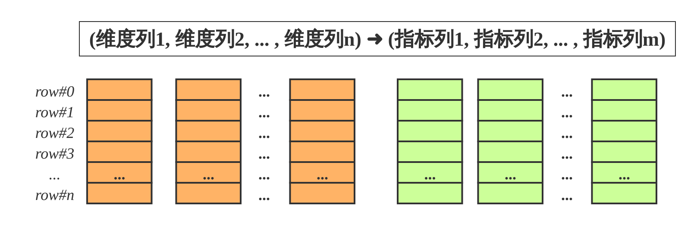
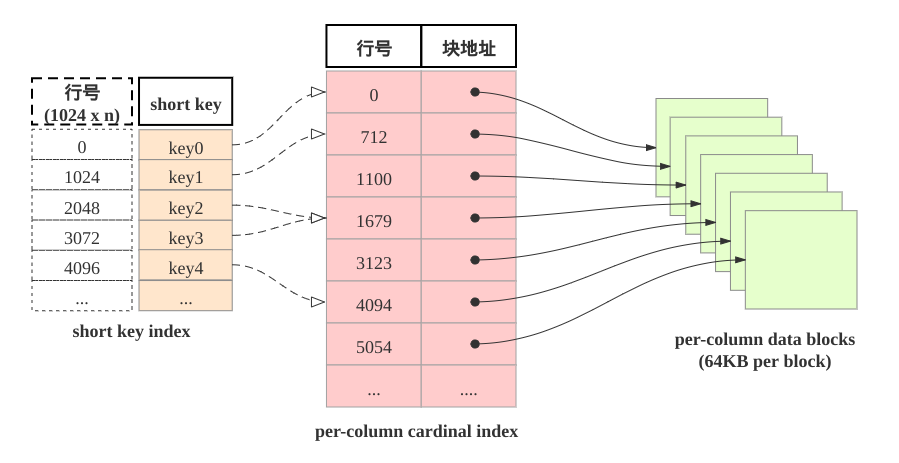

# 理解StarRocks表设计

## 列式存储

StarRocks的表和关系型数据相同, 由行和列构成. 每行数据对应用户一条记录, 每列数据有相同数据类型. 所有数据行的列数相同, 可以动态增删列.  StarRocks中, 一张表的列可以分为维度列(也成为key列)和指标列(value列), 维度列用于分组和排序, 指标列可通过聚合函数SUM, COUNT, MIN, MAX, REPLACE, HLL\_UNION, BITMAP\_UNION等累加起来. 因此, StarRocks的表也可以认为是多维的key到多维指标的映射。

   

在StarRocks中, 表中数据按列存储, 物理上, 一列数据会经过分块编码压缩等操作, 然后持久化于非易失设备, 但在逻辑上, 一列数据可以看成由相同类型的元素构成的数组.  一行数据的所有列在各自的列数组中保持对齐, 即拥有相同的数组下标, 该下标称之为序号或者行号. 该序号是隐式, 不需要存储的, 表中的所有行按照维度列, 做多重排序, 排序后的位置就是该行的行号。

   

查询时, 如果指定了维度列的等值条件或者范围条件, 并且这些条件中维度列可构成表维度列的前缀, 则可以利用数据的有序性, 使用range-scan快速锁定目标行. 例如: 对于表table1: (event\_day, siteid, citycode, username)➜(pv); 当查询条件为event\_day > 2020-09-18 and siteid = 2, 则可以使用范围查找; 如果指定条件为citycode = 4 and username in \["Andy", "Boby", "Christian", "StarRocks"\], 则无法使用范围查找。

 

## 稀疏索引

当范围查找时, 如何快速地找到起始的目标行呢? 答案是shortkey index. 如下图所示: shortkey索引为稀疏索引,

表中数据组织有主要由三部分构成:

1. shortkey index表:  表中数据每1024行, 构成一个逻辑block. 每个逻辑block在shortkey index表中存储一项索引, 内容为表的维度列的前缀, 并且不超过36字节.  shortkey index为稀疏索引, 用数据行的维度列的前缀查找索引表, 可以确定该行数据所在逻辑块的起始行号。
2. Per-column data block: 表中每一列数据按64KB分块存储,  数据块作为一个单位单独编码压缩, 也作为IO单位, 整体写回设备或者读出。
3. Per-column cardinal index:  表中的每列数据有各自的行号索引表,  列的数据块和行号索引项一一对应, 索引项由数据块的起始行号和数据块的位置和长度信息构成, 用数据行的行号查找行号索引表, 可以获取包含该行号的数据块所在位置, 读取目标数据块后, 可以进一步查找数据。

由此可见, 查找维度列的前缀的查找过程为:  先查找shortkey index, 获得逻辑块的起始行号, 查找维度列的行号索引, 获得目标列的数据块, 读取数据块, 然后解压解码, 从数据块中找到维度列前缀对应的数据项。

## 加速数据处理

1. 预先聚合:  StarRocks支持聚合模型, 维度列取值相同数据行可合并一行, 合并后数据行的维度列取值不变, 指标列的取值为这些数据行的聚合结果, 用户需要给指标列指定聚合函数.  通过预先聚合, 可以加速聚合操作。
2. 分区分桶:  事实上StarRocks的表被划分成tablet, 每个tablet多副本冗余存储在BE上, BE和tablet的数量可以根据计算资源和数据规模而弹性伸缩. 查询时, 多台BE可并行地查找tablet快速获取数据. 此外, tablet的副本可复制和迁移, 增强了数据的可靠性, 避免了数据倾斜. 总之, 分区分桶保证了数据访问的高效性和稳定性。
3. RollUp表索引: shortkey index可加速数据查找, 然后shortkey index依赖维度列排列次序. 如果使用非前缀的维度列构造查找谓词, 则无法使用shortkey index. 用户可以为数据表创建若干RollUp表索引, RollUp表索引的数据组织和存储和数据表相同, 但RollUp表拥有自身的shortkey index. 用户创建RollUp表索引时, 可选择聚合的粒度, 列的数量, 维度列的次序; 使频繁使用的查询条件能够命中相应的RollUp表索引。
4. 列级别的索引技术:  Bloomfilter可快速判断数据块中不含所查找值, ZoneMap通过数据范围快速过滤待查找值, Bitmap索引可快速计算出枚举类型的列满足一定条件的行。

表的设计详细介绍, 请参考下文。
