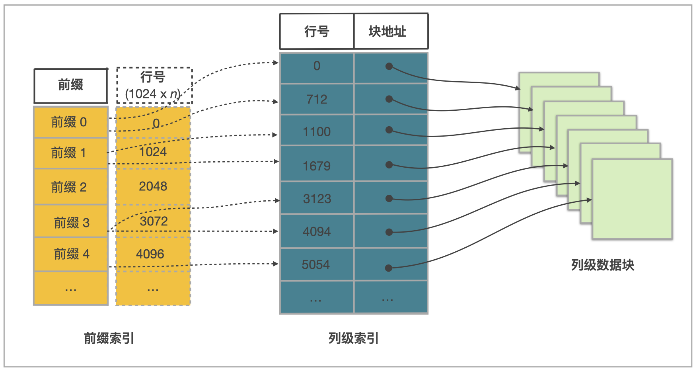

# 理解 StarRocks 表设计

## 列式存储

StarRocks 中的表由行和列构成。每行数据对应用户一条记录，每列数据具有相同的数据类型。所有数据行的列数相同，可以动态增删列。在 StarRocks 中，一张表的列可以分为维度列（也称为 Key 列）和指标列（也称为 Value 列）。维度列用于分组和排序，指标列的值可以通过聚合函数 [sum](../sql-reference/sql-functions/aggregate-functions/sum.md)、[count](../sql-reference/sql-functions/aggregate-functions/count.md)、[min](../sql-reference/sql-functions/aggregate-functions/min.md)、[max](../sql-reference/sql-functions/aggregate-functions/max.md)、[hll_union_agg](../sql-reference/sql-functions/aggregate-functions/hll_union_agg.md) 和 [bitmap_union](../sql-reference/sql-functions/bitmap-functions/bitmap_union.md) 等累加起来。

在 StarRocks 中，表数据按列存储。物理上，一列数据会经过分块编码、压缩等操作，然后持久化存储到非易失设备上。但在逻辑上，一列数据可以看成是由相同类型的元素构成的一个数组。 一行数据的所有列值在各自的数组中按照列顺序排列，即拥有相同的数组下标。数组下标是隐式的，不需要存储。表中所有的行按照维度列，做多重排序，排序后的位置就是该行的行号。

查询时，如果指定了维度列上的等值条件或者范围条件、并且这些条件中的维度列可以构成表的维度列前缀，则可以利用数据的有序性，使用二分查找法快速锁定目标行。例如，表 `table1` 包含 `event_day`、`siteid`、`citycode` 和 `username` 四列，其中 `event_day` 和 `siteid` 是维度列。如果查询条件为 `event_day = 2020-09-18` 和 `siteid = 2`，因为 `event_day` 和 `siteid` 可以构成维度列前缀，因此可以使用二分查找法，只需要处理指定范围内的数据；如果查询条件为 `citycode = 4` 和 `username = Andy`，因为 `citycode` 和 `username` 不能构成维度列前缀，因此无法使用二分查找法，必须处理整表的数据。

## 索引

StarRocks 通过前缀索引 (Prefix Index) 和列级索引，能够快速找到目标行所在数据块的起始行号。

StarRocks 表设计原理如下图所示。

一张表中的数据组织主要由三部分构成：

- 前缀索引

  表中每 1024 行数据构成一个逻辑数据块 (Data Block)。每个逻辑数据块在前缀索引表中存储一个索引项，索引项的内容为数据块中第一行数据的维度列所构成的前缀，长度不超过 36 字节。前缀索引是一种稀疏索引。使用表中某行数据的维度列所构成的前缀查找前缀索引表，可以确定该行数据所在逻辑数据块的起始行号。

- 列级数据块

<<<<<<< HEAD
  表中每列数据都按 64 KB 分块存储。数据块作为一个单位单独编码、压缩，也作为 I/O 单位，整体写回设备或者读出。
=======
执行 [DESCRIBE](../sql-reference/sql-statements/table_bucket_part_index/DESCRIBE.md) 查看表结构。
>>>>>>> e06217c368 ([Doc] Ref docs (#50111))

- 列级索引

<<<<<<< HEAD
  表中每列数据都有一个独立的行号索引。行号索引表中，该列的数据块和行号一一对应。每个行号索引项由对应数据块的起始行号、位置和长度信息构成。用某行数据的行号查找行号索引表，可以获取包含该行号对应的数据块所在的位置，读取目标数据块后，可以进一步查找数据。
=======
执行 [SHOW CREATE TABLE](../sql-reference/sql-statements/table_bucket_part_index/SHOW_CREATE_TABLE.md) 来查看建表语句。
>>>>>>> e06217c368 ([Doc] Ref docs (#50111))

由此可见，通过某行数据的维度列所构成的前缀查找该行数据的过程包含以下五个步骤：

1. 先查找前缀索引表，获得逻辑数据块的起始行号。
2. 查找维度列的行号索引，定位到维度列的数据块。
3. 读取数据块。
4. 解压、解码数据块。
5. 从数据块中找到维度列前缀对应的数据项。

## 加速处理

StarRocks 通过如下机制实现数据的加速处理：

### 预先聚合

StarRocks 支持聚合模型，维度列取值相同的数据行可合并一行。合并后，数据行的维度列取值不变，指标列的取值为这些数据行的聚合结果。您需要给指标列指定聚合函数。通过预先聚合，可以加速聚合操作。

### 分区分桶

StarRocks 中，表被划分成多个 Tablet，每个 Tablet 多副本冗余存储在 BE 上。BE 和 Tablet 的数量可以根据计算资源和数据规模的变化而弹性伸缩。查询时，多台 BE 可以并行地查找 Tablet，从而快速获取数据。此外，Tablet 的副本可以复制和迁移，从而增强数据可靠性，并避免数据倾斜。总之，分区分桶有效保证了数据访问的高效性和稳定性。

### 物化视图

前缀索引可以加速数据查找，但是前缀索引依赖维度列的排列次序。如果使用非前缀的维度列构造查找谓词，则无法使用前缀索引。您可以为数据表创建物化视图。物化视图的数据组织和存储与数据表相同，但物化视图拥有自己的前缀索引。在为物化视图创建索引时，可指定聚合的粒度、列的数量和维度列的次序，使频繁使用的查询条件能够命中相应的物化视图索引。

### 列级索引

StarRocks 支持布隆过滤器 (Bloom Filter)、ZoneMap 索引和 位图 (Bitmap) 索引等列级别的索引技术：

- 布隆过滤器有助于快速判断数据块中不含所查找的值。

- ZoneMap 索引有助于通过数据范围快速过滤出待查找的值。

<<<<<<< HEAD
- 位图索引有助于快速计算出枚举类型的列满足一定条件的行。
=======
StarRocks 提供两种分桶方式：

- 哈希分桶：根据数据的分桶键值，将数据划分至分桶。选择查询时经常使用的条件列组成分桶键，能有效提高查询效率。
- 随机分桶：随机划分数据至分桶。这种分桶方式更加简单易用。

### [数据类型](../sql-reference/data-types/README.md)

除了基本的数据类型，如数值、日期和字符串类型，StarRocks 还支持复杂的半结构化数据类型，包括 ARRAY、JSON、MAP、STRUCT。

### [索引](./indexes/indexes_overview.md)

索引是一种特殊的数据结构，相当于数据的目录。查询条件命中索引列时，StarRocks 能够快速定位到满足条件的数据的位置。

StarRocks 提供内置索引，包括前缀索引、Ordinal 索引和 ZoneMap 索引。也支持用户手动创建索引，以提高查询效率，包括 Bitmap 和 Bloom Filter 索引。

### 约束

约束用于确保数据的完整性、一致性和准确性。主键表的 Primary Key 列具有唯一非空约束，聚合表的 Aggregate Key 列和更新表的 Unique Key 列具有唯一约束。 

### 临时表

在处理数据时，您可能需要保存中间计算结果以便后续复用。先前版本中，StarRocks 仅支持在单个查询内利用 CTE（公用表表达式）来定义临时计算结果。然而，CTE 仅是逻辑概念，不会在物理上存储计算结果，且无法在不同查询间共享，存在一定局限性。如果您选择自行创建表来保存中间结果，需要自行维护表的生命周期，使用成本较高。

为了解决上述问题，StarRocks 在 v3.3.1 中引入了临时表。临时表允许您将临时数据暂存在表中（例如 ETL 计算的中间结果），其生命周期与 Session 绑定，并由 StarRocks 管理。Session 结束时，临时表会被自动清除。临时表仅在当前 Session 内可见，不同的 Session 内可以创建同名的临时表。

#### 使用临时表

您可以在以下 SQL 语句中添加 `TEMPORARY` 关键字创建或删除临时表：

- [CREATE TABLE](../sql-reference/sql-statements/table_bucket_part_index/CREATE_TABLE.md)
- [CREATE TABLE AS SELECT](../sql-reference/sql-statements/table_bucket_part_index/CREATE_TABLE_AS_SELECT.md)
- [CREATE TABLE LIKE](../sql-reference/sql-statements/table_bucket_part_index/CREATE_TABLE_LIKE.md)
- [DROP TABLE](../sql-reference/sql-statements/table_bucket_part_index/DROP_TABLE.md)

:::note

与其他类型的内表类似，临时表必须在属于在 Default Catalog 内的特定 Database 下创建。但由于临时表基于 Session，因此命名时不受唯一性约束。您可以在不同 Session 中创建同名临时表，或创建与其他内表同名的临时表。

如果同一 Database 中同时存在同名的临时表和非临时表，临时表具有最高访问优先级。在该 Session 内，所有针对同名表的查询和操作仅对临时表生效。

:::

#### 限制

临时表的使用方式与普通内表基本相同，但存在一些限制和差异：

- 临时表必须创建在 Default Catalog 中。
- 不支持设置 Colocate Group，若建表时显式指定了 `colocate_with` 属性，该属性将被忽略。
- 建表时 `ENGINE` 必须指定为 `olap`。
- 不支持 ALTER TABLE 语句。
- 不支持基于临时表创建视图和物化视图。
- 不支持 EXPORT 语句导出。
- 不支持 SELECT INTO OUTFILE 语句导出。
- 不支持基于临时表通过 SUBMIT TASK 语句提交异步任务。

###  更多特性

除了上述常用的特性之外，您还可以根据业务需求使用更多的特性，设计更加健壮的表结构，例如通过 Bitmap 和 HLL 列来加速去重计数，指定生成列或者自增列来加速部分查询，配置灵活的数据自动降冷策略来降低运维成本，配置 Colocate Join 来加速多表 JOIN 查询。
>>>>>>> e06217c368 ([Doc] Ref docs (#50111))
