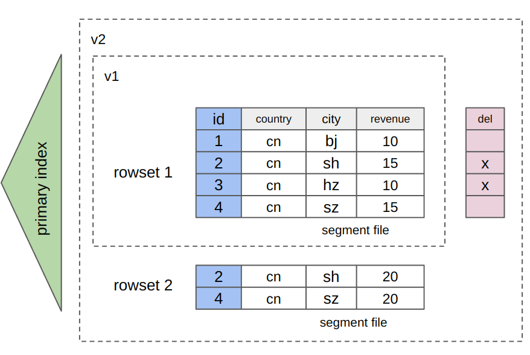

# 行列混存表

StarRocks 属于 OLAP 数据库，原先数据是按列存储的方式，能够提高复杂查询（例如聚合查询）的性能。自 3.2.3 开始，StarRocks 还支持行列混存的表存储格式，能够支撑基于主键的高并发、低延时点查，以及数据部分列更新等场景，同时还保留了原有列存的高效分析能力。此外，行列混存表还支持[预准备语句](../sql-reference/sql-statements/prepared_statement.md)，能够提高查询的性能和安全性。

## 列存和行列混存对比

| **表存储格式** | **存储方式**                                                 | **适用场景**                                                 |
| -------------- | ------------------------------------------------------------ | ------------------------------------------------------------ |
| 行列混存       | 数据同时按照列和行存储。简单来说，行列混存表会额外加一个隐藏的二进制类型的列 `__row`，写入数据至表的同时还会将一行数据所有 value 列编码后的值写入列 `__row`（如下所示）。由于数据同时按照列和行存储，因此会带来额外的存储成本。 | <ul><li>适用于主键点查和部分列更新的场景，能大大降低随机 IO 和读写放大。</li><ul><li>点查（基于主键的简单查询，扫描和返回数据量小）。</li><li>表的字段个数比较少，并且通常会查询数据行的大部分字段或者整行数据的信息。</li><li>部分列更新。</li><li>行列混存表和预准备语句同时使用，能够通过节省解析 SQL 语句的开销从而提高查询性能，并且还能防止 SQL 注入攻击。</li></ul><li>同时也适用于复杂数据分析。</li></ul> |
| 列存           | 按列存储数据。 | <ul><li>针对海量数据进行复杂或者即席查询。 </li><li>表的字段比较多（比如大宽表），但查询的字段不多。</li></ul> |

## 基本操作

### 创建行列混存表

建表时在 `PROPERTIES` 中配置 `"STORE_TYPE" = "column_with_row"`。

:::note

- 必须为主键表。
- `__row` 列的长度不能超过 1 MB。
- 不支持列的数据类型为 BITMAP、JSON、ARRAY、MAP、STRUCT。
- 表中除了主键列外必须包含更多的列。

:::

```SQL
CREATE TABLE users (
  id bigint not null,
  country string,
  city string,
  revenue bigint
)
PRIMARY KEY (id)
DISTRIBUTED BY HASH(id)
PROPERTIES ("storage_type" = "column_with_row");
```

### 增删改数据

和列存表一样，您可以通过数据导入和 DML 语句向行列混存表中增加、删除和修改数据。本小节使用 DML 语句和上述行列混存表进行演示。

1. 插入数据。

   ```SQL
   INSERT INTO users (id, country, city, revenue)
   VALUES 
   (1, 'USA', 'New York', 5000),
   (2, 'UK', 'London', 4500),
   (3, 'France', 'Paris', 6000),
   (4, 'Germany', 'Berlin', 4000),
   (5, 'Japan', 'Tokyo', 7000),
   (6, 'Australia', 'Sydney', 7500);
   ```

2. 删除一行数据。

   ```SQL
   DELETE FROM users WHERE id = 6;
   ```

3. 修改一行数据。

   ```SQL
   UPDATE users SET revenue = 6500 WHERE id = 4;
   ```

### 查询数据

这里以点查为例。点查走短路径，即直接查询按行存储的数据，可以提高查询性能。

依然使用上述行列混存表进行演示。该表经过上述的建表和数据变更操作，其包含的数据应该为：

```SQL
MySQL [example_db]> SELECT * FROM users ORDER BY id;
+------+---------+----------+---------+
| id   | country | city     | revenue |
+------+---------+----------+---------+
|    1 | USA     | New York |    5000 |
|    2 | UK      | London   |    4500 |
|    3 | France  | Paris    |    6000 |
|    4 | Germany | Berlin   |    6500 |
|    5 | Japan   | Tokyo    |    7000 |
+------+---------+----------+---------+
5 rows in set (0.03 sec)
```

1. 确保系统已经开启短路径查询。短路径查询开启后，满足条件（用于评估是否为点查）的查询会走短路径，直接查询按行存储的数据。

   ```SQL
   SHOW VARIABLES LIKE '%enable_short_circuit%';
   ```

   如果短路径查询未开启，可以执行命令 `SET enable_short_circuit = true;`， 设置变量 [`enable_short_circuit`](../reference/System_variable.md#enable_short_circuit323-及以后) 为 `true`。

2. 查询数据。如果查询满足本条件：WHERE 子句的条件列必须包含所有主键列，并且运算符为  `=` 或者 `IN`，该查询才会走短路径。

   :::note

   WHERE 子句的条件列在包含所有主键列的基础上，还可以包含其他列。

   :::

   ```SQL
   SELECT * FROM users WHERE id=1;
   ```

   您可以通过查看查询规划来确认查询是否走短路径。如果查询规划中包括 `Short Circuit Scan: true`，则代表查询走的是短路径。

   ```SQL
   MySQL [example_db]> EXPLAIN SELECT * FROM users WHERE id=1;
   +---------------------------------------------------------+
   | Explain String                                          |
   +---------------------------------------------------------+
   | PLAN FRAGMENT 0                                         |
   |  OUTPUT EXPRS:1: id | 2: country | 3: city | 4: revenue |
   |   PARTITION: RANDOM                                     |
   |                                                         |
   |   RESULT SINK                                           |
   |                                                         |
   |   0:OlapScanNode                                        |
   |      TABLE: users                                       |
   |      PREAGGREGATION: OFF. Reason: null                  |
   |      PREDICATES: 1: id = 1                              |
   |      partitions=1/1                                     |
   |      rollup: users                                      |
   |      tabletRatio=1/6                                    |
   |      tabletList=10184                                   |
   |      cardinality=-1                                     |
   |      avgRowSize=0.0                                     |
   |      Short Circuit Scan: true                           | -- 短路径查询生效
   +---------------------------------------------------------+
   17 rows in set (0.00 sec)
   ```

### 使用预准备语句

您可以使用[预准备语句](../sql-reference/sql-statements/prepared_statement.md#使用预准备语句)来查询行列混存表的数据。例如：

```SQL
-- 准备语句以供执行。
PREPARE select_all_stmt FROM 'SELECT * FROM users';
PREPARE select_by_id_stmt FROM 'SELECT * FROM users WHERE id = ?';

-- 声明语句中的变量。
SET @id1 = 1, @id2 = 2;

-- 使用已声明的变量来执行语句。
-- 分别查询 ID 为 1 和 2 的数据
EXECUTE select_by_id_stmt USING @id1;
EXECUTE select_by_id_stmt USING @id2;
```

## 限制

- 行列混存表暂不支持 [ALTER TABLE](../sql-reference/sql-statements/data-definition/ALTER_TABLE.md)。
- 短路径查询目前仅适合定期批量导入后纯查询的场景。因为目前短路径查询和写流程中的 apply 步骤互斥访问索引，所以写操作可能会堵塞短路径查询，导致写入时会影响点查的响应时间。
- 行列混存表可能会大幅增加存储空间的占用。因为数据会按行和列格式存储两份，并且按行存储压缩比可能不如按列存储高。
- 行列混存表会增加数据导入耗时和资源占用。
- 如果业务场景中有在线服务的需求，行列混存表可以作为一种可行的解决方案，但其性能可能无法与成熟 OLTP 数据库竞争。
- 行列混存表不支持列模式部分更新等依赖按列存储的特性。
- 仅适用于主键表。