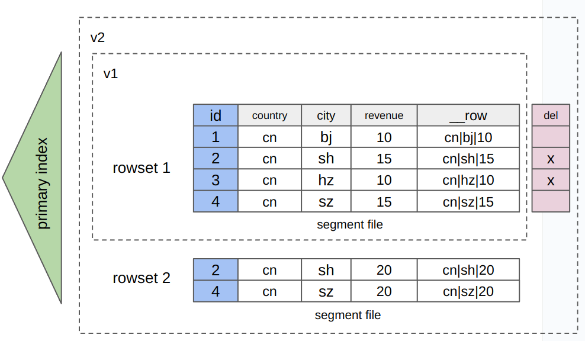

import Beta from '../_assets/commonMarkdown/_beta.mdx'

# 行列混存

<Beta />

作为一个OLAP数据库，StarRocks最初使用列式存储来增强复杂查询的性能，例如聚合查询。从v3.2.3开始，StarRocks也支持将数据存储在行列混存中，即数据以逐行和逐列的方式存储。这种行列混存非常适合于基于主键的高并发、低延迟点查询和部分列更新等场景，同时提供与列式存储相当的高效分析能力。此外，行列混存支持[prepared statements](../sql-reference/sql-statements/prepared_statement.md)，这提高了查询性能和安全性。

## 列式存储与行列混存的比较

**行列混存**

- 存储方式：数据以逐行和逐列的方式存储。简单来说，使用行列混存的表包含一个额外的、隐藏的二进制类型列`__row`。当数据写入表时，每行涉及的值列的所有值都会被编码并写入`__row`列（如下图所示）。由于数据以逐行和逐列的方式存储，会产生额外的存储成本。

   

- 场景：支持逐行和逐列存储的用户场景，但会产生额外的存储成本。<ul><li>逐行存储的用户场景：</li><ul><li>基于主键的高并发点查询。</li><li>查询由少量字段组成的表中的大多数字段。</li><li>部分列更新（更具体地说，需要更新多个列和少量数据行）</li></ul><li>逐列存储的用户场景：复杂数据分析。</li></ul>

**列式存储**

- 存储方式：数据以逐列的方式存储。

  

- 场景：复杂数据分析。<ul><li>对海量数据集进行复杂查询和分析，例如聚合分析和多表连接查询。</li><li>表由许多字段组成（如宽表），但对这些表的查询仅涉及少数列。</li></ul>

## 基本用法

### 创建使用行列混存的表

1. 启用FE配置项`enable_experimental_rowstore`。

   ```SQL
   ADMIN SET FRONTEND CONFIG ("enable_experimental_rowstore" = "true");
   ```

2. 在创建表时在`PROPERTIES`中指定`"STORE_TYPE" = "column_with_row"`。

:::note

- 表必须是主键表。
- `__row`列的长度不能超过1 MB。
- 从v3.2.4开始，StarRocks扩展支持以下列类型：BITMAP, HLL, JSON, ARRAY, MAP, 和 STRUCT。

:::

```SQL
CREATE TABLE users (
  id bigint not null,
  country string,
  city string,
  revenue bigint
)
PRIMARY KEY (id)
DISTRIBUTED by HASH (id)
PROPERTIES ("store_type" = "column_with_row");
```

### 插入、删除和更新数据

与使用列式存储的表类似，您可以通过数据导入和DML语句在使用行列混存的表上插入、删除和更新数据。本节演示如何在上述使用行列混存的表上运行DML语句。

1. 插入一行数据。

   1. ```SQL
      INSERT INTO users (id, country, city, revenue)
      VALUES 
        (1, 'USA', 'New York', 5000),
        (2, 'UK', 'London', 4500),
        (3, 'France', 'Paris', 6000),
        (4, 'Germany', 'Berlin', 4000),
        (5, 'Japan', 'Tokyo', 7000),
        (6, 'Australia', 'Sydney', 7500);
      ```

2. 删除一行数据。

   ```SQL
   DELETE FROM users WHERE id = 6;
   ```

3. 更新一行数据。

   ```SQL
   UPDATE users SET revenue = 6500 WHERE id = 4;
   ```

### 查询数据

本节以点查询为例。点查询采用短路，直接查询行存储中的数据，可以提高查询性能。

以下示例仍然使用上述使用行列混存的表。在上述表创建和数据修改操作之后，表存储的数据如下：

```SQL
MySQL [example_db]> SELECT * FROM users ORDER BY id;
+------+---------+----------+---------+
| id   | country | city     | revenue |
+------+---------+----------+---------+
|    1 | USA     | New York |    5000 |
|    2 | UK      | London   |    4500 |
|    3 | France  | Paris    |    6000 |
|    4 | Germany | Berlin   |    6500 |
|    5 | Japan   | Tokyo    |    7000 |
+------+---------+----------+---------+
5 rows in set (0.03 sec)
```

1. 确保系统启用了查询短路。一旦启用查询短路，符合特定条件的查询（用于评估查询是否为点查询）将采用短路扫描行存储中的数据。

   ```SQL
   SHOW VARIABLES LIKE '%enable_short_circuit%';
   ```

   如果查询短路未启用，运行`SET enable_short_circuit = true;`命令将变量[`enable_short_circuit`](../sql-reference/System_variable.md)设置为`true`。

2. 查询数据。如果查询符合WHERE子句中的条件列包含所有主键列，并且WHERE子句中的操作符为`=`或`IN`的条件，查询将采用快捷方式。

   :::note
   WHERE子句中的条件列可以包含除所有主键列之外的其他列。
   :::

   ```SQL
   SELECT * FROM users WHERE id=1;
   ```

3. 检查查询计划以验证查询是否可以使用短路。如果查询计划中包含`Short Circuit Scan: true`，则查询可以采用短路。

      ```SQL
      MySQL [example_db]> EXPLAIN SELECT * FROM users WHERE id=1;
      +---------------------------------------------------------+
      | Explain String                                          |
      +---------------------------------------------------------+
      | PLAN FRAGMENT 0                                         |
      |  OUTPUT EXPRS:1: id | 2: country | 3: city | 4: revenue |
      |   PARTITION: RANDOM                                     |
      |                                                         |
      |   RESULT SINK                                           |
      |                                                         |
      |   0:OlapScanNode                                        |
      |      TABLE: users                                       |
      |      PREAGGREGATION: OFF. Reason: null                  |
      |      PREDICATES: 1: id = 1                              |
      |      partitions=1/1                                     |
      |      rollup: users                                      |
      |      tabletRatio=1/6                                    |
      |      tabletList=10184                                   |
      |      cardinality=-1                                     |
      |      avgRowSize=0.0                                     |
      |      Short Circuit Scan: true                           | -- 查询可以使用快捷方式。
      +---------------------------------------------------------+
      17 rows in set (0.00 sec)
      ```

### 使用prepared statements

您可以使用[prepared statements](../sql-reference/sql-statements/prepared_statement.md#use-prepared-statements)查询使用行列混存的表中的数据。

```SQL
-- 准备要执行的语句。
PREPARE select_all_stmt FROM 'SELECT * FROM users';
PREPARE select_by_id_stmt FROM 'SELECT * FROM users WHERE id = ?';

-- 在语句中声明变量。
SET @id1 = 1, @id2 = 2;

-- 使用声明的变量执行语句。
-- 分别查询ID为1或2的数据。
EXECUTE select_by_id_stmt USING @id1;
EXECUTE select_by_id_stmt USING @id2;
```

## 限制

- 目前，StarRocks存算分离集群不支持行列混存。
- 从v3.2.4开始，可以使用[ALTER TABLE](../sql-reference/sql-statements/table_bucket_part_index/ALTER_TABLE.md)对使用行列混存的表进行修改。
- 查询短路目前仅适用于计划批量数据导入后的查询。因为当查询短路发生在数据写入过程的应用阶段时，可能会导致索引互斥，数据写入可能会阻塞查询短路，影响数据写入期间点查询的响应时间。
- 行列混存可能显著增加存储消耗。这是因为数据同时以行和列格式存储，并且行存储的数据压缩率可能不如列存储高。
- 行列混存可能增加数据导入过程中的时间和资源消耗。
- 使用行列混存的表可以成为在线服务的可行解决方案，但这种类型表的性能可能无法与成熟的OLTP数据库竞争。
- 使用行列混存的表不支持依赖于列式存储的功能，例如列模式下的部分更新。
- 使用行列混存的表必须是主键表。