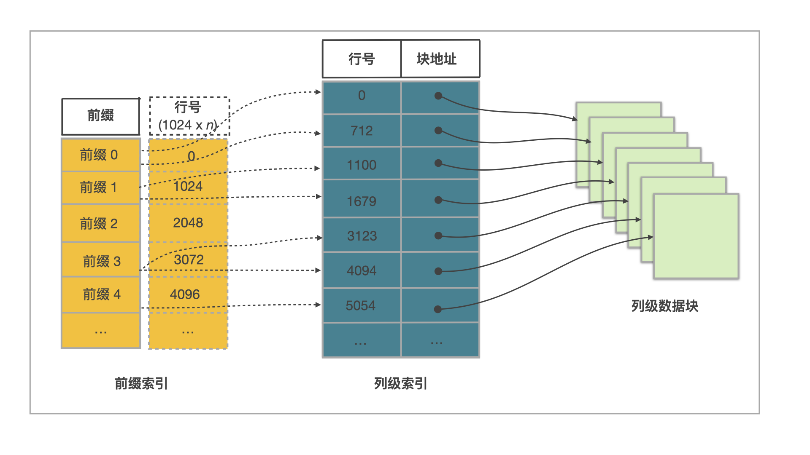

# 索引

索引有助于快速定位到满足查询条件的数据。具体来说，如果表中基于一些列构建了索引，那么查询时如果能用上这些索引，就不需要扫描全表，只需要读取部分数据，就能快速定位到满足条件的数据的位置，从而提高查询效率。StarRocks 提供了丰富的索引类型，主要分为以下两类：

- StarRocks 自动创建的索引，称为内置索引，包括前缀索引、Ordinal 索引、ZoneMap 索引。
- StarRocks 同时也支持用户手动创建索引，包括 Bitmap 索引和 Bloom filter 索引。

## 内置索引

### 前缀索引

#### 功能简介

建表时指定一个或多个列构成排序键 (Sort Key)。表中的数据行会根据排序键进行排序以后再落入磁盘存储。

**并且数据写入的过程中会自动生成前缀索引。数据按照指定的排序键排序后，每写入 1024 行数据构成一个逻辑数据块（Data Block），在前缀索引表中存储一个索引项，内容为该逻辑数据块中第一行数据的排序列组成的前缀。**

通过这样两层的排序结构，查询时就可以使用二分查找快速跳过不符合条件的数据。

:::tip

前缀索引是一种稀疏索引，其大小至少会比数据量小 1024 倍，因此一般可以全量缓存在内存中，加速查询性能。

:::

#### 使用说明

对于明细表，排序列通过 `DUPLICATE KEY` 指定。对于聚合表和更新表，排序列和约束列耦合，通过 `AGGREGATE KEY` 和 `UNIQUE KEY` 中指定。而自 3.0 版本起，主键表解耦了排序列和主键列，提供更加灵活的表能力，排序列通过 `ORDER BY` 指定，而主键列通过 `PRIMARY KEY` 指定。
下文以明细表为例，说明建表时如何指定排序列，以及其前缀索引的组成。

创建明细表，在 `DUPLICATE KEY` 中指定排序列为 `uid` 和 `name`。

```SQL
CREATE TABLE user_access (
    uid int,
    name varchar(64),
    age int, 
    phone varchar(16),
    last_access datetime,
    credits double
)
DUPLICATE KEY(uid, name);
```

:::note

建表后，对于明细表、聚合表和更新表，可以通过 `DESCRIBE <table_name>;` 查看排序列，返回结果中 Key 字段显示 `true` 的列为排序列。对于主键表，建表后可以通过 `SHOW CREATE TABLE  <table_name>;` 在返回结果中的 ORDER BY 子句中查看指定的排序列。

:::

由于前缀索引项的最大长度为 36 字节，超过部分会被截断，因此该表的前缀索引项为 uid (4 字节) + name (只取前 32 字节)，前缀字段为 `uid` 和 `name`。

**注意事项**

- 前缀字段的数量不超过 3 个，前缀索引项的最大长度为 36 字节。

- 前缀字段中 CHAR、VARCHAR、STRING 类型的列只能出现一次，并且处在末尾位置。

  假设存在下表，其中前三列为排序列，前缀字段为 `name`（20 字节）。即使索引项没有达到 36 个字节，因为前缀索引以 VARCHAR 类型的列开始，所以直接截断，不再往后继续。所以，这里前缀索引只含有字段 `name`。

    ```SQL
    MySQL [example_db]> describe user_access2;
    +-------------+-------------+------+-------+---------+-------+
    | Field       | Type        | Null | Key   | Default | Extra |
    +-------------+-------------+------+-------+---------+-------+
    | name        | varchar(20) | YES  | true  | NULL    |       |
    | uid         | int         | YES  | true  | NULL    |       |
    | last_access | datetime    | YES  | true  | NULL    |       |
    | age         | int         | YES  | false | NULL    |       |
    | phone       | varchar(16) | YES  | false | NULL    |       |
    | credits     | double      | YES  | false | NULL    |       |
    +-------------+-------------+------+-------+---------+-------+
    6 rows in set (0.00 sec)
    ```

##### 如何设计合理排序键，以便查询利用前缀索引加速

根据分析业务场景中查询和数据特点，选择合理的排序列和设计排序列的顺序，来组成前缀索引，能够显著提高查询性能。

:::tip

除了主键表外，目前暂时不支持建表后修改表的排序列，因此建议您在建表前仔细研究业务中数据和查询特点后选择合适的排序列。

:::

- 排序列不宜过多， 一般为 3 个，建议不超过 4 个。排序列过多并不有助于提升查询性能，反而会导致数据导入时会增加排序的开销。
- 选择排序列和排序列的顺序，从以下两个方面按优先级展开：
  
  1. **选择经常作为查询过滤条件的列为排序列**。如果存在多个排序列，则按照作为查询条件列的频率排列，最经常作为查询过滤条件的排序列放最前面。
  
      这样查询的过滤条件包含**前缀索引的前缀**，则查询性能可以得到显著提升。并且如果过滤条件中包含索引的全部前缀，则查询可以充分借助前缀索引，从而获得最佳提升效果。当然，过滤条件中未包含全部前缀，但是只要包含前缀，前缀索引也能优化查询。不过过滤条件包含的前缀长度太短，则会减弱索引的效果。
      
      例如仍然以上[明细表](#使用说明) `user_access` 为例进行说明，该表的前缀字段为 `uid` 和 `name`。如果查询过滤条件包含全部的前缀，比如 `select sum(credits) from user_access where uid = 123 and name = 'Jane Smith';`， 则查询可以充分利用前缀索引来提升性能。
      
      如果查询条件只包含部分前缀 ，比如 `select sum(credits) from user_access where uid = 123;`，查询也可以适当借助前缀索引用于提升查询性能。
      
      然而，如果查询条件不包含前缀，例如`select sum(credits) from user_access where name = 'Jane Smith';`，则查询无法借助前缀索引加速。
  
  2. 如果多个排序列作为查询过滤条件的频率差不多，则可以衡量各排序列的基数特点。
     - 列的基数较高，则查询时能够过滤较多的数据。如果列的基数过低，比如布尔类型的列，则查询时其对于数据过滤效果不佳。
       
       :::tip
       
       然而考虑到实际业务场景中的查询特点，通常相比于高基数列，基于基数稍低的列进行查询过滤会更频繁一些。因为如果经常基于高基数列过滤的话，甚至在一些极端的场景中，经常基于具有唯一性约束的列进行查询过滤的话，则这类查询实际上会偏向于 OLTP 数据库中点查了，而不是 OLAP 数据库中的复杂分析性查询了。
       
       :::
     - 另外考虑存储压缩因素。如果一个低基数列和一个高基数列谁前谁后对于查询性能影响不大，则将低基数列在高基数列前时，排序后的低基数列的存储压缩率会高很多，因此建议低基数列放前。
     
##### 建表时定义排序列的注意事项

在明细表、聚合表和更新表中定义排序列时，需要注意：

- 作为排序列的列必须定义在其他列之前。
- 排序列必须是表中的第一列或者前几列，并且顺序和表中列顺序一致。
- 排序列的数据类型支持数值（除 DOUBLE、FLOAT）、字符串和日期类型。

##### 是否支持修改前缀索引

建表后无法修改排序列（除了主键表外），因此也无法直接修改前缀索引。

如果业务场景中查询特点发生变化，查询条件经常使用前缀字段之外的列，现有的前缀索引无法过滤数据，此时查询性能可能不佳。此时您还可以基于该表创建[同步物化视图](../../using_starrocks/Materialized_view-single_table.md)，并基于其它常用的条件过滤列构建前缀索引，从而提升查询性能。但是注意这样会增加存储空间。

### Ordinal 索引

底层存储数据时，StarRocks 实际上采用列式存储。每一列数据以 Date Page 为单位分块存储，每个 Data Page 大小一般为 64*1024 个字节（data_page_size = 64 * 1024）。每一个列 data page 会对应生成一条 Ordinal 索引项，记录 Data Page 的起始行号等信息。这样 Ordinal 索引提供了通过行号来查找列 Data Page 数据页的物理地址。其他索引查找数据时，最终都要通过 Ordinal Index 查找列 Data Page的位置。



### ZoneMap 索引

ZoneMap 索引存储了每块数据统计信息，统计信息包括 Min 最大值、Max 最小值、HasNull 空值、HasNotNull 不全为空的信息。在查询时，StarRocks 可以根据这些统计信息，快速判断这些数据块是否可以过滤掉，从而减少扫描数据量，提升查询速度。

<details>

<summary>更多信息</summary>

在实现上，“每块”数据可以是一个 Segment，也可以是一个列的一个 Data Page，相应的 ZoneMap 索引有两种：一种是存每个 Segment 的统计信息，另一种是存每个 Data Page 的统计信息

</details>

## 手动创建的索引

如果查询条件中的列不是前缀字段，您可以为这一列手动创建 Bitmap 索引或者 Bloom filter 索引来提高查询效率。 

### [Bitmap 索引](./Bitmap_index.md)

Bitmap 索引一般适用于高基数列，基于列构建的 Bitmap 索引的选择性高，使用 Bitmap 索引后能筛选出的较少的数据行的场景。

### [Bloom filter 索引](./Bloomfilter_index.md)

Bloom filter 索引适用于基数较高的列，比如 ID 列，但是存在一定的误判率。

## 如何判断索引是否生效

执行查询后，您可以通过 [Query Profile](../../administration/query_profile.md) 的 scan 节点中的详细指标查看索引是否生效以及过滤效果，例如 `ShortKeyFilterRows`、`ZoneMapIndexFilterRows` 等指标。
