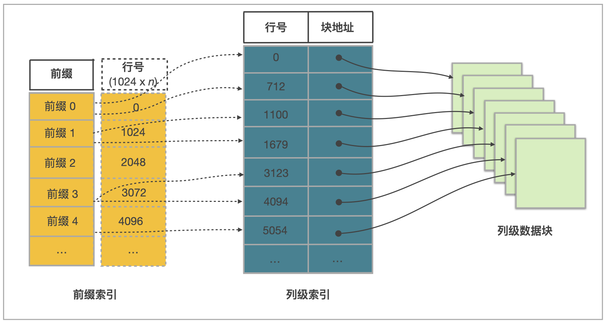

# 索引

索引有助于快速定位到满足查询条件的数据。具体来说，如果表中基于一些列构建了索引，那么查询时如果能用上这些索引，就不需要扫描全表，只需要读取部分数据，就能快速定位到满足条件的数据的位置，从而提高查询效率。StarRocks 提供了丰富的索引类型，主要分为以下两类：

- StarRocks 自动创建的索引，称为内置索引，包括前缀索引、Ordinal 索引、ZoneMap 索引。
- StarRocks 同时也支持用户手动创建索引，包括 Bitmap 索引和 Bloom filter 索引。

## 内置索引

### [前缀索引](./Prefix_index_sort_key.md)

数据写入时候自动生成前缀索引。具体来说，写入时数据按照指定的排序键排序，并且每写入 1024 行数据构成一个逻辑数据块（Data Block），在前缀索引表中存储一个索引项，内容为该逻辑数据块中第一行数据的排序列组成的前缀。
当查询的过滤条件命中前缀索引的前缀，则可以快速定位符合条件的数据，减少扫描的数据量，从而查询性能可以得到显著提升。

### Ordinal 索引

底层存储数据时，StarRocks 实际上采用列式存储。每一列数据以 Date Page 为单位分块存储，每个 Data Page 大小一般为 64*1024 个字节（data_page_size = 64 * 1024）。每一个列 Date Page 会对应生成一条 Ordinal 索引项，记录 Data Page 的起始行号等信息。这样 Ordinal 索引提供了通过行号来查找列 Data Page 数据页的物理地址。其他索引查找数据时，最终都要通过 Ordinal 索引查找列 Data Page 的位置。

### ZoneMap 索引

ZoneMap 索引存储了每块数据统计信息，统计信息包括 Min 最大值、Max 最小值、HasNull 空值、HasNotNull 不全为空的信息。在查询时，StarRocks 可以根据这些统计信息，快速判断这些数据块是否可以过滤掉，从而减少扫描数据量，提升查询速度。

更多信息

在实现上，“每块”数据可以是一个 Segment，也可以是一个列的一个 Data Page，相应的 ZoneMap 索引有两种：一种是存每个 Segment 的统计信息，另一种是存每个 Data Page 的统计信息

## 手动创建的索引

如果查询条件中的列不是前缀字段，您可以根据数据和查询特点，为该列手动创建索引来提高查询效率。

### [Bitmap 索引](./Bitmap_index.md)

Bitmap 索引适用于较高基数列的查询和多个低基数列的组合查询，并且此时 Bitmap 索引对查询的过滤效果比较好，至少可以过滤掉 999/1000 的数据。

### [Bloom filter 索引](./Bloomfilter_index.md)

Bloom filter 索引适用于基数较高的列，比如 ID 列，但是存在一定的误判率。

### [N-Gram bloomfilter 索引](./Ngram_Bloom_Filter_Index.md)

N-Gram bloom filter 索引是一种特殊的 Bloom filter 索引，通常用于加速 `LIKE` 查询或 `ngram_search` 和 `ngram_search_case_insensitive` 函数的运算速度。

### [全文倒排索引](./inverted_index.md)

全文倒排索引可以快速定位到与关键词匹配的数据行，能够加速全文检索。
