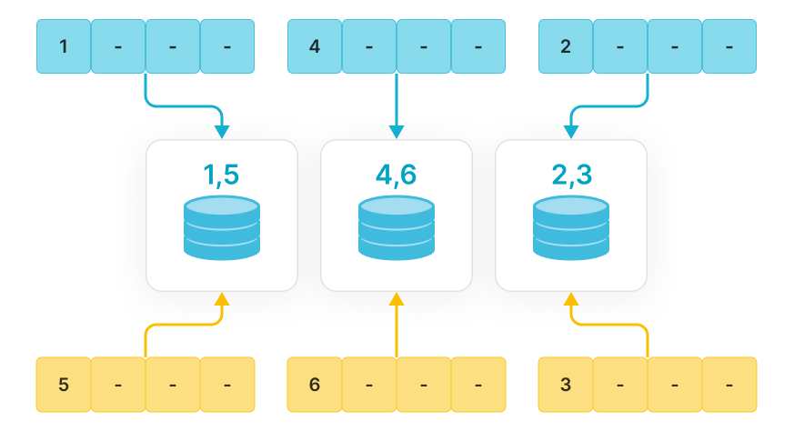

# List 分区

自 v3.1 起，StarRocks 支持 List 分区，数据按照您显式定义的枚举值列表进行分区，适用于按枚举值来查询和管理数据。

## 功能介绍

您需要显式列出每个 List 分区所包含的枚举值列表，并且值不需要连续，区别于包含连续日期或者数值范围的 Range 分区。当新数据导入表中时，StarRocks 会根据数据的分区列值与分区的映射关系将数据分配到相应的分区中。



List 分区适用于存储具有少量枚举值列的数据、并且经常按列的枚举值来查询和管理数据的场景。例如表示地理位置、状态、类别的列。列的每个值都代表一种独立的类别。按照列的枚举值对数据进行分区，可以提高查询性能和方便数据管理。

**尤其适用于一个分区中需要包含各分区列的多个值的场景**。例如表中存在 `City` 列表示个体所属的城市，并且您经常按照州和城市查询和管理数据，则建表时可以使用 `City` 列作为分区列进行 List 分区，指定同属一个州的多个城市的数据分在同一分区 `PARTITION pCalifornia VALUES IN ("Los Angeles","San Francisco","San Diego")`，可以加速查询和方便数据管理。

如果一个分区只需要包含各分区列的一个值，则推荐您使用[表达式分区](./expression_partitioning.md)。

**List 分区和[表达式分区](./expression_partitioning.md)的区别**

两者主要区别在于 List 分区需要您手动一个一个创建分区。而表达式分区（推荐）可以实现导入时自动创建分区，来简化分区创建，并且大部分情况下可以替代 List 分区。两者具体对比如下表：

| 分区方式                                     | **List 分区**                                                | **表达式分区**                                               |
| -------------------------------------------- | ------------------------------------------------------------ | ------------------------------------------------------------ |
| 语法                                         | `PARTITION BY LIST (partition_columns)（    PARTITION <partition_name> VALUES IN (value_list)    [, ...] )` | `PARTITION BY <partition_columns>`                           |
| 一个分区中包含各分区列的多值                 | 支持。一个分区中可以包含各分区列的多值。如下所示，如果导入数据的 `city` 列值为 `Los Angeles`、`San Francisco` 或 `San Diego`，则都被划分在一个分区 `pCalifornia` 中。<br />`PARTITION BY LIST (city) (    PARTITION pCalifornia VALUES IN ("Los Angeles","San Francisco","San Diego")    [, ...] )` | 不支持。一个分区中只包含在各分区列上应用表达式来计算出一个值。例如使用表达式分区 `PARTITION BY (city)` ，并且所导入多行数据的 `city` 列值包含 `Los Angeles`、`San Francisco` 或 `San Diego`，则会自动创建三个分区 `pLosAngeles` 、`pSanFrancisco` 和 `pSanDiego` ，分别包含 `city` 列值为`Los Angeles`、`San Francisco` 和 `San Diego` 的数据。 |
| 导入数据前需要提前建分区                     | 必须，并且是在建表时就创建分区。                             | 不需要，导入数据时自动创建分区。                             |
| 导入数据时自动建分区                         | 不支持。导入数据时，如果表中不存在数据对应的分区，StarRocks 不会自动创建分区，并且会报错。 | 支持。导入数据时，如果表中不存在数据对应的分区，则 StarRocks 自动创建分区并将导入数据，并且一个分区只包含各分区列的一个值。 |
| SHOW CERATE TABLE                            | 返回建表语句定义的分区。                                     | 导入数据后，执行该命令，返回结果会包含建表时分区子句，即 `PARTITION BY (partition_columns)`，但是不会返回自动创建的分区。如果您需要查看自动创建的分区，请执行 `SHOW PARTITIONS FROM table_name;` 。 |

## 使用方式

### 语法

```bnf
PARTITION BY LIST (partition_columns)（
    PARTITION <partition_name> VALUES IN (value_list)
    [, ...]
)

partition_columns::= 
    <column> [,<column> [, ...] ]

value_list ::=
    value_item [, value_item [, ...] ]

value_item ::=
    { <value> | ( <value> [, <value>, [, ...] ] ) }    
```

### 参数说明

| 参数                | 是否必填 | 参数                                                         |
| ------------------- | -------- | ------------------------------------------------------------ |
| `partition_columns` | 是       | 分区列。<br />分区列的值支持为字符串（除 BINARY）、日期（DATE 和 DATETIME）、整数和布尔值。分区列的值不支持为 `NULL`。 |
| `partition_name`    | 是       | 分区名称。建议您按照业务场景设置合理的分区名称，便于区别不同分区包含的数据分类。 |
| `value_list`        |          | 分区中分区列的枚举值列表。                                   |

## 示例

示例一：假设经常按照州或城市查询机房收费明细，则建表时可以指定分区列为城市 `city` ，并且指定每个分区所包含城市同属一个州，这样可以加速查询特定州或城市的数据，并且方便按照特定州或城市进行数据管理。

```SQL
CREATE TABLE t_recharge_detail2 (
    id bigint,
    user_id bigint,
    recharge_money decimal(32,2), 
    city varchar(20) not null,
    dt varchar(20) not null
)
DUPLICATE KEY(id)
PARTITION BY LIST (city) (
   PARTITION pCalifornia VALUES IN ("Los Angeles","San Francisco","San Diego"), -- 这些城市同属一个州
   PARTITION pTexas VALUES IN ("Houston","Dallas","Austin")
)
DISTRIBUTED BY HASH(`id`);
```

示例二：假设经常按日期范围和特定州或城市查询机房收费明细，则建表时可以指定分区列为日期 `dt` 和城市 `city`。这样属于特定日期和特定州或城市的数据分组到同一个分区中，以加速查询和方便数据管理。

```SQL
CREATE TABLE t_recharge_detail4 (
    id bigint,
    user_id bigint,
    recharge_money decimal(32,2), 
    city varchar(20) not null,
    dt varchar(20) not null
) ENGINE=OLAP
DUPLICATE KEY(id)
PARTITION BY LIST (dt,city) (
   PARTITION p202204_California VALUES IN (
       ("2022-04-01", "Los Angeles"),
       ("2022-04-01", "San Francisco"),
       ("2022-04-02", "Los Angeles"),
       ("2022-04-02", "San Francisco")
    ),
   PARTITION p202204_Texas VALUES IN (
       ("2022-04-01", "Houston"),
       ("2022-04-01", "Dallas"),
       ("2022-04-02", "Houston"),
       ("2022-04-02", "Dallas")
   )
)
DISTRIBUTED BY HASH(`id`);
```

## 使用限制

- 不支持[动态](./dynamic_partitioning.md)和[批量创建](./Data_distribution.md#range-分区) List 分区。
- StarRocks 存算分离模式 从 3.1.1 版本开始支持该功能。
- 使用 `ALTER TABLE <table_name> DROP PARTITION <partition_name>;` 分区直接被删除并且不能被恢复。
- List 分区暂时不支持[备份与恢复](../administration/management/Backup_and_restore.md)。
- [异步物化视图](../using_starrocks/Materialized_view.md)暂不支持基于使用 List 分区的基表创建。
