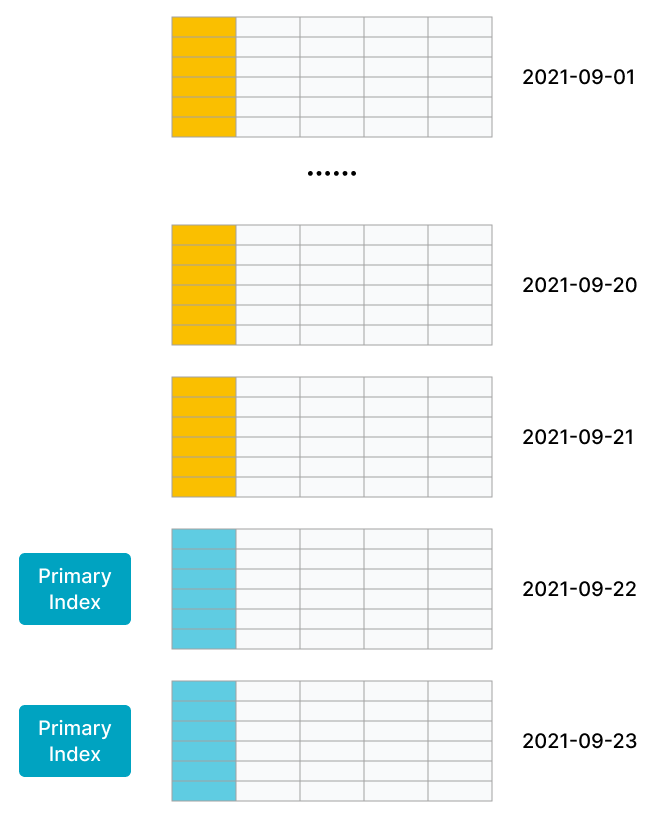
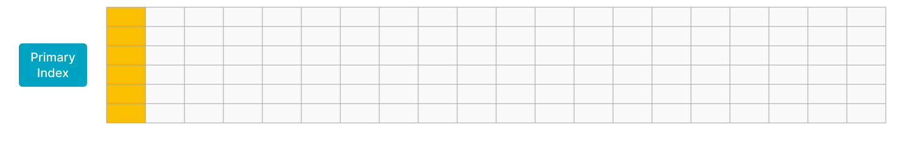

# 主键模型

主键模型支持分别定义主键和排序键。数据导入至主键模型的表时先按照排序键排序后存储。查询时返回主键相同的一组数据中的最新数据。相对于更新模型，主键模型在查询时不需要执行聚合操作，并且支持谓词和索引下推，能够在支持**实时和频繁更新**等场景的同时，提供高效查询。
> **说明**
>
> - 3.0 版本之前，主键模型不支持分别定义主键和排序键。
> - 自 3.1 版本起，存算分离模式支持创建主键模型表，并且自 3.1.4 版本起，支持基于本地磁盘上的持久化索引。

## 适用场景

主键模型适用于实时和频繁更新的场景，例如：

- **实时对接事务型数据至 StarRocks**。事务型数据库中，除了插入数据外，一般还会涉及较多更新和删除数据的操作，因此事务型数据库的数据同步至 StarRocks 时，建议使用主键模型。[通过 Flink-CDC 等工具直接对接 TP 的 Binlog](../../loading/Flink_cdc_load.md)，实时同步增删改的数据至主键模型，可以简化数据同步流程，并且相对于 Merge-On-Read 策略的更新模型，查询性能能够提升 3~10 倍。
- **利用部分列更新轻松实现多流 JOIN**。在用户画像等分析场景中，一般会采用大宽表方式来提升多维分析的性能，同时简化数据分析师的使用模型。而这种场景中的上游数据，往往可能来自于多个不同业务（比如来自购物消费业务、快递业务、银行业务等）或系统（比如计算用户不同标签属性的机器学习系统），主键模型的部分列更新功能就很好地满足这种需求，不同业务直接各自按需更新与业务相关的列即可，并且继续享受主键模型的实时同步增删改数据及高效的查询性能。

## 注意事项

- 如果开启持久化索引，主键模型大大降低了主键索引对内存的占用。因为导入时少部分主键索引存在内存中，大部分主键索引存在磁盘中。**单条主键编码后的最大长度为 128 字节**。
- 如果不开启持久化索引，主键模型适用于主键占用空间相对可控的场景，因为导入时将主键索引加载至内存中。**单条主键编码后的最大长度和内存占用上限为 128 字节**。
  如下两个场景中，主键占用空间相对可控：
  - **数据有冷热特征**，即最近几天的热数据才经常被修改，老的冷数据很少被修改。例如，MySQL订单表实时同步到 StarRocks 中提供分析查询。其中，数据按天分区，对订单的修改集中在最近几天新创建的订单，老的订单完成后就不再更新，因此导入时其主键索引就不会加载，也就不会占用内存，内存中仅会加载最近几天的索引。<br />
  
  > 如图所示，数据按天分区，最新两个分区的数据更新比较频繁。
  - **大宽表**（数百到数千列）。主键只占整个数据的很小一部分，其内存开销比较低。比如用户状态和画像表，虽然列非常多，但总的用户数不大（千万至亿级别），主键索引内存占用相对可控。
  
  > 如图所示，大宽表中主键只占一小部分，且数据行数不多。

## 原理

主键模型是由 StarRocks 全新设计开发的存储引擎支撑。相比于更新模型，主键模型的元数据组织、读取、写入方式完全不同，不需要执行聚合操作，并且支持谓词和索引下推，极大地提高了查询性能。

更新模型整体上采用了 Merge-On-Read 的策略。虽然写入时处理简单高效，但是查询时需要在线聚合多版本。并且由于 Merge 算子的存在，谓词和索引无法下推，严重影响了查询性能。

而主键模型采用了 Delete+Insert 的策略，保证同一个主键下仅存在一条记录，这样就完全避免了 Merge 操作。具体实现方式如下：

- StarRocks 收到对某记录的更新操作时，会通过主键索引找到该条记录的位置，并对其标记为删除，再插入一条新的记录。相当于把 Update 改写为 Delete+Insert。

- StarRocks 收到对某记录的删除操作时，会通过主键索引找到该条记录的位置，对其标记为删除。

这样，查询时不需要执行聚合操作，不影响谓词和索引的下推，保证了查询的高效执行。

## 创建表

- 例如，需要按天实时分析订单，则可以将时间 `dt`、订单编号 `order_id` 作为主键，其余列为指标列。建表语句如下：

```SQL
create table orders (
    dt date NOT NULL,
    order_id bigint NOT NULL,
    user_id int NOT NULL,
    merchant_id int NOT NULL,
    good_id int NOT NULL,
    good_name string NOT NULL,
    price int NOT NULL,
    cnt int NOT NULL,
    revenue int NOT NULL,
    state tinyint NOT NULL
) PRIMARY KEY (dt, order_id)
PARTITION BY RANGE(`dt`) (
    PARTITION p20210820 VALUES [('2021-08-20'), ('2021-08-21')),
    PARTITION p20210821 VALUES [('2021-08-21'), ('2021-08-22')),
    PARTITION p20210929 VALUES [('2021-09-29'), ('2021-09-30')),
    PARTITION p20210930 VALUES [('2021-09-30'), ('2021-10-01'))
) DISTRIBUTED BY HASH(order_id)
PROPERTIES (
    "replication_num" = "3",
    "enable_persistent_index" = "true"
);
```

> **注意**
>
> - 建表时必须使用 `DISTRIBUTED BY HASH` 子句指定分桶键，否则建表失败。分桶键的更多说明，请参见[分桶](../Data_distribution.md#分桶)。
> - 自 2.5.7 版本起，StarRocks 支持在建表和新增分区时自动设置分桶数量 (BUCKETS)，您无需手动设置分桶数量。更多信息，请参见 [确定分桶数量](../Data_distribution.md#确定分桶数量)。

- 例如，需要按地域、最近活跃时间实时分析用户情况，则可以将表示用户 ID 的 `user_id` 列作为主键，表示地域的 `address` 列和表示最近活跃时间的 `last_active` 列作为排序键。建表语句如下：

```SQL
create table users (
    user_id bigint NOT NULL,
    name string NOT NULL,
    email string NULL,
    address string NULL,
    age tinyint NULL,
    sex tinyint NULL,
    last_active datetime,
    property0 tinyint NOT NULL,
    property1 tinyint NOT NULL,
    property2 tinyint NOT NULL,
    property3 tinyint NOT NULL
) PRIMARY KEY (user_id)
DISTRIBUTED BY HASH(user_id)
ORDER BY(`address`,`last_active`)
PROPERTIES (
    "replication_num" = "3",
    "enable_persistent_index" = "true"
);
```

## 使用说明

- 主键相关的说明：
  - 在建表语句中，主键必须定义在其他列之前。
  - 主键通过 `PRIMARY KEY` 定义。
  - 主键必须满足唯一性约束，且列的值不会修改。本示例中主键为 `dt`、`order_id`。
  - 主键支持以下数据类型：BOOLEAN、TINYINT、SMALLINT、INT、BIGINT、LARGEINT、DATE、DATETIME、VARCHAR/STRING。并且不允许为 NULL。
  - 分区列和分桶列必须在主键中。

- `enable_persistent_index`：是否持久化主键索引，同时使用磁盘和内存存储主键索引，避免主键索引占用过大内存空间。通常情况下，持久化主键索引后，主键索引所占内存为之前的 1/10。您可以在建表时，在`PROPERTIES`中配置该参数，取值范围为 `true` 或者 `false`（默认值）。

   > - 自 2.3.0 版本起，StarRocks 支持配置该参数。
   > - 如果磁盘为固态硬盘 SSD，则建议设置为 `true`。如果磁盘为机械硬盘 HDD，并且导入频率不高，则也可以设置为 `true`。
   > - 建表后，如果您需要修改该参数，请参见 ALTER TABLE [修改表的属性](../../sql-reference/sql-statements/data-definition/ALTER_TABLE.md#修改表的属性) 。
   > - 自 3.1 版本起，存算分离模式支持创建主键模型表，并且自 3.1.4 版本起，支持基于本地磁盘上的持久化索引。

- 如果未开启持久化索引，导入时主键索引存在内存中，可能会导致占用内存较多。因此建议您遵循如下建议：
  - 合理设置主键的列数和长度。建议主键为占用内存空间较少的数据类型，例如 INT、BIGINT 等，暂时不建议为 VARCHAR。
  - 在建表前根据主键的数据类型和表的行数来预估主键索引占用内存空间，以避免出现内存溢出。以下示例说明主键索引占用内存空间的计算方式：
    - 假设存在主键模型，主键为`dt`、`id`，数据类型为 DATE（4 个字节）、BIGINT（8 个字节）。则主键占 12 个字节。
    - 假设该表的热数据有 1000 万行，存储为三个副本。
    - 则内存占用的计算方式：`(12 + 9(每行固定开销) ) * 1000W * 3 * 1.5（哈希表平均额外开销) = 945 M`

- 通过 `ORDER BY` 关键字指定排序键，可指定为任意列的排列组合。

  > 注意：
  >
  > 如果指定了排序键，就根据排序键构建前缀索引；如果没指定排序键，就根据主键构建前缀索引。

- 支持使用 ALTER TABLE 进行表结构变更，但是存在如下注意事项：

  - 不支持修改主键。
  - 对于排序键，支持通过 ALTER TABLE ... ORDER BY ... 重新指定排序键。不支持删除排序键，不支持修改排序键中列的数据类型。
  - 不支持调整列顺序。

- 自2.3 版本起，除了主键之外的列新增支持 BITMAP、HLL 数据类型。

- 创建表时，支持为除了主键之外的列创建 BITMAP、Bloom Filter 等索引。

- 自 2.4 版本起，支持基于主键模型的表创建[异步物化视图](../../using_starrocks/Materialized_view.md)。

## 下一步

建表完成后，您可以创建导入作业，导入数据至表中。具体导入方式，请参见[导入总览](../../loading/Loading_intro.md)。
如果需要更新主键模型表的数据，您可以通过[导入](../../loading/Load_to_Primary_Key_tables.md)或执行 DML 语句（[UPDATE](../../sql-reference/sql-statements/data-manipulation/UPDATE.md) 或 [DELETE](../../sql-reference/sql-statements/data-manipulation/DELETE.md)）实现，并且更新操作是原子性的。
