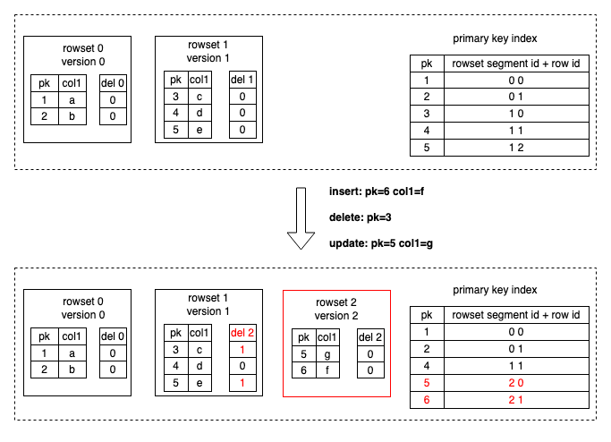
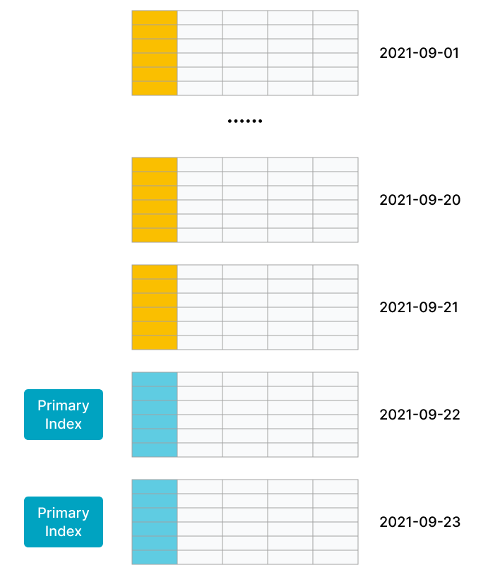
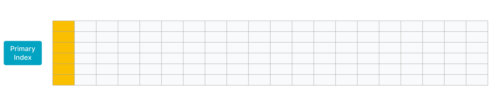

# 主键表

import Tabs from '@theme/Tabs';

import TabItem from '@theme/TabItem';

主键表使用 StarRocks 全新设计开发的存储引擎。**其主要优势在于支撑实时数据更新的同时，也能保证高效的复杂即席查询性能**。在实时分析业务中采用主键表，用最新的数据实时分析出结果来指导决策，使得数据分析不再受限于 T+1 数据延迟。

主键表中的主键具有唯一非空约束，用于唯一标识数据行。如果新数据的主键值与表中原数据的主键值相同，则存在唯一约束冲突，此时新数据会替代原数据。

:::info

- 自 3.0 版本起，主键表解耦了排序键与主键，支持单独指定排序键，提供更灵活的建表能力。
- 自 3.1 版本起，存算分离模式支持创建主键表
  - 自 3.1.4 版本起，支持持久化主键索引至**本地磁盘**。
  - 自 3.3.2 版本起，支持持久化主键索引至**对象存储**。

:::

## 应用场景

主键表能够在支撑实时数据更新的同时，也能保证高效的查询性能。可适用于如下场景：

- **实时对接事务型数据至 StarRocks**。事务型数据库中，除了插入数据外，一般还会涉及较多更新和删除数据的操作，因此事务型数据库的数据同步至 StarRocks 时，建议使用主键表。通过 Flink-CDC 等工具直接对接 TP 的 Binlog，实时同步增删改的数据至主键表，可以简化数据同步流程，并且相对于 Merge-On-Read 策略的更新表，查询性能能够提升 3~10 倍。更多信息，参见[从 MySQL 实时同步](../../loading/Flink_cdc_load.md)。
- **利用[部分列更新](../../loading/Load_to_Primary_Key_tables.md#部分更新)轻松实现多流 JOIN**。在用户画像等分析场景中，一般会采用大宽表方式来提升多维分析的性能，同时简化数据分析师的使用模型。而这种场景中的上游数据，往往可能来自于多个不同业务（比如来自购物消费业务、快递业务、银行业务等）或系统（比如计算用户不同标签属性的机器学习系统），主键表的部分列更新功能就很好地满足这种需求，不同业务直接各自按需更新与业务相关的列即可，并且继续享受主键表的实时同步增删改数据及高效的查询性能。

## 工作原理

更新表和聚合表整体上采用了 Merge-On-Read 的策略。虽然写入时处理简单高效，但是读取时需要在线 Merge 多个版本的数据文件。并且由于 Merge 算子的存在，谓词和索引无法下推至底层数据，会严重影响查询性能。

然而为了兼顾实时更新和查询性能，主键表的元数据组织、读取、写入方式完全不同。主键表采用了 Delete+Insert 策略，借助主键索引配合 DelVector 的方式实现，保证在查询时只需要读取具有相同主键值的数据中的最新数据。如此可以避免 Merge 多个版本的数据文件，并且谓词和索引可以下推到底层数据，所以可以极大提升查询性能。

主键表中写入和读取数据的整体流程如下：

- 数据写入是通过 StarRocks 内部的 Loadjob 实现，包含一批数据变更操作（包括 Insert、Update、Delete）。StarRocks 会加载导入数据对应 Tablet 的主键索引至内存中。对于 Delete 操作，StarRocks 先通过主键索引找到数据行原来所在的数据文件以及行号，在 DelVector（用于存储和管理数据导入时生成数据行对应的删除标记）中把该条数据标记为删除。对于 Update 操作，StarRocks 除了在 DelVector 中将原先数据行标记为删除，还会把最新数据写入新的数据文件，相当于把 Update 改写为 Delete+Insert（如下图所示）。并且会更新主键索引中变更的数据行现在所在的数据文件和行号。

   
- 读取数据时，由于写入数据时各个数据文件中历史重复数据已经标记为删除，同一个主键值下仅需要读取最新的一条数据，无需在线 Merge 多个版本的数据文件来去重以找到最新的数据。扫描底层数据文件时借助过滤算子和各类索引，可以减少扫描开销（如下图所示），所以查询性能的提升空间更大。并且相对于 Merge-On-Read 策略的更新表，主键表的查询性能能够提升 3~10 倍。

   

<details>
<summary>更多原理</summary>

如果需要更深入理解技术原理，可以了解如下更具体的数据写入和读取流程：

StarRocks 属于分析型数据库，底层数据采用列式存储。具体来说，一个表的 Tablet 中往往包含多个 Rowset 文件，每个 Rowset 文件的数据实际是分段存储在 Segment 文件中。Segment 文件使用列存格式组织数据（类似于 Parquet），并且是不可修改的。

当所需写入的数据分发至 Executor BE 节点时，BE 节点会执行 Loadjob。Loadjob 包含一批数据变更，可以视为一个事务，具有 ACID 属性。一个 Loadjob 分为两个阶段：write 和 commit。

1. write 阶段：根据分区分桶信息将数据分发到对应的 Tablet，每个 Tablet 收到数据后，数据按列存格式存储，形成一个新的 Rowset。
2. commit 阶段：所有数据都写入成功后，FE 向所有参与的 Tablet 发起 commit，每个 commit 会携带一个 version 版本号，代表 Tablet 数据的最新版本。commit 流程主要包含：查找并更新 Primary Index，记录所有变更的数据，标记为删除；根据标记为删除的数据，生成 DelVector；生成新版本的元数据。

数据读取时会在元数据中根据最新 Tablet 版本查找到需要读取哪些 Rowset，并且读取 Rowset 中的 segment 文件时会查找最新版本的 DelVector，这样保证读取数据时无需读取具有相同主键值的旧数据，仅需要读取最新数据，并且过滤算子下推到 Scan 层可以直接利用各类索引进行过滤，减少扫描开销。

- **Tablet**：一张表根据分区和分桶机制被划分成多个 Tablet，是实际的物理存储单元。Tablet 以副本（Replica）的形式分布式存储在不同 BE 节点上。一个 Tablet 主要包含以下 4 个组件：

  

- **元数据**：保存 Tablet 的版本历史以及每个版本的信息（比如包含哪些 Rowset）。每次 Loadjob 或者 Compaction 的 Commit 阶段都会生成一个新版本。

  

- **主键索引**：主键索引，用于保存主键标识的数据行与该数据行所在位置之间的映射关系。采用 HashMap 结构，Key 是编码后的主键列值，Value 记录数据行所在的位置（包括 `rowset_id`、`segment_id` 和 `rowid`）。通常只在数据写入时会使用到主键索引，根据主键值查找主键值标识的数据行在哪个 Rowset 的第几行。
- **DelVector**: 每个 Rowset 中每一个 Segment 文件（列存文件）对应的删除标记。
- **Rowset**：Rowset 是逻辑概念，存储 Tablet 中一次数据变更的数据集合。
- **Segment**：实际上 Rowset 包含的数据是分段存储在一个或多个 Segment 文件（列存文件）中。Segment 按列包含了具体列值和列相关的索引信息。

</details>

## 使用说明

### 建表示例

您只需要在 CREATE TABLE 语句通过 `PRIMARY KEY` 定义主键，即可创建一个主键表。

```SQL
CREATE TABLE orders1 (
    order_id bigint NOT NULL,
    dt date NOT NULL,
    user_id INT NOT NULL,
    good_id INT NOT NULL,
    cnt int NOT NULL,
    revenue int NOT NULL
)
PRIMARY KEY (order_id)
DISTRIBUTED BY HASH (order_id)
;
```

:::info

由于主键表仅支持分桶策略为哈希分桶，因此您还需要通过 `DISTRIBUTED BY HASH ()` 定义哈希分桶键。

:::

然而，在实际的业务场景中，为了加速查询和管理数据，创建主键表时，通常还会用到数据分布、排序键等功能。

假设订单表中 `order_id` 字段能够唯一标识数据行，则可以作为主键。

并且自 3.0 起主键表解耦了主键和排序键，因此您可以选择经常作为查询过滤条件的列去构成排序键。假设经常根据订单日期和商户组合维度查询商品销售情况，则您可以通过 `ORDER BY (dt,merchant_id)` 指定排序键为 `dt` 和 `merchant_id` 。

注意，如果您使用了[数据分布策略](../data_distribution/Data_distribution.md)，由于目前主键表要求主键必须包括分区列和分桶列，假设采用的数据分布策略是将 `dt` 作为分区列并且 `merchant_id` 作为哈希分桶列，则主键还需要包括 `dt` 和 `merchant_id`。

综上所述，该订单表的建表语句可以为：

```SQL
CREATE TABLE orders2 (
    order_id bigint NOT NULL,
    dt date NOT NULL,
    merchant_id int NOT NULL,
    user_id int NOT NULL,
    good_id int NOT NULL,
    good_name string NOT NULL,
    price int NOT NULL,
    cnt int NOT NULL,
    revenue int NOT NULL,
    state tinyint NOT NULL
)
PRIMARY KEY (order_id,dt,merchant_id)
PARTITION BY date_trunc('day', dt)
DISTRIBUTED BY HASH (merchant_id)
ORDER BY (dt,merchant_id)
PROPERTIES (
    "enable_persistent_index" = "true"
);
```

### 主键

主键用于唯一标识表中的每一行数据，组成主键的一个或多个列在 `PRIMARY KEY` 中定义，具有非空唯一性约束。其注意事项如下：

- 在建表语句中，主键列必须定义在其他列之前。
- 主键必须包含分区列和分桶列。
- 主键列支持以下数据类型：数值（包括整型和布尔）、日期和字符串。
- 默认设置下，单条主键值编码后的最大长度为 128 字节。
- 建表后不支持修改主键。
- 主键列的值不能更新，避免破坏数据一致性。

### 主键索引

主键索引来保存主键值和其标识的数据行所在位置的映射。通常只有在导入数据（包含一批数据变更）的时候会将导入数据相关 Tablet 的主键索引加载至内存。您可以综合查询和更新性能要求，以及内存和磁盘情况，选择是否持久化主键索引。

<Tabs groupId="主键索引">
<TabItem value="example1" label="持久化主键索引" default>

`enable_persistent_index`：设置为 `true`（默认），表示持久化主键索引。导入时少部分主键索引存在内存中，大部分主键索引存在磁盘中，避免占用过大内存空间。通常情况下，持久化主键索引后，<!--主键索引所占内存为之前的 1/10，并且-->查询和更新性能几乎接近全内存索引。

如果磁盘为固态硬盘 SSD，则建议设置为 `true`。如果磁盘为机械硬盘 HDD，并且导入频率不高，则也可以设置为 `true`。

自 3.1.4 版本起，StarRocks 存算分离集群支持基于本地磁盘上的持久化索引。自 3.3.2 版本起，存算分离集群进一步支持基于对象存储上的持久化索引。您可以通过将主键表 Property `persistent_index_type` 设置为 `CLOUD_NATIVE` 启用该功能。

</TabItem>
<TabItem value="example2" label="全内存主键索引">

`enable_persistent_index`：设置为 `false`，表示不持久化主键索引，即全内存主键索引。导入时会加载数据导入涉及到的 Tablet 的主键索引在内存中，可能会导致占用内存较多。（如果某个 Tablet长时间没有数据导入，则该 Tablet 的主键索引从内存中释放）。

使用全内存主键索引时，建议您遵循如下建议来设计主键，以控制主键索引的内存占用：

- 合理设置主键的列数和长度。建议主键列为占用内存空间较少的数据类型，例如 INT、BIGINT 等，不建议为 VARCHAR。
- 在建表前根据主键列的数据类型和表的行数来预估主键索引占用内存空间，以避免出现内存溢出。以下示例说明主键索引占用内存空间的计算方式：
  - 假设存在主键表，主键为`dt`、`id`，数据类型为 DATE（4 个字节）、BIGINT（8 个字节）。则主键占 12 个字节。
  - 假设该表的热数据有 1000 万行，存储为三个副本。
  - 则内存占用的计算方式：`(12 + 9(每行固定开销) ) * 1000W * 3 * 1.5（哈希表平均额外的存储开销) = 945 M`

全内存主键索引适用于主键索引的内存占用相对可控的场景，例如：

- **数据有冷热特征**，即最近几天的热数据才经常被修改，老的冷数据很少被修改。例如，MySQL 订单表实时同步到 StarRocks 中提供分析查询。其中，数据按天分区，对订单的修改集中在最近几天新创建的订单，老的订单完成后就不再更新，因此导入时老订单的主键索引就不会加载，也就不会占用内存，内存中仅会加载最近几天的主键索引。如图所示，数据按天分区，最新两个分区的数据更新比较频繁。

   

- **大宽表**（数百到数千列）。主键只占整个数据的很小一部分，其内存开销比较低。比如用户状态和画像表，虽然列非常多，但总的用户数不大（千万至亿级别），主键索引内存占用相对可控。 如图所示，大宽表中主键只占一小部分，且数据行数不多。
   

</TabItem>
  </Tabs>

### 排序键

自 3.0 起，主键表解耦了排序键和主键，排序键由 `ORDER BY` 定义的排序列组成，可以为任意列的排列组合，只要列的数据类型满足排序键的要求。

导入数据时数据按照排序键排序后存储，并且排序键还用于构建前缀索引，能够加速查询。建议您[设计合理排序键，以便查询利用前缀索引加速](../indexes/Prefix_index_sort_key.md#如何设计合理排序键以便查询利用前缀索引加速)。

:::info

- 如果指定了排序键，就根据排序键构建前缀索引；如果没指定排序键，就根据主键构建前缀索引。
- 建表后支持通过 `ALTER TABLE ... ORDER BY ...` 修改排序键。不支持删除排序键，不支持修改排序列的数据类型。

:::

## 更多信息

- 建表后导入数据，您可以参考[导入概览](../../loading/Loading_intro.md)选择合适的导入方式。
- 如果需要对主键表中数据进行变更，则可以参考 [通过导入实现数据变更](../../loading/Load_to_Primary_Key_tables.md) 或者 DML 语句（[INSERT](../../sql-reference/sql-statements/loading_unloading/INSERT.md)、[UPDATE](../../sql-reference/sql-statements/table_bucket_part_index/UPDATE.md)、[DELETE](../../sql-reference/sql-statements/table_bucket_part_index/DELETE.md)）。
- 如果您需要进一步加速查询，则可以参考[查询加速](../../using_starrocks/async_mv/Materialized_view.md)。
- 如果需要修改表结构，则可以参考 [ALTER TABLE](../../sql-reference/sql-statements/Resource/ALTER_RESOURCE.md)。
- [自增列](../../sql-reference/sql-statements/generated_columns.md)可作为生成主键。
