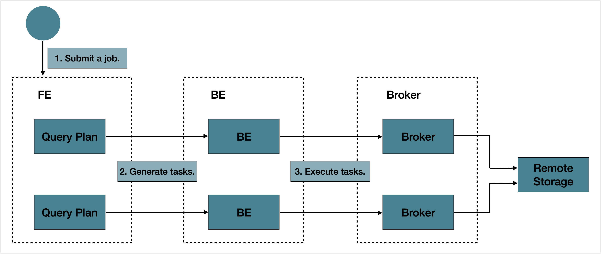

# 使用 EXPORT 导出数据

本文介绍如何通过 [EXPORT](../sql-reference/sql-statements/loading_unloading/unloading/EXPORT.md) 语句把 StarRocks 集群中指定表或分区上的数据以 CSV 的格式导出到外部存储系统。当前支持导出到分布式文件系统 HDFS 或 AWS S3、阿里云 OSS、腾讯云 COS、华为云 OBS 等云存储系统。

> **注意**
>
> 导出操作需要目标表的 EXPORT 权限。如果您的用户账号没有 EXPORT 权限，请参考 [GRANT](../sql-reference/sql-statements/account-management/GRANT.md) 给用户赋权。

## 背景信息

在 v2.4 及以前版本，StarRocks 在使用 EXPORT 导出数据时需要借助 Broker 才能访问外部存储系统，称为“有 Broker 的导出”。导出语句中需要通过 `WITH BROKER "<broker_name>"` 来指定使用哪个 Broker。Broker 是一个独立的无状态服务，封装了文件系统接口，能够帮助 StarRocks 将数据导出到外部存储系统。

自 v2.5 起，StarRocks 在使用 EXPORT 导出数据时不需要借助 Broker 即可访问外部存储系统，称为“无 Broker 的导出”。导出语句中也不再需要指定 `broker_name`，但继续保留 `WITH BROKER` 关键字。

需要注意的是，无 Broker 的导出在数据源为 HDFS 的某些场景下会受限，这时您可以继续执行有 Broker 的导出，包括：

- 在配置了多 HDFS 集群时，您需要为每一个 HDFS 集群部署一个独立的 Broker。
- 在配置了单 HDFS 集群、但是多 Kerberos 用户时，您只需要部署一个独立的 Broker。


## 支持的外部存储系统

- 分布式文件系统 HDFS
- 云存储系统，包括 AWS S3、阿里云 OSS、腾讯云 COS、华为云 OBS

## 注意事项

- 建议不要一次性导出大量数据。一个导出作业建议的导出数据量最大为几十 GB。一次性导出过量数据可能会导致导出失败，重试的成本也会增加。

- 如果表数据量过大，建议按照分区导出。

- 在导出作业运行过程中，如果 FE 发生重启或切主，会导致导出作业失败，您需要重新提交导出作业。

- 导出作业运行完成后（成功或失败），若 FE 发生重启或切主，则 [SHOW EXPORT](../sql-reference/sql-statements/loading_unloading/unloading/SHOW_EXPORT.md) 语句返回的导出作业信息会发生部分丢失，无法查看。

- 导出作业只会导出原始表 (Base Table) 的数据，不会导出物化视图的数据。

- 导出作业会扫描数据，占用 I/O 资源，可能会影响系统的查询延迟。

## 导出流程

提交一个导出作业后，StarRocks 会统计这个作业涉及的所有 Tablet，然后对这些 Tablet 进行分组，每组生成一个特殊的查询计划。该查询计划会读取所包含的 Tablet 上的数据，然后将数据写到远端存储上指定的路径中。

导出作业的总体处理流程如下图所示。



导出作业的总体处理流程主要包括以下三个步骤：

1. 用户提交一个导出作业到 Leader FE。
2. Leader FE 会先向集群中所有的 BE（或 CN）发送 `snapshot` 命令，对所有涉及到的 Tablet 做一个快照，以保持导出数据的一致性，并生成多个导出子任务。每个子任务即为一个查询计划，每个查询计划会负责处理一部分 Tablet。
3. Leader FE 会把一个个导出子任务发送给 BE（或 CN）执行。

## 基本原理

在执行查询计划的时候，StarRocks 会首先在指定的远端存储上的路径中，建立一个名为 `__starrocks_export_tmp_xxx` 的临时目录，其中，`xxx` 为导出作业的查询 ID，例如 `__starrocks_export_tmp_921d8f80-7c9d-11eb-9342-acde48001122`。每个查询计划执行成功以后，导出的数据都会先写入到这个临时目录下生成的一个临时文件。

当所有数据都导出后，StarRocks 会通过 RENAME 语句把这些文件保存到到指定的路径中。

## 相关配置

这里主要介绍 FE 上一些跟数据导出有关的参数配置。

- `export_checker_interval_second`：导出作业调度器的调度间隔。默认为 5 秒。设置该参数需重启 FE。
- `export_running_job_num_limit`：正在运行的导出作业数量限制。如果超过这一限制，则作业在执行完 `snapshot` 后进入等待状态。默认为 5。可以在导出作业运行时调整该参数的取值。
- `export_task_default_timeout_second`：导出作业的超时时间。默认为 2 小时。可以在导出作业运行时调整该参数的取值。
- `export_max_bytes_per_be_per_task`：每个导出子任务在每个 BE 上导出的最大数据量，用于拆分导出作业并行处理。按压缩后数据量计算，默认为 256 MB。
- `export_task_pool_size`：导出子任务线程池的大小，即线程池中允许并行执行的最大子任务数。默认为 5。

## 基本操作

### 提交导出作业

可以通过如下命令把 `db1` 数据库中 `tbl1` 表在 `p1` 和 `p2` 分区上 `col1` 和 `col3` 两列的数据导出到 HDFS 存储上的 `export` 目录中：

```SQL
EXPORT TABLE db1.tbl1 
PARTITION (p1,p2)
(col1, col3)
TO "hdfs://HDFS_IP:HDFS_Port/export/lineorder_" 
PROPERTIES
(
    "column_separator"=",",
    "load_mem_limit"="2147483648",
    "timeout" = "3600"
)
WITH BROKER
(
    "username" = "user",
    "password" = "passwd"
);
```

有关 EXPORT 语句的详细语法和参数说明、以及导出数据到 AWS S3、阿里云 OSS、腾讯云 COS、华为云 OBS 等云存储系统的命令示例，请参见 [EXPORT](../sql-reference/sql-statements/loading_unloading/unloading/EXPORT.md)。

### 获取导出作业的查询 ID

提交导出作业后，可以通过 SELECT LAST_QUERY_ID() 语句获取导出作业的查询 ID。您可以通过查询到的 ID 查看或者取消导出作业。

有关 SELECT LAST_QUERY_ID() 语句的详细语法和参数说明，请参见 [last_query_id](../sql-reference/sql-functions/utility-functions/last_query_id.md)。

### 查看导出作业的状态

提交导出作业后，可以通过 SHOW EXPORT 语句查看导出作业的状态，如下所示：

```SQL
SHOW EXPORT WHERE queryid = "edee47f0-abe1-11ec-b9d1-00163e1e238f";
```

> **说明**
>
> 上述示例中，`queryid` 为导出作业的 ID。

系统返回如下导出结果：

```Plain_Text
JobId: 14008
State: FINISHED
Progress: 100%
TaskInfo: {"partitions":["*"],"mem limit":2147483648,"column separator":",","line delimiter":"\n","tablet num":1,"broker":"hdfs","coord num":1,"db":"default_cluster:db1","tbl":"tbl3",columns:["col1", "col3"]}
Path: oss://bj-test/export/
CreateTime: 2019-06-25 17:08:24
StartTime: 2019-06-25 17:08:28
FinishTime: 2019-06-25 17:08:34
Timeout: 3600
ErrorMsg: N/A
```

有关 SHOW EXPORT 语句的详细语法和参数说明，请参见 [SHOW EXPORT](../sql-reference/sql-statements/loading_unloading/unloading/SHOW_EXPORT.md)。

### 取消导出作业

提交导出作业后，在导出作业执行完成以前，可以通过 CANCEL EXPORT 语句取消导出作业，如下所示：

```SQL
CANCEL EXPORT WHERE queryid = "921d8f80-7c9d-11eb-9342-acde48001122";
```

> **说明**
>
> 上述示例中，`queryid` 为导出作业的 ID。

有关 CANCEL EXPORT 语句的详细语法和参数说明，请参见 [CANCEL EXPORT](../sql-reference/sql-statements/loading_unloading/unloading/SHOW_EXPORT.md)。

## 最佳实践

### 查询计划的拆分

一个导出作业有多少查询计划需要执行，取决于总共有多少 Tablet、以及一个查询计划可以处理的最大数据量。 导出作业是按照查询计划来重试的。如果一个查询计划处理的数据量超过允许的最大数据量，查询计划出错，比如调用 Broker 的 RPC 失败、远端存储出现抖动等。这会导致该查询计划的重试成本变高。每个查询计划中每个 BE（或 CN）扫描的数据量通过 FE 配置参数 `export_max_bytes_per_be_per_task` 来设置，默认为 256 MB。每个查询计划中每个 BE（或 CN）最少分配一个 Tablet，导出的最大数据量不超过参数 `export_max_bytes_per_be_per_task` 的取值。

一个导出作业的多个查询计划并行执行，子任务线程池的大小通过 FE 配置参数 `export_task_pool_size` 来设置，默认为 5。

通常一个导出作业的查询计划只有“扫描”和“导出”两部分，计算逻辑不会消耗太多内存。所以通常 2 GB 的默认内存限制可以满足需求。但在某些场景下，比如一个查询计划，在同一个 BE（或 CN）上需要扫描的 Tablet 过多、或者 Tablet 的数据版本过多时，可能会导致内存不足。此时需要修改 `load_mem_limit` 参数，设置更大的内存，比如 4 GB、8 GB 等。
