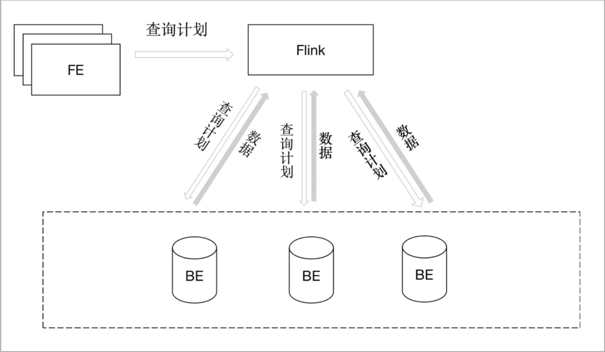
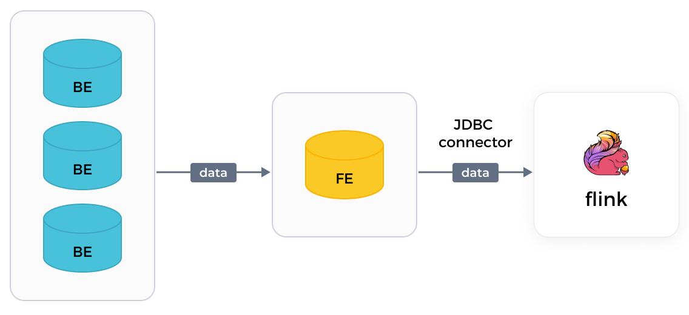

# 使用 Flink 连接器读取数据

StarRocks 提供自研的 Apache Flink® 连接器 (StarRocks Connector for Apache Flink®)，支持通过 Flink 批量读取某个 StarRocks 集群中的数据。

Flink 连接器支持两种数据读取方式：Flink SQL 和 Flink DataStream。推荐使用 Flink SQL。

> **说明**
>
> Flink 连接器还支持将 Flink 读取到的数据写入另外一个 StarRocks 集群或其他存储系统上。参见[从 Apache Flink 持续导入](../loading/Flink-connector-starrocks.md)。

## 功能简介

相较于 Flink 官方提供的 Flink JDBC 连接器 (JDBC Connector)，StarRocks 自研的 Flink 连接器具备从 StarRocks 集群中各 BE 节点并行读取数据的能力，大大提高了数据读取效率。以下是两种连接器的实现方案对比：

- Flink 连接器

  Flink 先从 FE 节点获取查询计划 (Query Plan)，然后将获取到的查询计划作为参数，下发至 BE 节点，最后获取 BE 节点返回的数据。

  

- Flink JDBC 连接器

  Flink JDBC 连接器仅能从 FE 单点上串行读取数据，数据读取效率较低。

  

## 前提条件

已部署 Flink。若您尚未部署 Flink，请参照如下步骤完成部署：

1. 在操作系统中安装 Java 8 或者 Java 11，以正常运行 Flink。您可以通过以下命令来检查已经安装的 Java 版本：

   ```SQL
   java -version
   ```

   例如，命令回显如下，则说明已经安装 Java 8：

   ```SQL
   openjdk version "1.8.0_322"
   OpenJDK Runtime Environment (Temurin)(build 1.8.0_322-b06)
   OpenJDK 64-Bit Server VM (Temurin)(build 25.322-b06, mixed mode)
   ```

2. 下载并解压 [Flink](https://flink.apache.org/downloads.html)。

   > **说明**
   >
   > 推荐使用 1.14 及以上版本，最低支持 1.11 版本。

   ```SQL
   # 下载 Flink
   wget https://dlcdn.apache.org/flink/flink-1.14.5/flink-1.14.5-bin-scala_2.11.tgz
   # 解压 Flink  
   tar -xzf flink-1.14.5-bin-scala_2.11.tgz
   # 进入 Flink 目录
   cd flink-1.14.5
   ```

3. 启动 Flink 集群。

   ```SQL
   # 启动 Flink 集群
   ./bin/start-cluster.sh
      
   # 返回如下信息，表示成功启动 flink 集群
   Starting cluster.
   Starting standalonesession daemon on host.
   Starting taskexecutor daemon on host.
   ```

您也可以参考 [Flink 官方文档](https://nightlies.apache.org/flink/flink-docs-release-1.13/docs/try-flink/local_installation/) 完成部署。

## 准备工作

通过如下步骤完成 Flink 连接器的部署：

1. 根据 Flink 的版本，选择和下载对应版本的 [flink-connector-starrocks](https://github.com/StarRocks/flink-connector-starrocks/releases) JAR 包。

   > **注意**
   >
   > 推荐您下载 Flink 连接器版本在 1.2.x 及以上、并且配套的 Flink 版本与您的业务环境中安装的 Flink 版本前两位一致的 JAR 包。例如，如果您的业务环境中安装的 Flink 版本为 1.14.x，可以下载 `flink-connector-starrocks-1.2.4_flink-1.14_x.yy.jar`。

2. 如需调试代码，可选择对应分支代码自行编译。

3. 将下载或者编译的 JAR 包放在 Flink 的 `lib` 目录中。

4. 重启 Flink。

## 参数说明

### 通用参数

以下参数适用于 Flink SQL 和 Flink DataStream 两种读取方式。

| 参数                        | 是否必填 | 数据类型 | 描述                                                         |
| --------------------------- | -------- | -------- | ------------------------------------------------------------ |
| connector                   | 是       | STRING   | 固定设置为 `starrocks`。                                     |
| scan-url                    | 是       | STRING   | FE 节点的连接地址，用于通过 Web 服务器访问 FE 节点。 格式如下：`<fe_host>:<fe_http_port>`。默认端口号为 `8030`。多个地址之间用逗号 (,) 分隔。例如 `192.168.xxx.xxx:8030,192.168.xxx.xxx:8030`。 |
| jdbc-url                    | 是       | STRING   | FE 节点的连接地址，用于访问 FE 节点上的 MySQL 客户端。格式如下：`jdbc:mysql://<fe_host>:<fe_query_port>`。默认端口号为 `9030`。 |
| username                    | 是       | STRING   | 用于访问 StarRocks 集群的用户名。该账号需具备待读取数据的 StarRocks 表的读权限。有关用户权限的说明，请参见[用户权限](../administration/User_privilege.md)。 |
| password                    | 是       | STRING   | 用于访问 StarRocks 集群的用户密码。                          |
| database-name               | 是       | STRING   | 待读取数据的 StarRocks 数据库的名称。                        |
| table-name                  | 是       | STRING   | 待读取数据的 StarRocks 表的名称。                            |
| scan.connect.timeout-ms     | 否       | STRING   | Flink 连接器连接 StarRocks 集群的时间上限。单位：毫秒。默认值：`1000`。超过该时间上限，则数据读取任务会报错。 |
| scan.params.keep-alive-min  | 否       | STRING   | 数据读取任务的保活时间，通过轮询机制定期检查。单位：分钟。默认值：`10`。建议取值大于等于 `5`。 |
| scan.params.query-timeout-s | 否       | STRING   | 数据读取任务的超时时间，在任务执行过程中进行检查。单位：秒。默认值：`600`。如果超过该时间，仍未返回读取结果，则停止数据读取任务。 |
| scan.params.mem-limit-byte  | 否       | STRING   | BE 节点中单个查询的内存上限。单位：字节。默认值：`1073741824`（即 1 GB）。 |
| scan.max-retries            | 否       | STRING   | 数据读取失败时的最大重试次数。默认值：`1`。超过该数量上限，则数据读取任务报错。 |

### Flink DataStream 专有参数

以下参数仅适用于 Flink DataStream 读取方式。

| 参数         | 是否必填 | 数据类型 | 描述                                            |
| ------------ | -------- | -------- | ----------------------------------------------- |
| scan.columns | 否       | STRING   | 指定要读取数据的列。多个列之间以逗号 (,) 分隔。 |
| scan.filter  | 否       | STRING   | 指定过滤条件。                                  |

假设您在 Flink 中创建的表包含 `c1`、`c2`、`c3` 三列。如果要读取该 Flink 表的 `c1` 列中取值等于 `100` 的数据行，可以指定 `"scan.columns, "c1"` 和 `"scan.filter, "c1 = 100"`。

## 数据类型映射关系

下述数据类型映射关系仅适用于 Flink 读取 StarRocks 中的数据。有关 Flink 将数据写入至 StarRocks 时的数据类型映射关系，请参见[从 Apache Flink® 持续导入](../loading/Flink-connector-starrocks.md)。

| StarRocks  | Flink     |
| ---------- | --------- |
| NULL       | NULL      |
| BOOLEAN    | BOOLEAN   |
| TINYINT    | TINYINT   |
| SMALLINT   | SMALLINT  |
| INT        | INT       |
| BIGINT     | BIGINT    |
| LARGEINT   | STRING    |
| FLOAT      | FLOAT     |
| DOUBLE     | DOUBLE    |
| DATE       | DATE      |
| DATETIME   | TIMESTAMP |
| DECIMAL    | DECIMAL   |
| DECIMALV2  | DECIMAL   |
| DECIMAL32  | DECIMAL   |
| DECIMAL64  | DECIMAL   |
| DECIMAL128 | DECIMAL   |
| CHAR       | CHAR      |
| VARCHAR    | STRING    |

## 使用示例

假设您的 StarRocks 集群中已创建数据库 `test`，并且您拥有 `root` 账号权限。

> **说明**
>
> 如果读取任务失败，您需要重新创建读取任务。

### 数据样例

1. 进入 `test` 数据库，创建一张名为 `score_board` 的表。

   ```SQL
   MySQL [test]> CREATE TABLE `score_board`
   (
       `id` int(11) NOT NULL COMMENT "",
       `name` varchar(65533) NULL DEFAULT "" COMMENT "",
       `score` int(11) NOT NULL DEFAULT "0" COMMENT ""
   )
   ENGINE=OLAP
   PRIMARY KEY(`id`)
   COMMENT "OLAP"
   DISTRIBUTED BY HASH(`id`) BUCKETS 1
   PROPERTIES
   (
       "replication_num" = "1"
   );
   ```

2. 向 `score_board` 表中插入数据。

   ```SQL
   MySQL [test]> INSERT INTO score_board values
       (1, 'Bob', 21),
       (2, 'Stan', 21),
       (3, 'Sam', 22),
       (4, 'Tony', 22),
       (5, 'Alice', 22),
       (6, 'Lucy', 23),
       (7, 'Polly', 23),
       (8, 'Tom', 23),
       (9, 'Rose', 24),
       (10, 'Jerry', 24),
       (11, 'Jason', 24),
       (12, 'Lily', 25),
       (13, 'Stephen', 25),
       (14, 'David', 25),
       (15, 'Eddie', 26),
       (16, 'Kate', 27),
       (17, 'Cathy', 27),
       (18, 'Judy', 27),
       (19, 'Julia', 28),
       (20, 'Robert', 28),
       (21, 'Jack', 29);
   ```

3. 查询 `score_board` 表的数据。

   ```SQL
   MySQL [test]> SELECT * FROM score_board;
   +------+---------+-------+
   | id   | name    | score |
   +------+---------+-------+
   |    1 | Bob     |    21 |
   |    2 | Stan    |    21 |
   |    3 | Sam     |    22 |
   |    4 | Tony    |    22 |
   |    5 | Alice   |    22 |
   |    6 | Lucy    |    23 |
   |    7 | Polly   |    23 |
   |    8 | Tom     |    23 |
   |    9 | Rose    |    24 |
   |   10 | Jerry   |    24 |
   |   11 | Jason   |    24 |
   |   12 | Lily    |    25 |
   |   13 | Stephen |    25 |
   |   14 | David   |    25 |
   |   15 | Eddie   |    26 |
   |   16 | Kate    |    27 |
   |   17 | Cathy   |    27 |
   |   18 | Judy    |    27 |
   |   19 | Julia   |    28 |
   |   20 | Robert  |    28 |
   |   21 | Jack    |    29 |
   +------+---------+-------+
   21 rows in set (0.00 sec)
   ```

### 使用 Flink SQL 读取数据

1. 根据要待导入数据的 StarRocks 表，在 Flink 中创建一张表，例如 `flink_test`，并配置读取任务属性，包括设置 Flink 连接器和库表的信息：

   ```SQL
   CREATE TABLE flink_test
   (
       `id` INT,
       `name` STRING,
       `score` INT
   )
   WITH
   (
       'connector'='starrocks',
       'scan-url'='192.168.xxx.xxx:8030',
       'jdbc-url'='jdbc:mysql://192.168.xxx.xxx:9030',
       'username'='xxxxxx',
       'password'='xxxxxx',
       'database-name'='test',
       'table-name'='score_board'
   );
   ```

2. 使用 SQL 语句读取 StarRocks 的数据：

   ```SQL
   SELECT id, name FROM flink_test WHERE score > 20;
   ```

使用 Flink SQL 读取数据时，需要注意以下事项：

- 仅支持使用部分 SQL 语句读取 StarRocks 中的数据，如 `SELECT ... FROM <table_name> WHERE ...`。暂不支持除 `count` 以外的聚合函数。
- 使用 SQL 语句时，支持自动进行谓词下推。如过滤条件 `char_1 <> 'A' and int_1 = -126`，会下推到 Flink 连接器中并转换成适用于 StarRocks 的语句后，再执行查询，不需要额外配置。
- 不支持 LIMIT 语句。
- StarRocks 暂时不支持 Checkpoint 机制。因此，如果读取任务失败，则无法保证数据一致性。

### 使用 Flink DataStream 读取数据

1. 在 **pom.xml** 文件中添加依赖，如下所示：

   ```SQL
   <dependency>
       <groupId>com.starrocks</groupId>
       <artifactId>flink-connector-starrocks</artifactId>
       <!-- for Apache Flink® 1.15 -->
       <version>x.x.x_flink-1.15</version>
       <!-- for Apache Flink® 1.14 -->
       <version>x.x.x_flink-1.14_2.11</version>
       <version>x.x.x_flink-1.14_2.12</version>
       <!-- for Apache Flink® 1.13 -->
       <version>x.x.x_flink-1.13_2.11</version>
       <version>x.x.x_flink-1.13_2.12</version>
       <!-- for Apache Flink® 1.12 -->
       <version>x.x.x_flink-1.12_2.11</version>
       <version>x.x.x_flink-1.12_2.12</version>
       <!-- for Apache Flink® 1.11 -->
       <version>x.x.x_flink-1.11_2.11</version>
       <version>x.x.x_flink-1.11_2.12</version>
   </dependency>
   ```

   上述代码示例中，`x.x.x` 需要替换为 Flink 连接器的最新版本号。具体请参见[版本信息](https://search.maven.org/search?q=g:com.starrocks)。

2. 调用 Flink 连接器，读取 StarRocks 中的数据，如下所示：

   ```Java
   import com.starrocks.connector.flink.StarRocksSource;
   import com.starrocks.connector.flink.table.source.StarRocksSourceOptions;
   import org.apache.flink.streaming.api.environment.StreamExecutionEnvironment;
   import org.apache.flink.table.api.DataTypes;
   import org.apache.flink.table.api.TableSchema;
      
   public class StarRocksSourceApp {
           public static void main(String[] args) throws Exception {
               StarRocksSourceOptions options = StarRocksSourceOptions.builder()
                      .withProperty("scan-url", "192.168.xxx.xxx:8030")
                      .withProperty("jdbc-url", "jdbc:mysql://192.168.xxx.xxx:9030")
                      .withProperty("username", "root")
                      .withProperty("password", "")
                      .withProperty("table-name", "score_board")
                      .withProperty("database-name", "test")
                      .build();
               TableSchema tableSchema = TableSchema.builder()
                      .field("id", DataTypes.INT())
                      .field("name", DataTypes.STRING())
                      .field("score", DataTypes.INT())
                      .build();
               StreamExecutionEnvironment env = StreamExecutionEnvironment.getExecutionEnvironment();
               env.addSource(StarRocksSource.source(tableSchema, options)).setParallelism(5).print();
               env.execute("StarRocks flink source");
           }
   
       }
   ```

## 后续操作

Flink 成功读取 StarRocks 中的数据后，您可以使用 Flink 官方的 [Flink WebUI](https://nightlies.apache.org/flink/flink-docs-master/zh/docs/try-flink/flink-operations-playground/#flink-webui-界面) 界面观察读取任务，比如，可以在 **Metrics** 页面上查看 `totalScannedRows` 指标，从而获悉成功读取的数据行数。您还可以使用 Flink SQL 对读取的数据进行计算，比如 Join。
