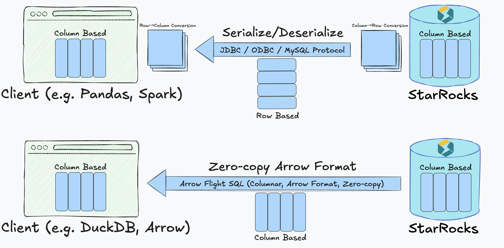
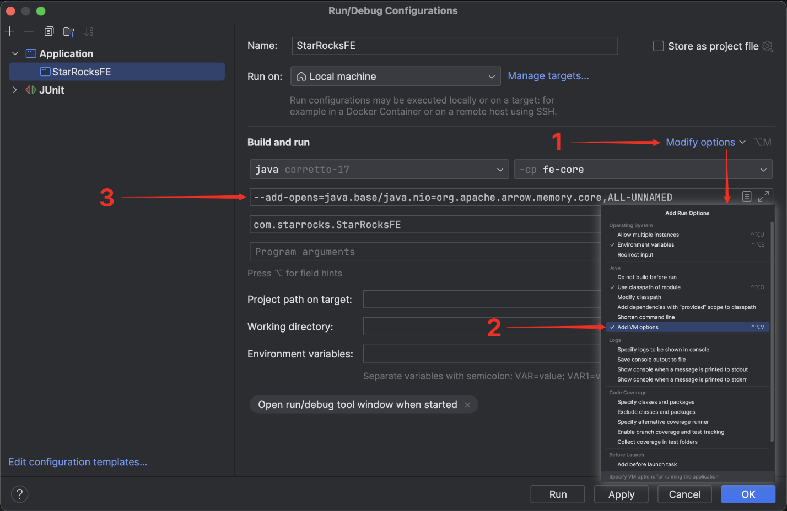

# 通过 Arrow Flight SQL 与 StarRocks 交互

从 v3.5.1 开始，StarRocks 支持通过 Apache Arrow Flight SQL 协议进行连接。

## 概述

通过 Arrow Flight SQL 协议，您可以使用 ADBC 驱动或 Arrow Flight SQL JDBC 驱动执行常规的 DDL、DML、DQL 语句，并通过 Python 或 Java 代码高效读取大规模数据。

该解决方案建立了一个从 StarRocks 列式执行引擎到客户端的全列式数据传输管道，消除了传统 JDBC 和 ODBC 接口中常见的频繁行列转换和序列化开销。这使得 StarRocks 能够实现零拷贝、低延迟和高吞吐量的数据传输。

### 应用场景

Arrow Flight SQL 集成让 StarRocks 特别适用于以下场景：

- 数据科学工作流：Pandas 和 Apache Arrow 等工具通常需要列式数据。
- 数据湖分析：需要以高吞吐、低延迟访问海量数据集。
- 机器学习：对快速迭代与处理速度有极高要求。
- 实时分析平台：需要尽可能低延迟地交付数据。

使用 Arrow Flight SQL，您将获得：

- 端到端列式数据传输，避免列式与行式格式之间的昂贵转换。
- 零拷贝数据移动，降低 CPU 和内存开销。
- 低延迟与极高吞吐量，加快分析和响应速度。

### 技术原理

在传统方式下，StarRocks 内部以列式 Block 结构组织查询结果。但使用 JDBC、ODBC 或 MySQL 协议时，数据必须经过：

1. 在服务器端序列化为行式字节流。
2. 通过网络传输。
3. 在客户端反序列化，并经常重新转换为列式格式。

此三步过程带来了：

- 高昂的序列化/反序列化开销。
- 复杂的数据转换逻辑。
- 随数据量增长而加剧的延迟。

Arrow Flight SQL 的集成通过以下方式解决了这些问题：

- 全程保持列式格式，从 StarRocks 执行引擎直达客户端。
- 利用 Apache Arrow 的内存列式表示，针对分析型负载进行优化。
- 通过 Arrow Flight 协议实现高性能传输，无需中间格式转换。



这一设计实现了真正的零拷贝传输，速度更快，资源效率更高。

此外，StarRocks 提供了支持 Arrow Flight SQL 的通用 JDBC 驱动，应用程序可以在不牺牲 JDBC 兼容性或与其他 Arrow Flight 系统互操作性的前提下，轻松接入这一路径。

### 性能对比

大量测试表明，数据读取速度显著提升。在多种数据类型（整数、浮点、字符串、布尔值和混合列）下，Arrow Flight SQL 始终优于传统 PyMySQL 与 Pandas `read_sql` 接口。主要结果包括：

- 读取一千万行整数数据时，执行时间从约 35 秒降至 0.4 秒（提升约 85 倍）。
- 混合列表的性能提升达到 160 倍。
- 即使是简单查询（如单列字符串），性能也提升超过 12 倍。

总体来看，Arrow Flight SQL 实现了：

- 根据查询复杂度和数据类型，传输速度提升 20–160 倍。
- 通过消除冗余的序列化步骤，显著降低 CPU 和内存使用。

这些性能优势直接带来更快的仪表盘、更高效的数据科学工作流，以及实时分析更大规模数据集的能力。

## 使用方法

按照以下步骤，通过 Arrow Flight SQL 协议使用 Python ADBC 驱动连接并与 StarRocks 交互。完整代码示例请参见[附录](#附录)。

:::note

Python 3.9 或更高版本是前提条件。

:::

### 步骤 1. 安装库

使用 `pip` 从 PyPI 安装 `adbc_driver_manager` 和 `adbc_driver_flightsql`：

```Bash
pip install adbc_driver_manager
pip install adbc_driver_flightsql
```

将以下模块或库导入到你的代码中：

- 必需的库：

```Python
import adbc_driver_manager
import adbc_driver_flightsql.dbapi as flight_sql
```

- 可选模块以提高可用性和调试：

```Python
import pandas as pd       # 可选：使用 DataFrame 更好地显示结果
import traceback          # 可选：在 SQL 执行期间提供详细的错误回溯
import time               # 可选：用于测量 SQL 执行时间
```

### 步骤 2. 连接到 StarRocks

:::note

- 如果你想使用命令行启动 FE 服务，可以使用以下任一方式：

  - 指定环境变量 `JAVA_TOOL_OPTIONS`。

    ```Bash
    export JAVA_TOOL_OPTIONS="--add-opens=java.base/java.nio=org.apache.arrow.memory.core,ALL-UNNAMED"
    ```

  - 在 **fe.conf** 中指定 FE 配置项 `JAVA_OPTS`。这样，你可以追加其他 `JAVA_OPTS` 值。

    ```Bash
    JAVA_OPTS="--add-opens=java.base/java.nio=org.apache.arrow.memory.core,ALL-UNNAMED ..."
    ```

- 如果你想在 IntelliJ IDEA 中运行服务，必须在 `Run/Debug Configurations` 中的 `Build and run` 添加以下选项：

  ```Bash
  --add-opens=java.base/java.nio=org.apache.arrow.memory.core,ALL-UNNAMED
  ```

:::

#### 配置 StarRocks

在通过 Arrow Flight SQL 连接到 StarRocks 之前，必须先配置 FE 和 BE 节点，以确保 Arrow Flight SQL 服务已启用并监听指定端口。

在 FE 配置文件 **fe.conf** 和 BE 配置文件 **be.conf** 中，将 `arrow_flight_port` 设置为可用端口。修改配置文件后，重启 FE 和 BE 服务以使修改生效。

:::note

你必须为 FE 和 BE 设置不同的 `arrow_flight_port`。

:::

示例：

```Properties
// fe.conf
arrow_flight_port = 9408
// be.conf
arrow_flight_port = 9419
```

#### 建立连接

在客户端，使用以下信息创建一个 Arrow Flight SQL 客户端：

- StarRocks FE 的主机地址
- Arrow Flight 在 StarRocks FE 上监听的端口
- 拥有必要权限的 StarRocks 用户的用户名和密码

示例：

```Python
FE_HOST = "127.0.0.1"
FE_PORT = 9408

conn = flight_sql.connect(
    uri=f"grpc://{FE_HOST}:{FE_PORT}",
    db_kwargs={
        adbc_driver_manager.DatabaseOptions.USERNAME.value: "root",
        adbc_driver_manager.DatabaseOptions.PASSWORD.value: "",
    }
)
cursor = conn.cursor()
```

连接建立后，你可以通过返回的 Cursor 执行 SQL 语句与 StarRocks 交互。

### 步骤 3. （可选）预定义工具函数

这些函数用于格式化输出、标准化格式和简化调试。你可以在代码中可选地定义它们以进行测试。

```Python
# =============================================================================
# 工具函数，用于更好的输出格式化和 SQL 执行
# =============================================================================

# 打印章节标题
def print_header(title: str):
    """
    打印章节标题以提高可读性。
    """
    print("\n" + "=" * 80)
    print(f"🟢 {title}")
    print("=" * 80)

# 打印正在执行的 SQL 语句
def print_sql(sql: str):
    """
    在执行前打印 SQL 语句。
    """
    print(f"\n🟡 SQL:\n{sql.strip()}")

# 打印结果 DataFrame
def print_result(df: pd.DataFrame):
    """
    以可读格式打印结果 DataFrame。
    """
    if df.empty:
        print("\n🟢 Result: (no rows returned)\n")
    else:
        print("\n🟢 Result:\n")
        print(df.to_string(index=False))

# 打印错误回溯
def print_error(e: Exception):
    """
    如果 SQL 执行失败，打印错误回溯。
    """
    print("\n🔴 Error occurred:")
    traceback.print_exc()

# 执行 SQL 语句并打印结果
def execute(sql: str):
    """
    执行 SQL 语句并打印结果和执行时间。
    """
    print_sql(sql)
    try:
        start = time.time()  # 可选：开始时间，用于测量执行时间
        cursor.execute(sql)
        result = cursor.fetchallarrow()  # Arrow 表
        df = result.to_pandas()  # 可选：转换为 DataFrame 以便更好地显示
        print_result(df)
        print(f"\n⏱️  Execution time: {time.time() - start:.3f} seconds")
    except Exception as e:
        print_error(e)
```

### 步骤 4. 与 StarRocks 交互

本节将指导你完成一些基本操作，例如创建表、导入数据、检查表结构、设置变量和运行查询。

:::note

以下列出的输出示例是基于前述步骤中描述的可选模块和工具函数实现的。

:::

1. 创建一个数据库和一个将导入数据的表，并检查表结构。

   ```Python
   # Step 1: Drop and create database
   print_header("Step 1: Drop and Create Database")
   execute("DROP DATABASE IF EXISTS sr_arrow_flight_sql FORCE;")
   execute("SHOW DATABASES;")
   execute("CREATE DATABASE sr_arrow_flight_sql;")
   execute("SHOW DATABASES;")
   execute("USE sr_arrow_flight_sql;")
   
   # Step 2: Create table
   print_header("Step 2: Create Table")
   execute("""
   CREATE TABLE sr_arrow_flight_sql_test
   (
       k0 INT,
       k1 DOUBLE,
       k2 VARCHAR(32) NULL DEFAULT "" COMMENT "",
       k3 DECIMAL(27,9) DEFAULT "0",
       k4 BIGINT NULL DEFAULT '10',
       k5 DATE
   )
   DISTRIBUTED BY HASH(k5) BUCKETS 5
   PROPERTIES("replication_num" = "1");
   """)
   execute("SHOW CREATE TABLE sr_arrow_flight_sql_test;")
   ```

   示例输出：

   ```SQL
   ================================================================================
   🟢 Step 1: Drop and Create Database
   ================================================================================
   
   🟡 SQL:
   DROP DATABASE IF EXISTS sr_arrow_flight_sql FORCE;
   /Users/starrocks/test/venv/lib/python3.9/site-packages/adbc_driver_manager/dbapi.py:307: Warning: Cannot disable autocommit; conn will not be DB-API 2.0 compliant
     warnings.warn(
   
   🟢 Result:
   
   StatusResult
              0
   
   ⏱️  Execution time: 0.025 seconds
   
   🟡 SQL:
   SHOW DATABASES;
   
   🟢 Result:
      
             Database
         _statistics_
                 hits
   information_schema
                  sys
   
   ⏱️  Execution time: 0.014 seconds
   
   🟡 SQL:
   CREATE DATABASE sr_arrow_flight_sql;
   
   🟢 Result:
   
   StatusResult
              0
   
   ⏱️  Execution time: 0.012 seconds
   
   🟡 SQL:
   SHOW DATABASES;
   
   🟢 Result:
   
              Database
          _statistics_
                  hits
    information_schema
   sr_arrow_flight_sql
                   sys
   
   ⏱️  Execution time: 0.005 seconds
   
   🟡 SQL:
   USE sr_arrow_flight_sql;
   
   🟢 Result:
   
   StatusResult
              0
   
   ⏱️  Execution time: 0.006 seconds
   
   ================================================================================
   🟢 Step 2: Create Table
   ================================================================================
   
   🟡 SQL:
   CREATE TABLE sr_arrow_flight_sql_test
   (
       k0 INT,
       k1 DOUBLE,
       k2 VARCHAR(32) NULL DEFAULT "" COMMENT "",
       k3 DECIMAL(27,9) DEFAULT "0",
       k4 BIGINT NULL DEFAULT '10',
       k5 DATE
   )
   DISTRIBUTED BY HASH(k5) BUCKETS 5
   PROPERTIES("replication_num" = "1");
   
   🟢 Result:
   
   StatusResult
              0
   
   ⏱️  Execution time: 0.021 seconds
   
   🟡 SQL:
   SHOW CREATE TABLE sr_arrow_flight_sql_test;
   
   🟢 Result:
   
                      Table                                                                                                                                                                                                                                                                                                                                                                                                                                                                                                  Create Table
   sr_arrow_flight_sql_test CREATE TABLE `sr_arrow_flight_sql_test` (\n  `k0` int(11) NULL COMMENT "",\n  `k1` double NULL COMMENT "",\n  `k2` varchar(32) NULL DEFAULT "" COMMENT "",\n  `k3` decimal(27, 9) NULL DEFAULT "0" COMMENT "",\n  `k4` bigint(20) NULL DEFAULT "10" COMMENT "",\n  `k5` date NULL COMMENT ""\n) ENGINE=OLAP \nDUPLICATE KEY(`k0`)\nDISTRIBUTED BY HASH(`k5`) BUCKETS 5 \nPROPERTIES (\n"compression" = "LZ4",\n"fast_schema_evolution" = "true",\n"replicated_storage" = "true",\n"replication_num" = "1"\n);
   
   ⏱️  Execution time: 0.005 seconds
   ```

2. 插入数据，运行一些查询，并设置变量。

   ```Python
   # Step 3: Insert data
   print_header("Step 3: Insert Data")
   execute("""
   INSERT INTO sr_arrow_flight_sql_test VALUES
       (0, 0.1, "ID", 0.0001, 1111111111, '2025-04-21'),
       (1, 0.20, "ID_1", 1.00000001, 0, '2025-04-21'),
       (2, 3.4, "ID_1", 3.1, 123456, '2025-04-22'),
       (3, 4, "ID", 4, 4, '2025-04-22'),
       (4, 122345.54321, "ID", 122345.54321, 5, '2025-04-22');
   """)
   
   # Step 4: Query data
   print_header("Step 4: Query Data")
   execute("SELECT * FROM sr_arrow_flight_sql_test ORDER BY k0;")
   
   # Step 5: Session variables
   print_header("Step 5: Session Variables")
   execute("SHOW VARIABLES LIKE '%query_mem_limit%';")
   execute("SET query_mem_limit = 2147483648;")
   execute("SHOW VARIABLES LIKE '%query_mem_limit%';")
   
   # Step 6: Aggregation query
   print_header("Step 6: Aggregation Query")
   execute("""
   SELECT k5, SUM(k1) AS total_k1, COUNT(1) AS row_count, AVG(k3) AS avg_k3
   FROM sr_arrow_flight_sql_test
   GROUP BY k5
   ORDER BY k5;
   """)
   ```

   示例输出：

   ```SQL
   ================================================================================
   🟢 Step 3: Insert Data
   ================================================================================
   
   🟡 SQL:
   INSERT INTO sr_arrow_flight_sql_test VALUES
       (0, 0.1, "ID", 0.0001, 1111111111, '2025-04-21'),
       (1, 0.20, "ID_1", 1.00000001, 0, '2025-04-21'),
       (2, 3.4, "ID_1", 3.1, 123456, '2025-04-22'),
       (3, 4, "ID", 4, 4, '2025-04-22'),
       (4, 122345.54321, "ID", 122345.54321, 5, '2025-04-22');
   
   🟢 Result:
   
   StatusResult
              0
   
   ⏱️  Execution time: 0.149 seconds
   
   ================================================================================
   🟢 Step 4: Query Data
   ================================================================================
   
   🟡 SQL:
   SELECT * FROM sr_arrow_flight_sql_test ORDER BY k0;
   
   🟢 Result:
                                                                
   0      0.10000   ID      0.000100000 1111111111 2025-04-21
   1      0.20000 ID_1      1.000000010          0 2025-04-21
   2      3.40000 ID_1      3.100000000     123456 2025-04-22
   3      4.00000   ID      4.000000000          4 2025-04-22
   4 122345.54321   ID 122345.543210000          5 2025-04-22
   
   ⏱️  Execution time: 0.019 seconds
   
   ================================================================================
   🟢 Step 5: Session Variables
   ================================================================================
   
   🟡 SQL:
   SHOW VARIABLES LIKE '%query_mem_limit%';
   
   🟢 Result:
   
     Variable_name Value
   query_mem_limit     0
   
   ⏱️  Execution time: 0.005 seconds
   
   🟡 SQL:
   SET query_mem_limit = 2147483648;
   
   🟢 Result:
   
   StatusResult
              0
      
   ⏱️  Execution time: 0.007 seconds
   
   🟡 SQL:
   SHOW VARIABLES LIKE '%query_mem_limit%';
   
   🟢 Result:
   
     Variable_name        Value
     query_mem_limit 2147483648
   
   ⏱️  Execution time: 0.005 seconds
   
   ================================================================================
   🟢 Step 6: Aggregation Query
   ================================================================================
   
   🟡 SQL:
   SELECT k5, SUM(k1) AS total_k1, COUNT(1) AS row_count, AVG(k3) AS avg_k3
   FROM sr_arrow_flight_sql_test
   GROUP BY k5
   ORDER BY k5;
   
   🟢 Result:
                                                  
   2025-04-21      0.30000 2     0.500050005000
   2025-04-22 122352.94321 3 40784.214403333333
      
   ⏱️  Execution time: 0.014 second
   ```

### 步骤 5. 关闭连接

在代码中包含以下部分以关闭连接。

```Python
# Step 7: Close
print_header("Step 7: Close Connection")
cursor.close()
conn.close()
print("✅ Test completed successfully.")
```

示例输出：

```Python
================================================================================
🟢 Step 7: Close Connection
================================================================================
✅ Test completed successfully.

Process finished with exit code 0
```

## 大规模数据传输的用例

### Python

在通过 ADBC 驱动在 Python 中连接到支持 Arrow Flight SQL 的 StarRocks 后，你可以使用各种 ADBC API 将 Clickbench 数据集从 StarRocks 导入到 Python 中。

代码示例：

```Python
#!/usr/bin/env python
# -*- coding: utf-8 -*-

import adbc_driver_manager
import adbc_driver_flightsql.dbapi as flight_sql
from datetime import datetime

# ----------------------------------------
# StarRocks Flight SQL 连接设置
# ----------------------------------------
# 根据需要替换 URI 和凭据
my_uri = "grpc://127.0.0.1:9408"  # StarRocks 的默认 Flight SQL 端口
my_db_kwargs = {
    adbc_driver_manager.DatabaseOptions.USERNAME.value: "root",
    adbc_driver_manager.DatabaseOptions.PASSWORD.value: "",
}

# ----------------------------------------
# SQL 查询 (ClickBench: hits 表)
# ----------------------------------------
# 根据需要替换为实际的表和数据集
sql = "SELECT * FROM clickbench.hits LIMIT 1000000;"  # 读取 100 万行

# ----------------------------------------
# 方法 1: fetchallarrow + to_pandas
# ----------------------------------------
def test_fetchallarrow():
    conn = flight_sql.connect(uri=my_uri, db_kwargs=my_db_kwargs)
    cursor = conn.cursor()
    start = datetime.now()
    cursor.execute(sql)
    arrow_table = cursor.fetchallarrow()
    df = arrow_table.to_pandas()
    duration = datetime.now() - start

```Python
    print("\n[Method 1] fetchallarrow + to_pandas")
    print(f"Time taken: {duration}, Arrow table size: {arrow_table.nbytes / 1024 / 1024:.2f} MB, Rows: {len(df)}")
    print(df.info(memory_usage='deep'))

# ----------------------------------------
# 方法 2: fetch_df (推荐)
# ----------------------------------------
def test_fetch_df():
    conn = flight_sql.connect(uri=my_uri, db_kwargs=my_db_kwargs)
    cursor = conn.cursor()
    start = datetime.now()
    cursor.execute(sql)
    df = cursor.fetch_df()
    duration = datetime.now() - start

    print("\n[Method 2] fetch_df (recommended)")
    print(f"Time taken: {duration}, Rows: {len(df)}")
    print(df.info(memory_usage='deep'))

# ----------------------------------------
# 方法 3: adbc_execute_partitions (用于并行读取)
# ----------------------------------------
def test_execute_partitions():
    conn = flight_sql.connect(uri=my_uri, db_kwargs=my_db_kwargs)
    cursor = conn.cursor()
    start = datetime.now()
    partitions, schema = cursor.adbc_execute_partitions(sql)

    # 读取第一个分区（用于演示）
    cursor.adbc_read_partition(partitions[0])
    arrow_table = cursor.fetchallarrow()
    df = arrow_table.to_pandas()
    duration = datetime.now() - start

    print("\n[Method 3] adbc_execute_partitions (parallel read)")
    print(f"Time taken: {duration}, Partitions: {len(partitions)}, Rows: {len(df)}")
    print(df.info(memory_usage='deep'))

# ----------------------------------------
# 运行所有测试
# ----------------------------------------
if __name__ == "__main__":
    test_fetchallarrow()
    test_fetch_df()
    test_execute_partitions()
```

结果表明，从 StarRocks 加载 100 万行 Clickbench 数据集（105 列，780 MB）仅用了 3 秒。

```Python
[Method 1] fetchallarrow + to_pandas
Time taken: 0:00:03.219575, Arrow table size: 717.42 MB, Rows: 1000000
<class 'pandas.core.frame.DataFrame'>
RangeIndex: 1000000 entries, 0 to 999999
Columns: 105 entries, CounterID to CLID
dtypes: int16(48), int32(19), int64(6), object(32)
memory usage: 2.4 GB

[Method 2] fetch_df (recommended)
Time taken: 0:00:02.358840, Rows: 1000000
<class 'pandas.core.frame.DataFrame'>
RangeIndex: 1000000 entries, 0 to 999999
Columns: 105 entries, CounterID to CLID
dtypes: int16(48), int32(19), int64(6), object(32)
memory usage: 2.4 GB

[Method 3] adbc_execute_partitions (parallel read)
Time taken: 0:00:02.231144, Partitions: 1, Rows: 1000000
<class 'pandas.core.frame.DataFrame'>
RangeIndex: 1000000 entries, 0 to 999999
Columns: 105 entries, CounterID to CLID
dtypes: int16(48), int32(19), int64(6), object(32)
memory usage: 2.4 GB
```

### Arrow Flight SQL JDBC 驱动

Arrow Flight SQL 协议提供了一个开源的 JDBC 驱动，与标准 JDBC 接口兼容。你可以轻松地将其集成到各种 BI 工具（如 Tableau、Power BI、DBeaver 等）中，以访问 StarRocks 数据库，就像使用传统的 JDBC 驱动一样。该驱动的一个显著优势是支持基于 Apache Arrow 的高速数据传输，大大提高了查询和数据传输的效率。使用方式几乎与传统的 MySQL JDBC 驱动相同。你只需在连接 URL 中将 `jdbc:mysql` 替换为 `jdbc:arrow-flight-sql` 即可无缝切换。查询结果仍以标准 `ResultSet` 格式返回，确保与现有 JDBC 处理逻辑的兼容性。

:::note

请注意，如果你使用的是 Java 9 或更高版本，必须在 Java 代码中添加 `--add-opens=java.base/java.nio=ALL-UNNAMED` 以公开 JDK 的内部结构。否则，可能会遇到某些错误。

- 如果你想使用命令行启动 FE 服务，可以使用以下任一方式：

  - 指定环境变量 `JAVA_TOOL_OPTIONS`。

    ```Bash
    export JAVA_TOOL_OPTIONS="--add-opens=java.base/java.nio=org.apache.arrow.memory.core,ALL-UNNAMED"
    ```

  - 在 **fe.conf** 中指定 FE 配置项 `JAVA_OPTS`。这样，你可以追加其他 `JAVA_OPTS` 值。

    ```Bash
    JAVA_OPTS="--add-opens=java.base/java.nio=org.apache.arrow.memory.core,ALL-UNNAMED ..."
    ```

- 如果你想在 IntelliJ IDEA 中进行调试，必须在 `Run/Debug Configurations` 中的 `Build and run` 添加以下选项：

  ```Bash
  --add-opens=java.base/java.nio=org.apache.arrow.memory.core,ALL-UNNAMED
  ```



:::

<details>

  <summary><b>点击此处查看 POM 依赖项</b></summary>

```XML
<properties>
    <adbc.version>0.15.0</adbc.version>
</properties>

<dependencies>
    <dependency>
        <groupId>org.apache.arrow.adbc</groupId>
        <artifactId>adbc-driver-jdbc</artifactId>
        <version>${adbc.version}</version>
    </dependency>
    <dependency>
        <groupId>org.apache.arrow.adbc</groupId>
        <artifactId>adbc-core</artifactId>
        <version>${adbc.version}</version>
    </dependency>
    <dependency>
        <groupId>org.apache.arrow.adbc</groupId>
        <artifactId>adbc-driver-manager</artifactId>
        <version>${adbc.version}</version>
    </dependency>
    <dependency>
        <groupId>org.apache.arrow.adbc</groupId>
        <artifactId>adbc-sql</artifactId>
        <version>${adbc.version}</version>
    </dependency>
    <dependency>
        <groupId>org.apache.arrow.adbc</groupId>
        <artifactId>adbc-driver-flight-sql</artifactId>
        <version>${adbc.version}</version>
    </dependency>
</dependencies>
```

</details>

代码示例：

```Java
import java.sql.Connection;
import java.sql.DriverManager;
import java.sql.ResultSet;
import java.sql.Statement;

public class ArrowFlightSqlIntegrationTest {

    private static final String JDBC_URL = "jdbc:arrow-flight-sql://127.0.0.1:9408"
            + "?useEncryption=false"
            + "&useServerPrepStmts=false"
            + "&useSSL=false"
            + "&useArrowFlightSql=true";

    private static final String USER = "root";
    private static final String PASSWORD = "";

    private static int testCaseNum = 1;

    public static void main(String[] args) {
        try {
            // 加载 Arrow Flight SQL JDBC 驱动
            Class.forName("org.apache.arrow.driver.jdbc.ArrowFlightJdbcDriver");

            try (Connection conn = DriverManager.getConnection(JDBC_URL, USER, PASSWORD);
                    Statement stmt = conn.createStatement()) {

                testUpdate(stmt, "DROP DATABASE IF EXISTS sr_arrow_flight_sql FORCE;");
                testQuery(stmt, "SHOW PROCESSLIST;");
                testUpdate(stmt, "CREATE DATABASE sr_arrow_flight_sql;");
                testQuery(stmt, "SHOW DATABASES;");
                testUpdate(stmt, "USE sr_arrow_flight_sql;");
                testUpdate(stmt, "CREATE TABLE sr_table_test (id INT, name STRING) ENGINE=OLAP PRIMARY KEY (id) " +
                        "DISTRIBUTED BY HASH(id) BUCKETS 1 " +
                        "PROPERTIES ('replication_num' = '1');");
                testUpdate(stmt, "INSERT INTO sr_table_test VALUES (1, 'Alice'), (2, 'Bob');");
                testQuery(stmt, "SELECT * FROM sr_arrow_flight_sql.sr_table_test;");
            }
        } catch (Exception e) {
            e.printStackTrace();
        }

    }

    /**
     * 执行查询并将结果打印到控制台。
     */
    private static void testQuery(Statement stmt, String sql) throws Exception {
        System.out.println("Test Case: " + testCaseNum);
        System.out.println("▶ Executing query: " + sql);
        ResultSet rs = stmt.executeQuery(sql);
        try {
            System.out.println("Result:");
            int columnCount = rs.getMetaData().getColumnCount();
            while (rs.next()) {
                for (int i = 1; i <= columnCount; i++) {
                    System.out.print(rs.getString(i) + "\t");
                }
                System.out.println();
            }
        } finally {
            rs.close();
        }
        testCaseNum++;
        System.out.println();
    }

    /**
     * 执行更新（DDL 或 DML）并将结果打印到控制台。
     */
    private static void testUpdate(Statement stmt, String sql) throws Exception {
        System.out.println("Test Case: " + testCaseNum);
        System.out.println("▶ Executing update: " + sql);
        stmt.executeUpdate(sql);
        System.out.println("Result: ✅ Success");
        testCaseNum++;
        System.out.println();
    }
}
```

执行结果：

```Bash
Test Case: 1
▶ Executing update: DROP DATABASE IF EXISTS sr_arrow_flight_sql FORCE;
Result: ✅ Success

Test Case: 2
▶ Executing query: SHOW PROCESSLIST;
Result:
192.168.124.48_9010_1751449846872	16777217	root			Query	2025-07-02 18:46:49	0	OK	SHOW PROCESSLIST;	false	default_warehouse	

Test Case: 3
▶ Executing update: CREATE DATABASE sr_arrow_flight_sql;
Result: ✅ Success

Test Case: 4
▶ Executing query: SHOW DATABASES;
Result:
_statistics_	
information_schema	
sr_arrow_flight_sql	
sys	

Test Case: 5
▶ Executing update: USE sr_arrow_flight_sql;
Result: ✅ Success

Test Case: 6
▶ Executing update: CREATE TABLE sr_table_test (id INT, name STRING) ENGINE=OLAP PRIMARY KEY (id) DISTRIBUTED BY HASH(id) BUCKETS 1 PROPERTIES ('replication_num' = '1');
Result: ✅ Success

Test Case: 7
▶ Executing update: INSERT INTO sr_table_test VALUES (1, 'Alice'), (2, 'Bob');
Result: ✅ Success

Test Case: 8
▶ Executing query: SELECT * FROM sr_arrow_flight_sql.sr_table_test;
Result:
1	Alice	
2	Bob
```

### Java ADBC 驱动

Arrow Flight SQL 协议提供了一个开源的 JDBC 驱动，与标准 JDBC 接口兼容。你可以轻松地将其集成到各种 BI 工具（如 Tableau、Power BI、DBeaver 等）中，以访问 StarRocks 数据库，就像使用传统的 JDBC 驱动一样。该驱动的一个显著优势是支持基于 Apache Arrow 的高速数据传输，大大提高了查询和数据传输的效率。使用方式几乎与传统的 MySQL JDBC 驱动相同。

:::note

- 如果你想使用命令行启动 FE 服务，可以使用以下任一方式：

  - 指定环境变量 `JAVA_TOOL_OPTIONS`。

    ```Bash
    export JAVA_TOOL_OPTIONS="--add-opens=java.base/java.nio=org.apache.arrow.memory.core,ALL-UNNAMED"
    ```

  - 在 **fe.conf** 中指定 FE 配置项 `JAVA_OPTS`。这样，你可以追加其他 `JAVA_OPTS` 值。

    ```Bash
    JAVA_OPTS="--add-opens=java.base/java.nio=org.apache.arrow.memory.core,ALL-UNNAMED ..."
    ```

- 如果你想在 IntelliJ IDEA 中进行调试，必须在 `Run/Debug Configurations` 中的 `Build and run` 添加以下选项：

  ```Bash
  --add-opens=java.base/java.nio=org.apache.arrow.memory.core,ALL-UNNAMED
  ```

:::

<details>

  <summary>POM 依赖项</summary>

```XML
<properties>
    <adbc.version>0.15.0</adbc.version>
</properties>

<dependencies>
    <dependency>
        <groupId>org.apache.arrow.adbc</groupId>
        <artifactId>adbc-driver-jdbc</artifactId>
        <version>${adbc.version}</version>
    </dependency>
    <dependency>
        <groupId>org.apache.arrow.adbc</groupId>
        <artifactId>adbc-core</artifactId>
        <version>${adbc.version}</version>
    </dependency>
    <dependency>
        <groupId>org.apache.arrow.adbc</groupId>
        <artifactId>adbc-driver-manager</artifactId>
        <version>${adbc.version}</version>
    </dependency>
    <dependency>
        <groupId>org.apache.arrow.adbc</groupId>
        <artifactId>adbc-sql</artifactId>
        <version>${adbc.version}</version>
    </dependency>
    <dependency>
        <groupId>org.apache.arrow.adbc</groupId>
        <artifactId>adbc-driver-flight-sql</artifactId>
        <version>${adbc.version}</version>
    </dependency>
</dependencies>
```

</details>

与 Python 中类似，你也可以直接在 Java 中创建 ADBC 客户端以从 StarRocks 读取数据。

在此过程中，你首先需要获取 FlightInfo，然后连接到每个 Endpoint 以获取数据。

代码示例：

```Java
public static void main(String[] args) throws Exception {
    try (BufferAllocator allocator = new RootAllocator()) {
        FlightSqlDriver driver = new FlightSqlDriver(allocator);

        Map<String, Object> parameters = new HashMap<>();
        String host = "localhost";
        int port = 9408;
        String uri = Location.forGrpcInsecure(host, port).getUri().toString();

        AdbcDriver.PARAM_URI.set(parameters, uri);
        AdbcDriver.PARAM_USERNAME.set(parameters, "root");
        AdbcDriver.PARAM_PASSWORD.set(parameters, "");

        try (AdbcDatabase database = driver.open(parameters);
                AdbcConnection connection = database.connect();
                AdbcStatement statement = connection.createStatement()) {

            statement.setSqlQuery("SHOW DATABASES;");

            try (AdbcStatement.QueryResult result = statement.executeQuery();
                    ArrowReader reader = result.getReader()) {

                int batchCount = 0;
                while (reader.loadNextBatch()) {
                    batchCount++;
                    VectorSchemaRoot root = reader.getVectorSchemaRoot();
                    System.out.println("Batch " + batchCount + ":");
                    System.out.println(root.contentToTSVString());
                }

                System.out.println("Total batches: " + batchCount);
            }
        }
    }
}
```

#### 建议

- 在上述三种 Java Arrow Flight SQL 连接方法中：
  - 如果后续数据分析依赖于基于行的数据格式，建议使用 `jdbc:arrow-flight-sql`，它以 JDBC ResultSet 格式返回数据。
  - 如果分析可以直接处理 Arrow 格式或其他列式数据格式，可以使用 Flight AdbcDriver 或 Flight JdbcDriver。这些选项直接返回 Arrow 格式的数据，避免行列转换，并利用 Arrow 的特性加速数据解析。

- 无论是解析 JDBC ResultSet 还是 Arrow 格式数据，解析时间通常比读取数据本身的时间更长。如果发现 Arrow Flight SQL 没有带来预期的性能提升，可以调查数据解析是否耗时过长。

- 对于所有连接方法，使用 JDK 17 读取数据通常比使用 JDK 1.8 更快。

- 在读取大规模数据集时，Arrow Flight SQL 通常比 `jdbc:mysql://` 消耗更少的内存。因此，如果遇到内存限制，也值得尝试 Arrow Flight SQL。

- 除了上述三种连接方法外，你还可以使用原生 FlightClient 连接到 Arrow Flight Server，从而实现更灵活的多端点并行读取。Java Flight AdbcDriver 构建在 FlightClient 之上，提供了比直接使用 FlightClient 更简单的接口。

### Spark

目前，官方的 Arrow Flight 项目没有计划支持 Spark 或 Flink。未来将逐步添加支持，以允许 [starrocks-spark-connector](https://github.com/qwshen/spark-flight-connector) 通过 Arrow Flight SQL 访问 StarRocks，预计读取性能将提升数倍。

在使用 Spark 访问 StarRocks 时，除了传统的 JDBC 或 Java 客户端方法外，你还可以使用开源的 Spark-Flight-Connector 组件，直接从 StarRocks Flight SQL Server 读取和写入数据，作为 Spark DataSource。基于 Apache Arrow Flight 协议的这种方法具有以下显著优势：

- **高性能数据传输** Spark-Flight-Connector 使用 Apache Arrow 作为数据传输格式，实现零拷贝、高效的数据交换。StarRocks 的 `internal Block` 数据格式与 Arrow 之间的转换效率极高，相较于传统的 `CSV` 或 `JDBC` 方法，性能提升可达 10 倍，显著降低了数据传输开销。
- **对复杂数据类型的原生支持** Arrow 数据格式原生支持复杂类型（如 `Map`、`Array`、`Struct` 等），相比传统 JDBC 方法，更好地适应 StarRocks 的复杂数据模型，增强了数据的表达能力和兼容性。
- **支持读、写和流式写入** 该组件支持 Spark 作为 Flight SQL 客户端进行高效的读写操作，包括 `insert`、`merge`、`update` 和 `delete` DML 语句，甚至支持流式写入，适用于实时数据处理场景。
- **支持谓词下推和列裁剪** 在读取数据时，Spark-Flight-Connector 支持谓词下推和列裁剪，能够在 StarRocks 端进行数据过滤和列选择，显著减少传输数据量，提高查询性能。
- **支持聚合下推和并行读取** 聚合操作（如 `sum`、`count`、`max`、`min` 等）可以下推到 StarRocks 执行，减少 Spark 的计算负担。还支持基于分区的并行读取，提高大数据场景下的读取效率。
- **更适合大数据场景** 相较于传统 JDBC 方法，Flight SQL 协议更适合大规模、高并发访问场景，使 StarRocks 能够充分发挥其高性能分析能力。

## 附录

以下是使用教程中的完整代码示例。

```Python
# =============================================================================
# StarRocks Arrow Flight SQL 测试脚本
# =============================================================================
# pip install adbc_driver_manager adbc_driver_flightsql pandas
# =============================================================================

# =============================================================================
# 连接 StarRocks 所需的核心模块，通过 Arrow Flight SQL
# =============================================================================
import adbc_driver_manager
import adbc_driver_flightsql.dbapi as flight_sql

# =============================================================================
# 可选模块以提高可用性和调试
# =============================================================================
import pandas as pd       # 可选：使用 DataFrame 更好地显示结果
import traceback          # 可选：在 SQL 执行期间提供详细的错误回溯
import time               # 可选：用于测量 SQL 执行时间

# =============================================================================
# StarRocks Flight SQL 配置
# =============================================================================
FE_HOST = "127.0.0.1"
FE_PORT = 9408

# =============================================================================
# 连接到 StarRocks
# =============================================================================
conn = flight_sql.connect(
    uri=f"grpc://{FE_HOST}:{FE_PORT}",
    db_kwargs={
        adbc_driver_manager.DatabaseOptions.USERNAME.value: "root",
        adbc_driver_manager.DatabaseOptions.PASSWORD.value: "",
    }
)

cursor = conn.cursor()

# =============================================================================
# 工具函数，用于更好的输出格式化和 SQL 执行
# =============================================================================

def print_header(title: str):
    """
    打印章节标题以提高可读性。
    """
    print("\n" + "=" * 80)
    print(f"🟢 {title}")
    print("=" * 80)


def print_sql(sql: str):
    """
    在执行前打印 SQL 语句。
    """
    print(f"\n🟡 SQL:\n{sql.strip()}")


def print_result(df: pd.DataFrame):
    """
    以可读格式打印结果 DataFrame。
    """
    if df.empty:
        print("\n🟢 Result: (no rows returned)\n")
    else:
        print("\n🟢 Result:\n")
        print(df.to_string(index=False))


def print_error(e: Exception):
    """
    如果 SQL 执行失败，打印错误回溯。
    """
    print("\n🔴 Error occurred:")
    traceback.print_exc()


def execute(sql: str):
    """
    执行 SQL 语句并打印结果和执行时间。
    """
    print_sql(sql)
    try:
        start = time.time()  # 开始时间，用于测量执行时间
        cursor.execute(sql)
        result = cursor.fetchallarrow()  # Arrow 表
        df = result.to_pandas()          # 转换为 DataFrame 以便更好地显示
        print_result(df)
        print(f"\n⏱️  Execution time: {time.time() - start:.3f} seconds")
    except Exception as e:
        print_error(e)

# =============================================================================
# 步骤 1: 删除并创建数据库
# =============================================================================
print_header("Step 1: Drop and Create Database")
execute("DROP DATABASE IF EXISTS sr_arrow_flight_sql FORCE;")
execute("SHOW DATABASES;")
execute("CREATE DATABASE sr_arrow_flight_sql;")
execute("SHOW DATABASES;")
execute("USE sr_arrow_flight_sql;")

# =============================================================================
# 步骤 2: 创建表
# =============================================================================
print_header("Step 2: Create Table")
execute("""
CREATE TABLE sr_arrow_flight_sql_test
(
    k0 INT,
    k1 DOUBLE,
    k2 VARCHAR(32) NULL DEFAULT "" COMMENT "",
    k3 DECIMAL(27,9) DEFAULT "0",
    k4 BIGINT NULL DEFAULT '10',
    k5 DATE
)
DISTRIBUTED BY HASH(k5) BUCKETS 5
PROPERTIES("replication_num" = "1");
""")

execute("SHOW CREATE TABLE sr_arrow_flight_sql_test;")

# =============================================================================
# 步骤 3: 插入数据
# =============================================================================
print_header("Step 3: Insert Data")
execute("""
INSERT INTO sr_arrow_flight_sql_test VALUES
    (0, 0.1, "ID", 0.0001, 1111111111, '2025-04-21'),
    (1, 0.20, "ID_1", 1.00000001, 0, '2025-04-21'),
    (2, 3.4, "ID_1", 3.1, 123456, '2025-04-22'),
    (3, 4, "ID", 4, 4, '2025-04-22'),
    (4, 122345.54321, "ID", 122345.54321, 5, '2025-04-22');
""")

# =============================================================================
# 步骤 4: 查询数据
# =============================================================================
print_header("Step 4: Query Data")
execute("SELECT * FROM sr_arrow_flight_sql_test ORDER BY k0;")

# =============================================================================
# 步骤 5: 会话变量
# =============================================================================
print_header("Step 5: Session Variables")
execute("SHOW VARIABLES LIKE '%query_mem_limit%';")
execute("SET query_mem_limit = 2147483648;")
execute("SHOW VARIABLES LIKE '%query_mem_limit%';")

# =============================================================================
# 步骤 6: 聚合查询
# =============================================================================
print_header("Step 6: Aggregation Query")
execute("""
SELECT k5, SUM(k1) AS total_k1, COUNT(1) AS row_count, AVG(k3) AS avg_k3
FROM sr_arrow_flight_sql_test
GROUP BY k5
ORDER BY k5;
""")

# =============================================================================
# 步骤 7: 关闭连接
# =============================================================================
print_header("Step 7: Close Connection")
cursor.close()
conn.close()
print("✅ Test completed successfully.")
```
