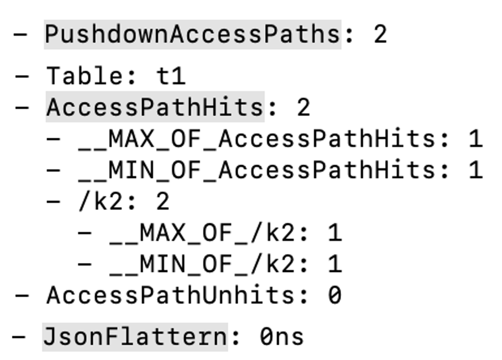

# [Preview] Flat JSON

本文介绍 Flat JSON 的基本概念，以及如何使用该功能。

自 2.2.0 版本起，StarRocks 支持 JSON 数据类型，用于支持更加灵活的数据存储。但在查询 JSON 时，大部分场景并不是直接读取完整的 JSON 数据，而是访问指定路径下的数据，举例：

```SQL
-- 将日志中必填的字段存储为固定字段，将其他经常随业务变更的字段打包为 JSON 存储。
SELECT
    time,
    event,
    user,
    get_json_string(remain_json, "$.from_system"),
    get_json_string(remain_json, "$.tag")
FROM logs;
```

由于 JSON 类型的特殊性，在查询中 JSON 类型的性能表现并不如标准类型（INT，STRING 等），其原因有：

- JSON 类型是半结构化类型，在存储上需要存储每行数据的结构信息，存储占用多，压缩效率低。
- 在查询时，需要根据运行时数据来检测数据结构，难以实现向量化执行优化。
- 在查询时，需要读取完整的 JSON 数据，其中包含了大量冗余字段。

StarRocks 从 3.3.0 版本起，支持 Flat JSON 功能，旨在优化 JSON 数据的查询性能，降低用户使用 JSON 的成本。

## 什么是 Flat JSON

Flat JSON 的核心原理是在导入时检测 JSON 数据，将 JSON 数据中的公共字段提取为标准类型数据存储。在查询 JSON 时，通过这些公共字段数据优化 JSON 的查询速度。示例数据：

```Plaintext
1, {"a": 1, "b": 21, "c": 3, "d": 4}
2, {"a": 2, "b": 22, "d": 4}
3, {"a": 3, "b": 23, "d": [1, 2, 3, 4]}
4, {"a": 4, "b": 24, "d": null}
5, {"a": 5, "b": 25, "d": null}
6, {"c": 6, "d": 1}
```

在导入上述这组 JSON 数据时，`a` 和 `b` 两个字段在大部分的 JSON 数据中都存在并且其数据类型相似（都是 INT），那么可以将 `a`，`b` 两个字段的数据都从 JSON 中读取出来，单独存储为两列 INT。当查询中使用到这两列时，就可以直接读取 `a`，`b` 两列的数据，无需读取 JSON 中额外的字段，在计算时减少对 JSON 结构的处理开销。

## 使用说明

StarRocks 当前对 Flat JSON 的支持情况：

- 当前仅 StarRocks 存算一体集群支持 Flat JSON。StarRocks 所有表类型都支持 Flat JSON。
- 导入数据时，支持提取公共字段、单独存储为 JSON 类型，暂未实现类型推导。StarRocks 会逐步迭代 Flat JSON 功能，在后续版本中支持类型推导和存储优化。
- 目前只支持最顶层 JSON 字段的提取。
- 目前会同时存储提取的列和原始 JSON 数据。提取的数据会在原始数据删除时一起删除。
- 兼容历史数据，无须重新导入。历史数据会和 Flat JSON 打平的数据共存。
- 向历史表导入新数据时，自动通过 Compaction 完成 Flat JSON 操作。

## 使用 Flat JSON

使用 Flat JSON 需要先在 BE 上开启动态参数 `enable_json_flat` （默认 `false`）。开启后新导入的 JSON 数据会自动打平。

```Bash
curl -XPOST http://<be_host>:<be_http_port>/api/update_config?enable_json_flat=true
```

在查询数据时，开启 Session 变量 `cbo_prune_json_subfield`（默认 `false`）。开启后支持对 JSON 子列进行裁剪。

```SQL
SET cbo_prune_json_subfield = true;
```

## 验证 Flat JSON 是否生效

- 导入数据后，可以查询对应列提取的子列：

    ```SQL
    SELECT flat_json_meta(<json_column>)
    FROM <table_name>[_META_];
    ```

- 查询中，可以通过 [Query Profile](https://docs.starrocks.io/zh/docs/administration/query_profile_overview/) 观察几个相关指标：
  - `PushdownAccessPaths`：下推存储的子字段路径数量。
  - `AccessPathHits`：命中 Flat JSON 子字段的次数，其子项详细打印了具体命中的 JSON。
  - `AccessPathUnhits`：未命中 Flat JSON 子字段的次数，其子项详细打印了具体未命中的 JSON 。
  - `JsonFlattern`：当存在未命中 Flat JSON 时，系统现场提取子列的耗时。

## 使用示例

1. 开启 BE 动态参数 `enable_json_flat`。
2. 创建一张包含 JSON 列的表，本示例使用 INSERT INTO 向表中导入 JSON 数据。

   ```SQL
   CREATE TABLE `t1` (
       `k1` int,
       `k2` JSON,
       `k3` VARCHAR(20),
       `k4` JSON
   )             
   DUPLICATE KEY(`k1`)
   COMMENT "OLAP"
   DISTRIBUTED BY HASH(`k1`) BUCKETS 2
   PROPERTIES ("replication_num" = "3");
      
   INSERT INTO t1 (k1,k2) VALUES
   (11,parse_json('{"str":"test_flat_json","Integer":123456,"Double":3.14158,"Object":{"c":"d"},"arr":[10,20,30],"Bool":false,"null":null}')),
   (15,parse_json('{"str":"test_str0","Integer":11,"Double":3.14,"Object":{"a":"b"},"arr":[1,2,3],"Bool":true,"null":null}')),
   (15,parse_json('{"str":"test_str1","Integer":111,"Double":3.14,"Object":{"a":"b"},"arr":[1,2,3],"Bool":true,"null":null}')),
   (15,parse_json('{"str":"test_str2","Integer":222,"Double":3.14,"Object":{"a":"b"},"arr":[1,2,3],"Bool":true,"null":null}')),
   (15,parse_json('{"str":"test_str2","Integer":222,"Double":3.14,"Object":{"a":"b"},"arr":[1,2,3],"Bool":true,"null":null}')),
   (16,parse_json('{"str":"test_str3","Integer":333,"Double":3.14,"Object":{"a":"b"},"arr":[1,2,3],"Bool":true,"null":null}')),
   (17,parse_json('{"str":"test_str3","Integer":333,"Double":3.14,"Object":{"a":"b"},"arr":[1,2,3],"Bool":true,"null":null}')),
   (18,parse_json('{"str":"test_str5","Integer":444,"Double":3.14,"Object":{"a":"b"},"arr":[1,2,3],"Bool":true,"null":null}')),
   (19,parse_json('{"str":"test_str6","Integer":444,"Double":3.14,"Object":{"a":"b"},"arr":[1,2,3],"Bool":true,"null":null}')),
   (20,parse_json('{"str":"test_str6","Integer":444,"Double":3.14,"Object":{"a":"b"},"arr":[1,2,3],"Bool":true,"null":null}'));
   ```

3. 查看对于 `k2` 列提取的子列。

   ```Plaintext
   SELECT flat_json_meta(k2) FROM t1[_META_];
   +---------------------------------------------------------------------------------------------------------------------------+
   | flat_json_meta(k2)                                                                                                        |
   +---------------------------------------------------------------------------------------------------------------------------+
   | ["nulls(TINYINT)","Integer(BIGINT)","Double(DOUBLE)","str(VARCHAR)","Bool(JSON)","Object(JSON)","arr(JSON)","null(JSON)"] |
   +---------------------------------------------------------------------------------------------------------------------------+
   ```

4. 开启 Session 变量 `cbo_prune_json_subfield`。

   ```SQL
   SET cbo_prune_json_subfield = true;
   ```

5. 开启 Query Profile 特性。

   ```SQL
   SET enable_profile = true;
   ```

6. 执行数据查询。

   ```SQL
   SELECT * FROM t1;
   SELECT get_json_string(k2,'\$.Integer') FROM t1 WHERE k2->'str' = 'test_flat_json';
   SELECT get_json_string(k2,'\$.Double') FROM t1 WHERE k2->'Integer' = 123456;
   SELECT get_json_string(k2,'\$.Object') FROM t1 WHERE k2->'Double' = 3.14158;
   SELECT get_json_string(k2,'\$.arr') FROM t1 WHERE k2->'Object' = to_json(map{'c':'d'});
   SELECT get_json_string(k2,'\$.Bool') FROM t1 WHERE k2->'arr' = '[10,20,30]';
   ```

7. 获取最近一次查询的 ID。

   ```Plaintext
   SELECT last_query_id();
   +--------------------------------------+
   | last_query_id()                      |
   +--------------------------------------+
   | a5d0d795-037c-11ef-93ca-00163e13a1ba |
   +--------------------------------------+
   ```

8. 查看 Query Profile 中 Flat JSON 相关指标。可通过以下方式查看 Profile:

   - 通过 `get_query_profile` 函数获取该查询 ID 对应的 profile。

     ```SQL
     SELECT get_query_profile('a5d0d795-037c-11ef-93ca-00163e13a1ba')\G
     ```

   - [通过 Web 网页查看 profile 的相关指标。](https://docs.starrocks.io/zh/docs/administration/query_profile_overview/#通过-web-页面获取)

     由于 profile 结果比较长，以下截图仅展示几个 Flat JSON 相关的指标结果。

     

## 其他可选 BE 配置

- [json_flat_null_factor](../administration/management/BE_configuration.md#json_flat_null_factor)
- [json_flat_internal_column_min_limit](../administration/management/BE_configuration.md#json_flat_internal_column_min_limit)
- [json_flat_column_max](../administration/management/BE_configuration.md#json_flat_column_max)
- [json_flat_sparsity_factor](../administration/management/BE_configuration.md#json_flat_sparsity_factor)

## 注意事项

- 开启 Flat JSON 后：
  - 提取列会占用额外的存储资源。
  - 会加大导入 JSON 的耗时，提取的 JSON 越多，耗时越长。
  - Compaction 的耗时和内存使用量会增高。
- 系统变量 `cbo_prune_json_subfield` 只有在命中 Flat JSON 时才有效果，其他情况下可能存在性能负优化，不建议打开。
