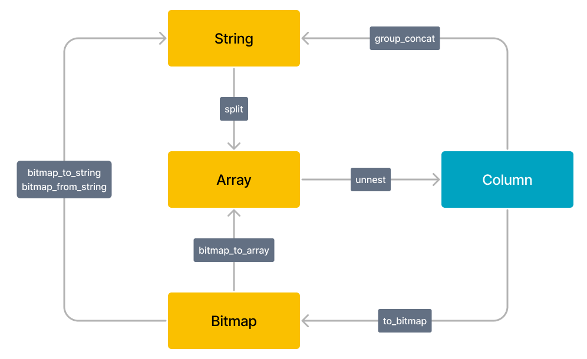

# 使用 Lateral Join 实现列转行

本文介绍如何使用 Lateral Join 功能。

「行列转化」是 ETL 处理过程中常见的操作。Lateral Join 功能能够将每行数据和内部的子查询或者 Table Function 关联。通过 Lateral Join 与 Unnest 功能配合，您可以实现一行转多行的功能。Unnest 是一种 Table Function，可以把数组类型转化成 Table 的多行。更多信息，参见 [unnest](../sql-reference/sql-functions/array-functions/unnest.md)。

> 注意
>
> * 当前版本中，Lateral Join 仅用于和 Unnest 函数配合使用，实现列转行的功能。后续会支持配合其他 Table Function 或 UDTF。
> * 当前版本中，Lateral Join 暂不支持子查询。

## 使用 Lateral Join

Lateral Join 功能的语法如下：

~~~SQL
from table_reference join [lateral] table_reference;
~~~

您可以结合 Lateral Join 功能与 Unnest 功能实现常见的行展开逻辑。

~~~SQL
-- 完整 SQL 语句。
SELECT student, score, t.unnest
FROM tests
CROSS JOIN LATERAL UNNEST(scores) AS t;

-- 简化 SQL 语句。您可以使用 Unnest 关键字省略 Lateral Join 关键字。
SELECT student, score, t.unnest
FROM tests, UNNEST(scores) AS t;
~~~

> 注意
>
> 多列 Unnest 操作需要指定别名。例如：`select v1, t1.unnest as v2, t2.unnest as v3 from lateral_test, unnest(v2) t1 ,unnest(v3) t2;`。

StarRocks 支持的 BITMAP、STRING、ARRAY、Column 之间的类型转化关系如下。

### 展开 STRING 类型数据

您可以使用 Lateral Join 功能配合 Unnest 功能将 STRING 类型数据展开为多行数据。

示例：

1. 创建测试用表并插入测试数据。

    ~~~SQL
    CREATE TABLE lateral_test2 (
        `v1` bigint(20) NULL COMMENT "",
        `v2` string NULL COMMENT "",
        `v3` string NULL COMMENT ""
    )
    duplicate key(v1)
    DISTRIBUTED BY HASH(`v1`)
    PROPERTIES (
        "replication_num" = "3",
        "storage_format" = "DEFAULT"
    );

    insert into lateral_test2 values (1, "1,2,3","1,2"), (2, "1,3","1,3");
    ~~~

2. 检查展开前的数据。

    ~~~Plain Text
    mysql> select * from lateral_test2;

    +------+-------+------+
    | v1   | v2    | v3   |
    +------+-------+------+
    |    1 | 1,2,3 | 1,2  |
    |    2 | 1,3   | 1,3  |
    +------+-------+------+
    ~~~

3. 展开 STRING 数据。

    ~~~Plain Text
    -- 对单行数据进行 Unnest 操作。
    mysql> select v1, unnest from lateral_test2, unnest(split(v2, ","));

    +------+--------+
    | v1   | unnest |
    +------+--------+
    |    1 | 1      |
    |    1 | 2      |
    |    1 | 3      |
    |    2 | 1      |
    |    2 | 3      |
    +------+--------+

    -- 对多行数据进行 Unnest 操作，需要指定别名。
    mysql> select v1, t1.unnest as v2, t2.unnest as v3 from lateral_test2, unnest(split(v2, ",")) t1, unnest(split(v3, ",")) t2;

    +------+------+------+
    | v1   | v2   | v3   |
    +------+------+------+
    |    1 | 1    | 1    |
    |    1 | 1    | 2    |
    |    1 | 2    | 1    |
    |    1 | 2    | 2    |
    |    1 | 3    | 1    |
    |    1 | 3    | 2    |
    |    2 | 1    | 1    |
    |    2 | 1    | 3    |
    |    2 | 3    | 1    |
    |    2 | 3    | 3    |
    +------+------+------+
    ~~~

### 展开 ARRAY 类型数据

您可以使用 Lateral Join 功能配合 Unnest 功能将 ARRAY 类型数据展开为多行数据。**从 2.5 版本开始，Unnest 支持传入多个 array，并且多个 array 的元素类型和长度可以不同。**

示例：

1. 创建测试用表并插入测试数据。

    ~~~SQL
    CREATE TABLE lateral_test (
        `v1` bigint(20) NULL COMMENT "",
        `v2` ARRAY<int> NULL COMMENT ""
    ) 
    duplicate key(v1)
    DISTRIBUTED BY HASH(`v1`)
    PROPERTIES (
        "replication_num" = "3",
        "storage_format" = "DEFAULT"
    );

    insert into lateral_test values (1, [1,2]), (2, [1, null, 3]), (3, null);
    ~~~

2. 检查展开前的数据。

    ~~~Plain Text
    mysql> select * from lateral_test;

    +------+------------+
    | v1   | v2         |
    +------+------------+
    |    1 | [1,2]      |
    |    2 | [1,null,3] |
    |    3 | NULL       |
    +------+------------+
    ~~~

3. 展开 ARRAY 数据。

    ~~~Plain Text
    mysql> select v1, v2, unnest from lateral_test, unnest(v2);

    +------+------------+--------+
    | v1   | v2         | unnest |
    +------+------------+--------+
    |    1 | [1,2]      |      1 |
    |    1 | [1,2]      |      2 |
    |    2 | [1,null,3] |      1 |
    |    2 | [1,null,3] |   NULL |
    |    2 | [1,null,3] |      3 |
    +------+------------+--------+
    ~~~

### 展开 Bitmap 类型数据

您可以使用 Lateral Join 功能配合 Unnest 功能展开 Bitmap 类型数据。

示例：

1. 创建测试用表并插入测试数据。

    ~~~SQL
    CREATE TABLE lateral_test3 (
    `v1` bigint(20) NULL COMMENT "",
    `v2` Bitmap BITMAP_UNION COMMENT ""
    )
    Aggregate key(v1)
    DISTRIBUTED BY HASH(`v1`);

    insert into lateral_test3 values (1, bitmap_from_string('1, 2')), (2, to_bitmap(3));
    ~~~

2. 检查当前数据中 `v1` 以及 `bitmap_to_string(v2)`。

    ~~~Plain Text
    mysql> select v1, bitmap_to_string(v2) from lateral_test3;

    +------+------------------------+
    | v1   | bitmap_to_string(`v2`) |
    +------+------------------------+
    |    1 | 1,2                    |
    |    2 | 3                      |
    +------+------------------------+
    ~~~

3. 插入一行新数据。

    ~~~Plain Text
    mysql> insert into lateral_test3 values (1, to_bitmap(3));
    ~~~

4. 检查新数据中 `v1` 以及 `bitmap_to_string(v2)`。

    ~~~Plain Text
    mysql> select v1, bitmap_to_string(v2) from lateral_test3;

    +------+------------------------+
    | v1   | bitmap_to_string(`v2`) |
    +------+------------------------+
    |    1 | 1,2,3                  |
    |    2 | 3                      |
    +------+------------------------+
    ~~~

5. 展开 Bitmap 类型数据。

    ~~~Plain Text
    mysql> select v1, unnest from lateral_test3, unnest(bitmap_to_array(v2));

    +------+--------+
    | v1   | unnest |
    +------+--------+
    |    1 |      1 |
    |    1 |      2 |
    |    1 |      3 |
    |    2 |      3 |
    +------+--------+
    ~~~

## Keywords

explode，爆裂函数
