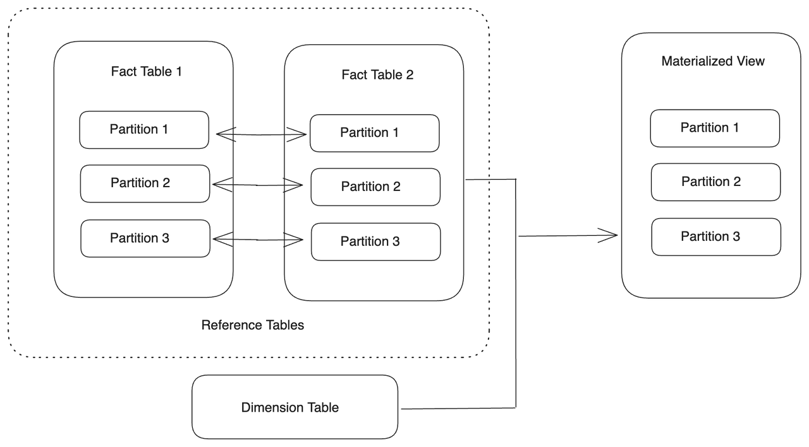
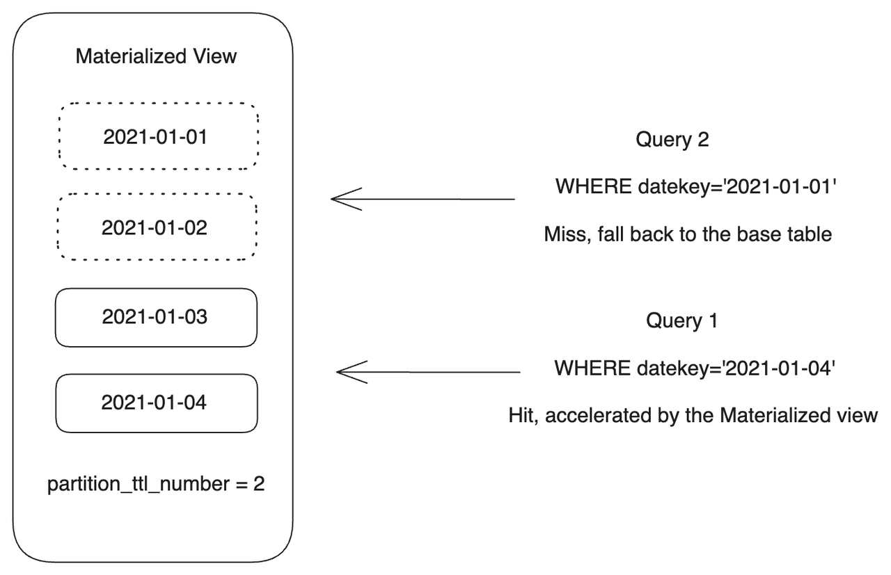

# 创建分区物化视图

本文介绍了如何使用分区物化视图满足不同业务需求。

## 概述

StarRocks 的异步物化视图支持多种分区策略和函数，方便您实现以下效果：

- **增量构建**

  在创建分区物化视图时，您可以设置分区刷新任务分批执行，以避免所有分区并行刷新导致过多资源消耗。

- **增量刷新**

  您可以将刷新任务设置为基表分区有数据更新时，仅更新物化视图的相应分区。分区级别的刷新可以显著减少刷新整个物化视图所导致的资源浪费。

- **局部物化**

  您可以为物化视图分区设置 TTL，从而实现数据的部分物化。

- **透明查询改写**

  查询可以仅基于最新的物化视图分区进行透明改写。过期的分区不会参与查询计划，相应查询将在基表上直接执行，从而确保数据的一致性。

## 使用限制

分区物化视图只能在分区基表（通常是事实表）上创建。您需要通过映射基表和物化视图之间的分区关系建立两者之间的协同关系。

目前，StarRocks 支持在以下数据源中的表上构建分区物化视图：

- **StarRocks Default Catalog 中的 OLAP 表**
  - 支持的分区策略：Range 分区
  - 支持的分区键数据类型：INT、DATE、DATETIME 和 STRING
  - 支持的表类型：主键表、明细表、聚合表和更新表
  - 支持存算一体和存算分离集群
- **Hive Catalog、Hudi Catalog、Iceberg Catalog 和 Paimon Catalog 中的表**
  - 支持的分区级别：一级分区
  - 支持的分区键数据类型：INT、DATE、DATETIME 和 STRING

:::note

- 不支持基于非分区基表创建分区物化视图。
- 对于 StarRocks OLAP 表：
  - 目前不支持 List 分区和表达式分区。
  - 基表的两个相邻分区必须具有连续的范围。
- 对于 External Catalog 中的多级分区基表，只能使用一级分区路径来创建分区物化视图。例如，对于以 `yyyyMMdd/hour` 格式分区的表，只能构建按 `yyyyMMdd` 分区的物化视图。
- 从 v3.2.3 版本开始，StarRocks 支持在使用 [Partition Transforms (分区变换)](https://iceberg.apache.org/spec/#partition-transforms) 的 Iceberg 表上创建分区物化视图，物化视图将根据变换后的列进行分区。更多信息，参考 [使用物化视图加速数据湖查询 - 选择合适的刷新策略](./data_lake_query_acceleration_with_materialized_views.md#选择合适的刷新策略)。

:::

## 使用场景

假设有以下基表：

```SQL
CREATE TABLE IF NOT EXISTS par_tbl1 (
  datekey      DATE,       -- DATE 类型的日期列用作分区键。
  k1           STRING,
  v1           INT,
  v2           INT
)
ENGINE=olap
PARTITION BY RANGE (datekey) (
  START ("2021-01-01") END ("2021-01-04") EVERY (INTERVAL 1 DAY)
)
DISTRIBUTED BY HASH(k1);

CREATE TABLE IF NOT EXISTS par_tbl2 (
  datekey      STRING,     -- STRING 类型的日期列用作分区键。
  k1           STRING,
  v1           INT,
  v2           INT
)
ENGINE=olap
PARTITION BY RANGE (str2date(datekey, '%Y-%m-%d')) (
  START ("2021-01-01") END ("2021-01-04") EVERY (INTERVAL 1 DAY)
)
DISTRIBUTED BY HASH(k1);

CREATE TABLE IF NOT EXISTS par_tbl3 (
  datekey_new  DATE,       -- 等同于 par_tbl1.datekey 列。
  k1           STRING,
  v1           INT,
  v2           INT
)
ENGINE=olap
PARTITION BY RANGE (datekey_new) (
  START ("2021-01-01") END ("2021-01-04") EVERY (INTERVAL 1 DAY)
)
DISTRIBUTED BY HASH(k1);
```

### 等比例对齐分区

您可以通过使用相同的分区键创建一个分区与基表分区一一对应的物化视图。


- 如果基表的分区键是 DATE 或 DATETIME 类型，可以直接为物化视图指定相同的分区键。

  ```SQL
  PARTITION BY <base_table_partitioning_column>
  ```

  示例：

  ```SQL
  CREATE MATERIALIZED VIEW par_mv1
  REFRESH ASYNC
  PARTITION BY datekey
  AS 
  SELECT 
    k1, 
    sum(v1) AS SUM, 
    datekey 
  FROM par_tbl1 
  GROUP BY datekey, k1;
  ```

- 如果基表的分区键是 STRING 类型，可以使用 [str2date](../../../sql-reference/sql-functions/date-time-functions/str2date.md) 函数将日期字符串转换为 DATE 或 DATETIME 类型。

  ```SQL
  PARTITION BY str2date(<base_table_partitioning_column>, <format>)
  ```

  示例：

  ```SQL
  CREATE MATERIALIZED VIEW par_mv2
  REFRESH ASYNC
  PARTITION BY str2date(datekey, '%Y-%m-%d')
  AS 
  SELECT 
    k1, 
    sum(v1) AS SUM, 
    datekey 
  FROM par_tbl2 
  GROUP BY datekey, k1;
  ```

### 时间粒度上卷对齐分区

您可以通过在分区键上使用 [date_trunc](../../../sql-reference/sql-functions/date-time-functions/date_trunc.md) 函数，创建一个分区时间粒度比基表更粗的物化视图。当检测到基表分区中的数据变更后，StarRocks 将会刷新物化视图中对应的上卷分区。


- 如果基表的分区键是 DATE 或 DATETIME 类型，可以直接在基表的分区键上使用 date_trunc 函数。

  ```SQL
  PARTITION BY date_trunc(<format>, <base_table_partitioning_column>)
  ```

   示例：

  ```SQL
  CREATE MATERIALIZED VIEW par_mv3
  REFRESH ASYNC
  PARTITION BY date_trunc('month', datekey)
  AS 
  SELECT 
    k1, 
    sum(v1) AS SUM, 
    datekey 
  FROM par_tbl1 
  GROUP BY datekey, k1;
  ```

- 如果基表的分区键是 STRING 类型，则必须在 SELECT List 中将基表的分区键转换为 DATE 或 DATETIME 类型，并为其设置别名，然后使用 date_trunc 函数并将结果指定为物化视图的分区键。

  ```SQL
  PARTITION BY 
  date_trunc(<format>, <mv_partitioning_column>)
  AS
  SELECT 
    str2date(<base_table_partitioning_column>, <format>) AS <mv_partitioning_column>
  ```

  示例：

  ```SQL
  CREATE MATERIALIZED VIEW par_mv4
  REFRESH ASYNC
  PARTITION BY date_trunc('month', mv_datekey)
  AS 
  SELECT 
    datekey,
    k1, 
    sum(v1) AS SUM, 
    str2date(datekey, '%Y-%m-%d') AS mv_datekey
  FROM par_tbl2 
  GROUP BY datekey, k1;
  ```

### 自定义时间粒度对齐分区

上述的分区上卷方法只允许根据特定的时间粒度对物化视图进行分区，不允许自定义分区时间范围。如果您的业务场景需要使用自定义的时间粒度进行分区，您可以创建一个物化视图，并使用 [time_slice](../../../sql-reference/sql-functions/date-time-functions/time_slice.md) 函数定义其分区的时间粒度。以上两种函数可以根据指定的时间粒度周期，将给定的时间转化到其所在的时间粒度周期的起始或结束时刻。

您需要在 SELECT List 中使用 time_slice 函数在基表的分区键上定义新的时间粒度，为其设置别名，然后结合 date_trunc 函数指定物化视图的分区键，从而创建一个自定义分区时间粒度的物化视图。

```SQL
PARTITION BY
date_trunc(<format>, <mv_partitioning_column>)
AS
SELECT 
  -- 您可以使用 time_slice 函数。
  time_slice(<base_table_partitioning_column>, <interval>) AS <mv_partitioning_column>
```

示例：

```SQL
CREATE MATERIALIZED VIEW par_mv5
REFRESH ASYNC
PARTITION BY date_trunc('day', mv_datekey)
AS 
SELECT 
  k1, 
  sum(v1) AS SUM, 
  time_slice(datekey, INTERVAL 5 HOUR) AS mv_datekey 
FROM par_tbl1 
GROUP BY datekey, k1;
```

### 多基表对齐分区



如果多张基表的分区可以互相对齐，即基表使用相同类型的分区键，您就可以基于多张基表创建分区物化视图。您可以使用 JOIN 连接基表，并将分区键设置为公共列。您也可以使用 UNION 连接基表。具有对齐分区的基表称为 Reference Table。任意 Reference Table 中的数据变更都将触发对应物化视图分区的刷新任务。

该功能自 v3.3 起支持。

```SQL
-- 使用 JOIN 连接基表。
CREATE MATERIALIZED VIEW par_mv6
REFRESH ASYNC
PARTITION BY datekey
AS SELECT 
  par_tbl1.datekey,
  par_tbl1.k1 AS t1k1,
  par_tbl3.k1 AS t2k1, 
  sum(par_tbl1.v1) AS SUM1, 
  sum(par_tbl3.v1) AS SUM2
FROM par_tbl1 JOIN par_tbl3 ON par_tbl1.datekey = par_tbl3.datekey_new
GROUP BY par_tbl1.datekey, t1k1, t2k1;

-- 使用 UNION 连接基表。
CREATE MATERIALIZED VIEW par_mv7
REFRESH ASYNC
PARTITION BY datekey
AS SELECT 
  par_tbl1.datekey,
  par_tbl1.k1 AS t1k1,
  sum(par_tbl1.v1) AS SUM1
FROM par_tbl1
GROUP BY 
  par_tbl1.datekey,
  par_tbl1.k1
UNION ALL
SELECT
  par_tbl3.datekey_new,
  par_tbl3.k1 AS t2k1, 
  sum(par_tbl3.v1) AS SUM2
FROM par_tbl3
GROUP BY 
  par_tbl3.datekey_new,
  par_tbl3.k1;
```

### 多分区列对齐

自 v3.4.1 起，异步物化视图支持多列分区表达式。您可以为物化视图指定多个分区列，一一映射基表的分区列。这使得基于物化视图的湖仓一体化方案得以实现，同时也能充分利用现有的 StarRocks 内表功能，提升 Lakehouse 的解决方案能力：

- **简化用户操作**：简化数据从湖上流转到 StarRocks 的过程。
- **加速查询性能**：在创建物化视图时复用内表功能，如 Colocate Group、Bitmap Index、Bloom Filter Index、Sort Key 和全局字典。对于直接基于基表的查询，物化视图会透明加速查询并自动改写。

#### 多列分区表达式相关说明

- 当前物化视图支持的多列分区只能与基表的多列分区一一映射，或者是 N:1 关系，而不能是 M:N 关系。例如，如果基表的分区列为 `(col1, col2, ..., coln)`，则物化视图定义时的分区只能是单列分区，如 `col1`、`col2`、`coln`，或者与基表分区列一一映射，如 `(col1, col2, ..., coln)`。这是因为通用的 M:N 关系会导致基表与物化视图之间的分区映射逻辑复杂，通过一一映射可以简化刷新和分区补偿逻辑。
- 由于 Iceberg 分区表达式支持 Transform 功能，若 Iceberg 的分区表达式映射到 StarRocks 时，需要额外处理分区表达式。以下为两者对应关系：

  | Iceberg Transform | Iceberg 分区表达式      | 物化视图分区表达式             |
  | ----------------- | --------------------- | ---------------------------- |
  | Identity          | `<col>`               | `<col>`                      |
  | hour              | `hour(<col>)`         | `date_trunc('hour', <col>)`  |
  | day               | `day(<col>)`          | `date_trunc('day', <col>)`   |
  | month             | `month(<col>)`        | `date_trunc('month', <col>)` |
  | year              | `year(<col>)`         | `date_trunc('year', <col>)`  |
  | bucket            | `bucket(<col>, <n>)`  | Not supported                |
  | truncate          | `truncate(<col>)`     | Not supported                |

- 对于非 Iceberg 类型的分区列，因不涉及分区表达式计算，创建物化视图时只需直接选择映射，不需要额外的分区表达式处理。

以下示例使用多列分区表达式基于 Iceberg Catalog（Spark）基表创建分区物化视图。

Spark 中的基表定义如下：

```SQL
-- 分区表达式包含多个分区列以及 `days` Transform。
CREATE TABLE lineitem_days (
      l_orderkey    BIGINT,
      l_partkey     INT,
      l_suppkey     INT,
      l_linenumber  INT,
      l_quantity    DECIMAL(15, 2),
      l_extendedprice  DECIMAL(15, 2),
      l_discount    DECIMAL(15, 2),
      l_tax         DECIMAL(15, 2),
      l_returnflag  VARCHAR(1),
      l_linestatus  VARCHAR(1),
      l_shipdate    TIMESTAMP,
      l_commitdate  TIMESTAMP,
      l_receiptdate TIMESTAMP,
      l_shipinstruct VARCHAR(25),
      l_shipmode     VARCHAR(10),
      l_comment      VARCHAR(44)
) USING ICEBERG
PARTITIONED BY (l_returnflag, l_linestatus, days(l_shipdate));
```

创建多列分区一一映射物化视图：

```SQL
CREATE MATERIALIZED VIEW test_days
PARTITION BY (l_returnflag, l_linestatus, date_trunc('day', l_shipdate))
REFRESH DEFERRED MANUAL
AS 
SELECT * FROM iceberg_catalog.test_db.lineitem_days;
```

### 实现增量刷新和透明改写

您可以创建一个分区物化视图，通过分区刷新来实现对物化视图的增量更新，并通过局部数据物化实现查询的透明重写。

要实现这些目标，在创建物化视图时，必须考虑以下几个方面：

- **刷新粒度**

  您可以使用 `partition_refresh_number` 属性来指定每次刷新操作的粒度。`partition_refresh_number` 控制在单次刷新中，最多刷新的分区数量。如果需要刷新的分区数量超过该值，StarRocks 将拆分这次刷新任务，并分批完成。分区按照时间由远至近的顺序进行刷新（不包括提前创建的未来分区）。`partition_refresh_number` 的默认值为 `-1`，表示不拆分刷新任务。

- **物化范围**

  物化数据的范围由 `partition_ttl_number`（v3.1.5 之前的版本）或 `partition_ttl`（推荐用于 v3.1.5 及更高版本）属性控制。`partition_ttl_number` 用于指定要保留的最新分区的数量，`partition_ttl` 用于指定要保留的物化视图数据的时间范围。在每次刷新过程中，StarRocks 会按时间顺序排列分区，并且仅保留符合 TTL 要求的分区。

- **刷新策略**
  - 自动刷新 (`REFRESH ASYNC`) 的物化视图在基表数据发生变化时会自动刷新。
  - 定时刷新 (`REFRESH ASYNC [START (<start_time>)] EVERY (INTERVAL <interval>)`) 的物化视图将按照定义的间隔定时刷新。

  :::note

  自动刷新和定时刷新的物化视图在触发刷新任务后都会自动刷新。StarRocks 会记录并比较基表的每个分区的数据版本。数据版本的变更表示分区中的数据发生了变化。一旦 StarRocks 检测到基表分区中的数据变化，就会刷新相应的物化视图分区。如果未在基表分区上检测到数据变更，StarRocks 将跳过对应物化视图分区的刷新。

  :::

  - 手动刷新 (`REFRESH MANUAL`) 的物化视图只能通过手动执行 REFRESH MATERIALIZED VIEW 语句进行刷新。您可以指定需要刷新的分区的时间范围，以避免刷新整个物化视图。如果在语句中指定了 `FORCE`，StarRocks 会强制刷新相应的物化视图或分区，无论基表中的数据是否发生了变化。通过在语句中添加 `WITH SYNC MODE`，您可以同步调用刷新任务，从而使 StarRocks 仅在任务成功或失败时返回任务结果。

以下示例创建了一个名为 `par_mv8` 的分区物化视图。当 StarRocks 检测到基表分区中的数据变化时，将刷新物化视图中对应的分区。该物化视图的刷新任务分批执行，单个批次仅刷新一个分区（`"partition_refresh_number" = "1"`）。该物化视图仅保留了两个最近分区（`"partition_ttl_number" = "2"`），其他分区在刷新过程中被删除。

```SQL
CREATE MATERIALIZED VIEW par_mv8
REFRESH ASYNC
PARTITION BY datekey
PROPERTIES(
  "partition_ttl_number" = "2",
  "partition_refresh_number" = "1"
)
AS 
SELECT 
  k1, 
  sum(v1) AS SUM, 
  datekey 
FROM par_tbl1 
GROUP BY datekey, k1;
```

您可以使用 REFRESH MATERIALIZED VIEW 语句来刷新该物化视图。以下示例通过同步调用的方式强制刷新 `par_mv8` 中指定时间范围内的分区。

```SQL
REFRESH MATERIALIZED VIEW par_mv8
PARTITION START ("2021-01-03") END ("2021-01-04")
FORCE WITH SYNC MODE;
```

输出如下：

```Plain
+--------------------------------------+
| QUERY_ID                             |
+--------------------------------------+
| 1d1c24b8-bf4b-11ee-a3cf-00163e0e23c9 |
+--------------------------------------+
1 row in set (1.12 sec)
```

TTL 功能允许 `par_mv8` 保留其中一部分分区，从而实现了部分数据的物化。该功能对于多数查询具有时效性的场景非常重要。TTL 功能允许您使用物化视图透明加速针对新数据的查询（例如一周或一个月内），同时显著节省存储成本。如果查询的数据不在物化视图分区的范围内，该查询将被退回至基表执行。

在以下示例中，Query 1 因为命中了 `par_mv8` 中保留的分区，所以可以通过物化视图加速。而 Query 2 因为不在分区保留的时间范围内，将会被退回至基表执行。

```SQL
-- Query 1
SELECT 
  k1, 
  sum(v1) AS SUM, 
  datekey 
FROM par_tbl1
WHERE datekey='2021-01-04'
GROUP BY datekey, k1;

-- Query 2
SELECT 
  k1, 
  sum(v1) AS SUM, 
  datekey 
FROM par_tbl1
WHERE datekey='2021-01-01'
GROUP BY datekey, k1;
```


