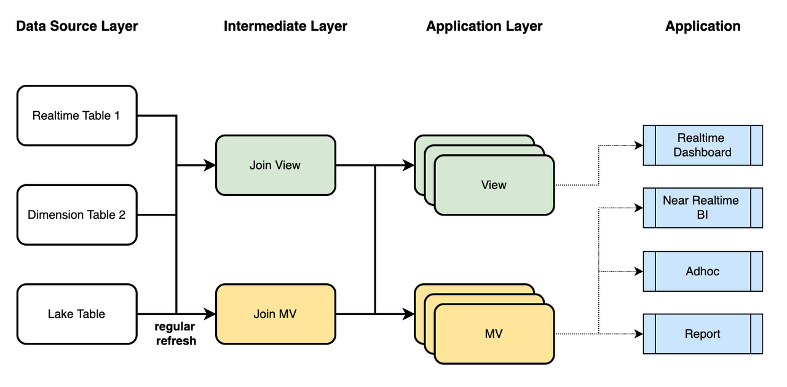

# 使用物化视图进行数据建模

本文描述了如何通过 StarRocks 的异步物化视图来进行数据建模，从而极大地简化数据仓库的 ETL Pipeline，并显著提高数据质量和查询性能。

## 概述

数据建模是通过合理的方法进行数据清洗、分层、聚合和关联的过程。当原始数据质量过低，指标过多过于复杂，或未经聚合导致查询成本过高时，您可以通过对原始数据进行建模得到易于理解的、可供使用的数据结果。

然而，在现实数据建模中常见的矛盾在于建模过程难以跟上业务发展的步伐，并且很难衡量数据建模工作的投资回报。建模手段虽然简单，但需要业务专家在数据组织和治理方面有扎实的背景，对数据整理加工，这是个复杂的过程。在业务的早期阶段，决策者通常不会在数据建模方面投入足够资源，并且很难看到数据建模能够带来的价值。此外，由于业务模式可能会迅速变化，而建模方法本身也需要不断迭代和演化。因此，许多数据分析师倾向于不使用数据建模，直接使用原始数据，从而不可避免地导致数据质量和查询性能的问题。当建模的需求出现时，又遇到数据使用方式已经成型，难以重构的问题。

使用 StarRocks 物化视图进行数据建模可以有效解决以上问题。StarRocks 异步物化视图具备以下能力：

- **简化数仓架构**：由于 StarRocks 可以提供一站式数据治理体验，您无需维护其他数据处理系统或组件，节省了用于维护这些系统的人力和物理资源。
- **简化建模体验**：任何只具备基本 SQL 知识的数据分析师都可以使用 StarRocks 进行数据建模，无需专业数据工程师。
- **简化系统维护**：StarRocks 的异步物化视图可以自动管理数据之间的层级和依赖关系，无需整个数据平台来处理此任务。



在实际情况中，您可以通过结合使用 StarRocks 的视图（逻辑视图）和异步物化视图来进行数据建模，如下所示：

1. 使用视图将实时数据与维度数据关联，并使用物化视图将数据湖中的历史数据与维度数据关联。同时进行必要的数据清洗和业务语义映射，以得到反映业务语义明细数据的中间层（Intermediate Layer）。
2. 在应用层（Application Layer）中，面向不同的业务场景，进行数据的 Join、Agg、Union、Window 计算，生成用于实时链路的视图和用于近实时链路的物化视图。
3. 在应用侧（Application），根据您的时效性和性能要求选择适当的分析数据存储（ADS）进行查询分析，服务于实时大屏、近实时 BI、Ad hoc 查询和定时报告等需求。

在此过程中，您将利用 StarRocks 的几种内置能力，这些能力将在下一节中详细阐述。

## 异步物化视图的能力

StarRocks 的异步物化视图具备以下原子能力，可助力数据建模：

- **自动刷新**：在数据导入至基表后，物化视图可以自动刷新。您无需在外部维护调度任务。
- **分区刷新**：通过有时序属性的报表，可以通过分区刷新实现近实时计算。
- **与视图协同使用**：通过协同使用物化视图和逻辑视图，您可以实现多层建模，从而实现中间层的重复使用和数据模型的简化。
- **Schema Change**：您可以通过简单的 SQL 语句更改计算结果，无需修改复杂的数据流水线。

借助以上功能，您可以设计全面且灵活的数据模型，以满足各种业务需求和场景。

### 自动刷新

创建异步物化视图时，您可以使用 REFRESH 子句指定刷新策略。目前，StarRocks 异步物化视图支持以下刷新策略：

- 自动刷新（`REFRESH ASYNC`）：每当基表中的数据发生变化时，都会触发刷新任务。数据依赖关系由物化视图自动管理。
- 定时刷新（`REFRESH ASYNC EVERY (INTERVAL <refresh_interval>)`）：定期触发刷新任务，例如，每分钟、每天或每月。如果基表中没有数据更改，将不会触发刷新任务。
- 手动刷新（`REFRESH MANUAL`）：您只能通过手动执行 `REFRESH MATERIALIZED VIEW` 触发刷新任务。如果您通过外部调度框架触发刷新任务，可以使用此刷新策略。

语法：

```SQL
CREATE MATERIALIZED VIEW <name>
REFRESH 
    [ ASYNC | 
      ASYNC [START <time>] EVERY(<interval>) | 
      MANUAL
    ]
AS <query>
```

### 分区刷新

创建异步物化视图时，您可以使用 PARTITION BY 子句将基表的分区与物化视图的分区关联起来，从而实现分区粒度的刷新。

- `PARTITION BY <column>`：您可以为物化视图引用与基表相同的分区列，从而使基表和物化视图采用相同的分区粒度。
- `PARTITION BY date_trunc(<column>)`：您可以使用 date_trunc 函数在基表分区列的基础上上卷，从而为物化视图制定不同粒度的分区策略。
- `PARTITION BY { time_slice | date_slice }(<column>)`：与 date_trunc 相比，time_slice 和 date_slice 提供更灵活的时间粒度调整，允许更精细地控制时间分区粒度。

语法：

```SQL
CREATE MATERIALIZED VIEW <name>
REFRESH ASYNC
PARTITION BY 
    [
        <base_table_column> | 
        date_trunc(<granularity>, <base_table_column>) |
        time_slice(<base_table_column>, <granularity>) | 
        date_slice(<base_table_column>, <granularity>)
    ]
AS <query>
```

### 与视图的协同使用

- 可以基于视图创建物化视图。此时，当视图引用的基表发生数据更改时，物化视图可以自动刷新。
- 可以基于其他物化视图创建物化视图，实现多层级联式刷新。
- 可以基于物化视图创建视图，等同于基于常规表创建。

### Schema Change

- 异步物化视图可以通过 ALTER MATERIALIZED VIEW SWAP 语句进行原子替换。您可以创建一个新物化视图，并增加新列或更改列类型，然后用新物化视图替换旧物化视图。
- 视图可以通过 ALTER VIEW 语句直接修改定义。
- StarRocks 中的常规表可以使用 SWAP 或 ALTER 操作进行修改。
- 此外，基表（可以是物化视图、视图或常规表）发生更改时，将会触发相应物化视图中的级联更改。

## 分层建模

在许多实际的业务场景中，存在各种形式的数据源，包括实时明细数据、维度数据以及数据湖的归档数据。另一方面，业务需求需要多样化的分析方法，如实时大屏、近实时 BI 查询、分析师 Ad hoc 查询和定时报表等。不同的场景有不同的需求 - 有些需要灵活性，有些优先考虑性能，而其他一些则强调成本效益。

显然，单一解决方案无法充分满足如此多样化的需求。StarRocks 可以通过结合使用视图和物化视图高效地满足这些需求。因为视图不维护物理数据，每次查询视图时，查询会根据视图的定义进行解析和执行。相比之下，物化视图保存了预计算的结果，可以避免重复执行的开销。视图适合表达业务语义并简化 SQL 复杂性，但无法降低查询执行的开销。另一方面，物化视图通过预先计算优化查询性能，适用于简化 ETL Pipeline。

以下为视图与物化视图的差异：

|                | **视图**                                   | **物化视图**                                       |
| -------------- | ------------------------------------------ | -------------------------------------------------- |
| **使用场景**   | 业务建模、数据治理                         | 数据建模、透明加速、湖仓一体                       |
| **存储开销**   | 不存储数据，无存储开销                     | 存储预计算结果，有额外存储成本                     |
| **更新开销**   | 无更新开销                                 | 基表数据更新时，有更新开销                         |
| **性能收益**   | 不做预计算，无性能收益                     | 预计算结果，加速查询                               |
| **数据实时性** | 查询视图时返回最新数据                     | 结果为预计算，可能存在数据延迟                     |
| **依赖关系**   | 基于表名引用基表，基表名变更将导致视图失效 | 基于 ID 引用基表，基表名变更不影响物化视图可用性。 |
| **创建语法**   | CREATE VIEW                                | CREATE MATERIALIZED VIEW                           |
| **修改语法**   | ALTER VIEW                                 | ALTER MATERIALIZED VIEW                            |

您可以使用以下语句来修改您的视图、物化视图和基表：

```SQL
-- 修改基表。
ALTER TABLE <table_name> ADD COLUMN <column_desc>;

-- 原子替换基表。
ALTER TABLE <table1> SWAP WITH <table2>;

-- 修改视图定义。
ALTER VIEW <view_name> AS <query>;

-- 原子替换物化视图（替换两个物化视图的名字，并不修改其中数据）。
ALTER MATERIALIZED VIEW <mv1> SWAP WITH <mv2>;

-- 重新启用物化视图。
ALTER MATERIALIZED VIEW <mv_name> ACTIVE;
```

Schema Change 遵循以下原则：

- 表的重命名以及原子替换操作将导致依赖其的物化视图变为 Inactive 状态。对于 Schema Change 操作，仅当物化视图依赖的基表列发生 Schema Change 时，才会导致物化视图变为 Inactive 状态。
- 视图的定义变更将导致依赖其的物化视图变为 Inactive 状态。
- 物化视图的原子替换操作将导致依赖其的嵌套物化视图变为 Inactive 状态。
- Inactive 状态会级联向上传播，直到没有物化视图依赖关系为止。
- Inactive 状态的物化视图无法刷新或用于自动查询改写。
- Inactive 状态的物化视图仍然可以直接查询，但在它们被变为 Active之前，数据一致性不能得到保证。

由于 Inactive 状态的物化视图其数据一致性无法保证，您可以使用以下方法修复：

- **手动修复**：您可以通过执行 `ALTER MATERIALIZED VIEW <mv_name> ACTIVE` 手动修复 Inactive 状态的物化视图。此语句将根据物化视图原始 SQL 定义尝试重建。需要注意的是，重建时需保证在底层 Schema Change 之后， SQL 定义仍然有效，否则操作将失败。
- **刷新时修复**：StarRocks 将会在刷新物化视图时会尝试自动执行以上的修复命令，重建物化视图再刷新。
- **自动修复**： StarRocks 将会尝试自动修复 Inactive 的物化视图，您可以通过 `ADMIN SET FRONTEND CONFIG('enable_mv_automatic_active_check'='false')` 关闭此功能。此功能自 3.1.4 和 3.2.0 版本开始支持。

## 分区建模

除分层建模外，分区建模也是数据建模的一个重要方面。数据建模往往涉及根据业务语义关联数据，并根据时效性要求设置数据的生存时间（TTL）。分区建模在此过程中起着重要作用。 不同的数据关联方式会产生不同的建模方法，如星型模式和雪花模式。这些模型有一个共同点 - 它们都使用事实表和维度表。一些业务场景需要多个大型事实表，而其他场景涉及复杂的维度表及其之间的复杂的关联关系。StarRocks 的物化视图支持事实表的分区关联，即事实表进行分区，而物化视图的 Join 结果按照同样的方式进行分区。


以上图为例，通过物化视图将事实表和多个维度表进行关联：

- 您需要在物化视图的分区键中指定特定基表（通常是事实表）的分区键来实现物化视图的分区关联（`PARTITION BY fact_tbl.col`）。一个物化视图仅能与一个基表做分区关联。
- 当被关联基表的某个分区中的数据发生变化时，物化视图中相应的分区将被刷新，但不影响其他分区。
- 当其他未被关联的基表发生变化时，默认情况下会刷新整个物化视图。然而，您可以选择忽略某些未关联表中的数据变化，以便在这些表中的数据发生变化时不刷新物化视图。

这种分区关联可以支持多种业务场景：

- **事实表更新**：您可以将事实表分区到细粒度级别，例如按日或按小时。在事实表更新后，物化视图中相应的分区将自动刷新。
- **维度表更新**：通常，维度表中的数据更新将导致所有关联结果的刷新，刷新代价较大。您可以选择忽略某些维度表中的数据更新，以避免刷新整个物化视图，或者您可以指定一个时间范围，从而只有在该时间范围内的分区才能被刷新。
- **外部表的自动刷新**：在类似于 Apache Hive 或 Apache Iceberg 这样的外部数据源中，数据往往以分区的粒度进行变更。StarRocks 的物化视图可以订阅外表分区级别的数据更新，只刷新物化视图的相应分区。
- **TTL**：在为物化视图设置分区策略时，您可以设置要保留的最近分区的数量，从而仅保留最新的数据。其对应的业务场景对数据时效性有较高要求，例如，分析师仅需要查询某个时间窗口内的最新数据，而无需保留所有历史数据。

您可以使用多个参数来控制刷新行为：

- `partition_refresh_number`：每次刷新操作中要刷新的分区数。
- `partition_refresh_strategy`：每次刷新操作中选择的刷新策略。
- `partition_ttl_number`：要保留的最近分区的数量。
- `excluded_trigger_tables`：为避免触发自动刷新而需要忽略的表。
- `auto_refresh_partitions_limit`：每次自动刷新操作中要刷新的分区数。
- `excluded_refresh_tables`: 物化视图刷新时排除需要刷新的表，通常和 `excluded_trigger_tables` 搭配使用。

详细说明，参见 [CREATE MATERIALIZED VIEW](../../../sql-reference/sql-statements/materialized_view/CREATE_MATERIALIZED_VIEW.md)。

当前版本中，分区物化视图存在如下限制：

- 仅支持基于分区表创建分区物化视图。
- 仅支持 DATE 和 DATETIME 类型的分区列，不支持 STRING 类型。
- 仅支持使用 date_trunc、time_slice 和 date_slice 做分区上卷。
- 仅支持单个列作为分区列，不支持多分区列。

## 总结

通过 StarRocks 异步物化视图进行数据建模，能够通过声明式的建模语言，简化流水线的管理，提升数据建模的效率与灵活性。

除了数据建模这一应用场景之外，异步物化视图能够应用其他的透明加速场景、湖仓一体场景，使得数据价值能够被进一步挖掘，数据效率进一步提高。
