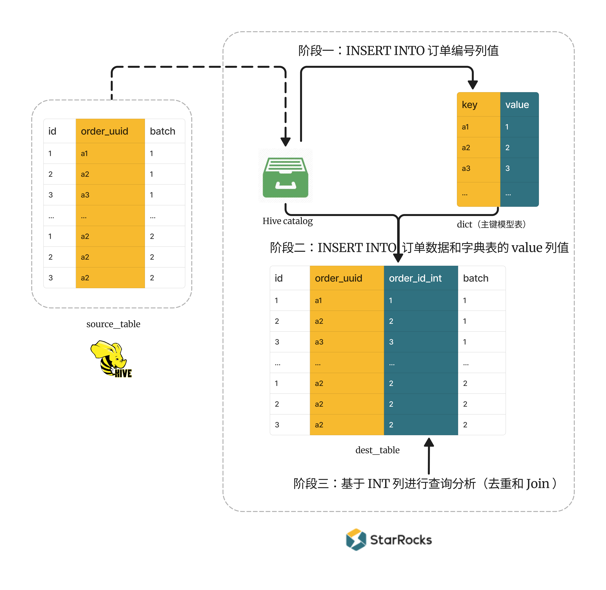
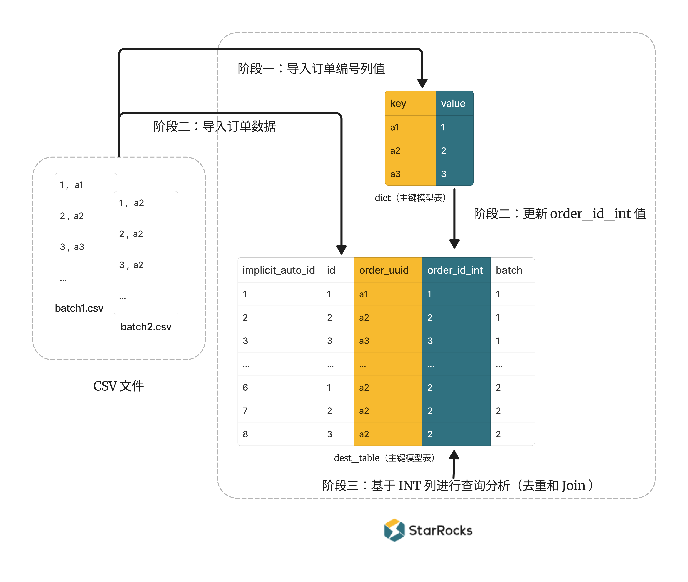

# 使用 AUTO INCREMENT 列构建全局字典以加速精确去重计算和 Join

## 应用场景

- **场景一**：您需要对海量订单数据（零售订单、快递订单等）计算精确去重。但是去重计数的列为 STRING 类型，此时直接计数，性能会不够理想。例如订单表 `orders` 中表示订单编号的`order_uuid` 列为 STRING 类型，大小通常为 32 ~ 36 字节，由 `UUID()` 或其他类似函数生成。直接基于 STRING 列 `order_uuid` 精确去重计数 `SELECT count(DISTINCT order_uuid) FROM orders WHERE create_date >= CURDATE();`，查询性能可能无法满足您的需要。
  如果能使用 INTEGER 列做精确去重计数，性能则会显著提升。
<<<<<<< HEAD
- **场景二**：您需要[借助bitmap函数进一步加速多维分析中对订单计算精确去重](./distinct_values/Using_bitmap.md)。然而，`bitmap_count()` 函数要求输入值为 INTEGER 类型，如果业务场景中去重计数的列为 STRING 类型，则需要使用 `bitmap_hash()` 函数，但是这样可能导致最终返回的是近似且值小一点的去重计数。并且，相对于连续分配的 INTEGER 值，`bitmap_hash()` 产生的 INTEGER 值更分散，会导致查询性能下降、存储数据量变大。
=======
- **场景二**：您需要[借助bitmap函数进一步加速多维分析中对订单计算精确去重](distinct_values/Using_bitmap.md)。然而，`bitmap_count()` 函数要求输入值为 INTEGER 类型，如果业务场景中去重计数的列为 STRING 类型，则需要使用 `bitmap_hash()` 函数，但是这样可能导致最终返回的是近似且值小一点的去重计数。并且，相对于连续分配的 INTEGER 值，`bitmap_hash()` 产生的 INTEGER 值更分散，会导致查询性能下降、存储数据量变大。
>>>>>>> b42eff7ae3 ([Doc] Add meaning of 0 for variables (#53714))
- **场景三**：您需要查询从下单到支付的时间相对较短的订单数量，而下单时间和支付时间可能存储在两张表里，由不同的业务团队维护。则您可能需要基于订单编号关联两张表，然后对订单计算精确去重。例如如下语句：

    ```SQL
    SELECT count(distinct order_uuid)
    FROM orders_t1 as t1 JOIN orders_t2 as t2
        ON t1.order_uuid = t2.order_uuid
    WHERE t2.payment_time - t1.create_time <= 3600
        AND create_date >= CURDATE();
    ```

   但是订单编号 `order_uuid` 列是 STRING 类型，直接基于 STRING 列进行 Join，性能也不如基于 INTEGER 列。

## 优化思路

针对上述应用场景，优化思路是将订单数据导入目标表并构建 STRING 和 INTEGER 值之间的映射关系，后续查询分析基于 INTEGER 列进行。该思路可以拆分为如下阶段执行：

1. 阶段一： 创建全局字典并构建 STRING 值和 INTEGER 值之间的映射关系。字典中 key 列为 STRING 类型，value 列为 INTEGER 类型且为自增列。每次导入数据时候，系统都会自动为每个 STRING 值生成一个表内全局唯一的 ID，如此就建立了 STRING 值和 INTEGER 值之间的映射关系。
2. 阶段二：将订单数据和全局字典的映射关系导入至目标表。
3. 阶段三：后续查询分析时基于目标表的 INTEGER 列来计算精确去重或 Join，可以显著提高性能。
4. 阶段四：为了进一步优化性能，您还可以在 INTEGER 列上使用 bitmap 函数来进一步加速计算精确去重。

## 解决方案

<<<<<<< HEAD
由于上述阶段二可以通过两种方式实现，因此本文提供两种解决方案，其主要差异如下：

- **解决方案一**
  
  通过一个操作导入数据：订单数据表 Join 字典表，将订单数据和字典表的映射关系通过一个 INSERT INTO 语句同时导入至目标表。<br />
  这里 Join 子句中的订单数据表可以是一个外部表，也可以是一个作为中间表的内表（可以把原始数据先导入到该中间表）。
- **解决方案二**

  分两个操作导入数据：首先，将订单数据导入目标表；然后，通过 UPDATE 语句（技术上其实也是目标表 Join 字典表），将字典表中的映射关系更新至目标表的 INTEGER 列。<br />
  这里的更新操作要求目标表必须为主键模型表。

### 解决方案一：使用 External Catalog 外部表 + INSERT INTO 数据

#### 业务场景

订单数据需要来源于一张外部表，其形式可以是 [External Catalog 外部表](../data_source/catalog/hive_catalog.md)、[文件外部表](../data_source/file_external_table.md)、或者 [FILES](../sql-reference/sql-functions/table-functions/files.md) 表函数（可以理解为一个外部表）。

本解决方案以 Hive Catalog 外部表 `source_table` 为例，其中 `order_uuid` 列表示订单编号并且为 STRING 类型。

> **说明**
>
> 如果您没有外部表，也可以使用内表，通过将订单数据导入到一张内表作为中间表，使该表承担外部表的角色

| id   | order_uuid | batch |
| ---- | ---------- | ----- |
| 1    | a1         | 1     |
| 2    | a2         | 1     |
| 3    | a3         | 1     |
| 11   | a1         | 1     |
| 11   | a2         | 1     |
| 12   | a1         | 1     |
| 1    | a2         | 2     |
| 2    | a2         | 2     |
| 3    | a2         | 2     |
| 11   | a2         | 2     |
| 12   | a102       | 2     |
| 12   | a101       | 2     |
| 13   | a102       | 2     |

> **说明**
>
> - 这里的 `id` 可以是某种订单业务的简化后的键、其他字段等。
> - 业务中订单数据一般是按批次导入 HDFS 或者 AWS S3 等对象存储，本文以 `batch` 字段表示数据导入批次，并且操作时也会按批次导入数据。

#### 具体步骤

**流程图**

通过订单数据表 Join 字典表，将订单数据和字典表的映射关系通过一个 INSERT INTO 语句同时导入至目标表。



**准备工作**：创建 [Hive catalog](../data_source/catalog/hive_catalog.md) 允许 StarRocks 访问 Hive 表 `source_table`。

**阶段一：创建全局字典，并且导入 Hive 表中的订单编号列值，从而构建 STRING 和 INTEGER 值之间的映射关系。**

1. 创建一个主键模型表作为全局字典。定义主键也就是 key 列为 `order_uuid`（ STRING 类型），value 列为 `order_id_int`（ BIGINT 类型）并且为自增列。

    ```SQL
    CREATE TABLE dict (
        order_uuid STRING,
        order_id_int BIGINT AUTO_INCREMENT -- 系统自动为每个 order_uuid 值分配一个对应的唯一 ID
    )
    PRIMARY KEY (order_uuid)
    DISTRIBUTED BY HASH (order_uuid)
    PROPERTIES("replicated_storage" = "true");
    ```

2. 将 Hive 表 `source_table` 中第一批数据的 `order_uuid` 值（STRING 类型）插入到字典表 `dict`的主键 `order_uuid`（STRING 类型）中，则字典表的自增列 `order_id_int` （BIGINT 类型）会自动为每个 `order_uuid` 生成一个表内全局唯一的 ID，如此就建立 STRING 和 BIGINT 值之间的映射关系。
   值得注意的是，插入时需要使用 Left Join 子句和 WHERE 条件 `WHERE dict.order_uuid IS NULL`，以确保插入的 `order_uuid` 值原先并不存在于字典表中。如果向字典表中重复插入已存在的 `order_uuid` 值，则该 `order_uuid` 值映射为 BIGINT 值`order_id_int`会变化。因为字典表为主键模型的表，INSERT INTO 相同的主键后会覆盖字典表中原先已存在的行，同时对应自增列的值也会变化（注意 INSERT INTO 目前还不支持部分列更新）。

      ```SQL
      INSERT INTO dict (order_uuid)
      SELECT DISTINCT src.order_uuid  -- 这里是要拿到去重后的 order_uuid
      FROM hive_catalog.hive_db.source_table src LEFT JOIN dict
          ON src.order_uuid = dict.order_uuid
      WHERE dict.order_uuid IS NULL
          AND src.batch = 1;
      ```

**阶段二：创建目标表，并导入 Hive 表订单数据和字典表 INTEGER 列值。从而在目标表中构建 STRING 和 INTEGER 值的映射关系，后续基于 INTEGER 列进行查询分析。**

1. 创建一张明细模型表 `dest_table`。除了包含 `source_table` 的所有列外，您还需要定义一个 INTEGER 类型的 `order_id_int` 列，与 STRING 类型的`order_uuid`列进行映射。后续会基于 `order_id_int` 列进行查询分析。

      ```SQL
      CREATE TABLE dest_table (
          id BIGINT,
          order_uuid STRING, -- 该列记录 STRING 类型订单编号 
          order_id_int BIGINT NULL, -- 该列记录 BIGINT 类型订单编号，与前一列相互映射，后续用于精确去重计数和 Join
          batch int comment 'used to distinguish different batch loading'
      )
      DUPLICATE KEY (id, order_uuid, order_id_int)
      DISTRIBUTED BY HASH(id);
      ```

2. 将 Hive 表 `source_table` 第一批订单数据和字典表 `dict` 的 INTEGER 列值导入至目标表 `dest_table`。

      ```SQL
      INSERT INTO dest_table (id, order_uuid, order_id_int, batch)
      SELECT src.id, src.order_uuid, dict.order_id_int, src.batch
      FROM hive_catalog.hive_db.source_table AS src LEFT JOIN dict
          ON src.order_uuid = dict.order_uuid
      WHERE src.batch = 1;
      ```

      > **说明**
      >
      > 理论上这里不需要 Left Join, 普通 Join 即可。不过，为了防止一些异常的影响，可以用 Left Join 来先保证 `source_table` 中的数据都能导入到 `dest_table` 中，比如在此之前导入 `order_uuid` 到 `dict` 中时出现异常没注意到。后续可以通过判断 `dest_table` 中是否存在 `order_id_int` 列为 `NULL` 的行来判断。

3. 重复阶段一的步骤 2 和阶段二的步骤 2，将 `source_table` 第二批数据导入至目标表 `dest_table` ，并且构建 `order_uuid` （STRING 类型） 和 `order_id_int`（BIGINT 类型） 的映射关系。

   1. 将 `source_table` 中第二批数据的 `order_uuid` 值插入到字典 `dict` 表的主键 `order_uuid` 中。

      ```SQL
      INSERT INTO dict (order_uuid)
      SELECT DISTINCT src.order_uuid
      FROM hive_catalog.hive_db.source_table src LEFT JOIN dict
          ON src.order_uuid = dict.order_uuid
      WHERE dict.order_uuid IS NULL
          AND src.batch = 2;
      ```

   2. 将 `source_table` 中第二批订单数据和字典表 `dict` 的 INTEGER 列值导入至 `dest_table`。

      ```SQL
      INSERT INTO dest_table (id, order_uuid, order_id_int, batch)
      SELECT src.id, src.order_uuid, dict.order_id_int, src.batch
      FROM hive_catalog.hive_db.source_table AS src LEFT JOIN dict
          ON src.order_uuid = dict.order_uuid
      WHERE src.batch = 2;
      ```

4. 查询 `dest_table` 中 `order_uuid` 列与 `order_id_int` 列的映射关系。

    ```sql
    MySQL > SELECT * FROM dest_table ORDER BY batch, id;
    +------+------------+--------------+-------+
    | id   | order_uuid | order_id_int | batch |
    +------+------------+--------------+-------+
    |    1 | a1         |            1 |     1 |
    |    2 | a2         |            2 |     1 |
    |    3 | a3         |            3 |     1 |
    |   11 | a1         |            1 |     1 |
    |   11 | a2         |            2 |     1 |
    |   12 | a1         |            1 |     1 |
    |    1 | a2         |            2 |     2 |
    |    2 | a2         |            2 |     2 |
    |    3 | a2         |            2 |     2 |
    |   11 | a2         |            2 |     2 |
    |   12 | a102       |       100002 |     2 |
    |   12 | a101       |       100001 |     2 |
    |   13 | a102       |       100002 |     2 |
    +------+------------+--------------+-------+
    13 rows in set (0.02 sec)
    ```

**阶段三：实际查询分析时，您可以在 INTEGER 列上进行精确去重或者 Join，相较于基于 STRING 列，性能会显著提升。**

```SQL
-- 基于 BIGINT 类型的 order_id_int 精确去重
SELECT id, COUNT(DISTINCT order_id_int) FROM dest_table GROUP BY id ORDER BY id;
-- 基于 STRING 类型的 order_uuid 精确去重
SELECT id, COUNT(DISTINCT order_uuid) FROM dest_table GROUP BY id ORDER BY id;
```

您还可以[使用 bitmap 函数加速计算精确去重](#使用-bitmap-函数加速计算精确去重)。

### 解决方案二：使用导入 + UPDATE 数据（主键模型表）

#### 业务场景

本解决方案以如下两个 CSV 文件 `batch1.csv`  和 `batch2.csv` 为例。文件包含两列 `id` 和 `order_uuid`。

- batch1.csv
=======
在 v3.2.5 之前，阶段二可以通过[两种方案](https://docs.starrocks.io/zh/docs/3.1/using_starrocks/query_acceleration_with_auto_increment/#%E8%A7%A3%E5%86%B3%E6%96%B9%E6%A1%88)实现：

- 采用外表或者内表作为中间表的方式，通过**外表或者中间表 JOIN 字典表**的方式，得到字典数据对应的字典 ID 后进行导入.
- 需要使用主键表，先导入数据，然后通过带有 JOIN 操作的 UPDATE 语句来更新字典数据对应的字典 ID。但这个数据导入的过程其实比较不方便，且有不少约束。

自 v3.2.5 起，StarRocks 提供了 `dict_mapping()` 函数，您只需要在目标表中把对应的字典 ID 列定义为一个表达式为 `dict_mapping()` 生成列即可。而后的数据导入就和普通的数据导入一样，不再需要借助 JOIN 或 UPDATE 语句来写入字典 ID。在您导入数据的过程中，系统将自动关联字典表并插入对应的字典 ID。这将极大地方便有全局字典表的数据导入过程，不再依赖表类型、同时还可以使用各种导入方式导入数据。

### 业务场景

本解决方案以如下两个 CSV 文件 `batch1.csv`  和 `batch2.csv` 为例。文件包含两列 `id` 和 `order_uuid`。

- `batch1.csv`
>>>>>>> b42eff7ae3 ([Doc] Add meaning of 0 for variables (#53714))

    ```csv
    1, a1
    2, a2
    3, a3
    11, a1
    11, a2
    12, a1
    ```

<<<<<<< HEAD
- batch2.csv
=======
- `batch2.csv`
>>>>>>> b42eff7ae3 ([Doc] Add meaning of 0 for variables (#53714))

    ```csv
    1, a2
    2, a2
    3, a2
    11, a2
    12, a101
    12, a102
    13, a102
    ```

<<<<<<< HEAD
#### 具体步骤

**流程图**

需要先导入订单数据至目标表，再把字典表的映射关系更新至目标表的 INTEGER 列（更新操作要求目标表必须为主键模型表）。



**阶段一：创建全局字典表，并且导入 CSV 文件中的订单编号列值，从而构建 STRING 和 INTEGER 值之间的映射关系。**

1. 创建一个主键模型表作为全局字典，定义主键也就是 key 列为 `order_uuid` （ STRING 类型），value 列为 `order_id_int`（ BIGINT 类型）并且为自增列。
=======
### 具体步骤

**阶段一：创建全局字典表，并且导入 CSV 文件中的订单编号列值，从而构建 STRING 和 INTEGER 值之间的映射关系。**

1. 创建一个主键表作为全局字典，定义主键也就是 key 列为 `order_uuid`（STRING 类型），value 列为 `order_id_int`（INTEGER 类型）并且为自增列。

   :::info

   `dict_mapping` 要求全局字典表必须为主键表。

   :::
>>>>>>> b42eff7ae3 ([Doc] Add meaning of 0 for variables (#53714))

      ```SQL
      CREATE TABLE dict (
          order_uuid STRING,
          order_id_int BIGINT AUTO_INCREMENT  -- 自动为每个 order_uuid 值分配一个唯一 ID 
      )
      PRIMARY KEY (order_uuid)
      DISTRIBUTED BY HASH (order_uuid)
      PROPERTIES("replicated_storage" = "true");
      ```

2. 本示例使用 Stream Load 将两个 CSV 文件的 `order_uuid` 列分批导入至字典表 `dict` 的 `order_uuid` 列，并且需要注意的是，此处需要使用部分列更新。

      ```Bash
      curl --location-trusted -u root: \
          -H "partial_update: true" \
          -H "format: CSV" -H "column_separator:," -H "columns: id, order_uuid" \
          -T batch1.csv \
          -XPUT http://<fe_host>:<fe_http_port>/api/example_db/dict/_stream_load
          
      curl --location-trusted -u root: \
          -H "partial_update: true" \
          -H "format: CSV" -H "column_separator:," -H "columns: id, order_uuid" \
          -T batch2.csv \
          -XPUT http://<fe_host>:<fe_http_port>/api/example_db/dict/_stream_load
      ```

<<<<<<< HEAD
**阶段二：创建目标表并导入 CSV 文件的订单数据。**

需要注意在本解决方案中，目标表必须为主键模型。因为只有主键模型表支持带有 Join 的 UPDATE 命令。

1. 创建一个**主键模型表** `dest_table_pk`，包含 CSV 文件的所有列。 并且您还需要定义一个 INTEGER 类型的 `order_id_int` 列，与 STRING 类型的 `order_id_int` 列进行映射。后续会基于 `order_id_int` 列进行查询分析。

   并且值得注意的是，为了将所有导入的数据到存在主键模型表中，您还需要定义一个自增列 `implicit_auto_id` 为主键，作为每一条数据的唯一标识，以确保保留所有数据。（如果实际订单业务表中已经存在其他主键，则直接使用即可，不再需要创建 `implicit_auto_id`）。

      ```SQL
      CREATE TABLE dest_table_pk (
          implicit_auto_id BIGINT AUTO_INCREMENT comment 'used to keep all loaded rows',
          id BIGINT,
          order_uuid STRING, -- 该列记录 STRING 类型订单编号 
          order_id_int BIGINT NULL, -- 该列记录 BIGINT 类型订单编号，与前一列相互映射，后续用于精确去重计数和 Join
          batch int comment 'used to distinguish different batch loading'
      )
      PRIMARY KEY (implicit_auto_id)  -- 必须为主键模型表
      DISTRIBUTED BY HASH (implicit_auto_id)
      PROPERTIES("replicated_storage" = "true");
      ```

2. 将包含订单数据的两个 CSV 文件分批导入至 `dest_table_pk` 表。
=======
> **说明**
>
> 在进入下一阶段前，如果数据源有新增数据，需将所有新增数据导入字典表以保证映射一定存在。

**阶段二**：创建目标表，并且包含具有 `dict_mapping` 属性的字典 ID 列，后续导入订单数据至目标表时，系统将自动关联字典表并插入对应的字典 ID。

1. 创建一张表 `dest_table`，包含 CSV 文件的所有列。 并且您还需要定义一个整数类型的 `order_id_int` 列（通常为 BIGINT），与 STRING 类型的 `order_id_int` 列进行映射，并且具有 dict_mapping 列属性。后续会基于 `order_id_int` 列进行查询分析。

      ```SQL
      -- 目标数据表里，订单编号`order_uuid`对应的字典ID 增加 dict_mapping 列属性
      CREATE TABLE dest_table (
          id BIGINT,
          order_uuid STRING, -- 该列记录 STRING 类型订单编号 
          batch int comment 'used to distinguish different batch loading',
          order_id_int BIGINT AS dict_mapping('dict', order_uuid) -- 订单编号`order_uuid`对应的字典 ID，具有 dict_mapping 列属性。
      )
      DUPLICATE KEY (id, order_uuid)
      DISTRIBUTED BY HASH(id);
      ```

2. 正常导入数据到目标表。这步可以采用 Stream Load 在内的各种导入方式。`order_id_int` 列因为有配置 `dict_mapping` 属性，系统会在导入数据时自动从`dict`获取字典 ID 并填充：
>>>>>>> b42eff7ae3 ([Doc] Add meaning of 0 for variables (#53714))

      ```Bash
      curl --location-trusted -u root: \
          -H "format: CSV" -H "column_separator:," -H "columns: id, order_uuid, batch=1" \
          -T batch1.csv \
<<<<<<< HEAD
          -XPUT http://<fe_host>:<fe_http_port>/api/example_db/dest_table_pk/_stream_load
=======
          -XPUT http://<fe_host>:<fe_http_port>/api/example_db/dest_table/_stream_load
>>>>>>> b42eff7ae3 ([Doc] Add meaning of 0 for variables (#53714))
          
      curl --location-trusted -u root: \
          -H "format: CSV" -H "column_separator:," -H "columns: id, order_uuid, batch=2" \
          -T batch2.csv \
<<<<<<< HEAD
          -XPUT http://<fe_host>:<fe_http_port>/api/example_db/dest_table_pk/_stream_load
      ```

**阶段二：将字典表的 INTEGER 列值，更新至目标表的列 `order_id_int`。从而在目标表中构建 STRING 和 INTEGER 值的映射关系，后续基于 `order_id_int` 列进行查询分析。**

1. 根据全局字典中的映射关系，将字典表的 INTEGER 值部分更新至 `dest_table_pk` 表的 `order_id_int`列。

      ```SQL
      UPDATE dest_table_pk
      SET order_id_int = dict.order_id_int
      FROM dict
      WHERE dest_table_pk.order_uuid = dict.order_uuid AND batch = 1;
      
      UPDATE dest_table_pk
      SET order_id_int = dict.order_id_int
      FROM dict
      WHERE dest_table_pk.order_uuid = dict.order_uuid AND batch = 2;
      ```

2. 查询 `dest_table_pk` 中 `order_uuid` 列与 `order_id_int` 列的映射关系。

    ```sql
    MySQL > SELECT * FROM dest_table_pk ORDER BY batch, id;
    +------------------+------+------------+--------------+-------+
    | implicit_auto_id | id   | order_uuid | order_id_int | batch |
    +------------------+------+------------+--------------+-------+
    |                0 |    1 | a1         |            1 |     1 |
    |                1 |    2 | a2         |            2 |     1 |
    |                2 |    3 | a3         |            3 |     1 |
    |                4 |   11 | a2         |            2 |     1 |
    |                3 |   11 | a1         |            1 |     1 |
    |                5 |   12 | a1         |            1 |     1 |
    |                6 |    1 | a2         |            2 |     2 |
    |                7 |    2 | a2         |            2 |     2 |
    |                8 |    3 | a2         |            2 |     2 |
    |                9 |   11 | a2         |            2 |     2 |
    |               10 |   12 | a102       |            4 |     2 |
    |               11 |   12 | a101       |            5 |     2 |
    |               12 |   13 | a102       |            4 |     2 |
    +------------------+------+------------+--------------+-------+
    13 rows in set (0.01 sec)
    ```

**阶段三：**实际查询分析时，您可以在 INTEGER 类型的列 `order_id_int` 上进行精确去重或者 Join，相较于基于 STRING 类型的列 `order_uuid`，性能会显著提升。

```SQL
-- 基于 BIGINT 类型的 order_id_int 精确去重
SELECT id, COUNT(DISTINCT order_id_int) FROM dest_table_pk GROUP BY id ORDER BY id;
-- 基于 STRING 类型的 order_uuid 精确去重
SELECT id, COUNT(DISTINCT order_uuid) FROM dest_table_pk GROUP BY id ORDER BY id;
=======
          -XPUT http://<fe_host>:<fe_http_port>/api/example_db/dest_table/_stream_load
      ```

**阶段三**：实际查询分析时，您可以在 INTEGER 类型的列 `order_id_int` 上进行精确去重或者 Join，相较于基于 STRING 类型的列 `order_uuid`，性能会显著提升。

```SQL
-- 基于 BIGINT 类型的 order_id_int 精确去重
SELECT id, COUNT(DISTINCT order_id_int) FROM dest_table GROUP BY id ORDER BY id;
-- 基于 STRING 类型的 order_uuid 精确去重
SELECT id, COUNT(DISTINCT order_uuid) FROM dest_table GROUP BY id ORDER BY id;
>>>>>>> b42eff7ae3 ([Doc] Add meaning of 0 for variables (#53714))
```

您还可以[使用 bitmap 函数加速计算精确去重](#使用-bitmap-函数加速计算精确去重)。

### 使用 bitmap 函数加速计算精确去重

为了进一步加速计算，在构建全局字典后，您可以将字典表 INTEGER 列值直接插入到一个 bitmap 列中。后续对该 bitmap 列使用 bitmap 函数来精确去重计数。

<<<<<<< HEAD
1. 首先创建一个**聚合模型表**，包含两列。聚合列为 BITMAP 类型的 `order_id_bitmap`，并且指定聚合函数为 `bitmap_union()`，定义另一列为 BIGINT 类型的 `id`。该表已**不包含**原始 STRING 列了（否则每个 bitmap 中只有一个值，无法起到加速效果）。
=======
**方式一**：

如果您构建了全局字典并且已经导入具体订单数据到 `dest_table` 表，则可以执行如下步骤：

1. 创建聚合表 `dest_table_bitmap`。该表中包含两列，聚合列为 BITMAP 类型的 `order_id_bitmap`，并且指定聚合函数为 `bitmap_union()`，另一列为 INTEGER 类型的 `id`。该表已**不包含**原始 STRING 列（否则每个 bitmap 中只有一个值，无法起到加速效果）。
>>>>>>> b42eff7ae3 ([Doc] Add meaning of 0 for variables (#53714))

      ```SQL
      CREATE TABLE dest_table_bitmap (
          id BIGINT,
          order_id_bitmap BITMAP BITMAP_UNION
      )
      AGGREGATE KEY (id)
<<<<<<< HEAD
      DISTRIBUTED BY HASH(id) BUCKETS 2;
      ```

2. 根据所使用的解决方案，选择插入数据的方式。
   - 如果是使用**解决方案一**，则需要向聚合模型表 `dest_table_bitmap` 的 `id` 列插入 `hive_catalog.hive_db.``source_table` 表 `id` 列的数据；向聚合模型表的 `order_id_bitmap` 列插入字典表 `dict` INTEGER 列 `order_id_int` 列的数据（经过函数 `to_bitmap` 处理后的值）。

        ```SQL
        INSERT INTO dest_table_bitmap (id, order_id_bitmap)
        SELECT src.id, to_bitmap(dict.order_id_int)
        FROM hive_catalog.hive_db.source_table AS src LEFT JOIN dict
            ON src.order_uuid = dict.order_uuid
        WHERE src.batch = 1; -- 用来模拟导入的一批批数据，导入第二批数据时指定为 2
        ```

   - 如果是使用**解决方案二**，则需要向聚合模型表 `dest_table_bitmap` 的 `id` 列插入表 `dest_table_pk` 的列 `id` 的数据；向聚合模型表的 `order_id_bitmap` 列插入字典表 `dict` INTEGER 列 `order_id_int` 列的数据（经过函数 `to_bitmap` 处理后的值）。

        ```SQL
        INSERT INTO dest_table_bitmap (id, order_id_bitmap)
        SELECT dest_table_pk.id, to_bitmap(dict.order_id_int)
        FROM dest_table_pk LEFT JOIN dict
            ON dest_table_pk.order_uuid = dest_table_pk.order_uuid
        WHERE dest_table_pk.batch = 1; -- 用来模拟导入的一批批数据，导入第二批数据时指定为 2
        ```
=======
      DISTRIBUTED BY HASH(id) BUCKETS 6;
      ```

2. 向聚合表 `dest_table_bitmap` 中插入数据。 `id` 列插入表 `dest_table` 的列 `id` 的数据；`order_id_bitmap` 列插入字典表 `dict` INTEGER 列 `order_id_int` 的数据（经过函数 `to_bitmap` 处理后的值）。

    ```SQL
    INSERT INTO dest_table_bitmap (id, order_id_bitmap)
    SELECT id,  to_bitmap(dict_mapping('dict', order_uuid))
    FROM dest_table
    WHERE dest_table.batch = 1; -- 此处 batch 用于模拟不同批次的处理。
        
    INSERT INTO dest_table_bitmap (id, order_id_bitmap)
    SELECT id, to_bitmap(dict_mapping('dict', order_uuid))
    FROM dest_table
    WHERE dest_table.batch = 2;
    ```

3. 然后基于 bitmap 列使用函数 `BITMAP_UNION_COUNT()` 精确去重计数。

      ```SQL
      SELECT id, BITMAP_UNION_COUNT(order_id_bitmap) FROM dest_table_bitmap
      GROUP BY id ORDER BY id;
      ```

**方式二**：

如果您在构建了全局字典后，不需要保留具体订单数据，只想直接一步到位导入数据到 `dest_table_bitmap` 表中，则可以执行如下步骤：

1. 创建聚合表 `dest_table_bitmap`。该表中包含两列，聚合列为 BITMAP 类型的 `order_id_bitmap`，并且指定聚合函数为 `bitmap_union()`，定义另一列为 INTEGER 类型的 `id`。该表已**不包含**原始 STRING 列了（否则每个 bitmap 中只有一个值，无法起到加速效果）。

      ```SQL
      CREATE TABLE dest_table_bitmap (
          id BIGINT,
          order_id_bitmap BITMAP BITMAP_UNION
      )
      AGGREGATE KEY (id)
      DISTRIBUTED BY HASH(id) BUCKETS 6;
      ```

2. 向聚合表中插入数据。`id` 列直接插入 CSV 文件中的`id` 列的数据；`order_id_bitmap` 列插入字典表 `dict` INTEGER 列 `order_id_int` 列的数据（经过函数 `to_bitmap` 处理后的值）。

     ```bash
     curl --location-trusted -u root: \
         -H "format: CSV" -H "column_separator:," \
         -H "columns: id, order_uuid,  order_id_bitmap=to_bitmap(dict_mapping('dict', order_uuid))" \
         -T batch1.csv \
         -XPUT http://<fe_host>:<fe_http_port>/api/example_db/dest_table_bitmap/_stream_load
     
     curl --location-trusted -u root: \
         -H "format: CSV" -H "column_separator:," \
         -H "columns: id, order_uuid, order_id_bitmap=to_bitmap(dict_mapping('dict', order_uuid))" \
         -T batch2.csv \
         -XPUT http:///<fe_host>:<fe_http_port>/api/example_db/dest_table_bitmap/_stream_load
     ```
>>>>>>> b42eff7ae3 ([Doc] Add meaning of 0 for variables (#53714))

3. 然后基于 bitmap 列使用函数 `BITMAP_UNION_COUNT()` 精确去重计数。

      ```SQL
      SELECT id, BITMAP_UNION_COUNT(order_id_bitmap) FROM dest_table_bitmap
      GROUP BY id ORDER BY id;
      ```
