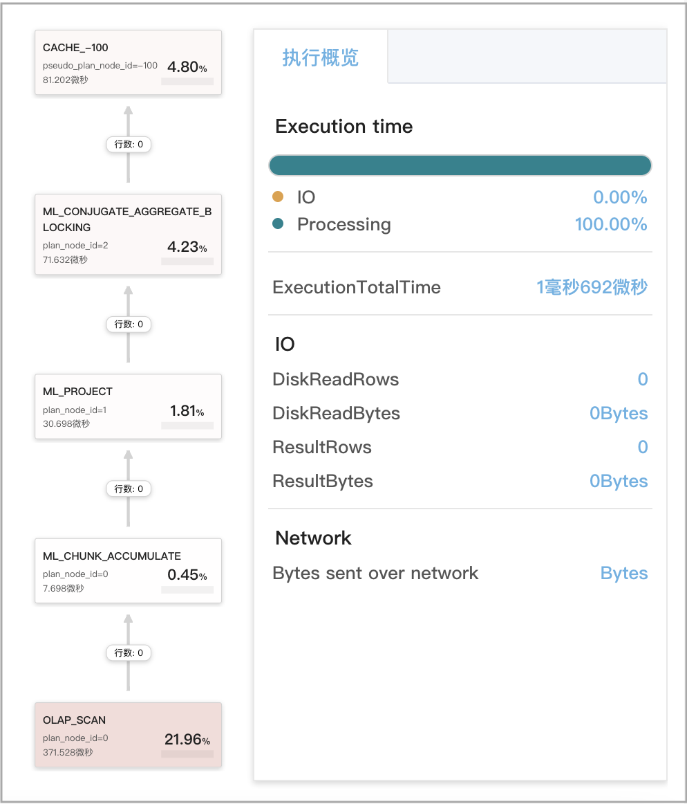
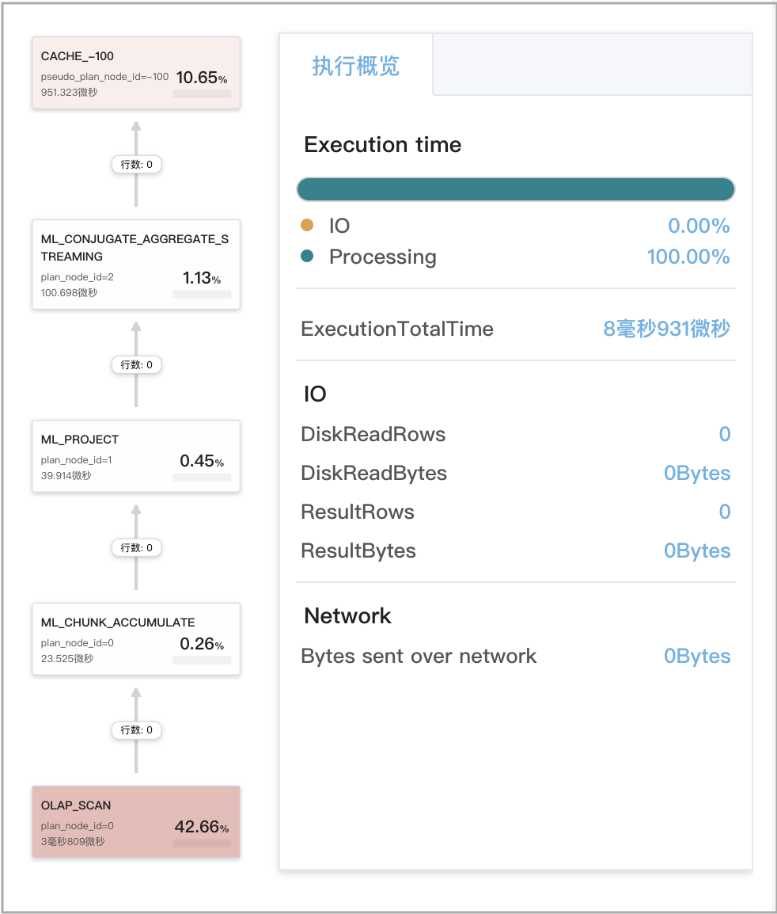
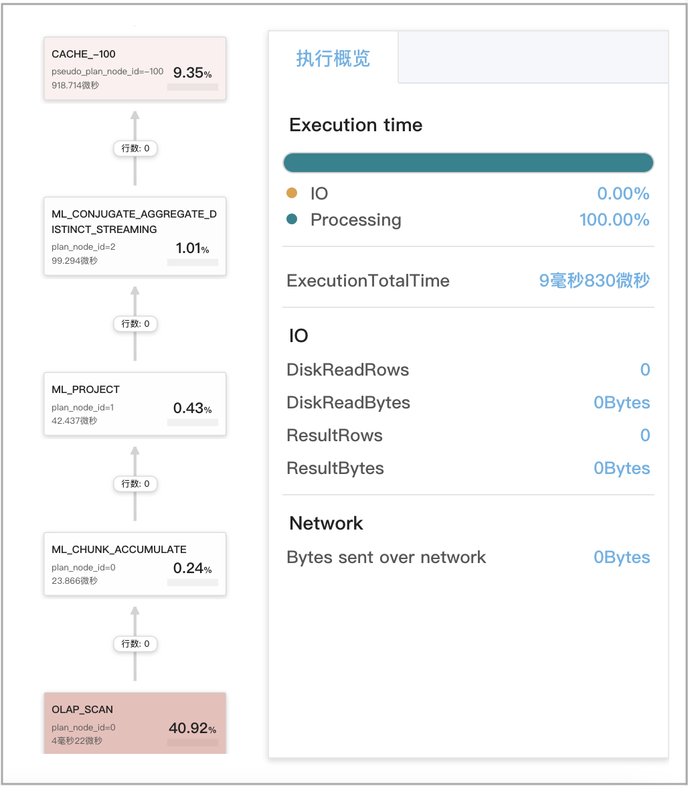
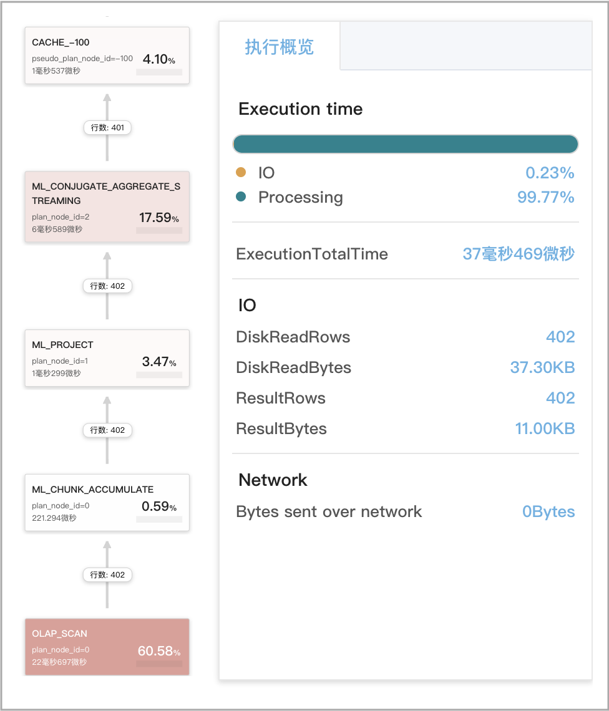
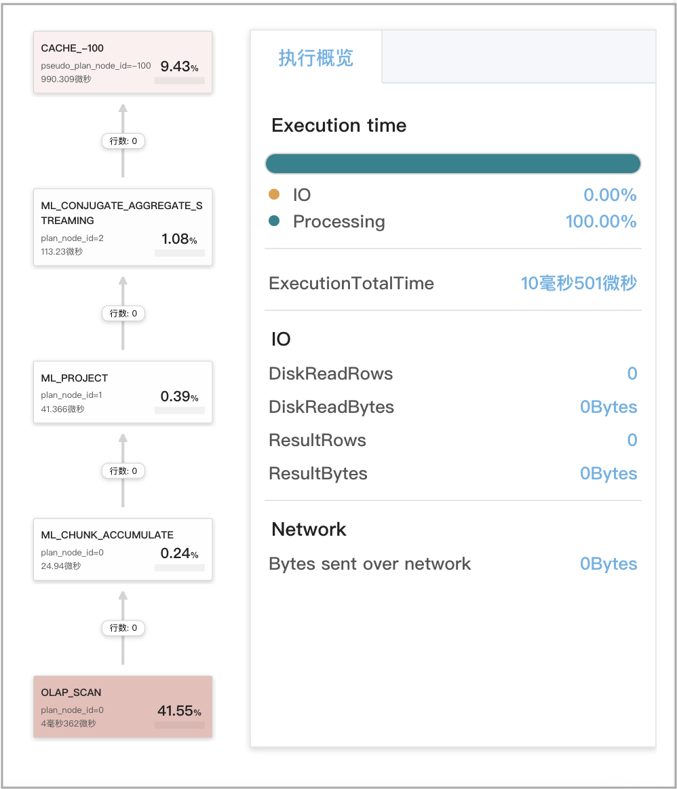
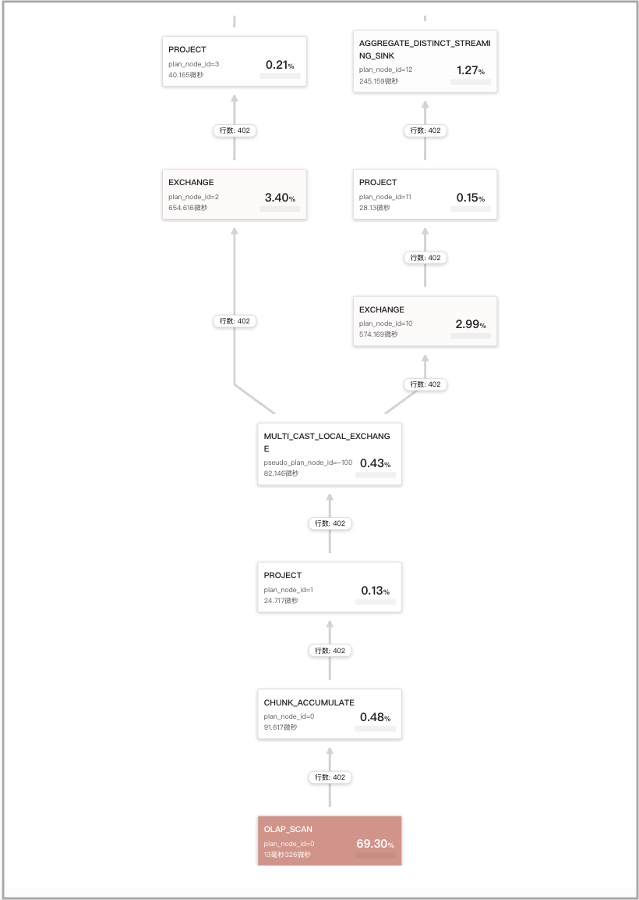
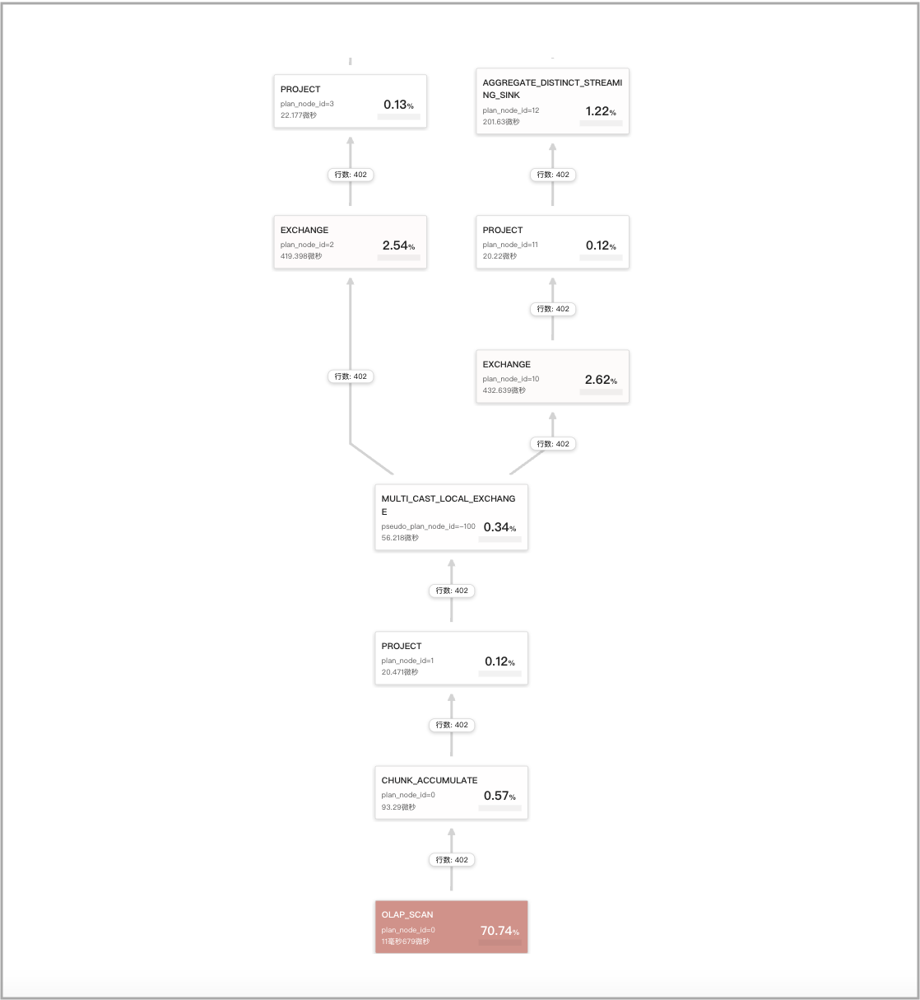
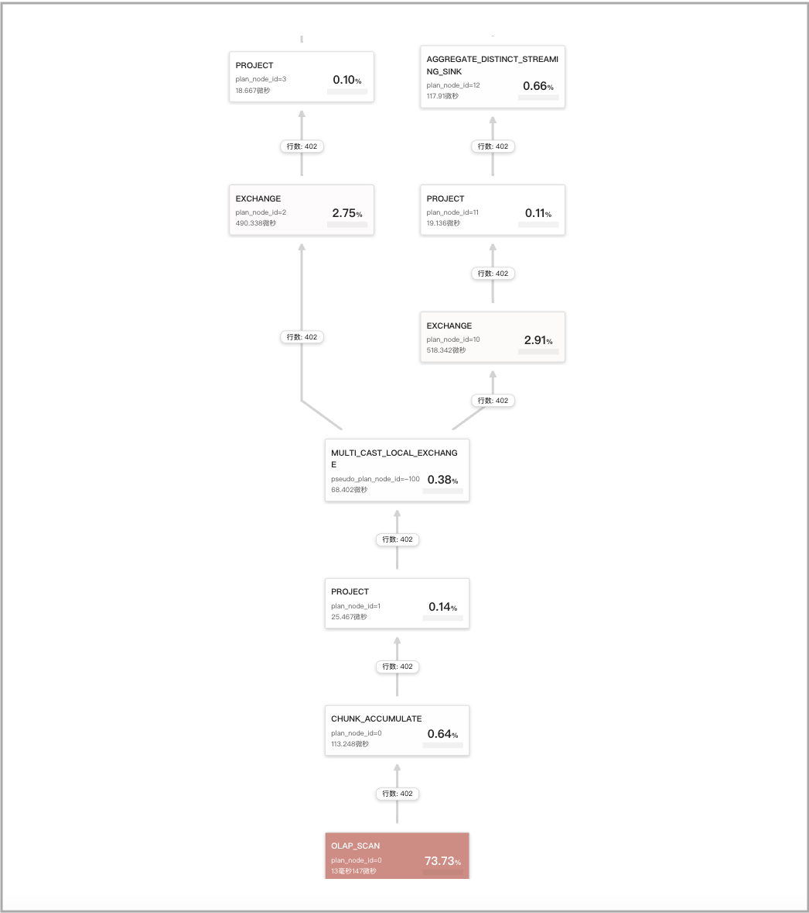

# Query Cache

StarRocks 提供的 Query Cache 特性，可以帮助您极大地提升聚合查询的性能。开启 Query Cache 后，每次处理聚合查询时，StarRocks 都会将本地聚合的中间结果缓存于内存中。这样，后续收到相同或类似的聚合查询时，StarRocks 就能够直接从 Query Cache 获取匹配的聚合结果，而无需从磁盘读取数据并进行计算，大大节省查询的时间和资源成本，并提升查询的可扩展性。在大量用户同时对复杂的大数据集执行相同或类似查询的高并发场景下，Query Cache 的优势尤为明显。

该特性从 2.5 版本开始支持。

在 2.5 版本，Query Cache 仅支持宽表模型下的单表聚合查询。自 3.0 版本起，除宽表模型下的单表聚合查询外，Query Cache 还支持星型模型下简单多表 JOIN 的聚合查询。

## 应用场景

Query Cache 可以生效的典型应用场景有如下特点：

- 查询多为宽表模型下的单表聚合查询或星型模型下简单多表 JOIN 的聚合查询。
- 聚合查询以非 GROUP BY 聚合和低基数 GROUP BY 聚合为主。
- 查询的数据以按时间分区追加的形式导入，并且在不同时间分区上的访问表现出冷热性。

目前 Query Cache 支持的查询需要满足下面条件：

- 查询的执行引擎为 Pipeline。

  > **说明**
  >
  > 除 Pipeline 以外的其他执行引擎不支持 Query Cache。

- 查询的表为原生 OLAP 表（自 2.5 版本起支持）或存算分离表（自 3.0 版本起支持）。不支持外表上的查询。查询计划中，实际访问的是同步物化视图时，Query Cache 也可以生效。异步物化视图暂不支持。

- 查询为单表聚合查询或多表 JOIN 的聚合查询。

  > **说明**
  >
  > - Query Cache 支持 Broadcast Join 和 Bucket Shuffle Join。
  > - Query Cache 支持含 Join 算子的两种树形：先聚合后 Join 和 先 Join 后聚合。在先聚合后 Join 的树形结构中，不支持 Shuffle Join。在先 Join 后聚合的树形结构中，不支持 Hash Join。

- 查询不包含 `rand`、`random`、`uuid` 和 `sleep` 等不确定性 (Nondeterminstic) 函数。

Query Cache 支持全部数据分区策略，包括 Unpartitioned、Multi-Column Partitioned 和 Single-Column Partitioned。

## 产品边界

- Query Cache 依赖于 Pipeline 执行引擎的 Per-Tablet 计算。Per-Tablet 计算是指一个 Pipeline Driver 能够以 Tablet 为单位对整 Tablet 进行处理，而不是每次只处理一个 Tablet 的一部分、或者通过交叉并发的方式同时处理多个 Tablet。如果单个 BE 所访问的 Tablet 的数量大于等于实际调用的 Pipeline Driver 的数量（即，实际并发度）时，则启用 Query Cache。如果单个 BE 所访问的 Tablet 的数量小于 Pipeline Driver 的数量，则每个 Pipeline Driver 只会处理某个 Tablet 的一部分数据，无法形成 Per-Tablet 的计算结果，这种情况下不启用 Query Cache。
- 在 StarRocks 中，一个聚合查询至少包含四个阶段的聚合。在一阶段聚合中，只有当 OlapScanNode 和 AggregateNode 位于同一个 Fragment 时，AggregateNode 产生的 Per-Tablet 计算结果才会缓存。在其他阶段聚合中，AggregateNode 产生的Per-Tablet 计算结果不会缓存。部分 DISTINCT 聚合查询，受会话变量 `cbo_cte_reuse` 为 `true` 影响，当执行计划中生产数据的 OlapScanNode 和消费数据的一阶段 AggregateNode 位于不同的 Fragment、并且中间通过 ExchangeNode 传输数据时，也不启用 Query Cache。比如如下两个场景里，采用 CTE 优化，不启用 Query Cache：
  - 查询的输出列包含聚合函数 `avg(distinct)`。
  - 查询的输出列含多个 DISTINCT 聚合函数。
- 如果在聚合之前对数据进行了 Shuffle 操作，则 Query Cache 无法加速对该数据的查询。
- 如果表的分组列或去重列是高基数列 (High-Cardinality Column)，则对该表执行聚合查询生成的结果会很大。这类查询会在运行时绕过 Query Cache。
- Query Cache 的存储占用 BE 的少量内存，默认缓存大小为 512 MB，因此不宜缓存较大的数据项。此外，在启用 Query Cache 的情况下，如果缓存的命中率低，则会带来性能惩罚。因此，在查询的计算过程中，如果某一个 Tablet 上的计算结果大小超过了 `query_cache_entry_max_bytes` 或 `query_cache_entry_max_rows` 参数指定的阈值，则该查询接下来的计算不再开启 Query Cache，转而触发使用 Passthrough 机制来执行。

## 原理介绍

启用 Query Cache 时，BE 会把查询的本地聚合拆分为以下两个阶段：

1. Per-tablet 聚合

   BE 逐个处理查询所涉及的每个 Tablet。在处理某一个 Tablet 时，BE 首先会检查 Query Cache 中是否存在该 Tablet 的中间计算结果。如果存在（缓存命中），则 BE 直接取用该结果；如果不存在（缓存未命中），则 BE 从磁盘上读取该 Tablet 的数据并进行本地聚合，然后将聚合得到的中间计算结果填充到 Query Cache，以供后续类似查询使用。

2. Inter-tablet 聚合

   BE 收集查询所涉及的所有 Tablet 的中间计算结果，并将这些结果合并成最终结果。

   

后续发起的类似查询，就可以复用之前缓存的查询结果。比如下图所示的查询，一共涉及三个 Tablet（编号 0 到 2），Query Cache 中缓存了第一个Tablet（即 Tablet 0）的中间结果。此时，BE 可以从 Query Cache 直接获取 Tablet 0 的中间计算结果，而不必访问磁盘上的数据。如果 Query Cache 完全预热，就会包含所有三个 Tablet 的中间计算结果，此时，BE 不需要访问磁盘上的任何数据。


为释放额外占用的内存，Query Cache 采用基于“最近最少使用” (Least Recently Used，简称 LRU) 算法的移出策略对缓存条目进行管理。当 Query Cache 占用的内存超过 `query_cache_capacity` 参数中设置的缓存大小时，最近最少使用的缓存条目会移出 Query Cache。

> **说明**
>
> 未来 Query Cache 还将支持基于 Time to Live (TTL) 的移出策略。

FE 判定各个查询是否需要通过 Query Cache 进行加速，并对查询进行规范化处理，以消除对查询语义没有影响的一些细微的文字细节。

为了防止在某些不适用的场景下由于开启 Query Cache 而导致性能损失，BE 会采用自适应策略在运行时绕过 Query Cache。

## 开启 Query Cache

本小节介绍用于开启和配置 Query Cache 的参数和会话变量。

### FE 会话变量

| **变量**                    | **默认值** | **是否支持动态修改** | **说明**                                                     |
| --------------------------- | ---------- | -------------------- | ------------------------------------------------------------ |
| enable_query_cache          | false      | 是                   | 指定是否开启 Query Cache。取值范围：`true` 和 `false`。`true` 表示开启，`false` 表示关闭。开启该功能后，只有当查询满足本文“[应用场景](../using_starrocks/query_cache.md#应用场景)”小节所述之条件时，才会启用 Query Cache。 |
| query_cache_entry_max_bytes | 4194304    | 是                   | 指定触发 Passthrough 模式的阈值。取值范围：`0` ~ `9223372036854775807`。当一个 Tablet 上产生的计算结果的字节数或者行数超过 `query_cache_entry_max_bytes` 或 `query_cache_entry_max_rows` 指定的阈值时，则查询采用 Passthrough 模式执行。<br />当 `query_cache_entry_max_bytes` 或 `query_cache_entry_max_rows` 取值为 `0` 时, 即便 Tablet 产生结果为空，也采用 Passthrough 模式。 |
| query_cache_entry_max_rows  | 409600     | 是                   | 同上。                                                           |

### BE 配置项

您需要在 BE 配置文件 **be.conf** 里设置下面参数。更改下面参数的设置以后，需要重启 BE 才能使参数设置生效。

| **参数**             | **必填** | **描述**                                                     |
| -------------------- | -------- | ------------------------------------------------------------ |
| query_cache_capacity | 否       | 指定 Query Cache 的大小。单位：字节。默认为 512 MB。<br />每个 BE 都有自己的 Query Cache，并且只填充 (Populate) 和检查 (Probe) 自己的 Query Cache。Query Cache 占用的是所在 BE 的内存。<br />注意 Query Cache 大小不能不低于 4 MB。如果当前的 BE 内存容量无法满足您期望的 Query Cache 大小，可以增加 BE 的内存容量，然后再设置合理的 Query Cache 大小。 |

## 确保最大缓存命中率

即使后续查询与先前发起的结果已缓存的查询在语义上并不完全对等，Query Cache 依然能够有效提升缓存命中率，主要包括以下查询场景：

- 语义等价的查询
- 扫描分区重合的查询
- 仅涉及追加写入（无 UPDATE 或 DELETE 操作）数据的查询

### 语义等价的查询

如果两个查询相似（这两个查询不一定字面上完全一致、但是其执行计划在语义上是相等的），则这两个查询可以复用彼此先前计算的结果。通俗地说，语义等价是指两个查询计算的数据来源相同、计算方式相同、并且具有相似的执行计划。严格地说，判定两个查询是否语义等价的规则如下：

- 两个查询如果包含多次聚合，只要这两个查询中的第一次聚合是语义等价的，则判定为语义等价。例如下面两个查询，Q1 和 Q2。Q1 的第一次聚合和 Q2 的第一次聚合是等价的，因此这两个查询的计算结果可以彼此复用。

  - Q1

    ```SQL
    SELECT
        (
            ifnull(sum(murmur_hash3_32(hour)), 0) + ifnull(sum(murmur_hash3_32(k0)), 0) + ifnull(sum(murmur_hash3_32(__c_0)), 0)
        ) AS fingerprint
    FROM
        (
            SELECT
                date_trunc('hour', ts) AS hour,
                k0,
                sum(v1) AS __c_0
            FROM
                  t0
            WHERE
                ts BETWEEN '2022-01-03 00:00:00'
                AND '2022-01-03 23:59:59'
            GROUP BY
                date_trunc('hour', ts),
                k0
        ) AS t;
    ```

  - Q2

    ```SQL
    SELECT
        date_trunc('hour', ts) AS hour,
        k0,
        sum(v1) AS __c_0
    FROM
        t0
    WHERE
        ts BETWEEN '2022-01-03 00:00:00'
        AND '2022-01-03 23:59:59'
    GROUP BY
        date_trunc('hour', ts),
        k0
    ```

- 两个查询都符合下面四类查询中的同一类型，则可判定为语义等价。两个查询中，有 HAVING 子句的查询和无 HAVING 子句的查询不等价。同一类型的查询中，是否含有 ORDER BY 子句和 LIMIT 子句，不影响两个查询的语义等价。

  - GROUP BY 聚合

    ```SQL
    SELECT <GroupByItems>, <AggFunctionItems> 
    FROM <Table> 
    WHERE <Predicates> [and <PartitionColumnRangePredicate>]
    GROUP BY <GroupByItems>
    [HAVING <HavingPredicate>] 
    ```

    > **说明**
    >
    > HAVING 子句为可选。

  - GROUP BY DISTINCT 聚合

    ```SQL
    SELECT DISTINCT <GroupByItems>, <Items> 
    FROM <Table> 
    WHERE <Predicates> [and <PartitionColumnRangePredicate>]
    GROUP BY <GroupByItems>
    HAVING <HavingPredicate>
    ```

    > **说明**
    >
    > HAVING 子句为可选。

  - 非 GROUP BY 聚合

    ```SQL
    SELECT <AggFunctionItems> FROM <Table> 
    WHERE <Predicates> [and <PartitionColumnRangePredicate>]
    ```

  - 非 GROUP BY DISTINCT 聚合

    ```SQL
    SELECT DISTINCT <Items> FROM <Table> 
    WHERE <Predicates> [and <PartitionColumnRangePredicate>]
    ```

- 如果两个查询中任意一个查询包含 `PartitionColumnRangePredicate`，则删除 `PartitionColumnRangePredicate` 后再判断是否语义等价。`PartitionColumnRangePredicate` 是指谓词引用的列为分区列、并且谓词为以下五种类型的谓词之一：

  - `col between v1 and v2`：分区列的取值属于区间 [v1, v2]，其中 `v1`、`v2` 为常量表达式。
  - `v1 < col and col < v2`：分区列的取值属于区间 (v1, v2)，其中 `v1`、`v2` 为常量表达式。
  - `v1 < col and col <= v2`：分区列的取值属于区间 (v1, v2]，其中 `v1`、`v2` 为常量表达式。
  - `v1 <= col and col < v2`：分区列的取值属于区间 [v1, v2)，其中 `v1`、`v2` 为常量表达式。
  - `v1 <= col and col <= v2`：分区列的取值属于区间 [v1, v2]，其中`v1`、`v2` 为常量表达式。

- 如果两个查询的 SELECT 输出列经过重排后相同，则判定为语义等价。

- 如果两个查询都包含 GROUP BY 子句、并且它们的 GROUP BY 输出列经过重排后相同，则判定为语义等价。

- 如果两个查询都包含 WHERE 子句、并且它们的 WHERE 子句中移除 `PartitionColumnRangePredicate` 后剩下的谓词完全等价，则判定为语义等价。

- 如果两个查询都包含 HAVING 子句、并且它们的 HAVING 子句中的谓词完全等价，则判定为语义等价。

比如，我们以如下一张标准表 `lineorder_flat` 为例：

```SQL
CREATE TABLE `lineorder_flat`
(
    `lo_orderdate` date NOT NULL COMMENT "",
    `lo_orderkey` int(11) NOT NULL COMMENT "",
    `lo_linenumber` tinyint(4) NOT NULL COMMENT "",
    `lo_custkey` int(11) NOT NULL COMMENT "",
    `lo_partkey` int(11) NOT NULL COMMENT "",
    `lo_suppkey` int(11) NOT NULL COMMENT "",
    `lo_orderpriority` varchar(100) NOT NULL COMMENT "",
    `lo_shippriority` tinyint(4) NOT NULL COMMENT "",
    `lo_quantity` tinyint(4) NOT NULL COMMENT "",
    `lo_extendedprice` int(11) NOT NULL COMMENT "",
    `lo_ordtotalprice` int(11) NOT NULL COMMENT "",
    `lo_discount` tinyint(4) NOT NULL COMMENT "",
    `lo_revenue` int(11) NOT NULL COMMENT "",
    `lo_supplycost` int(11) NOT NULL COMMENT "",
    `lo_tax` tinyint(4) NOT NULL COMMENT "",
    `lo_commitdate` date NOT NULL COMMENT "",
    `lo_shipmode` varchar(100) NOT NULL COMMENT "",
    `c_name` varchar(100) NOT NULL COMMENT "",
    `c_address` varchar(100) NOT NULL COMMENT "",
    `c_city` varchar(100) NOT NULL COMMENT "",
    `c_nation` varchar(100) NOT NULL COMMENT "",
    `c_region` varchar(100) NOT NULL COMMENT "",
    `c_phone` varchar(100) NOT NULL COMMENT "",
    `c_mktsegment` varchar(100) NOT NULL COMMENT "",
    `s_name` varchar(100) NOT NULL COMMENT "",
    `s_address` varchar(100) NOT NULL COMMENT "",
    `s_city` varchar(100) NOT NULL COMMENT "",
    `s_nation` varchar(100) NOT NULL COMMENT "",
    `s_region` varchar(100) NOT NULL COMMENT "",
    `s_phone` varchar(100) NOT NULL COMMENT "",
    `p_name` varchar(100) NOT NULL COMMENT "",
    `p_mfgr` varchar(100) NOT NULL COMMENT "",
    `p_category` varchar(100) NOT NULL COMMENT "",
    `p_brand` varchar(100) NOT NULL COMMENT "",
    `p_color` varchar(100) NOT NULL COMMENT "",
    `p_type` varchar(100) NOT NULL COMMENT "",
    `p_size` tinyint(4) NOT NULL COMMENT "",
    `p_container` varchar(100) NOT NULL COMMENT ""
)
ENGINE=OLAP 
DUPLICATE KEY(`lo_orderdate`, `lo_orderkey`)
COMMENT "olap"
PARTITION BY RANGE(`lo_orderdate`)
(PARTITION p1 VALUES [('0000-01-01'), ('1993-01-01')),
PARTITION p2 VALUES [('1993-01-01'), ('1994-01-01')),
PARTITION p3 VALUES [('1994-01-01'), ('1995-01-01')),
PARTITION p4 VALUES [('1995-01-01'), ('1996-01-01')),
PARTITION p5 VALUES [('1996-01-01'), ('1997-01-01')),
PARTITION p6 VALUES [('1997-01-01'), ('1998-01-01')),
PARTITION p7 VALUES [('1998-01-01'), ('1999-01-01')))
DISTRIBUTED BY HASH(`lo_orderkey`)
PROPERTIES
(
    "replication_num" = "3",
    "colocate_with" = "groupxx1",
    "storage_format" = "DEFAULT",
    "enable_persistent_index" = "false",
    "compression" = "LZ4"
);
```

下面两个查询 Q1 和 Q2 在经过如下处理之后，可以判定为语义等价：

1. 重排 SELECT 输出列。
2. 重排 GROUP BY 输出列。
3. 删除 ORDER BY 输出列。
4. 重排 WHERE 中的谓词。
5. 添加 `PartitionColumnRangePredicate`。

- Q1

  ```SQL
  SELECT sum(lo_revenue)), year(lo_orderdate) AS year,p_brand
  FROM lineorder_flat
  WHERE p_category = 'MFGR#12' AND s_region = 'AMERICA'
  GROUP BY year,p_brand
  ORDER BY year,p_brand;
  ```

- Q2

  ```SQL
  SELECT year(lo_orderdate) AS year, p_brand, sum(lo_revenue))
  FROM lineorder_flat
  WHERE s_region = 'AMERICA' AND p_category = 'MFGR#12' AND 
     lo_orderdate >= '1993-01-01' AND lo_orderdate <= '1993-12-31'
  GROUP BY p_brand, year(lo_orderdate)
  ```

判定两个查询是否等价，是基于查询的物理计划，因此两个查询的字面上差异，不影响语义等价的判定。其次，查询中可以消除常量表达式计算，`cast` 表达式在查询的规划阶段已经消除，因此这些表达式不影响语义等价的判定。再次，Column 和 Relation 的别名同样也不影响等价判定。

### 扫描分区重合的查询

Query Cache 支持谓词分解。

通过谓词分解，可以实现部分计算结果的复用。当查询中含有分区谓词（即，含有分区列的谓词）并且分区谓词表示范围时，可以将范围按照数据表的分区分解成小的区间。各区间内的计算结果，可以分别复用于其他查询。

以如下一张数据表 `t0` 为例：

```SQL
CREATE TABLE if not exists t0
(
    ts DATETIME NOT NULL,
    k0 VARCHAR(10) NOT NULL,
    k1 BIGINT NOT NULL,
    v1 DECIMAL64(7, 2) NOT NULL 
)
ENGINE=OLAP
DUPLICATE KEY(`ts`, `k0`, `k1`)
COMMENT "OLAP"
PARTITION BY RANGE(ts)
(
  START ("2022-01-01 00:00:00") END ("2022-02-01 00:00:00") EVERY (INTERVAL 1 day) 
)
DISTRIBUTED BY HASH(`ts`, `k0`, `k1`)
PROPERTIES
(
    "replication_num" = "3", 
    "storage_format" = "default"
);
```

表 `t0` 按天分区，`ts` 为分区列。下面的四个查询中，Q2、Q3 和 Q4 可以复用 Q1 的部分计算结果：

- Q1

  ```SQL
  SELECT date_trunc('day', ts) as day, sum(v0)
  FROM t0
  WHERE ts BETWEEN '2022-01-02 12:30:00' AND '2022-01-14 23:59:59'
  GROUP BY day;
  ```

  Q1 的分区谓词 `ts between '2022-01-02 12:30:00' and '2022-01-14 23:59:59'` 可以分解为如下几个区间：

  ```SQL
  1. [2022-01-02 12:30:00, 2022-01-03 00:00:00),
  2. [2022-01-03 00:00:00, 2022-01-04 00:00:00),
  3. [2022-01-04 00:00:00, 2022-01-05 00:00:00),
  ...
  12. [2022-01-13 00:00:00, 2022-01-14 00:00:00),
  13. [2022-01-14 00:00:00, 2022-01-15 00:00:00),
  ```

- Q2

  ```SQL
  SELECT date_trunc('day', ts) as day, sum(v0)
  FROM t0
  WHERE ts >= '2022-01-02 12:30:00' AND  ts < '2022-01-05 00:00:00'
  GROUP BY day;
  ```

  Q2 可以复用 Q1 如下区间的计算结果：

  ```SQL
  1. [2022-01-02 12:30:00, 2022-01-03 00:00:00),
  2. [2022-01-03 00:00:00, 2022-01-04 00:00:00),
  3. [2022-01-04 00:00:00, 2022-01-05 00:00:00),
  ```

- Q3

  ```SQL
  SELECT date_trunc('day', ts) as day, sum(v0)
  FROM t0
  WHERE ts >= '2022-01-01 12:30:00' AND  ts <= '2022-01-10 12:00:00'
  GROUP BY day;
  ```

  Q3 可以复用 Q1 如下区间的计算结果：

  ```SQL
  2. [2022-01-03 00:00:00, 2022-01-04 00:00:00),
  3. [2022-01-04 00:00:00, 2022-01-05 00:00:00),
  ...
  8. [2022-01-09 00:00:00, 2022-01-10 00:00:00),
  ```

- Q4

  ```SQL
  SELECT date_trunc('day', ts) as day, sum(v0)
  FROM t0
  WHERE ts BETWEEN '2022-01-02 12:30:00' and '2022-01-02 23:59:59'
  GROUP BY day;
  ```

  Q4 可以复用 Q1 如下区间的计算结果：

  ```SQL
  1. [2022-01-02 12:30:00, 2022-01-03 00:00:00),
  ```

部分结果复用功能的支持情况与分区策略相关，如下表所述。

| **分区策略**              | **是否支持部分结果复用**        |
| ------------------------- | ------------------------------- |
| Unpartitioned             | 不支持                          |
| Multi-Column Partitioned  | 不支持<br />**说明**<br />未来可能会支持。 |
| Single-Column Partitioned | 支持                            |

### 仅涉及追加写入数据的查询

Query Cache 支持多版本 Cache 机制。

随着数据导入，Tablet 会产生新的版本，进而导致 Query Cache 中缓存结果的 Tablet 版本落后于实际的 Tablet 版本。这时候，多版本 Cache 机制会尝试把 Query Cache 中缓存的结果与磁盘上存储的增量数据合并，确保新查询能够获取到最新版本的 Tablet 数据。多版本 Cache 机制的运行受限于数据模型、查询类型、以及数据更新类型。

不同的数据模型和查询类型对多版本 Cache 机制的支持如下表所述。

| **数据模型** | **查询类型**               | **多版本 Cache 机制的支持**                                  |
| ------------ | -------------------------- | ------------------------------------------------------------ |
| 明细模型     | <ul><li>基表查询</li><li>同步物化视图查询</li></ul>   | <ul><li>基表查询：仅当增量版本含删除记录时不支持。其他情况下都支持。</li><li>同步物化视图查询：仅当查询的 GROUP BY、HAVING、或 WHERE 子句中引用聚合列时不支持。其他情况下都支持。</li></ul> |
| 聚合模型     | 基表查询或同步物化视图查询 | 仅在以下场景不支持：基表的 Schema 中含聚合函数 `replace`。查询的 GROUP BY、HAVING、或 WHERE 子句中引用聚合列。增量版本含删除记录。其他情况下都支持。 |
| 更新模型     | 不涉及                     | 支持 Query Cache，但不支持多版本 Cache 机制。                |
| 主键模型     | 不涉及                     | 支持 Query Cache，但不支持多版本 Cache 机制。                |

不同的数据更新类型对多版本 Cache 机制的影响如下所述：

- 数据删除

  删除 Tablet 增量数据会导致多版本 Cache 机制无效。

- 数据导入

  - 如果在 Tablet 上产生了空的新版本，则 Query Cache 中已有的数据仍然有效，查询时可以直接从 Query Cache 中获取数据。
  - 如果在 Tablet 上产生了非空的新版本，则虽然 Query Cache 中已有的数据仍然有效，但是已有数据的版本已经落后于最新的 Tablet 版本。此时需要从 Tablet 中读取从已有数据的版本到 Tablet 最新版本之间的增量数据，把已有数据和增量版本计算结果合并，然后把合并后的数据结果重新填充到 Query Cache。

- 表结构 (Schema) 变更与 Tablet 剪裁

  表结构变更与 Tablet 剪裁会产生全新的 Tablet，导致 Query Cache 中已有的数据失效。

## 监控指标

在查询使用 Query Cache 时，Profile 中会出现 `CacheOperator` 的统计情况，如下图所示。


首先，源执行计划里，含 `OlapScanOperator` 的 Pipeline 中，从 `OlapScanOperator` 后继算子到聚合算子的算子名会添加前缀 `ML_`，表示当前的 Pipeline 引入了 `MultilaneOperator` 做 Per-Tablet 计算。`ML_CONJUGATE_AGGREGATE` 算子上方插入了 `CacheOperator`，该 `CacheOperator` 处理 Query Cache 在 Passthrough、Populate、Probe 三种模式下的工作逻辑。`CacheOperator` 中 Profile 有下列指标来统计 Query Cache 的使用情况。

| **指标**                  | **说明**                                                 |
| ------------------------- | -------------------------------------------------------- |
| CachePassthroughBytes     | 使用 Passthrough 模式产生的字节数。                      |
| CachePassthroughChunkNum  | 使用 Passthrough 模式产生的 Chunk 数。                   |
| CachePassthroughRowNum    | 使用 Passthrough 模式产生的行数。                        |
| CachePassthroughTabletNum | 使用 Passthrough 模式计算的 Tablet 数。                  |
| CachePassthroughTime:     | 使用 Passthrough 模式的计算用时。                        |
| CachePopulateBytes        | 使用 Populate 模式产生的字节数。                         |
| CachePopulateChunkNum     | 使用 Populate 模式产生的 Chunk 数。                      |
| CachePopulateRowNum       | 使用 Populate 模式产生的行数。                           |
| CachePopulateTabletNum    | 使用 Populate 模式计算的 Tablet 数。                     |
| CachePopulateTime         | 使用 Populate 模式的计算用时。                           |
| CacheProbeBytes           | 使用 Probe 模式并且缓存命中 (Cache Hit) 所产生的字节数。 |
| CacheProbeChunkNum        | 使用 Probe 模式并且缓存命中所产生的 Chunk 数。           |
| CacheProbeRowNum          | 使用 Probe 模式并且缓存命中所产生的行数。                |
| CacheProbeTabletNum       | 使用 Probe 模式并且缓存命中的 Tablet 数。                |
| CacheProbeTime            | 使用 Probe 模式的计算耗时。                              |

`CachePopulate`*`XXX`* 指标表示缓存未命中、并且更新了 Query Cache 的统计情况。

`CachePassthrough`*`XXX`* 指标表示缓存未命中、但因产生的 Per-Tablet 计算结果过大而未更新 Query Cache 的统计情况。

`CacheProbe`*`XXX`* 指标表示缓存命中的统计情况。

在多版本 Cache 机制中，CachePopulate 和 CacheProbe 统计可能包含重复的 Tablet，CachePassthrough 和 CacheProbe 也可能包含重复的 Tablet。比如计算每一个 Tablet 的结果时，命中了缓存 Tablet 历史版本的计算结果，回源读取增量版本进行计算后，和已有的缓存内容合并。合并后的计算结果未超过 `query_cache_entry_max_bytes` 或 `query_cache_entry_max_rows` 参数指定的阈值，则会计入 CachePopulate 的统计，反之则会计入 CachePassthrough 的统计。

## RESTful API 操作接口

- `metrics |grep query_cache`

  用于查看 Query Cache 相关的指标，如下所示：

  ```Apache
  curl -s  http://<be_host>:<be_http_port>/metrics |grep query_cache
    
  # TYPE starrocks_be_query_cache_capacity gauge
  starrocks_be_query_cache_capacity 536870912
  # TYPE starrocks_be_query_cache_hit_count gauge
  starrocks_be_query_cache_hit_count 5084393
  # TYPE starrocks_be_query_cache_hit_ratio gauge
  starrocks_be_query_cache_hit_ratio 0.984098
  # TYPE starrocks_be_query_cache_lookup_count gauge
  starrocks_be_query_cache_lookup_count 5166553
  # TYPE starrocks_be_query_cache_usage gauge
  starrocks_be_query_cache_usage 0
  # TYPE starrocks_be_query_cache_usage_ratio gauge
  starrocks_be_query_cache_usage_ratio 0.000000
  ```

- `api/query_cache/stat`

  用于展示 Query Cache 的使用情况，如下所示：

  ```Bash
  curl  http://<be_host>:<be_http_port>/api/query_cache/stat
  {
      "capacity": 536870912,
      "usage": 0,
      "usage_ratio": 0.0,
      "lookup_count": 5025124,
      "hit_count": 4943720,
      "hit_ratio": 0.983800598751394
  }
  ```

- `api/query_cache/invalidate_all`

  用于清空 Query Cache，如下所示：

  ```Bash
  curl  -XPUT http://<be_host>:<be_http_port>/api/query_cache/invalidate_all
    
  {
      "status": "OK"
  }
  ```

参数说明如下：

- `be_host`：BE 所在节点的 IP 地址。
- `be_http_port`：BE 所在节点的 HTTP 端口号。

## 注意事项

- 部分查询首次发起，因为要填充 Query Cache，可能有轻微的性能惩罚，导致延迟加大。
- 当 Query Cache 配置较大的内存容量时，会占用 BE 上可用于查询评估的内存容量。建议配置 Query Cache 的内存容量不超过可用于查询评估的内存容量的 1/6。
- 当 Pipeline 处理的 Tablet 数量少于 `pipeline_dop` 取值时，Query Cache 不开启。此时您可以将 `pipeline_dop` 设置为较小的值，例如设置为 `1`。从 3.0 版本开始，支持根据查询并发度自适应调节 `pipeline_dop`。

## 示例

### 数据集

1. 登录 StarRocks 集群，进入目标数据库，执行如下命令创建表 `t0`：

   ```SQL
   CREATE TABLE t0
   (
         `ts` datetime NOT NULL COMMENT "",
         `k0` varchar(10) NOT NULL COMMENT "",
         `k1` char(6) NOT NULL COMMENT "",
         `v0` bigint(20) NOT NULL COMMENT "",
         `v1` decimal64(7, 2) NOT NULL COMMENT ""
   )
   ENGINE=OLAP 
   DUPLICATE KEY(`ts`, `k0`, `k1`)
   COMMENT "OLAP"
   PARTITION BY RANGE(`ts`)
   (
       START ("2022-01-01 00:00:00") END ("2022-02-01 00:00:00") EVERY (INTERVAL 1 DAY)
   )
   DISTRIBUTED BY HASH(`ts`, `k0`, `k1`)
   PROPERTIES
   (
       "replication_num" = "3",
       "storage_format" = "DEFAULT",
       "enable_persistent_index" = "false"
   );
   ```

2. 往表 `t0` 里插入如下数据：

   ```SQL
   INSERT INTO t0
   VALUES
       ('2022-01-11 20:42:26', 'n4AGcEqYp', 'hhbawx', '799393174109549', '8029.42'),
       ('2022-01-27 18:17:59', 'i66lt', 'mtrtzf', '100400167', '10000.88'),
       ('2022-01-28 20:10:44', 'z6', 'oqkeun', '-58681382337', '59881.87'),
       ('2022-01-29 14:54:31', 'qQ', 'dzytua', '-19682006834', '43807.02'),
       ('2022-01-31 08:08:11', 'qQ', 'dzytua', '7970665929984223925', '-8947.74'),
       ('2022-01-15 00:40:58', '65', 'hhbawx', '4054945', '156.56'),
       ('2022-01-24 16:17:51', 'onqR3JsK1', 'udtmfp', '-12962', '-72127.53'),
       ('2022-01-01 22:36:24', 'n4AGcEqYp', 'fabnct', '-50999821', '17349.85'),
       ('2022-01-21 08:41:50', 'Nlpz1j3h', 'dzytua', '-60162', '287.06'),
       ('2022-01-30 23:44:55', '', 'slfght', '62891747919627339', '8014.98'),
       ('2022-01-18 19:14:28', 'z6', 'dzytua', '-1113001726', '73258.24'),
       ('2022-01-30 14:54:59', 'z6', 'udtmfp', '111175577438857975', '-15280.41'),
       ('2022-01-08 22:08:26', 'z6', 'ympyls', '3', '2.07'),
       ('2022-01-03 08:17:29', 'Nlpz1j3h', 'udtmfp', '-234492', '217.58'),
       ('2022-01-27 07:28:47', 'Pc', 'cawanm', '-1015', '-20631.50'),
       ('2022-01-17 14:07:47', 'Nlpz1j3h', 'lbsvqu', '2295574006197343179', '93768.75'),
       ('2022-01-31 14:00:12', 'onqR3JsK1', 'umlkpo', '-227', '-66199.05'),
       ('2022-01-05 20:31:26', '65', 'lbsvqu', '684307', '36412.49'),
       ('2022-01-06 00:51:34', 'z6', 'dzytua', '11700309310', '-26064.10'),
       ('2022-01-26 02:59:00', 'n4AGcEqYp', 'slfght', '-15320250288446', '-58003.69'),
       ('2022-01-05 03:26:26', 'z6', 'cawanm', '19841055192960542', '-5634.36'),
       ('2022-01-17 08:51:23', 'Pc', 'ghftus', '35476438804110', '13625.99'),
       ('2022-01-30 18:56:03', 'n4AGcEqYp', 'lbsvqu', '3303892099598', '8.37'),
       ('2022-01-22 14:17:18', 'i66lt', 'umlkpo', '-27653110', '-82306.25'),
       ('2022-01-02 10:25:01', 'qQ', 'ghftus', '-188567166', '71442.87'),
       ('2022-01-30 04:58:14', 'Pc', 'ympyls', '-9983', '-82071.59'),
       ('2022-01-05 00:16:56', '7Bh', 'hhbawx', '43712', '84762.97'),
       ('2022-01-25 03:25:53', '65', 'mtrtzf', '4604107', '-2434.69'),
       ('2022-01-27 21:09:10', '65', 'udtmfp', '476134823953365199', '38736.04'),
       ('2022-01-11 13:35:44', '65', 'qmwhvr', '1', '0.28'),
       ('2022-01-03 19:13:07', '', 'lbsvqu', '11', '-53084.04'),
       ('2022-01-20 02:27:25', 'i66lt', 'umlkpo', '3218824416', '-71393.20'),
       ('2022-01-04 04:52:36', '7Bh', 'ghftus', '-112543071', '-78377.93'),
       ('2022-01-27 18:27:06', 'Pc', 'umlkpo', '477', '-98060.13'),
       ('2022-01-04 19:40:36', '', 'udtmfp', '433677211', '-99829.94'),
       ('2022-01-20 23:19:58', 'Nlpz1j3h', 'udtmfp', '361394977', '-19284.18'),
       ('2022-01-05 02:17:56', 'Pc', 'oqkeun', '-552390906075744662', '-25267.92'),
       ('2022-01-02 16:14:07', '65', 'dzytua', '132', '2393.77'),
       ('2022-01-28 23:17:14', 'z6', 'umlkpo', '61', '-52028.57'),
       ('2022-01-12 08:05:44', 'qQ', 'hhbawx', '-9579605666539132', '-87801.81'),
       ('2022-01-31 19:48:22', 'z6', 'lbsvqu', '9883530877822', '34006.42'),
       ('2022-01-11 20:38:41', '', 'piszhr', '56108215256366', '-74059.80'),
       ('2022-01-01 04:15:17', '65', 'cawanm', '-440061829443010909', '88960.51'),
       ('2022-01-05 07:26:09', 'qQ', 'umlkpo', '-24889917494681901', '-23372.12'),
       ('2022-01-29 18:13:55', 'Nlpz1j3h', 'cawanm', '-233', '-24294.42'),
       ('2022-01-10 00:49:45', 'Nlpz1j3h', 'ympyls', '-2396341', '77723.88'),
       ('2022-01-29 08:02:58', 'n4AGcEqYp', 'slfght', '45212', '93099.78'),
       ('2022-01-28 08:59:21', 'onqR3JsK1', 'oqkeun', '76', '-78641.65'),
       ('2022-01-26 14:29:39', '7Bh', 'umlkpo', '176003552517', '-99999.96'),
       ('2022-01-03 18:53:37', '7Bh', 'piszhr', '3906151622605106', '55723.01'),
       ('2022-01-04 07:08:19', 'i66lt', 'ympyls', '-240097380835621', '-81800.87'),
       ('2022-01-28 14:54:17', 'Nlpz1j3h', 'slfght', '-69018069110121', '90533.64'),
       ('2022-01-22 07:48:53', 'Pc', 'ympyls', '22396835447981344', '-12583.39'),
       ('2022-01-22 07:39:29', 'Pc', 'uqkghp', '10551305', '52163.82'),
       ('2022-01-08 22:39:47', 'Nlpz1j3h', 'cawanm', '67905472699', '87831.30'),
       ('2022-01-05 14:53:34', '7Bh', 'dzytua', '-779598598706906834', '-38780.41'),
       ('2022-01-30 17:34:41', 'onqR3JsK1', 'oqkeun', '346687625005524', '-62475.31'),
       ('2022-01-29 12:14:06', '', 'qmwhvr', '3315', '22076.88'),
       ('2022-01-05 06:47:04', 'Nlpz1j3h', 'udtmfp', '-469', '42747.17'),
       ('2022-01-19 15:20:20', '7Bh', 'lbsvqu', '347317095885', '-76393.49'),
       ('2022-01-08 16:18:22', 'z6', 'fghmcd', '2', '90315.60'),
       ('2022-01-02 00:23:06', 'Pc', 'piszhr', '-3651517384168400', '58220.34'),
       ('2022-01-12 08:23:31', 'onqR3JsK1', 'udtmfp', '5636394870355729225', '33224.25'),
       ('2022-01-28 10:46:44', 'onqR3JsK1', 'oqkeun', '-28102078612755', '6469.53'),
       ('2022-01-23 23:16:11', 'onqR3JsK1', 'ghftus', '-707475035515433949', '63422.66'),
       ('2022-01-03 05:32:31', 'z6', 'hhbawx', '-45', '-49680.52'),
       ('2022-01-27 03:24:33', 'qQ', 'qmwhvr', '375943906057539870', '-66092.96'),
       ('2022-01-25 20:07:22', '7Bh', 'slfght', '1', '72440.21'),
       ('2022-01-04 16:07:24', 'qQ', 'uqkghp', '751213107482249', '16417.31'),
       ('2022-01-23 19:22:00', 'Pc', 'hhbawx', '-740731249600493', '88439.40'),
       ('2022-01-05 09:04:20', '7Bh', 'cawanm', '23602', '302.44');
   ```

### 查询样例

本小节中图示的 Query Cache 相关指标统计结果，仅为示例，具体以实际统计结果为准。

#### 一阶段本地聚合使用 Query Cache

包含三种情形：

- 查询只访问单个 Tablet。
- 查询访问多个分区的多个 Tablet，数据表采用 Colocated Group，计算聚合时不需要 Shuffle。
- 查询访问一个分区的多个 Tablet，计算聚合时不需要 Shuffle。

查询示例：

```SQL
SELECT
    date_trunc('hour', ts) AS hour,
    k0,
    sum(v1) AS __c_0
FROM
    t0
WHERE
    ts between '2022-01-03 00:00:00'
    and '2022-01-03 23:59:59'
GROUP BY
    date_trunc('hour', ts),
    k0
```

Profile 中 Query Cache 相关指标统计如下图所示。



#### 一阶段远程聚合不使用 Query Cache

当强制采用一阶段聚合、并且聚合计算需要跨多个 Tablet 时，数据先 Shuffle 后聚合。

查询示例：

```SQL
SET new_planner_agg_stage = 1;

SELECT
    date_trunc('hour', ts) AS hour,
    v0 % 2 AS is_odd,
    sum(v1) AS __c_0
FROM
    t0
WHERE
    ts between '2022-01-03 00:00:00'
    and '2022-01-03 23:59:59'
GROUP BY
    date_trunc('hour', ts),
    is_odd
```

#### 二阶段聚合的本地聚合使用 Query Cache

包含三种情形：

- 查询的二阶段聚合是比较同样的聚合类型，第一次聚合做本地聚合，其聚合的结果再做一次全局 (Global) 聚合。
- 查询为 SELECT DISTINCT 查询。
- 查询包含 DISTINCT 聚合函数 `sum(distinct)`、`count(distinct)` 或 `avg(distinct)`。这种查询一般走三阶段聚合或者四阶段聚合，但是也可以通过 `set new_planner_agg_stage = 1` 设置强制采用二阶段聚合。如果查询包含 DISTINCT 聚合函数 `avg(distinct)`、要采用两阶段聚合的话，还需要通过 `set cbo_cte_reuse = false` 来关闭 CTE 优化。

查询示例：

```SQL
SELECT
    date_trunc('hour', ts) AS hour,
    v0 % 2 AS is_odd,
    sum(v1) AS __c_0
FROM
    t0
WHERE
    ts between '2022-01-03 00:00:00'
    and '2022-01-03 23:59:59'
GROUP BY
    date_trunc('hour', ts),
    is_odd
```

Profile 中 Query Cache 相关指标统计如下图所示。



#### 三阶段聚合的本地聚合使用 Query Cache

查询为含单个 DISTINCT 聚合函数的 GROUP BY 聚合查询。

支持的 DISTINCT 聚合函数有 `sum(distinct)`、`count(distinct)` 和 `avg(distinct)`。

> **注意**
>
> `avg(distinct)` 需要关闭 CTE 优化。命令如下：`set cbo_cte_reuse = false`。

查询示例：

```SQL
SELECT
    date_trunc('hour', ts) AS hour,
    v0 % 2 AS is_odd,
    sum(distinct v1) AS __c_0
FROM
    t0
WHERE
    ts between '2022-01-03 00:00:00'
    and '2022-01-03 23:59:59'
GROUP BY
    date_trunc('hour', ts),
    is_odd;
```

Profile 中 Query Cache 相关指标统计如下图所示。



#### 四阶段聚合的本地聚合使用 Query Cache

查询为含单个 DISTINCT 聚合函数的非 GROUP BY 聚合查询，比如经典的去重查询。

查询示例：

```SQL
SELECT
    count(distinct v1) AS __c_0
FROM
    t0
WHERE
    ts between '2022-01-03 00:00:00'
    and '2022-01-03 23:59:59'
```

Profile 中 Query Cache 相关指标统计如下图所示。


#### 两个查询的第一次聚合语义等价复用 Query Cache 缓存结果

例如下面两个查询，Q1 和 Q2。Q1 和 Q2 都包含多次聚合，但是它们的第一次聚合是语义等价的，因此被判定为两个语义等价的查询，可以复用彼此在 Query Cache 中缓存的计算结果。

- Q1

  ```SQL
  SELECT
      (
          ifnull(sum(murmur_hash3_32(hour)), 0) + ifnull(sum(murmur_hash3_32(k0)), 0) + ifnull(sum(murmur_hash3_32(__c_0)), 0)
      ) AS fingerprint
  FROM
      (
          SELECT
              date_trunc('hour', ts) AS hour,
              k0,
              sum(v1) AS __c_0
          FROM
              t0
          WHERE
              ts between '2022-01-03 00:00:00'
              and '2022-01-03 23:59:59'
          GROUP BY
              date_trunc('hour', ts),
              k0
      ) AS t;
  ```

- Q2

  ```SQL
  SELECT
      date_trunc('hour', ts) AS hour,
      k0,
      sum(v1) AS __c_0
  FROM
      t0
  WHERE
      ts between '2022-01-03 00:00:00'
      and '2022-01-03 23:59:59'
  GROUP BY
      date_trunc('hour', ts),
      k0
  ```

Q1 查询 CachePopulate 类指标的统计结果如下图所示。



Q2 查询 CacheProbe 类指标的统计结果如下图所示。



#### 采用 CTE 优化的 DISTINCT 查询不使用 Query Cache

通过 `set cbo_cte_reuse = true` 设置启用 CTE 优化后，几种含 DISTINCT 聚合函数的情形，计算结果无法被缓存。以下为几个举例：

- 查询包含 DISTINCT 聚合函数 `avg(distinct)`。

  ```SQL
  SELECT
      avg(distinct v1) AS __c_0
  FROM
      t0
  WHERE
      ts between '2022-01-03 00:00:00'
      and '2022-01-03 23:59:59';
  ```



- 查询包含针对同一列的多个 DISTINCT 聚合函数。

  ```SQL
  SELECT
      avg(distinct v1) AS __c_0,
      sum(distinct v1) AS __c_1,
      count(distinct v1) AS __c_2
  FROM
      t0
  WHERE
      ts between '2022-01-03 00:00:00'
      and '2022-01-03 23:59:59';
  ```



- 查询包含针对不同列的多个 DISTINCT 聚合函数。

  ```SQL
  SELECT
      sum(distinct v1) AS __c_1,
      count(distinct v0) AS __c_2
  FROM
      t0
  WHERE
      ts between '2022-01-03 00:00:00'
      and '2022-01-03 23:59:59';
  ```



## 最佳实践

建表时，设置合理的分区策略，并选择合适的数据分布方式，包括：

- 选择一个只包含 DATE 类型数据的列作为分区列。如果表里有多个包含 DATE 类型数据的列，请选择满足以下两个条件的列作为分区列：
  - 列值随数据插入而向前滚动。
  - 该列用于定义查询的时间范围。
- 选择合适的分区宽度。最新插入的数据可能会修改表的最新分区，导致涉及最新分区的缓存条目不稳定、并且容易失效。
- 确保分桶数量在数十个左右。如果分桶数量过小，那么当 BE 需要处理的 Tablet 数量小于 `pipeline_dop` 参数的取值时，Query Cache 无法生效。
