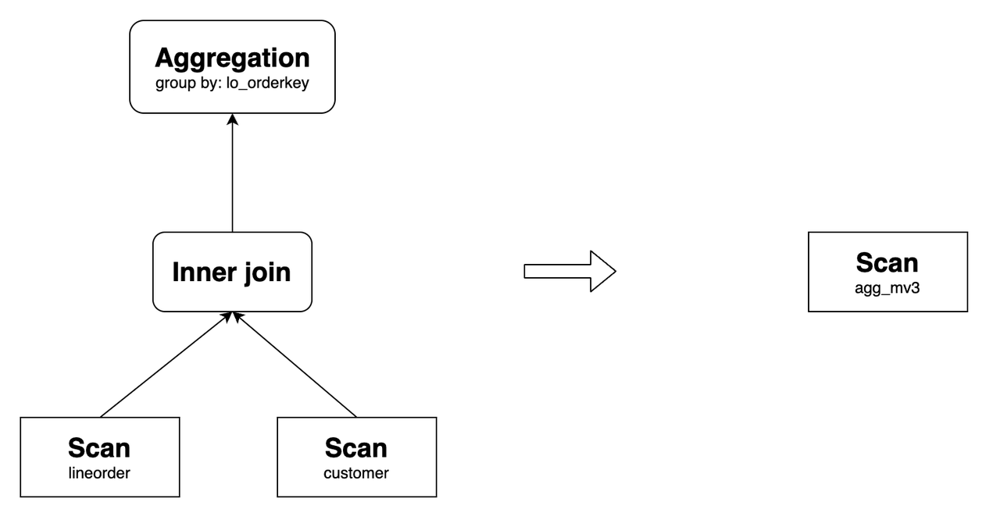

# 物化视图查询改写

本文描述了如何利用 StarRocks 的异步物化视图来改写并加速查询。

## 概述

StarRocks 的异步物化视图采用了主流的基于 SPJG（select-project-join-group-by）模式透明查询改写算法。在不修改查询语句的前提下，StarRocks 可以自动将在基表上的查询改写为在物化视图上的查询。通过其中包含的预计算结果，物化视图可以帮助您显著降低计算成本，并大幅加速查询执行。

基于异步物化视图的查询改写功能，在以下场景下特别有用：

- **指标预聚合**

  如果您需要处理高维度数据，可以使用物化视图来创建预聚合指标层。

- **宽表 Join**

  物化视图允许您在复杂场景下下透明加速包含大宽表 Join 的查询。

- **湖仓加速**

  构建基于 External Catalog 的物化视图可以轻松加速针对数据湖中数据的查询。

> **说明**
>
> 基于 JDBC Catalog 表构建的异步物化视图暂不支持查询改写。

### 功能特点

StarRocks 的异步物化视图自动查询改写功能具有以下特点：

- **强数据一致性**：如果基表是 StarRocks 内表，StarRocks 可以保证通过物化视图查询改写获得的结果与直接查询基表的结果一致。
- **Staleness rewrite**：StarRocks 支持 Staleness rewrite，即允许容忍一定程度的数据过期，以应对数据变更频繁的情况。
- **多表 Join**：StarRocks 的异步物化视图支持各种类型的 Join，包括一些复杂的 Join 场景，如 View Delta Join 和 Join 派生改写，可用于加速涉及大宽表的查询场景。
- **聚合改写**：StarRocks 可以改写带有聚合操作的查询，以提高报表性能。
- **嵌套物化视图**：StarRocks 支持基于嵌套物化视图改写复杂查询，扩展了可改写的查询范围。
- **Union 改写**：您可以将 Union 改写特性与物化视图分区的生存时间（TTL）相结合，实现冷热数据的分离，允许您从物化视图查询热数据，从基表查询历史数据。
- **基于视图构建物化视图**：您可以在基于视图建模的情景下加速查询。
- **基于 External Catalog 构建物化视图**：您可以通过该特性加速数据湖中的查询。
- **复杂表达式改写**：支持在表达式中调用函数和算术运算，满足复杂分析和计算需求。

这些特点将在以下各节中详细说明。

## Join 改写

StarRocks 支持改写具有各种类型 Join 的查询，包括 Inner Join、Cross Join、Left Outer Join、Full Outer Join、Right Outer Join、Semi Join 和 Anti Join。 以下示例展示 Join 查询的改写。创建以下基表：

```SQL
CREATE TABLE customer (
  c_custkey     INT(11)     NOT NULL,
  c_name        VARCHAR(26) NOT NULL,
  c_address     VARCHAR(41) NOT NULL,
  c_city        VARCHAR(11) NOT NULL,
  c_nation      VARCHAR(16) NOT NULL,
  c_region      VARCHAR(13) NOT NULL,
  c_phone       VARCHAR(16) NOT NULL,
  c_mktsegment  VARCHAR(11) NOT NULL
) ENGINE=OLAP
DUPLICATE KEY(c_custkey)
DISTRIBUTED BY HASH(c_custkey) BUCKETS 12;

CREATE TABLE lineorder (
  lo_orderkey         INT(11) NOT NULL,
  lo_linenumber       INT(11) NOT NULL,
  lo_custkey          INT(11) NOT NULL,
  lo_partkey          INT(11) NOT NULL,
  lo_suppkey          INT(11) NOT NULL,
  lo_orderdate        INT(11) NOT NULL,
  lo_orderpriority    VARCHAR(16) NOT NULL,
  lo_shippriority     INT(11) NOT NULL,
  lo_quantity         INT(11) NOT NULL,
  lo_extendedprice    INT(11) NOT NULL,
  lo_ordtotalprice    INT(11) NOT NULL,
  lo_discount         INT(11) NOT NULL,
  lo_revenue          INT(11) NOT NULL,
  lo_supplycost       INT(11) NOT NULL,
  lo_tax              INT(11) NOT NULL,
  lo_commitdate       INT(11) NOT NULL,
  lo_shipmode         VARCHAR(11) NOT NULL
) ENGINE=OLAP
DUPLICATE KEY(lo_orderkey)
DISTRIBUTED BY HASH(lo_orderkey) BUCKETS 48;
```

基于上述基表，创建以下物化视图：

```SQL
CREATE MATERIALIZED VIEW join_mv1
DISTRIBUTED BY HASH(lo_orderkey)
AS
SELECT lo_orderkey, lo_linenumber, lo_revenue, lo_partkey, c_name, c_address
FROM lineorder INNER JOIN customer
ON lo_custkey = c_custkey;
```

该物化视图可以改写以下查询：

```SQL
SELECT lo_orderkey, lo_linenumber, lo_revenue, c_name, c_address
FROM lineorder INNER JOIN customer
ON lo_custkey = c_custkey;
```

其原始查询计划和改写后的计划如下：


StarRocks 支持改写具有复杂表达式的 Join 查询，如算术运算、字符串函数、日期函数、CASE WHEN 表达式和谓词 OR 等。例如，上述物化视图可以改写以下查询：

```SQL
SELECT 
    lo_orderkey, 
    lo_linenumber, 
    (2 * lo_revenue + 1) * lo_linenumber, 
    upper(c_name), 
    substr(c_address, 3)
FROM lineorder INNER JOIN customer
ON lo_custkey = c_custkey;
```

除了常规场景，StarRocks还支持在更复杂的情景下改写 Join 查询。

### Query Delta Join 改写

Query Delta Join 是指查询中 Join 的表是物化视图中 Join 的表的超集的情况。例如，以下查询 Join 了表 `lineorder`、表 `customer` 和 表 `part`。如果物化视图 `join_mv1` 仅包含 `lineorder` 和 `customer` 的 Join，StarRocks 可以使用 `join_mv1` 来改写查询。

示例：

```SQL
SELECT lo_orderkey, lo_linenumber, lo_revenue, c_name, c_address, p_name
FROM
    lineorder INNER JOIN customer ON lo_custkey = c_custkey
    INNER JOIN part ON lo_partkey = p_partkey;
```

其原始查询计划和改写后的计划如下：


### View Delta Join 改写

View Delta Join 指的是查询中 Join 的表是物化视图中 Join 的表的子集的情况。通常在涉及大宽表的情景中使用此功能。例如，在 Star Schema Benchmark (SSB) 的背景下，您可以通过创建物化视图，Join 所有表以提高查询性能。测试发现在通过物化视图透明改写查询后，多表 Join 的查询性能可以达到与查询相应大宽表相同的性能水平。

要启用 View Delta Join 改写，必须保证物化视图中包含在查询中不存在的 1:1 的 Cardinality Preservation Join。满足以下约束条件的九种 Join 都被视为 Cardinality Preservation Join，可以用于启用 View Delta Join 改写：


以 SSB 测试为例，创建以下基表：

```SQL
CREATE TABLE customer (
  c_custkey         INT(11)       NOT NULL,
  c_name            VARCHAR(26)   NOT NULL,
  c_address         VARCHAR(41)   NOT NULL,
  c_city            VARCHAR(11)   NOT NULL,
  c_nation          VARCHAR(16)   NOT NULL,
  c_region          VARCHAR(13)   NOT NULL,
  c_phone           VARCHAR(16)   NOT NULL,
  c_mktsegment      VARCHAR(11)   NOT NULL
) ENGINE=OLAP
DUPLICATE KEY(c_custkey)
DISTRIBUTED BY HASH(c_custkey) BUCKETS 12
PROPERTIES (
"unique_constraints" = "c_custkey"   -- 指定唯一键。
);

CREATE TABLE dates (
  d_datekey          DATE          NOT NULL,
  d_date             VARCHAR(20)   NOT NULL,
  d_dayofweek        VARCHAR(10)   NOT NULL,
  d_month            VARCHAR(11)   NOT NULL,
  d_year             INT(11)       NOT NULL,
  d_yearmonthnum     INT(11)       NOT NULL,
  d_yearmonth        VARCHAR(9)    NOT NULL,
  d_daynuminweek     INT(11)       NOT NULL,
  d_daynuminmonth    INT(11)       NOT NULL,
  d_daynuminyear     INT(11)       NOT NULL,
  d_monthnuminyear   INT(11)       NOT NULL,
  d_weeknuminyear    INT(11)       NOT NULL,
  d_sellingseason    VARCHAR(14)   NOT NULL,
  d_lastdayinweekfl  INT(11)       NOT NULL,
  d_lastdayinmonthfl INT(11)       NOT NULL,
  d_holidayfl        INT(11)       NOT NULL,
  d_weekdayfl        INT(11)       NOT NULL
) ENGINE=OLAP
DUPLICATE KEY(d_datekey)
DISTRIBUTED BY HASH(d_datekey) BUCKETS 1
PROPERTIES (
"unique_constraints" = "d_datekey"   -- 指定唯一键。
);

CREATE TABLE supplier (
  s_suppkey          INT(11)       NOT NULL,
  s_name             VARCHAR(26)   NOT NULL,
  s_address          VARCHAR(26)   NOT NULL,
  s_city             VARCHAR(11)   NOT NULL,
  s_nation           VARCHAR(16)   NOT NULL,
  s_region           VARCHAR(13)   NOT NULL,
  s_phone            VARCHAR(16)   NOT NULL
) ENGINE=OLAP
DUPLICATE KEY(s_suppkey)
DISTRIBUTED BY HASH(s_suppkey) BUCKETS 12
PROPERTIES (
"unique_constraints" = "s_suppkey"   -- 指定唯一键。
);

CREATE TABLE part (
  p_partkey          INT(11)       NOT NULL,
  p_name             VARCHAR(23)   NOT NULL,
  p_mfgr             VARCHAR(7)    NOT NULL,
  p_category         VARCHAR(8)    NOT NULL,
  p_brand            VARCHAR(10)   NOT NULL,
  p_color            VARCHAR(12)   NOT NULL,
  p_type             VARCHAR(26)   NOT NULL,
  p_size             TINYINT(11)   NOT NULL,
  p_container        VARCHAR(11)   NOT NULL
) ENGINE=OLAP
DUPLICATE KEY(p_partkey)
DISTRIBUTED BY HASH(p_partkey) BUCKETS 12
PROPERTIES (
"unique_constraints" = "p_partkey"   -- 指定唯一键。
);

CREATE TABLE lineorder (
  lo_orderdate       DATE          NOT NULL, -- 指定为 NOT NULL。
  lo_orderkey        INT(11)       NOT NULL,
  lo_linenumber      TINYINT       NOT NULL,
  lo_custkey         INT(11)       NOT NULL, -- 指定为 NOT NULL。
  lo_partkey         INT(11)       NOT NULL, -- 指定为 NOT NULL。
  lo_suppkey         INT(11)       NOT NULL, -- 指定为 NOT NULL。
  lo_orderpriority   VARCHAR(100)  NOT NULL,
  lo_shippriority    TINYINT       NOT NULL,
  lo_quantity        TINYINT       NOT NULL,
  lo_extendedprice   INT(11)       NOT NULL,
  lo_ordtotalprice   INT(11)       NOT NULL,
  lo_discount        TINYINT       NOT NULL,
  lo_revenue         INT(11)       NOT NULL,
  lo_supplycost      INT(11)       NOT NULL,
  lo_tax             TINYINT       NOT NULL,
  lo_commitdate      DATE          NOT NULL,
  lo_shipmode        VARCHAR(100)  NOT NULL
) ENGINE=OLAP
DUPLICATE KEY(lo_orderdate,lo_orderkey)
PARTITION BY RANGE(lo_orderdate)
(PARTITION p1 VALUES [("0000-01-01"), ("1993-01-01")),
PARTITION p2 VALUES [("1993-01-01"), ("1994-01-01")),
PARTITION p3 VALUES [("1994-01-01"), ("1995-01-01")),
PARTITION p4 VALUES [("1995-01-01"), ("1996-01-01")),
PARTITION p5 VALUES [("1996-01-01"), ("1997-01-01")),
PARTITION p6 VALUES [("1997-01-01"), ("1998-01-01")),
PARTITION p7 VALUES [("1998-01-01"), ("1999-01-01")))
DISTRIBUTED BY HASH(lo_orderkey) BUCKETS 48
PROPERTIES (
"foreign_key_constraints" = "
    (lo_custkey) REFERENCES customer(c_custkey);
    (lo_partkey) REFERENCES part(p_partkey);
    (lo_suppkey) REFERENCES supplier(s_suppkey)" -- 指定外键约束。
);
```

创建 Join 表 `lineorder`、表 `customer`、表 `supplier`、表 `part` 和表 `dates` 的物化视图 `lineorder_flat_mv`：

```SQL
CREATE MATERIALIZED VIEW lineorder_flat_mv
DISTRIBUTED BY HASH(LO_ORDERDATE, LO_ORDERKEY) BUCKETS 48
PARTITION BY LO_ORDERDATE
REFRESH MANUAL
PROPERTIES (
    "partition_refresh_number"="1"
)
AS SELECT /*+ SET_VAR(query_timeout = 7200) */     -- 设置刷新超时时间。
       l.LO_ORDERDATE        AS LO_ORDERDATE,
       l.LO_ORDERKEY         AS LO_ORDERKEY,
       l.LO_LINENUMBER       AS LO_LINENUMBER,
       l.LO_CUSTKEY          AS LO_CUSTKEY,
       l.LO_PARTKEY          AS LO_PARTKEY,
       l.LO_SUPPKEY          AS LO_SUPPKEY,
       l.LO_ORDERPRIORITY    AS LO_ORDERPRIORITY,
       l.LO_SHIPPRIORITY     AS LO_SHIPPRIORITY,
       l.LO_QUANTITY         AS LO_QUANTITY,
       l.LO_EXTENDEDPRICE    AS LO_EXTENDEDPRICE,
       l.LO_ORDTOTALPRICE    AS LO_ORDTOTALPRICE,
       l.LO_DISCOUNT         AS LO_DISCOUNT,
       l.LO_REVENUE          AS LO_REVENUE,
       l.LO_SUPPLYCOST       AS LO_SUPPLYCOST,
       l.LO_TAX              AS LO_TAX,
       l.LO_COMMITDATE       AS LO_COMMITDATE,
       l.LO_SHIPMODE         AS LO_SHIPMODE,
       c.C_NAME              AS C_NAME,
       c.C_ADDRESS           AS C_ADDRESS,
       c.C_CITY              AS C_CITY,
       c.C_NATION            AS C_NATION,
       c.C_REGION            AS C_REGION,
       c.C_PHONE             AS C_PHONE,
       c.C_MKTSEGMENT        AS C_MKTSEGMENT,
       s.S_NAME              AS S_NAME,
       s.S_ADDRESS           AS S_ADDRESS,
       s.S_CITY              AS S_CITY,
       s.S_NATION            AS S_NATION,
       s.S_REGION            AS S_REGION,
       s.S_PHONE             AS S_PHONE,
       p.P_NAME              AS P_NAME,
       p.P_MFGR              AS P_MFGR,
       p.P_CATEGORY          AS P_CATEGORY,
       p.P_BRAND             AS P_BRAND,
       p.P_COLOR             AS P_COLOR,
       p.P_TYPE              AS P_TYPE,
       p.P_SIZE              AS P_SIZE,
       p.P_CONTAINER         AS P_CONTAINER,
       d.D_DATE              AS D_DATE,
       d.D_DAYOFWEEK         AS D_DAYOFWEEK,
       d.D_MONTH             AS D_MONTH,
       d.D_YEAR              AS D_YEAR,
       d.D_YEARMONTHNUM      AS D_YEARMONTHNUM,
       d.D_YEARMONTH         AS D_YEARMONTH,
       d.D_DAYNUMINWEEK      AS D_DAYNUMINWEEK,
       d.D_DAYNUMINMONTH     AS D_DAYNUMINMONTH,
       d.D_DAYNUMINYEAR      AS D_DAYNUMINYEAR,
       d.D_MONTHNUMINYEAR    AS D_MONTHNUMINYEAR,
       d.D_WEEKNUMINYEAR     AS D_WEEKNUMINYEAR,
       d.D_SELLINGSEASON     AS D_SELLINGSEASON,
       d.D_LASTDAYINWEEKFL   AS D_LASTDAYINWEEKFL,
       d.D_LASTDAYINMONTHFL  AS D_LASTDAYINMONTHFL,
       d.D_HOLIDAYFL         AS D_HOLIDAYFL,
       d.D_WEEKDAYFL         AS D_WEEKDAYFL
   FROM lineorder            AS l
       INNER JOIN customer   AS c ON c.C_CUSTKEY = l.LO_CUSTKEY
       INNER JOIN supplier   AS s ON s.S_SUPPKEY = l.LO_SUPPKEY
       INNER JOIN part       AS p ON p.P_PARTKEY = l.LO_PARTKEY
       INNER JOIN dates      AS d ON l.LO_ORDERDATE = d.D_DATEKEY;    
```

SSB Q2.1 涉及四个表的 Join，但与物化视图 `lineorder_flat_mv` 相比，缺少了 `customer` 表。在 `lineorder_flat_mv` 中，`lineorder INNER JOIN customer` 本质上是一个 Cardinality Preservation Join。因此逻辑上，可以消除该 Join 而不影响查询结果。因此，Q2.1 可以使用 `lineorder_flat_mv` 进行改写。

SSB Q2.1：

```SQL
SELECT sum(lo_revenue) AS lo_revenue, d_year, p_brand
FROM lineorder
JOIN dates ON lo_orderdate = d_datekey
JOIN part ON lo_partkey = p_partkey
JOIN supplier ON lo_suppkey = s_suppkey
WHERE p_category = 'MFGR#12' AND s_region = 'AMERICA'
GROUP BY d_year, p_brand
ORDER BY d_year, p_brand;
```

其原始查询计划和改写后的计划如下：


同样，SSB 中的其他查询也可以通过使用 `lineorder_flat_mv` 进行透明改写，从而优化查询性能。

### Join 派生改写

Join 派生是指物化视图和查询中的 Join 类型不一致，但物化视图的 Join 结果包含查询 Join 结果的情况。目前支持两种情景：三表或以上 Join 和两表 Join 的情景。

- **情景一：三表或以上 Join**

  假设物化视图包含表 `t1` 和表 `t2` 之间的 Left Outer Join，以及表 `t2` 和表 `t3` 之间的 Inner Join。两个 Join 的条件都包括来自表 `t2` 的列。

  而查询则包含 `t1` 和 `t2` 之间的 Inner Join，以及 `t2` 和 `t3` 之间的 Inner Join。两个 Join 的条件都包括来自表 `t2` 的列。

  在这种情况下，上述查询可以通过物化视图改写。这是因为在物化视图中，首先执行 Left Outer Join，然后执行 Inner Join。Left Outer Join 生成的右表没有匹配结果（即右表中的列为 NULL）。这些结果在执行 Inner Join 期间被过滤掉。因此，物化视图和查询的逻辑是等效的，可以对查询进行改写。

  示例：

  创建物化视图 `join_mv5`：

  ```SQL
  CREATE MATERIALIZED VIEW join_mv5
  PARTITION BY lo_orderdate
  DISTRIBUTED BY hash(lo_orderkey)
  PROPERTIES (
    "partition_refresh_number" = "1"
  )
  AS
  SELECT lo_orderkey, lo_orderdate, lo_linenumber, lo_revenue, c_custkey, c_address, p_name
  FROM customer LEFT OUTER JOIN lineorder
  ON c_custkey = lo_custkey
  INNER JOIN part
  ON p_partkey = lo_partkey;
  ```

  `join_mv5` 可改写以下查询：

  ```SQL
  SELECT lo_orderkey, lo_orderdate, lo_linenumber, lo_revenue, c_custkey, c_address, p_name
  FROM customer INNER JOIN lineorder
  ON c_custkey = lo_custkey
  INNER JOIN part
  ON p_partkey = lo_partkey;
  ```

  其原始查询计划和改写后的计划如下：

  

  同样，如果物化视图定义为 `t1 INNER JOIN t2 INNER JOIN t3`，而查询为 `LEFT OUTER JOIN t2 INNER JOIN t3`，那么查询也可以被改写。而且，在涉及超过三个表的情况下，也具备上述的改写能力。

- **情景二：两表 Join**

  两表 Join 的派生改写支持以下几种细分场景：

  

  在场景一至九中，需要向改写结果补偿过滤谓词，以确保语义等效性。例如，创建以下物化视图：

  ```SQL
  CREATE MATERIALIZED VIEW join_mv3
  DISTRIBUTED BY hash(lo_orderkey)
  AS
  SELECT lo_orderkey, lo_linenumber, lo_revenue, c_custkey, c_address
  FROM lineorder LEFT OUTER JOIN customer
  ON lo_custkey = c_custkey;
  ```

  则 `join_mv3` 可以改写以下查询，其查询结果需补偿谓词 `c_custkey IS NOT NULL`：

  ```SQL
  SELECT lo_orderkey, lo_linenumber, lo_revenue, c_custkey, c_address
  FROM lineorder INNER JOIN customer
  ON lo_custkey = c_custkey;
  ```

  其原始查询计划和改写后的计划如下：

  

  在场景十中， 需要 Left Outer Join 查询中包含右表中 `IS NOT NULL` 的过滤谓词，如 `=`、`<>`、`>`、`<`、`<=`、`>=`、`LIKE`、`IN`、`NOT LIKE` 或 `NOT IN`。例如，创建以下物化视图：

  ```SQL
  CREATE MATERIALIZED VIEW join_mv4
  DISTRIBUTED BY hash(lo_orderkey)
  AS
  SELECT lo_orderkey, lo_linenumber, lo_revenue, c_custkey, c_address
  FROM lineorder INNER JOIN customer
  ON lo_custkey = c_custkey;
  ```

  则 `join_mv4` 可以改写以下查询，其中 `customer.c_address = "Sb4gxKs7"` 为 `IS NOT NULL` 谓词：

  ```SQL
  SELECT lo_orderkey, lo_linenumber, lo_revenue, c_custkey, c_address
  FROM lineorder LEFT OUTER JOIN customer
  ON lo_custkey = c_custkey
  WHERE customer.c_address = "Sb4gxKs7";
  ```

  其原始查询计划和改写后的计划如下：

  

## 聚合改写

StarRocks 异步物化视图的多表聚合查询改写支持所有聚合函数，包括 bitmap_union、hll_union 和 percentile_union 等。例如，创建以下物化视图：

```SQL
CREATE MATERIALIZED VIEW agg_mv1
DISTRIBUTED BY hash(lo_orderkey)
AS
SELECT 
  lo_orderkey, 
  lo_linenumber, 
  c_name, 
  sum(lo_revenue) AS total_revenue, 
  max(lo_discount) AS max_discount 
FROM lineorder INNER JOIN customer
ON lo_custkey = c_custkey
GROUP BY lo_orderkey, lo_linenumber, c_name;
```

该物化视图可以改写以下查询：

```SQL
SELECT 
  lo_orderkey, 
  lo_linenumber, 
  c_name, 
  sum(lo_revenue) AS total_revenue, 
  max(lo_discount) AS max_discount 
FROM lineorder INNER JOIN customer
ON lo_custkey = c_custkey
GROUP BY lo_orderkey, lo_linenumber, c_name;
```

其原始查询计划和改写后的计划如下：


以下各节详细阐述了聚合改写功能可用的场景。

### 聚合上卷改写

StarRocks 支持通过聚合上卷改写查询，即 StarRocks 可以使用通过 `GROUP BY a,b` 子句创建的异步物化视图改写带有 `GROUP BY a` 子句的聚合查询。例如，`agg_mv1` 可以改写以下查询：

```SQL
SELECT 
  lo_orderkey, 
  c_name, 
  sum(lo_revenue) AS total_revenue, 
  max(lo_discount) AS max_discount 
FROM lineorder INNER JOIN customer
ON lo_custkey = c_custkey
GROUP BY lo_orderkey, c_name;
```

其原始查询计划和改写后的计划如下：


> **说明**
>
> 当前暂不支持 grouping set、grouping set with rollup 以及 grouping set with cube 的改写。

仅有部分聚合函数支持聚合上卷查询改写。下表展示了原始查询中的聚合函数与用于构建物化视图的聚合函数之间的对应关系。您可以根据自己的业务场景，选择相应的聚合函数构建物化视图。

| **原始查询聚合函数**                                      | **支持 Aggregate Rollup 的物化视图构建聚合函数**                 |
| ------------------------------------------------------ | ------------------------------------------------------------ |
| sum                                                    | sum                                                          |
| count                                                  | count                                                        |
| min                                                    | min                                                          |
| max                                                    | max                                                          |
| avg                                                    | sum / count                                                  |
| bitmap_union, bitmap_union_count, count(distinct)      | bitmap_union                                                 |
| hll_raw_agg, hll_union_agg, ndv, approx_count_distinct | hll_union                                                    |
| percentile_approx, percentile_union                    | percentile_union                                             |

没有相应 GROUP BY 列的 DISTINCT 聚合无法使用聚合上卷查询改写。但是，从 StarRocks v3.1 开始，如果聚合上卷对应 DISTINCT 聚合函数的查询没有 GROUP BY 列，但有等价的谓词，该查询也可以被相关物化视图重写，因为 StarRocks 可以将等价谓词转换为 GROUP BY 常量表达式。

在以下示例中，StarRocks 可以使用物化视图 `order_agg_mv1` 改写对应查询 Query：

```SQL
CREATE MATERIALIZED VIEW order_agg_mv1
DISTRIBUTED BY HASH(`order_id`) BUCKETS 12
REFRESH ASYNC START('2022-09-01 10:00:00') EVERY (interval 1 day)
AS
SELECT
    order_date,
    count(distinct client_id) 
FROM order_list 
GROUP BY order_date;


-- Query
SELECT
    order_date,
    count(distinct client_id) 
FROM order_list WHERE order_date='2023-07-03';
```

### COUNT DISTINCT 改写

StarRocks 支持将 COUNT DISTINCT 计算改写为 BITMAP 类型的计算，从而使用物化视图实现高性能、精确的去重。例如，创建以下物化视图：

```SQL
CREATE MATERIALIZED VIEW distinct_mv
DISTRIBUTED BY hash(lo_orderkey)
AS
SELECT lo_orderkey, bitmap_union(to_bitmap(lo_custkey)) AS distinct_customer
FROM lineorder
GROUP BY lo_orderkey;
```

该物化视图可以改写以下查询：

```SQL
SELECT lo_orderkey, count(distinct lo_custkey) 
FROM lineorder 
GROUP BY lo_orderkey;
```

## 嵌套物化视图改写

StarRocks 支持使用嵌套物化视图改写查询。例如，创建以下物化视图 `join_mv2`、`agg_mv2` 和 `agg_mv3`：

```SQL
CREATE MATERIALIZED VIEW join_mv2
DISTRIBUTED BY hash(lo_orderkey)
AS
SELECT lo_orderkey, lo_linenumber, lo_revenue, c_name, c_address
FROM lineorder INNER JOIN customer
ON lo_custkey = c_custkey;


CREATE MATERIALIZED VIEW agg_mv2
DISTRIBUTED BY hash(lo_orderkey)
AS
SELECT 
  lo_orderkey, 
  lo_linenumber, 
  c_name, 
  sum(lo_revenue) AS total_revenue, 
  max(lo_discount) AS max_discount 
FROM join_mv2
GROUP BY lo_orderkey, lo_linenumber, c_name;

CREATE MATERIALIZED VIEW agg_mv3
DISTRIBUTED BY hash(lo_orderkey)
AS
SELECT 
  lo_orderkey, 
  sum(total_revenue) AS total_revenue, 
  max(max_discount) AS max_discount 
FROM agg_mv2
GROUP BY lo_orderkey;
```

其关系如下：


`agg_mv3` 可改写以下查询：

```SQL
SELECT 
  lo_orderkey, 
  sum(lo_revenue) AS total_revenue, 
  max(lo_discount) AS max_discount 
FROM lineorder INNER JOIN customer
ON lo_custkey = c_custkey
GROUP BY lo_orderkey;
```

其原始查询计划和改写后的计划如下：



## Union 改写

### 谓词 Union 改写

当物化视图的谓词范围是查询的谓词范围的子集时，可以使用 UNION 操作改写查询。

例如，创建以下物化视图：

```SQL
CREATE MATERIALIZED VIEW agg_mv4
DISTRIBUTED BY hash(lo_orderkey)
AS
SELECT 
  lo_orderkey, 
  sum(lo_revenue) AS total_revenue, 
  max(lo_discount) AS max_discount 
FROM lineorder
WHERE lo_orderkey < 300000000
GROUP BY lo_orderkey;
```

该物化视图可以改写以下查询：

```SQL
select 
  lo_orderkey, 
  sum(lo_revenue) AS total_revenue, 
  max(lo_discount) AS max_discount 
FROM lineorder
GROUP BY lo_orderkey;
```

其原始查询计划和改写后的计划如下：


其中，`agg_mv5` 包含`lo_orderkey < 300000000` 的数据，`lo_orderkey >= 300000000` 的数据通过直接查询表 `lineorder` 得到，最终通过 Union 操作之后再聚合，获取最终结果。

### 分区 Union 改写

假设基于分区表创建了一个分区物化视图。当查询扫描的分区范围是物化视图最新分区范围的超集时，查询可被 UNION 改写。

例如，有如下的物化视图 `agg_mv4`。基表 `lineorder` 当前包含分区 `p1` 至 `p7`，物化视图也包含分区 `p1` 至 `p7`。

```SQL
CREATE MATERIALIZED VIEW agg_mv5
DISTRIBUTED BY hash(lo_orderkey)
PARTITION BY RANGE(lo_orderdate)
REFRESH MANUAL
AS
SELECT 
  lo_orderdate, 
  lo_orderkey, 
  sum(lo_revenue) AS total_revenue, 
  max(lo_discount) AS max_discount 
FROM lineorder
GROUP BY lo_orderkey;
```

如果 `lineorder` 新增分区 `p8`，其范围为 `[("19990101"), ("20000101"))`，则以下查询可被 UNION 改写：

```SQL
SELECT 
  lo_orderdate, 
  lo_orderkey, 
  sum(lo_revenue) AS total_revenue, 
  max(lo_discount) AS max_discount 
FROM lineorder
GROUP BY lo_orderkey;
```

其原始查询计划和改写后的计划如下：


如上所示，`agg_mv5` 包含来自分区 `p1` 到 `p7` 的数据，而分区 `p8` 的数据来源于 `lineorder`。最后，这两组数据使用 UNION 操作合并。

## 基于视图构建物化视图

StarRocks 支持基于视图创建物化视图。后续针对视图的查询可以被透明改写。

例如，创建以下视图：

```SQL
CREATE VIEW customer_view1 
AS
SELECT c_custkey, c_name, c_address
FROM customer;

CREATE VIEW lineorder_view1
AS
SELECT lo_orderkey, lo_linenumber, lo_custkey, lo_revenue
FROM lineorder;
```

根据以上视图创建物化视图：

```SQL
CREATE MATERIALIZED VIEW join_mv1
DISTRIBUTED BY hash(lo_orderkey)
AS
SELECT lo_orderkey, lo_linenumber, lo_revenue, c_name
FROM lineorder_view1 INNER JOIN customer_view1
ON lo_custkey = c_custkey;
```

查询改写过程中，针对 `customer_view1` 和 `lineorder_view1` 的查询会自动展开到基表，然后进行透明匹配改写。

## 基于 External Catalog 构建物化视图

StarRocks 支持基于 Hive Catalog、Hudi Catalog 和 Iceberg Catalog 的外部数据源上构建异步物化视图，并支持透明地改写查询。基于 External Catalog 的物化视图支持大多数查询改写功能，但存在以下限制：

- 基于 Hudi、Iceberg 和 JDBC Catalog 创建的物化视图不支持 Union 改写。
- 基于 Hudi、Iceberg 和 JDBC Catalog 创建的物化视图不支持 View Delta Join 改写。
- 基于 Hudi、Iceberg 和 JDBC Catalog 创建的物化视图不支持分区增量刷新。

## 设置物化视图查询改写

您可以通过以下 Session 变量设置异步物化视图查询改写。

| **变量**                                    | **默认值** | **描述**                                                     |
| ------------------------------------------- | ---------- | ------------------------------------------------------------ |
| enable_materialized_view_union_rewrite | true | 是否开启物化视图 Union 改写。  |
| enable_rule_based_materialized_view_rewrite | true | 是否开启基于规则的物化视图查询改写功能，主要用于处理单表查询改写。 |
| nested_mv_rewrite_max_level | 3 | 可用于查询改写的嵌套物化视图的最大层数。类型：INT。取值范围：[1, +∞)。取值为 `1` 表示只可使用基于基表创建的物化视图来进行查询改写。 |

## 验证查询改写是否生效

您可以使用 EXPLAIN 语句查看对应 Query Plan。如果其中 `OlapScanNode` 项目下的 `TABLE` 为对应异步物化视图名称，则表示该查询已基于异步物化视图改写。

```Plain
mysql> EXPLAIN SELECT 
    order_id, sum(goods.price) AS total 
    FROM order_list INNER JOIN goods 
    ON goods.item_id1 = order_list.item_id2 
    GROUP BY order_id;
+------------------------------------+
| Explain String                     |
+------------------------------------+
| PLAN FRAGMENT 0                    |
|  OUTPUT EXPRS:1: order_id | 8: sum |
|   PARTITION: RANDOM                |
|                                    |
|   RESULT SINK                      |
|                                    |
|   1:Project                        |
|   |  <slot 1> : 9: order_id        |
|   |  <slot 8> : 10: total          |
|   |                                |
|   0:OlapScanNode                   |
|      TABLE: order_mv               |
|      PREAGGREGATION: ON            |
|      partitions=1/1                |
|      rollup: order_mv              |
|      tabletRatio=0/12              |
|      tabletList=                   |
|      cardinality=3                 |
|      avgRowSize=4.0                |
|      numNodes=0                    |
+------------------------------------+
20 rows in set (0.01 sec)
```

## 禁用查询改写

StarRocks 默认开启基于 Default Catalog 创建的异步物化视图查询改写。您可以通过将 Session 变量 `enable_materialized_view_rewrite` 设置为 `false` 禁用该功能。

对于基于 External Catalog 创建的异步物化视图，你可以通过 [ALTER MATERIALIZED VIEW](../sql-reference/sql-statements/data-definition/ALTER_MATERIALIZED_VIEW.md) 将物化视图 Property `force_external_table_query_rewrite` 设置为 `false` 来禁用此功能。

## 限制

单就物化视图查询改写能力，StarRocks 目前存在以下限制：

- StarRocks 不支持非确定性函数的改写，包括 rand、random、uuid 以及 sleep。
- StarRocks 不支持窗口函数的改写。
- 如果物化视图定义语句中包含 LIMIT、ORDER BY、UNION、EXCEPT、INTERSECT、MINUS、GROUPING SETS、WITH CUBE 或 WITH ROLLUP，则无法用于改写。
- 基于 External Catalog 的物化视图不保证查询结果强一致。
- 基于 JDBC Catalog 表构建的异步物化视图暂不支持查询改写。
