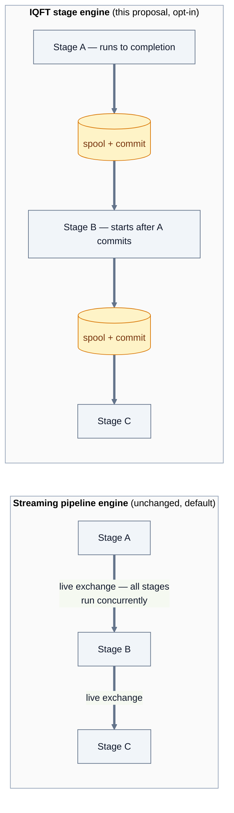
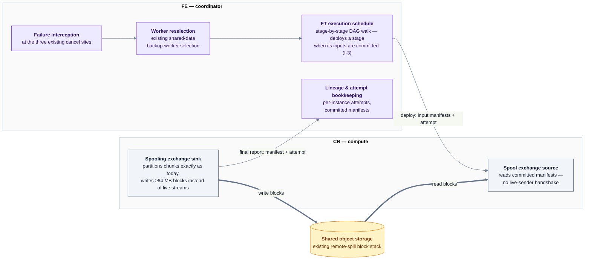
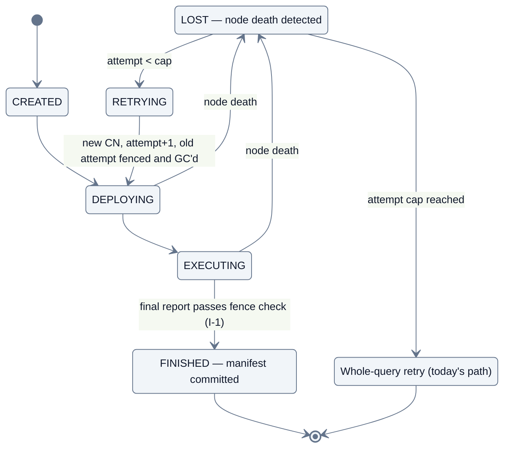
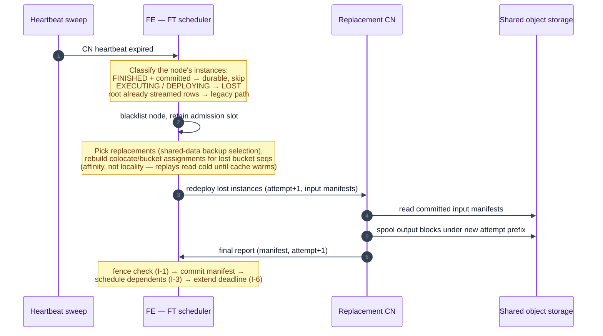

# RFC: Intra-Query Fault Tolerance via Durable Stage Exchanges

- Status: draft for community discussion
- Owner: Purushotham Pushpavanth (pushpavanthar@gmail.com)
- Last updated: 2026-07-09

## 1. Summary

This RFC proposes an opt-in fault-tolerant execution mode for long-running batch queries in shared-data clusters. When enabled, exchange output at stage boundaries is materialized to shared object storage, and the coordinator tracks per-fragment-instance lineage and attempts. On compute-node failure, only the lost fragment instances are re-executed on replacement nodes; committed work is reused. The feature is off by default, adds zero overhead when disabled, and can be enabled per cluster, per warehouse, or per query.

## 2. Motivation

Long-running analytical ETL is an increasingly important StarRocks workload: multi-hour INSERT/CTAS pipelines, scheduled transformation jobs, and heavy BI refreshes — the direction the 2026 roadmap describes under batch processing ("ETL mode for complex workloads", [#67632](https://github.com/StarRocks/starrocks/issues/67632)). For these workloads, the engine's all-or-nothing failure model is the dominant reliability cost: one compute-node loss at minute 119 of a 120-minute job discards two hours of cluster work.

StarRocks already provides FE HA, shared-data storage on immutable object stores, stateless compute nodes, and automatic node replacement — everything recovers except the queries themselves. As batch runtimes grow and clusters widen, the probability that some node fails during a given query grows accordingly. Deployment trends amplify this: batch clusters increasingly run on Kubernetes with spot/preemptible capacity, where node loss is routine rather than exceptional.

**Objective: allow a query to continue after one or more CN failures without restarting the entire query** — intra-query fault tolerance (IQFT).

### 2.1 What exists today

| Mechanism | What it does | What it doesn't |
| --- | --- | --- |
| Whole-query retry (retry loop in `StmtExecutor#execute()`, bounded by `Config.max_query_retry_time`, default 2) | Replans and reruns the entire query on node-loss errors | Discards all partial work; abandoned once any rows have streamed to the client (`MysqlChannel#isSend()` check); Arrow Flight never retries |
| BE/CN blacklist (`SimpleScheduler`/`HostBlacklist`, v3.3+) | Steers future queries away from bad nodes | Does not recover an in-flight query |
| Spill, including `enable_spill_to_remote_storage` | Relieves memory pressure | Spilled data is fragment-private and dies with the node |

There is no task/stage retry, no durable intermediate data, and no recovery path for an in-flight query. Related community items: [#61308](https://github.com/StarRocks/starrocks/issues/61308) (unhealthy-BE skipping — avoidance only), [Roadmap 2026 #67632](https://github.com/StarRocks/starrocks/issues/67632) (see §12 for alignment).

## 3. Background: why queries die today

The pipeline engine deploys all fragments of a query up front and streams chunks between live fragments over brpc. All operator state (hash tables, sort runs, aggregation state) lives only in CN memory. When a CN dies:

1. Its peers hit RPC errors; the FE receives a failed exec report → `DefaultCoordinator#updateStatus()` → `cancelInternal()` — the whole query is cancelled. Independently, the heartbeat sweep (`CoordinatorMonitor`) cancels every in-flight query using that node.
2. Recovery is whole-query replan + rerun, at most `max_query_retry_time` times.

Two properties of the exchange layer shape the design space:

- **Sent data is gone.** `SinkBuffer` frees chunks once acknowledged; a fragment cannot re-send its output without re-running.
- **Receivers cannot accept replacement senders.** `DataStreamRecvr` fixes its sender count at creation and has no deduplication; `DataStreamMgr::transmit_chunk()` silently drops chunks addressed to a torn-down receiver.

Because of these two properties, recovering an interior fragment by pure lineage replay cascades: the upstream outputs it needs are already freed (replay upstream, transitively to the leaves), and its consumers have already absorbed a prefix of its output into operator state that cannot roll back (restart downstream, transitively to the root). In a streaming engine, metadata-only recovery of an interior failure degenerates to whole-query restart. Spark's lineage-based recovery avoids this only because shuffle outputs are materialized files — the lineage graph is actionable because stage outputs are durable.

## 4. Goals and non-goals

**Goals**

- Retry only failed work; never duplicate writes; preserve SQL correctness.
- Zero overhead and byte-identical behavior when disabled.
- Cluster-, warehouse-, and query-level activation (§10).
- Native to the vectorized pipeline engine and the shared-data architecture, not a transplant of another engine's execution model.
- Bounded, predictable recovery time; suitable for spot/preemptible capacity.

**Non-goals**

- Exactly-once streaming semantics.
- Distributed checkpointing of operator state (hash tables and sort runs are never persisted).
- Write-ahead logging or replicated/active-active execution.
- Coordinator fault tolerance. Recovery state (lineage, manifests, attempts) is coordinator-scoped; the query still dies with its FE (§7.1 discusses the consequences; §14 notes the extension point).
- Shared-nothing mode in the initial scope (replica-pinned scans pose a different worker-selection problem).

## 5. Design overview

### 5.1 Core idea: the durable stage exchange

A fragment instance is replayable if and only if all of its inputs are durable. In shared-data mode, leaf fragments already satisfy this: their inputs are immutable tablets on object storage, so a lost scan instance can rerun on any CN today with no new machinery. Interior fragments do not: their inputs are ephemeral streams.

The proposal extends the durability property that leaf fragments already have to every **recovery boundary**. In IQFT mode, the output crossing each boundary is materialized to the shared object store before the consuming stage runs, and a small **manifest** (partition → data-file paths, bytes, rows) is committed to the coordinator's lineage graph. Every stage then becomes a pure function of durable inputs, and recovery of a lost instance is: allocate a replacement CN, increment the attempt counter, fence the old attempt, replay only that instance from committed input manifests, and commit its manifest.

In the initial scope, the recovery boundary is **every exchange edge**. This gives a uniform correctness argument (every stage is a pure function of committed inputs, with no per-plan case analysis) and produces the measured per-edge costs that later cost-based boundary placement needs (§13, Future work). Only stage **outputs** are materialized, never operator state, consistent with the non-goals.

The **recovery unit** is the **fragment instance** (a fragment on one CN — what the FE already schedules and tracks), not the intra-fragment pipeline: pipelines are driver groups sharing one fragment context and are not independently reschedulable.

### 5.2 Staged execution

This proposal introduces a second scheduling mode alongside the streaming pipeline engine. Today, all fragments of a query run concurrently and data flows through live exchanges. In IQFT mode, execution *within* a fragment is the unchanged vectorized pipeline engine, but execution *across* recovery boundaries is staged: a stage runs to completion and commits its spool before its consumers start.

Streaming buys latency and overlap (time-to-first-row, wall clock near the largest stage); staged execution buys recoverability (wall clock near the sum of stages). §9 quantifies the trade and §10 scopes who pays it. This scheduling change is the largest architectural item in the proposal and deserves review as such: "should StarRocks have a staged batch execution mode?", with fault tolerance as that mode's first payoff.

Beyond fault tolerance, staged execution has independent batch value:

1. Barriers cap the concurrent resource footprint — only ready stages run, so queries larger than cluster memory become schedulable by materialize-and-drain.
2. Committed manifests carry exact per-partition sizes, enabling adaptive per-stage parallelism from actual input sizes rather than planner estimates (§12).
3. Batch workloads spend little for the barrier: the pipelining given up buys time-to-first-row, which is largely irrelevant to a two-hour INSERT whose output is consumed at the end.
4. Stage boundaries make autoscaling effective for in-flight queries. Today fragment placement is fixed at deploy time, so CNs added mid-query by an autoscaler cannot join a running query — and the idle joiners dilute CPU-average scaling signals, stalling further scale-up. Under staged scheduling, each stage's placement and parallelism are decided when the stage becomes ready, from current cluster membership and committed input sizes: nodes added mid-query pick up work at the next stage boundary, including interior join/aggregation stages that no streaming design can rescale mid-flight.

A structural note on prior art: StarRocks has fragments → pipelines → drivers and a streaming exchange, so this proposal must build the stage layer (schedule, commit protocol, spool transport) rather than swap a transport. This is why the scope is phased (§13) and the first milestone deliberately narrow.

Containment:

- The stage engine is **additive**: a second `ExecutionSchedule` implementation and a second exchange transport, selected per query. The streaming engine's code paths are untouched; with IQFT off, behavior is byte-identical.

## 6. Correctness invariants

Every mechanism in §7 exists to enforce one of these; the design can be reviewed by checking them.

- **I-1 — Single commit.** At most one attempt per fragment instance ever commits. Enforced at report ingress by attempt fencing (a revived "dead" node's late report is rejected; §7.2), not assumed from failure detection.
- **I-2 — No mixed observation.** No consumer ever observes output from two attempts of the same instance. Follows from I-1 plus barrier visibility: consumers are handed only committed manifests, never live streams from a replayable stage.
- **I-3 — Committed-input recovery.** A stage is scheduled (first run or replay) only when every input edge has a full set of committed manifests. Replay therefore never depends on any live upstream.
- **I-4 — Determinism independence.** Correctness does **not** depend on replay determinism. A replayed attempt may produce different bytes (`rand()`, `LIMIT` without `ORDER BY`, hash-iteration order); this is safe because no consumer observes any attempt's output before commit (I-2) and at most one attempt commits (I-1). The design deliberately avoids the deterministic-re-execution obligation that chunk-level replay schemes carry.
- **I-5 — Transactional DML.** Exactly-once write semantics come from load-transaction atomicity: a failed sink-stage attempt's transaction is aborted before any rerun under a fresh transaction; non-sink stages replay without touching the transaction (§7.7).
- **I-6 — Bounded forward progress.** Query timeout measures forward progress: deadlines extend only by wall time attributed to failed attempts, bounded by the attempt cap, so worst-case wall time stays bounded and predictable.

## 7. Detailed design

Two new mechanisms (a spooling exchange and a recovering scheduler) and one new storage primitive (block reopen), layered on the existing remote-spill substrate. Class-level mapping, wire-protocol changes, and code touchpoints are in Appendix A; this section stays at component level.

### 7.1 Lineage metadata

Per fragment instance, the coordinator tracks: `{query_id, fragment_id, instance_ordinal, attempt, operator-tree fingerprint, input tablet/split set, input edge → committed manifest refs, output edge → manifest (once committed), worker, state}` — held on the coordinator's existing execution DAG objects. No new persistent store; the metadata dies with the coordinator and is sized in kilobytes per query.

**FE failure.** If the FE dies mid-query, the query dies — exactly as today. What remains is safe by construction: for DML, the load transaction was never committed, so nothing is visible; for SELECT, the client sees a connection error and no partial results; committed spool data becomes unreferenced garbage that the TTL sweep reclaims by query-id prefix. IQFT never makes FE failure worse than today; it does not make it better. Persisting manifests to a query-scoped object to enable FE-failover adoption is a deliberate extension point (§14), not initial scope.

### 7.2 Exchange protocol: manifests, commit, fencing, write path, GC

An attempt **commits** when the FE receives its successful final report carrying the output manifest. I-1 is enforced at report ingress: reports carry the attempt number, and the FE rejects any report whose attempt is not the instance's current attempt. This matters because "dead" is a heartbeat presumption — a network-partitioned CN may revive and deliver a late report, which must neither flip the replacement's state machine nor commit a second manifest (the standard fencing-token pattern).

Spool data files are named by `(query, fragment, instance, attempt)` and deleted at query end, with a TTL sweep for orphans. Blocks are buffered to a minimum target size (~64 MB) so manifests stay small and reads are bandwidth-bound rather than request-bound. Spool keys are sharded across randomized prefixes (per query × fragment) so no prefix becomes a request-rate hotspot, and spool I/O retries `SlowDown`-class throttling responses with jittered backoff; both are P1 requirements, not tuning options (§7.8). If a manifest exceeds a report-size threshold, the sink writes the manifest itself to shared storage and reports only its path.

Multi-cast edges (CTEs) spool naturally: one blob, N per-consumer manifest views; the producer's commit gates all N consumers. All edge types must spool in the initial scope — one non-replayable edge silently reverts the whole query to the legacy failure path.

**Write protocol.** One partition maps to one or more block objects; one block object contains many chunks, serialized and compressed as a stream (the existing spill serde). Layout is `partition → [block objects]` — never chunks-as-objects, and never multiple partitions per object (a consumer must be able to read exactly its partition). Uploads happen at exactly two triggers: a partition's buffer reaching the block-size target, or operator finish (final flush of all partial buffers). Large blocks upload via the filesystem layer's multipart path; uploads are asynchronous (the spill infrastructure's existing async I/O executors), overlapped with continued execution.

**Failure during upload.** Object-store semantics carry the correctness argument: an object exists only after a completed PUT or multipart-complete, so a half-uploaded block is not a corrupt file — it is no file. A failed attempt produces no final report, hence no manifest, hence nothing references whatever it uploaded. Cleanup is by ownership rather than inspection: all objects under a fenced attempt's `(query, fragment, instance, attempt)` prefix are deleted when the attempt is fenced or the query ends; incomplete multipart uploads are reaped by bucket lifecycle policy plus the TTL sweep. The residual case — multipart-complete succeeds but the manifest never commits (CN dies after upload, report lost, or FE dies first) — leaves fully-formed orphan blocks referenced by no manifest; the same prefix-scoped deletion and TTL sweep remove them. Orphans are a GC-latency question, never a correctness question: nothing can read a block that no committed manifest names.

**Memory accounting and backpressure.** The streaming exchange frees a chunk once sent; the spool sink holds it from buffer through write to (async) upload, so sink memory must be explicitly bounded. The sink gets a fixed budget charged to the query's memory tracker, shared across its per-partition buffers. When the writer falls behind the producer and the budget is exhausted, the sink reports *not ready* through the pipeline engine's existing operator readiness protocol — the driver yields and upstream operators block, the same backpressure path today's exchange sink uses when its network buffer fills. Under sustained pressure the sink flushes partitions early (smaller blocks, trading manifest size for memory, bounded by the manifest-as-pointer escape hatch) and can overflow through the hybrid block manager's local tier. Memory is never unbounded; the failure mode is a slower stage, not an OOM.

### 7.3 Recovery state machine (fragment instance)

Failure interception happens at the three places that today jump straight to whole-query cancel: the exec-report handler, the deploy-error handler, and the dead-node heartbeat sweep. Only node-loss-shaped errors enter recovery; every other error falls through unchanged. IQFT is an additional layer above whole-query retry, never a replacement for it.

### 7.4 Recovery sequence and latency

Order-of-magnitude latency budget (estimates, to be replaced by P4 chaos-suite measurements):

| Step | Approximate cost | Notes |
| --- | --- | --- |
| Failure detection | ~5–30 s | Heartbeat interval × miss threshold; the floor of every recovery. Proactive spot-drain (§14) can reduce this to ~0. |
| Classify + fence + blacklist | < 100 ms | In-memory over the execution DAG. |
| Replacement selection + assignment rebuild | < 1 s | Existing backup-worker selection; colocate remap is a map rewrite. |
| Redeploy lost instances | ~0.1–1 s | One batched deploy RPC per replacement CN. |
| **Replay** | **seconds–minutes** | The dominant term: the lost stage's runtime at cold-cache (object-store bandwidth) throughput. |
| Commit + resume dependents | < 100 ms | Manifest commit is a report; readiness re-evaluation is in-memory. |

Fixed overhead is tens of seconds; end-to-end recovery is approximately that plus one cold stage replay. The alternative today is the full query's runtime again, when retry is possible at all.

### 7.5 Determinism policy

Per I-4, replay divergence is safe by construction. The exception is side effects: UDFs with external side effects and sequence-like functions observe attempts, not committed results. Default policy: planner warning; a strict mode refuses IQFT for such plans (open question, §14).

### 7.6 Runtime filters

Global (cross-boundary) runtime filters have a merge path with no attempt awareness; a failed attempt's partial contribution can corrupt the merge's completeness accounting, leading to over-pruning and wrong results. Initial phases therefore disable global RFs across recovery boundaries (fragment-local RFs are unaffected), with a planner warning when a plan relies on high-selectivity global RFs — the cost is multiplicative (unfiltered scan → larger shuffle → larger spool) and must not be a silent cliff. The fix is mechanical under barriers: build inputs are committed, so any attempt's filter for a given instance ordinal encodes the same key set; merge deduplication keyed by `(filter_id, instance_ordinal)` restores correctness. Targeted at P4.

### 7.7 DML: no duplicate writes

I-5 is achieved via transaction scoping rather than per-file deduplication. Non-sink-stage failures replay normally; the load transaction is untouched because the sink stage has not run. If a sink-stage instance fails: abort the load transaction, rerun only the sink stage under a fresh transaction, re-reading committed upstream spool. Exactly-once comes from transaction atomicity; work reuse comes from the spool. This is deliberately simpler than per-attempt output-file commit coordination.

### 7.8 Spool storage: throttling and durability requirements

Object stores throttle on request rate per prefix (S3: ~3.5K PUT/s, ~5.5K GET/s per prefix), so "spool every exchange to S3" is the first practical objection this design must answer.

**Durability requirement inversion.** Because lineage can regenerate any spool block by replaying its producer stage, spool loss costs one bounded replay, never correctness (I-3 simply un-schedules the consumer until the input is re-committed). The spool therefore does not need a data lake's durability — it needs bandwidth and request capacity. This widens the set of eligible storage tiers well beyond what table data could use.

**Mitigations, in order of leverage:**

1. **Large blocks + prefix sharding + backoff on standard S3 (P1, mandatory).** Throttling is a small-object problem; the ≥64 MB block target makes spool I/O bandwidth-bound (a 1 TB shuffle ≈ 16K PUTs spread over the stage's lifetime), combined with randomized prefix sharding and jittered backoff (§7.2).
2. **Request-optimized spool volume.** `fault_tolerant_spool_storage_volume` (§10) provides the seam: an S3 Express One Zone directory bucket offers ~10× request capacity, single-digit-millisecond latency, and cheaper requests (higher GB-month cost is irrelevant for hours-lived intermediates). Its single-AZ durability is acceptable because of the inversion above — AZ loss of spool data degrades to stage replay. GCP and Azure have analogous tiers. This is deployment guidance, not an architecture change.
3. **Local-first reads.** The hybrid block manager already writes local-first; consumers scheduled on or near producer nodes read the local/datacache copy, leaving object storage to serve only replays and remote readers. This thins the GET path; the PUT-before-commit path is irreducible, since durability is what makes a manifest meaningful.
4. **Dedicated shuffle tier (deferred).** Celeborn/Cosco-class services solve throttling completely by aggregating writes in memory, but add a stateful service to deploy and operate — contradicting the stateless-CN operational story and a heavy dependency for a fault-tolerance feature. The storage-volume abstraction keeps the exchange store pluggable so such a backend can arrive later as an optional provider.

Rejected outright: peer-replicated CN-local NVMe with no object store. It has the lowest latency but couples spool durability to the compute fleet — a mass spot reclaim destroys both replicas and every "durable" input with them, on exactly the deployments this feature targets.

### 7.9 Scheduler semantics: admission, slots, and deadlock freedom

Today's scheduler state per query is essentially deploy → running → done. The stage engine expands it: per instance, the attempt state machine of §7.3; per stage, waiting-on-inputs → ready → running → committed. Four properties keep the added complexity tractable:

- **Readiness is a monotone fixpoint over committed manifests.** Commits are durable — a node death never un-commits anything — so the committed set only grows and stage readiness only flips from waiting to ready, never back. Failures shrink only the running set. A dependency graph with no retraction has no replanning cascades and no cyclic wait: the scheduler is an event loop that re-evaluates readiness on every manifest commit. The DAG is acyclic by construction (it is the plan's fragment tree); multi-consumer (CTE) in-degree accounting reuses machinery `PhasedExecutionSchedule` already has.
- **One admission per query, held throughout.** The query acquires its slot once (existing query-queue path) and retains it across replays — recovery happens inside an already-admitted query, never as a new admission that could deadlock against queued queries. Staged execution also lowers the concurrent footprint the slot must cover: only ready stages are deployed, so peak resource use approaches the widest stage rather than the whole plan.
- **Resource waits are bounded with a guaranteed exit.** A replay needing a worker on a shrunk cluster waits like any deploy, bounded by the attempt/delivery timeout, after which the instance falls back to whole-query retry. Every wait either satisfies (manifest commit, worker available) or times out into the legacy path.
- **Failure handling is local.** Because committed inputs are durable and consumers have not started (barriers), handling a node death touches only the lost instances' bookkeeping — no walk of downstream state, no cancellation fan-out across the DAG.

## 8. Recovery example

`INSERT INTO t SELECT ... FROM fact JOIN dim ... GROUP BY ...` — the CN running one instance of the join stage (B) dies at minute 41 of a 60-minute run. Stage A (scan fact) and A' (scan dim) have committed manifests; B has one committed instance, one lost, one still running.

- **Today:** the whole query restarts (at most twice), losing 41 minutes — or fails outright if rows have already streamed.
- **With IQFT:** A/A' outputs and B's committed and running instances are untouched. The one lost B instance replays on a fresh CN reading A/A' manifests; stage C (final agg + sink) starts when B's manifest set completes. Recovery cost ≈ one instance of B plus detection lag, not 41 minutes × cluster.

## 9. Performance expectations

The overhead has two distinct components, only one of which is I/O:

1. **Spool cost** — serializing, writing, and re-reading every boundary's data through shared storage.
2. **Loss of pipeline overlap** — today `Scan → Join → Agg → Sink` run concurrently, so wall clock approaches the largest stage's time; under barriers it approaches the sum of stage times plus spool. This cost exists even with infinitely fast storage. Plans with several comparably sized stages lose the most; plans dominated by one stage lose the least.

Mitigations, in order of leverage:

1. **Scoping** — off by default; per-warehouse/per-query opt-in where one failure costs more than the overhead (long ETL, spot capacity). When disabled: zero overhead, untouched code paths.
2. **Large blocks + data cache** — ≥64 MB spool blocks; the data cache absorbs re-reads when consumers land on the writing node. Request-rate throttling is addressed by design (§7.8).
3. **Broadcast is the least-penalized edge** — written once, read N times.
4. **Cost-based boundary placement and additional recovery primitives (§13, Future work)** — every edge without a boundary keeps today's streaming overlap; this is the only mitigation that attacks component 2.

Recovery target: seconds to low minutes (detection plus one cold-cache stage replay) instead of restarting hour-scale queries.

## 10. Configuration surface

FE cluster config:

| Knob | Default | Meaning |
| --- | --- | --- |
| `enable_fault_tolerant_execution` | `false` | Master switch permitting sessions/warehouses to opt in. Shared-data only. |
| `fault_tolerant_execution_max_task_retry_time` | `3` | Per-instance attempt cap before whole-query fallback. |

Session variables:

| Variable | Default | Meaning |
| --- | --- | --- |
| `enable_fault_tolerant_execution` | `false` | Run this query in IQFT mode (staged scheduling + durable stage exchanges). |
| `fault_tolerant_spool_storage_volume` | `""` | Spool storage volume; empty reuses the remote-spill volume plumbing. |

**Warehouse-level activation** rides the merged warehouse session-variable framework ([#67358](https://github.com/StarRocks/starrocks/pull/67358)): variables resolve `global → warehouse → user property → session`, so an operator sets `enable_fault_tolerant_execution=true` on the ETL warehouse and leaves interactive warehouses untouched — one cluster, per-workload fault tolerance.

## 11. Observability

Metrics: recovered queries, recovered instances, recovery latency (detect → redeploy → recommit), replay time, spool bytes written/read, spool GC backlog, fenced (rejected) zombie reports, failed recoveries with fallback reason. Audit log: attempt counts, timeout extensions granted (I-6), RF-disabled warnings. `EXPLAIN ANALYZE` surfaces per-boundary spool cost.

## 12. Alternatives considered

| Alternative | Verdict | Why |
| --- | --- | --- |
| **1. Checkpoint operator state** (persist hash tables, sort runs, agg state) | Rejected as foundation | State is GB–TB-scale at exactly the moment it matters (large joins/aggs); serialization cost and write amplification dwarf the spool cost; every stateful operator needs checkpoint/restore surgery; recovery must restore state *and* replay in-flight streams. This is Flink's model, built for unbounded streams that cannot be re-run — the wrong fit for bounded batch. Where state ≪ output (top-N heaps, bounded aggregates) the trade inverts; a bounded, optimizer-selected variant may return as a future recovery primitive (§13). |
| **2. Fragment replication** (run each fragment twice) | Rejected | Doubles compute always to save it rarely; still needs deduplication at every consumer; nondeterminism makes replicas diverge. |
| **3. Metadata-only lineage replay** (exchange reconnection, no materialization) | Rejected | Upstream outputs are already discarded (`SinkBuffer` frees sent chunks) and consumer state cannot roll back — interior-failure recovery cascades to the leaves and to the root (§3), degenerating to whole-query restart. Correct mid-stream reconnection would require deterministic re-execution plus per-consumer deduplication — the obligations I-4 deliberately avoids. |
| **3b. Write-ahead lineage** ([Quokka, ICDE 2024](https://arxiv.org/html/2403.08062v1) — log scheduling decisions, replay with pinned input order, consumers dedup by sequence) | Rejected as foundation | (a) Requires engine-wide replay determinism: Quokka's actor model consumes one serialized input queue per task, while a StarRocks fragment instance is many concurrent drivers with morsel stealing, spill-dependent chunk boundaries, and async runtime filters that change scan output by timing — pinning that means recording intra-fragment scheduling itself. (b) Cannot be additive: sequence deduplication must be built into the live streaming exchange, the code path this RFC leaves untouched. (c) Recovery cost grows with query progress — a lost stateful operator replays its full input history recursively to sources, giving no forward-progress guarantee under routine spot loss; the paper itself pairs the WAL with periodic state checkpoints for this reason. Under durable boundaries the blast radius becomes bounded (replay stops at the nearest committed manifest), so a bounded variant may return as a future primitive for non-materialized edges (§13). |
| **4. Durable stage outputs at recovery boundaries** | **Chosen** | KB-scale lineage metadata plus the existing remote-spill infrastructure for the data plane; replay isolation (one stage, pure function of committed inputs); no determinism requirement (I-4); production-proven shape (Trino FTE, Spark shuffle; §15). |

## 13. Future work: boundary placement and recovery primitives

The initial scope fixes the recovery boundary at every exchange, with durable exchange as the only recovery primitive. Two extensions are anticipated by the design but deliberately out of initial scope:

**Cost-based boundary placement.** The planner selects which exchanges materialize; non-boundary edges keep streaming overlap, and a lost consumer on a non-boundary edge recovers by re-running its upstream from the nearest durable point. The placement decision is a per-edge cost comparison — place a boundary where expected recompute savings exceed spool cost plus barrier latency. Two heuristics follow immediately: a boundary after an aggregation is nearly free (small output protecting the plan's most expensive recompute), while a boundary on a TB-scale scan→join shuffle is the plan's most expensive spool protecting recompute whose inputs (immutable tablets) are already durable. On a representative ETL plan (`12 TB scan → 2 TB shuffle → join+agg → 120 GB → final agg → 8 GB → sort`), selecting boundaries cuts spool I/O from ≈2.13 TB to ≈128 GB (~17×) while retaining the cheap, high-value boundaries. The planner already computes the per-edge cardinality/width estimates this needs, and committed manifests provide actuals for runtime re-decisions. For many ETL plans, selected boundaries may well become the default posture.

**Additional recovery primitives.** With boundaries selectable, materialization becomes one recovery primitive among several, chosen per edge and per operator: bounded chunk-level lineage replay (Quokka-style) where recompute is cheap, durable exchange where output is small or recompute expensive, and small-state checkpoints where operator state ≪ operator output (top-N heaps, bounded partial aggregates). These are recovery primitives, not execution engines — pipeline execution within a stage is identical regardless of primitive, and all plug into the same invariants: a consumer only ever observes committed recovery points (I-2/I-3), so the correctness argument is unchanged as primitives diversify.

Both extensions are sequenced after the uniform version for a specific reason: shipping cost-based placement on day one means debugging a new execution mode, a new exchange protocol, and a cost model simultaneously, with no baseline to isolate faults. The uniform version has a uniform correctness argument, is debuggable, and produces the measured per-edge spool costs the cost model needs as ground truth. Moving the boundary later is a planner policy change on a fixed architecture.

## 14. Roadmap alignment ([#67632](https://github.com/StarRocks/starrocks/issues/67632))

| Roadmap item | Relationship |
| --- | --- |
| **ETL mode for complex workloads** | IQFT is the fault-tolerance layer of an ETL mode: blocking staged execution, durable intermediates, retry — proposed under that umbrella with its own flag. |
| **Warehouse session variables** ([#67358](https://github.com/StarRocks/starrocks/pull/67358), merged) | The activation mechanism: per-warehouse IQFT defaults (§10). |
| **Enhanced disk spill** | The spool is built on the same spill block stack; hardening for IQFT (block reopen, large-block buffering, remote-dir lifecycle) directly strengthens spill, and vice versa. |
| **Adaptive concurrency** | Recovery boundaries are natural adaptation points: committed manifests carry exact bytes/rows per partition, so the scheduler can set the consuming stage's parallelism from actual input sizes rather than planner estimates — the same lever Trino FTE uses for adaptive task sizing. |

## 15. Phased implementation plan

Each phase ships standalone value and is independently reviewable. P0–P4 deliver the uniform design this RFC specifies; P5–P6 are the future-work extensions of §13, reached once the uniform version has produced a correctness baseline and measured per-edge costs.

| Phase | Scope |
| --- | --- |
| **P0 — Lineage metadata & retry hardening** | Capture lineage/attempt state in the FE; no stage recovery yet. Immediate wins: on node loss, fast whole-DAG restart that keeps the admission slot, skips replan, and blacklists the dead node; retry metrics and audit fields. |
| **P1 — Durable stage exchanges** | Spool sink/source operators, block-reopen primitive, manifest reporting, commit + fencing (I-1/I-2), GC. Read-only replay of leaf (scan/projection) stages. |
| **P2 — Full SELECT recovery** | FT execution schedule (I-3), RETRYING state, the three interception sites, colocate/bucket reassignment, slot retention, timeout semantics (I-6); joins/aggregations; global-RF disable + planner warning. |
| **P3 — DML recovery** | I-5: exactly-once for INSERT/CTAS (transaction abort + sink-stage-only rerun over committed spool); MERGE/UPDATE/DELETE follow the same transaction pattern. |
| **P4 — Production hardening** | Chaos/fault-injection suite (including zombie-report fencing tests), admission-control interplay, configurable retry/backoff, RF merge deduplication (re-enable global RFs), spot-preemption drain (spool flush on reclaim notice). |
| **P5 — Cost-based recovery-boundary placement** | Planner-selected boundaries from estimates plus measured runtime statistics; non-boundary edges keep streaming overlap; manifest-driven adaptive parallelism. |
| **P6 — Additional recovery primitives** | Optimizer-selected per edge/operator: bounded chunk-level lineage replay for cheap-recompute edges, durable exchange for expensive/small-output edges, small-state checkpoints where state ≪ output. Same invariants throughout (§13). |

Per-phase code touchpoints: Appendix A.

## 16. Open questions

1. Positioning: own flag under the ETL-mode umbrella (recommended) or a standalone feature track?
2. Manifest durability: coordinator memory only (proposed), or persist to a query-scoped object to enable future FE-failover adoption?
3. Spool GC ownership: coordinator-driven + TTL sweep (proposed) vs a starlet-managed spool namespace?
4. Is the global-RF disable acceptable for P2, or is merge deduplication a P2 prerequisite for usable ETL performance?
5. Result-set fault tolerance: bounded dedup buffer (Trino-style) to allow retry after partial streaming, or keep the hard cutoff?
6. Proactive spot handling: drain + spool flush on the ~2-minute reclaim notice vs reactive replay only?
7. Determinism policy: warn (proposed) vs refuse for plans with side-effecting UDFs crossing a recovery boundary?
8. Manifest-as-pointer threshold, and whether very wide shuffles should cap partition counts in IQFT mode.

## 17. Prior art

| System | Recovery method |
| --- | --- |
| Spark | Static lineage + **materialized shuffle files**; stage retry |
| Trino FTE | Task retry + spooled exchange manager (S3/HDFS) |
| Flink | Distributed operator-state checkpoints (Chandy–Lamport barriers) |
| RisingWave | Streaming barriers + periodic operator-state checkpoints to object storage |
| Materialize | Frontier/progress tracking; recovery by re-derivation from durable sources |
| DuckDB | Single-node; out-of-core spilling, no intra-query FT — restart |
| Presto (classic) | Query restart |
| Snowflake/BigQuery | Transparent fragment retry on disaggregated storage (proprietary) |
| **StarRocks (this RFC)** | **Durable stage exchanges on shared storage + fragment-instance replay, driven by FE lineage metadata** |

Two patterns run through the table. First, every system that recovers at sub-query granularity makes something durable — stage outputs (Spark, Trino, this RFC) or operator state (Flink, RisingWave). Second, which one is dictated by the workload: streaming engines checkpoint operator state because their inputs are unbounded and non-replayable; batch queries have bounded, replayable inputs, so they can materialize outputs instead and never touch operator state — the choice made in §12 and the reason Alternative 1 imports the wrong engine class's obligations.

## References

- StarRocks source (verified against this checkout): `StmtExecutor#execute()` retry loop + `ExecuteExceptionHandler#handle()`, `MysqlChannel#isSend()` cutoff, `DefaultCoordinator#updateStatus()`/`#updateFragmentExecStatus()`/`#cancelInternal()`/`#handleErrorExecution()`, `CoordinatorMonitor`, `Config.max_query_retry_time`, `DefaultSharedDataWorkerProvider#selectBackupWorker()`, `PhasedExecutionSchedule`, `be/src/compute_env/spill/` (`BlockManager`, `FileBlockManager`, `QuerySpillManager`), `DataStreamMgr::transmit_chunk()`, `SinkBuffer`
- [Trino fault-tolerant execution](https://trino.io/docs/current/admin/fault-tolerant-execution.html) · [Project Tardigrade](https://trino.io/blog/2022/05/05/tardigrade-launch.html)
- [Efficient Fault Tolerance for Pipelined Query Engines via Write-Ahead Lineage — Quokka, Wang & Aiken, ICDE 2024 (arXiv 2403.08062)](https://arxiv.org/html/2403.08062v1)
- [Roadmap 2026 #67632](https://github.com/StarRocks/starrocks/issues/67632) · [#67358 warehouse session variables](https://github.com/StarRocks/starrocks/pull/67358) · [#61308](https://github.com/StarRocks/starrocks/issues/61308)
- [BE blacklist docs](https://docs.starrocks.io/docs/administration/management/BE_blacklist/) · [Spill docs](https://docs.starrocks.io/docs/administration/management/resource_management/spill_to_disk/)

## Appendix A — Implementation touchpoints

Where each mechanism hooks into the existing codebase (FE paths under `fe/fe-core/src/main/java/com/starrocks/`, BE paths under `be/src/`).

| Concern | Hook point |
| --- | --- |
| Staged, lineage-aware scheduling | New `FaultTolerantExecutionSchedule` implementing `ExecutionSchedule`, alongside `AllAtOnceExecutionSchedule`/`PhasedExecutionSchedule`; selected in the `DefaultCoordinator` constructor. Reuses `PhasedExecutionSchedule`'s DAG walk (stack + in-degrees, CTE-producer handling). |
| Intercept node failure before whole-query cancel | `DefaultCoordinator#updateFragmentExecStatus()`/`#updateStatus()` (non-OK BE report), `DefaultCoordinator#handleErrorExecution()` (deploy-time RPC failure, invoked via `Deployer`'s failure handler), `CoordinatorMonitor` (dead-node heartbeat sweep). Non-node-loss errors fall through to today's cancel + whole-query retry. |
| Per-instance retry state & report routing | Extend the `FragmentInstanceExecState` state machine (CREATED→DEPLOYING→EXECUTING→FINISHED) with `RETRYING`; attempt counters on `FragmentInstance`; committed-manifest refs on `ExecutionFragment`. Reports are routed by `backend_num` (`executionDAG.getExecution(params.getBackend_num())` in `updateFragmentExecStatus`) — each replay gets a fresh routing index, the old one is tombstoned, and the attempt number in the report is fence-checked before any state transition (I-1). |
| Worker reselection | `DefaultSharedDataWorkerProvider#selectBackupWorker()` (`lake/qe/scheduler/`, already implemented for shared-data). Colocate/bucket-shuffle rebuild via `ColocatedBackendSelector.Assignment` on `ExecutionFragment`. Blacklist via `SimpleScheduler#addToBlocklist()`. |
| Slot retention across replay | `qe/scheduler/slot/` — today `cancelInternal()` releases the `LogicalSlot`; replay must retain it. |
| Spool sink/source | `exec/pipeline/exchange/ExchangeSinkOperatorFactory` (spool mode) + new source variant; writes via existing `Spiller`/`Serde` + `QuerySpillManager` block manager (`AcquireBlockOptions{force_remote, flat_layout, flat_name_prefix=<query>_<fragment>_<instance>_<attempt>}`). See `spillable_multi_cast_local_exchange.cpp`, the only existing materialize-once/replay-N operator. |
| Block reopen (net-new BE primitive) | `BlockManager::open_existing(path)` in `compute_env/spill/block_manager.*` — read-side counterpart of `acquire_block`; `Block::path()` already exposes physical object paths. |
| Manifest + attempt reporting (wire protocol) | New **optional** fields on `TReportExecStatusParams`: `attempt` and `manifest` (partition_id → [(block_path, bytes, rows)]) — `exec/pipeline/exec_state_reporter.*`, gensrc thrift; optional-only per repo invariant. Spool-source deploy params carry the manifest slice + `TCloudConfiguration`. |
| Spool GC | Lake `delete_files_async`/vacuum-by-filename pattern; TTL sweep keyed on query-id prefix. |
| Config plumbing | `common/Config.java` `@ConfField` (template: `max_query_retry_time`); `qe/SessionVariable.java` `@VarAttr` (template: spill/phased-scheduler blocks); warehouse-level defaults via the #67358 resolution chain. Docs in `docs/en/` + `docs/zh/` on implementation. |
| Benchmark/chaos harness | `INSERT INTO blackhole()` (`BlackHoleTableSink`) — full execution, discarded output; kill-a-CN fault injection. |

**Acceptance criteria (for the eventual implementation)**

- With IQFT enabled, killing one CN mid-query (non-root stage) on a shared-data cluster completes the query with correct results, replaying only that node's uncommitted instances; the audit log records attempts and timeout extensions.
- A partitioned-then-revived CN's late reports are rejected by attempt fencing: query state uncorrupted, exactly one committed attempt per instance (fault-injection test, verifies I-1/I-2).
- With IQFT disabled, behavior is byte-identical to today.
- Spool objects are fully removed after query end; the TTL sweep removes orphans.
- Overhead is measured via `blackhole()` benchmarks against the same query with IQFT off.
