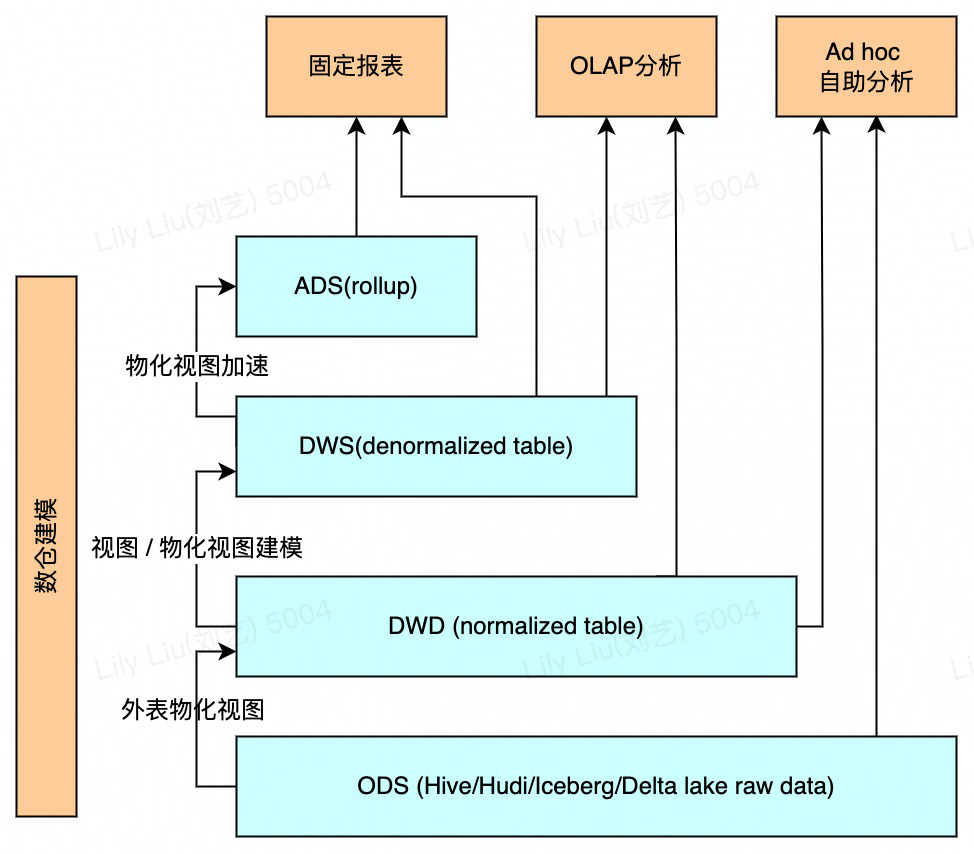

# 产品特性

## MPP分布式执行框架

StarRocks 采用 MPP (Massively Parallel Processing) 分布式执行框架。在 MPP 执行框架中，一条查询请求会被拆分成多个物理计算单元，在多机并行执行。每个执行节点拥有独享的资源（CPU、内存）。MPP 执行框架能够使得单个查询请求可以充分利用所有执行节点的资源，所以单个查询的性能可以随着集群的水平扩展而不断提升。

如上图所示，StarRocks 会将一个查询在逻辑上切分为多个逻辑执行单元（Query Fragment）。按照每个逻辑执行单元需要处理的计算量，每个逻辑执行单元会由一个或者多个物理执行单元来具体实现。物理执行单元是最小的调度单位。一个物理执行单元会被调度到集群某个 BE 上执行。一个逻辑执行单元可以包括一个或者多个执行算子，如图中的 Fragment 包括了 Scan，Project，Aggregate。每个物理执行单元只处理部分数据。由于每个逻辑执行单元处理的复杂度不一样，所以每个逻辑执行单元的并行度是不一样的，即，**不同逻辑执行单元可以由不同数目的物理执行单元来具体执行，以提高资源使用率，提升查询速度。**

与很多数据分析系统采用的 Scatter-Gather 分布式执行框架不同，MPP分布式执行框架可以利用更多的资源处理查询请求**。**在 Scatter-Gather 框架中，只有 Gather 节点能处理最后一级的汇总计算。**而在 MPP 框架中，数据会被 Shuffle 到多个节点，并且由多个节点来完成最后的汇总计算**。在复杂计算时（比如高基数 Group By，大表 Join 等操作），StarRocks 的 MPP 框架相对于     Scatter-Gather 模式的产品有明显的性能优势。

## 全面向量化执行引擎

StarRocks 通过实现全面向量化引擎，充分发挥了 CPU 的处理能力。全面向量化引擎按照列式的方式组织和处理数据。StarRocks 的数据存储、内存中数据的组织方式，以及 SQL 算子的计算方式，都是列式实现的。按列的数据组织也会更加充分的利用 CPU 的 Cache，按列计算会有更少的虚函数调用以及更少的分支判断从而获得更加充分的 CPU 指令流水。

另一方面，StarRocks 的全面向量化引擎通过向量化算法充分的利用 CPU 提供的 SIMD（Single Instruction Multiple Data）指令。这样 StarRocks 可以用更少的指令数目，完成更多的数据操作。经过标准测试集的验证，StarRocks的全面向量化引擎可以将执行算子的性能，整体提升 3~10 倍。

除了使用向量化技术实现所有算子外，StarRocks 还在执行引擎中实现了其他的优化。比如 StarRocks 实现了 Operation on Encoded Data 的技术。对于字符串字段的操作，StarRocks 在无需解码情况下就可以直接基于编码字段完成算子执行，比如实现关联算子、聚合算子、表达式算子计算等。这可以极大的降低 SQL 在执行过程中的计算复杂度。通过这个优化手段，相关查询速度可以提升 2 倍以上。

## CBO 优化器

在多表关联查询场景下，仅靠优秀的执行引擎没有办法获得最极致的执行性能。因为这类场景下，不同执行计划的复杂度可能会相差几个数量级。查询中关联表的数目越大，可能的执行计划就越多，在众多的可能中选择一个最优的计划，这是一个 NP-Hard 的问题。只有优秀的查询优化器，才能选择出相对最优的查询计划，从而实现极致的多表分析性能。

StarRocks 从零设计并实现了一款全新的，基于代价的优化器 CBO（Cost Based Optimizer）。该优化器是 Cascades Like 的，在设计时，针对 StarRocks 的全面向量化执行引擎进行了深度定制，并进行了多项优化和创新。该优化器内部实现了公共表达式复用，相关子查询重写，Lateral Join，Join Reorder，Join 分布式执行策略选择，低基数字典优化等重要功能和优化。目前，该优化器已可以完整支持 TPC-DS 99 条 SQL 语句。

由于全新 CBO 的支持，StarRocks 能比同类产品更好地支持多表关联查询，特别是复杂的多表关联查询，让全面向量化引擎能够发挥极致的性能。

## 可实时更新的列式存储引擎

StarRocks 实现了列式存储引擎，数据以按列的方式进行存储。通过这样的方式，相同类型的数据连续存放。一方面，数据可以使用更加高效的编码方式，获得更高的压缩比，降低存储成本。另一方面，也降低了系统读取数据的 IO 总量，提升了查询性能。此外，在大部分 OLAP 场景中，查询只会涉及部分列。相对于行存，列存只需要读取部分列的数据，能够极大地降低磁盘 IO 吞吐。

StarRocks 能够支持秒级的导入延迟，提供准实时的服务能力。 StarRocks 的存储引擎在数据导入时能够保证每一次操作的 ACID。一个批次的导入数据生效是原子性的，要么全部导入成功，要么全部失败。并发进行的各个事务相互之间互不影响，对外提供 Snapshot Isolation 的事务隔离级别。

StarRocks 存储引擎不仅能够提供高效的 Append 操作，也能高效的处理 Upsert 类操作。使用 Delete-and-insert (Merge_on_write)的实现方式，通过主键索引快速过滤，消除了读取时 Sort merge 操作，同时还可以充分利用其他二级索引。在大量更新的场景下，仍然可以保证查询的极速性能。

## 智能的物化视图

StarRocks 支持用户使用物化视图进行查询加速。不同于一些同类产品的物化视图需要异步和原表做数据同步，StarRocks 的物化视图可以自动根据原始表更新数据。只要原始表数据发生变更，物化视图的更新也同步完成，不需要额外的维护操作就可以保证物化视图能够维持与原表一致。不仅如此，物化视图的选择也是自动进行的。StarRocks 在进行查询规划时，如果有合适的物化视图能够加速查询，那么 StarRocks 能够自动的将查询改写，使用合适的物化视图来加速用户的查询请求。

StarRocks 的物化视图可以按需灵活创建和删除。用户不需要在原始表创建时就构建物化视图，而可以在使用过程中视实际使用情况来判断是否需要创建或删除物化视图。StarRocks 会在后台自动完成物化视图的相关调整。

## 数据湖分析

StarRocks 不仅能高效的分析本地存储的数据，也可以作为计算引擎直接分析数据湖中的数据，支持包括 Apache Hive、Apache Iceberg、Apache Hudi 等数据组织结构，支持 Parquet、ORC、CSV 等文件格式，也支持 HDFS、S3、OSS 等存储方式。

如上图所示，在数据湖分析的场景中，StarRocks 主要负责数据的计算分析，而数据湖则主要负责数据的存储、组织和维护。使用数据湖的优势在于可以使用开放的存储格式和灵活多变的 schema 定义方式，可以让 BI/AI/Adhoc/报表等业务在统一的 single source of truth 的，而 StarRocks 作为数据湖的计算引擎，可以充分发挥向量化引擎和 CBO 的优势，大大提升了数据湖分析的性能。
