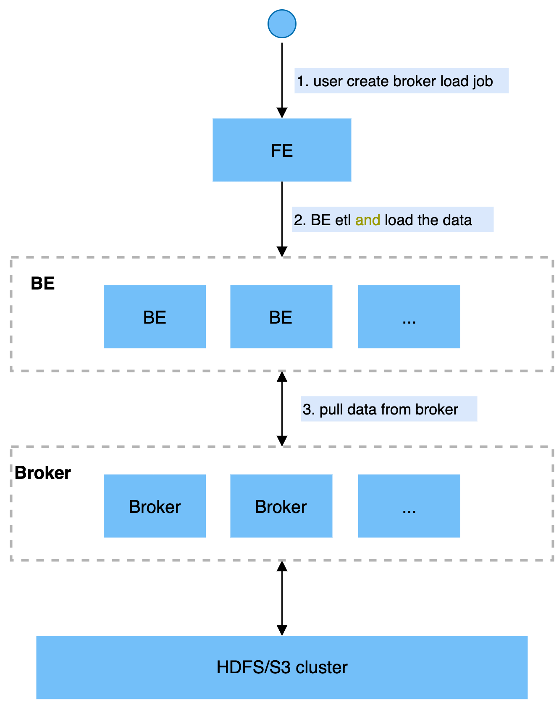

# Broker Load

StarRocks支持从Apache HDFS、Amazon S3等外部存储系统导入数据，支持CSV、ORCFile、Parquet等文件格式。数据量在几十GB到上百GB 级别。

在Broker Load模式下，通过部署的Broker程序，StarRocks可读取对应数据源（如HDFS, S3）上的数据，利用自身的计算资源对数据进行预处理和导入。这是一种**异步**的导入方式，用户需要通过MySQL协议创建导入，并通过查看导入命令检查导入结果。

本节主要介绍Broker导入的基本原理、使用示例、最佳实践，及常见问题。

---

## 名词解释

* Broker:  Broker 为一个独立的无状态进程，封装了文件系统接口，为 StarRocks 提供读取远端存储系统中文件的能力。

* Plan:  导入执行计划，BE会执行导入执行计划将数据导入到StarRocks系统中。

---

## 基本原理

用户在提交导入任务后，FE 会生成对应的 Plan 并根据目前 BE 的个数和文件的大小，将 Plan 分给多个 BE 执行，每个 BE 执行一部分导入任务。BE 在执行过程中会通过 Broker 拉取数据，在对数据预处理之后将数据导入系统。所有 BE 均完成导入后，由 FE 最终判断导入是否成功。

下图展示了 Broker Load 的主要流程：


  
---

## 支持的远程文件系统

* Apache HDFS
* Amazon S3
* 阿里云 OSS
* 腾讯 COS
  
---

## 导入示例

### Broker搭建

Broker Load需要借助Broker进程访问远端存储，因此使用Broker Load前需要搭建好Broker。

可以参考手动部署（[部署Broker](../quick_start/Deploy.md)）。

### 创建导入任务

**语法：**

~~~SQL
LOAD LABEL db_name.label_name 
    (data_desc, ...)
WITH BROKER broker_name broker_properties
    [PROPERTIES (key1=value1, ... )]

data_desc:
    DATA INFILE ('file_path', ...)
    [NEGATIVE]
    INTO TABLE tbl_name
    [PARTITION (p1, p2)]
    [COLUMNS TERMINATED BY column_separator ]
    [FORMAT AS file_type]
    [(col1, ...)]
    [COLUMNS FROM PATH AS (colx, ...)]
    [SET (k1=f1(xx), k2=f2(xx))]
    [WHERE predicate]

broker_properties: 
    (key2=value2, ...)
~~~

**Apache HDFS导入示例：**

~~~sql
LOAD LABEL db1.label1
(
    DATA INFILE("hdfs://abc.com:8888/user/starRocks/test/ml/file1")
    INTO TABLE tbl1
    COLUMNS TERMINATED BY ","
    (tmp_c1, tmp_c2)
    SET
    (
        id=tmp_c2,
        name=tmp_c1
    ),

    DATA INFILE("hdfs://abc.com:8888/user/starRocks/test/ml/file2")
    INTO TABLE tbl2
    COLUMNS TERMINATED BY ","
    (col1, col2)
    where col1 > 1
)
WITH BROKER 'broker'
(
    "username" = "hdfs_username",
    "password" = "hdfs_password"
)
PROPERTIES
(
    "timeout" = "3600"
);
~~~

**阿里云 OSS导入示例：**

~~~SQL
LOAD LABEL example_db.label12
(
    DATA INFILE("oss://my_bucket/input/file.csv")
    INTO TABLE `my_table`
    (k1, k2, k3)
)
WITH BROKER my_broker
(
    "fs.oss.accessKeyId" = "xxxxxxxxxxxxxxxxxxxxxxxxxx",
    "fs.oss.accessKeySecret" = "yyyyyyyyyyyyyyyyyyyy",
    "fs.oss.endpoint" = "oss-cn-zhangjiakou-internal.aliyuncs.com"
)
~~~

执行`HELP BROKER LOAD`可查看创建导入作业的详细语法。这里主要介绍命令中参数的意义和注意事项。
  
**Label：**

导入任务的标识。每个导入任务，都有**一个数据库**内部唯一的Label。Label是用户在导入命令中自定义的名称。通过这个Label，用户可以查看对应导入任务的执行情况，并且Label可以用来防止用户导入相同的数据。当导入任务状态为FINISHED时，对应的Label就不能再次使用了。当 Label 对应的导入任务状态为CANCELLED时，**可以再次使用**该Label提交导入作业。

**数据描述类参数：**

数据描述类参数，主要指的是语句中data_desc部分的参数。每组 data_desc表述了本次导入涉及到的数据源地址，ETL 函数，目标表及分区等信息。下面是对数据描述类部分参数的详细说明。

* 多表导入

Broker load支持一次导入任务涉及多张表，每个Broker load导入任务可通过多个data_desc声明多张表来实现多表导入。每个单独的data-desc可以指定属于**该表**的数据源地址，可以用多个 file-path 来指定导入同一个表的多个文件。Broker load 保证了单次导入的多张表之间原子性成功或失败。

* file_path

文件路径可以指定到一个文件，也可以用 * 通配符指定某个目录下的所有文件。中间的目录也可以使用通配符匹配。

可以使用的通配符有```? * [] {} ^```，[通配符使用规则参考](https://hadoop.apache.org/docs/stable/api/org/apache/hadoop/fs/FileSystem.html#globStatus-org.apache.hadoop.fs.Path-)。

例如：
通过 `hdfs://hdfs_host:hdfs_port/user/data/tablename/\*/\*` , 可以匹配tablename下所有分区内的所有文件；
通过 `hdfs://hdfs_host:hdfs_port/user/data/tablename/dt=202104\*/\*` , 可以匹配tablename下所有4月分区的所有文件；

* negative

data_desc中还可以设置数据取反导入。这个功能适用的场景是当数据表中聚合列的类型都为SUM类型时，如果希望撤销某一批导入的数据，可以通过negative参数导入同一批数据，StarRocks 会自动为这一批数据在聚合列上数据取反，以达到消除同一批数据的功能。

* partition

在data_desc中可以指定待导入表的partition信息。如果待导入数据不属于指定的partition则不会被导入。同时，不在指定Partition中的数据会被认为是“错误数据”。对于不想要导入、也不想要记录为“错误数据”的数据，可以使用下面介绍的 **where predicate** 来过滤。

* column separator

用于指定导入文件中的列分隔符，默认为 \t。

如果是不可见字符，则需要加\\x作为前缀，使用十六进制来表示分隔符。如hive文件的分隔符\x01，指定为"\\\\x01"。

* file type

用于指定导入文件的类型，例如：parquet、orc、csv，默认为csv。

parquet类型也可以通过文件后缀名 **.parquet** 或者 **.parq** 判断。

* COLUMNS FROM PATH AS

提取文件路径中的分区字段。

例: 导入文件为/path/col_name=col_value/dt=20210101/file1，col_name/dt为表中的列，则设置如下语句可以将col_value、20210101分别导入到col_name、dt对应的列中。

~~~SQL
...
(col1, col2)
COLUMNS FROM PATH AS (col_name, dt)
~~~

* set column mapping

data_desc中的SET语句负责设置列**函数变换**。这里的列函数变换支持所有查询的等值表达式变换。如果原始数据的列和表中的列不一一对应，就需要用到这个属性。

* where predicate

data_desc中的WHERE语句负责过滤已经完成transform的数据。被过滤的数据不会进入容忍率的统计中。如果多个data-desc中声明了关于同一张表的多个条件，则会以AND语义合并这些条件。

**导入作业参数：**

导入作业参数是指Broker Load创建导入语句中属于opt_properties部分的参数。导入作业参数是作用于整个导入作业的。下面是对其中部分参数的详细说明。

* timeout

导入作业的超时时间(以秒为单位)。用户可以在opt_properties中自行设置每个导入的超时时间。导入任务在设定的时限内未完成则会被系统取消，变成 CANCELLED。Broker Load的默认导入超时时间为4小时。

> 注意：通常情况下，用户不需要手动设置导入任务的超时时间。当在默认超时时间内无法完成导入时，可以手动设置任务的超时时间。

推荐超时时间的计算方式如下：

`超时时间 >（（总文件大小(MB) * 待导入的表及相关 Roll up 表的个数） / (30 * 导入并发数））`

导入并发数见文档最后的导入系统配置说明，公式中的30为目前BE导入的平均速度：30MB/s。

例如对于1GB的待导入数据文件，待导入表包含2个Rollup表，当前的导入并发数为3。则 timeout 的最小值为 (1 \* 1024 \* 3 ) / (10 \* 3) = 102 秒

由于每个 StarRocks 集群的机器环境不同且集群并发的查询任务也不同，所以 StarRocks 集群的最慢导入速度需要用户自己根据历史的导入任务速度进行推测。

* max_filter_ratio

导入任务的最大容忍率，默认为0容忍，取值范围是0~1。当导入的错误率超过该值，则导入失败。

如果用户希望忽略错误的行，可以通过设置这个参数大于 0，来保证导入可以成功。

计算公式为：

`max_filter_ratio = (dpp.abnorm.ALL / (dpp.abnorm.ALL + dpp.norm.ALL ) )`

**dpp.abnorm.ALL** 表示数据质量不合格的行数，如类型不匹配、列数不匹配、长度不匹配等。

**dpp.norm.ALL** 指的是导入过程中正确数据的条数。可以通过 SHOW LOAD 命令查询导入任务的正确数据量。

原始文件的行数 = dpp.abnorm.ALL + dpp.norm.ALL

* load_mem_limit

导入内存限制。单位是「字节」。默认是 2GB。

* strict_mode

Broker Load导入可以开启strict mode模式。开启方式为 properties ("strict_mode" = "true") 。默认strict mode为关闭。

strict mode 模式的意思是对于导入过程中的列类型转换进行严格过滤。严格过滤的策略如下：

1. 对于列类型转换来说，如果strict mode为true，则错误的数据将被过滤掉。这里的错误数据是指：原始数据并不为空值，在参与列类型转换后结果为空值的这一类数据。

但，一些场景除外：

1. 对于导入的某列**由函数变换生成时**，strict mode对其不产生影响。
2. 对于导入的某列类型包含范围限制的，如果原始数据能正常通过类型转换，**但无法通过范围限制的**，strict mode对其也不产生影响。例如：如果类型是decimal(1,0)，原始数据为10，则属于可以通过类型转换但不在列声明的范围内。这种数据strict mode对其不产生影响。

### 查看导入任务状态

Broker Load导入是异步的，用户可以在SHOW LOAD命令中指定Label来查询对应导入作业的执行状态。具体语法可执行HELP SHOW LOAD查看。这里需要注意的是，SHOW LOAD命令只能查看异步导入方式的LOAD任务。同步方式的LOAD任务，如Stream Load任务，目前无法使用SHOW LOAD命令查看。

示例：

~~~Plain Text
mysql> show load where label = 'label1'\G
*************************** 1. row ***************************
         JobId: 76391
         Label: label1
         State: FINISHED
      Progress: ETL:N/A; LOAD:100%
          Type: BROKER
       EtlInfo: unselected.rows=4; dpp.abnorm.ALL=15; dpp.norm.ALL=28133376
      TaskInfo: cluster:N/A; timeout(s):10800; max_filter_ratio:5.0E-5
      ErrorMsg: N/A
    CreateTime: 2019-07-27 11:46:42
  EtlStartTime: 2019-07-27 11:46:44
 EtlFinishTime: 2019-07-27 11:46:44
 LoadStartTime: 2019-07-27 11:46:44
LoadFinishTime: 2019-07-27 11:50:16
           URL: http://192.168.1.1:8040/api/_load_error_log?file=__shard_4/error_log_insert_stmt_4bb00753932c491a-a6da6e2725415317_4bb00753932c491a_a6da6e2725415317
    JobDetails: {"Unfinished backends":{"9c3441027ff948a0-8287923329a2b6a7":[10002]},"ScannedRows":2390016,"TaskNumber":1,"All backends":{"9c3441027ff948a0-8287923329a2b6a7":[10002]},"FileNumber":1,"FileSize":1073741824}
~~~

下面介绍SHOW LOAD命令返回结果集中参数的意义：

* JobId:  导入任务的唯一ID，每个导入任务的JobId都不同，由系统自动生成。与Label不同的是，JobId**永远不会相同**，而Label则可以在导入任务失败后被复用。
* Label:  导入任务的标识。
* State:  导入任务当前所处的阶段。在Broker load导入过程中主要会出现PENDING和LOADING这两个导入中的状态。如果Broker load处于PENDING状态，则说明当前导入任务正在等待被执行；LOADING状态则表示正在执行中。
* 导入任务的最终阶段有两个：CANCELLED和FINISHED。当任务处于这两个阶段时，导入完成。其中CANCELLED为导入失败，FINISHED为导入成功。
* Progress:  导入任务的进度描述。分为两种进度：ETL和LOAD，分别对应导入流程的两个阶段 ETL和LOADING。目前Broker Load只有LOADING阶段，所以ETL固定显示为 N/A，而LOAD的进度范围为：0~100%。LOAD进度 = 当前完成导入的表个数 / 本次导入任务设计的总表个数 \* 100%
  * 如果所有导入表均完成导入，此时 LOAD 的进度为 99%， 导入进入到最后生效阶段，整个导入完成后，LOAD 的进度才会改为 100%。

    > 注意：导入进度并不是线性的，所以如果一段时间内进度没有变化，并不代表导入没有在执行。

* Type:  导入任务的类型。Broker Load 的 type 取值是 BROKER。

* EtlInfo:  主要显示了导入的数据量指标 unselected.rows , dpp.norm.ALL 和 dpp.abnorm.ALL。用户可以根据第一个数值判断 where 条件过滤了多少行，后两个指标验证当前导入任务的错误率是否超过 max-filter-ratio。三个指标之和就是原始数据量的总行数。
* TaskInfo:  主要显示了当前导入任务参数，也就是创建 Broker Load 导入任务时用户指定的参数，包括：cluster，timeout 和 max-filter-ratio。
* ErrorMsg:  如果导入任务状态为CANCELLED，会显示失败的原因，包括两部分：**type** 和 **msg**。如果导入任务成功则显示 N/A。

    **type**的取值意义：
  * USER-CANCEL: 用户取消的任务
  * ETL-RUN-FAIL:  在ETL阶段失败的导入任务
  * ETL-QUALITY-UNSATISFIED:  数据质量不合格，也就是错误数据率超过了 max-filter-ratio
  * LOAD-RUN-FAIL:  在LOADING阶段失败的导入任务
  * TIMEOUT:  导入任务没在超时时间内完成
  * UNKNOWN:  未知的导入错误

* CreateTime/EtlStartTime/EtlFinishTime/LoadStartTime/LoadFinishTime:  这几个值分别代表导入创建的时间、ETL阶段开始的时间、ETL阶段完成的时间、Loading阶段开始的时间和整个导入任务完成的时间。
  * Broker Load 导入由于没有 ETL 阶段，所以其 EtlStartTime, EtlFinishTime, LoadStartTime 被设置为同一个值。
  * 若导入任务长时间停留在 CreateTime，而 LoadStartTime 为 N/A ，则说明目前导入任务堆积严重，用户可减少导入提交的频率。

    ~~~Plain Text
    LoadFinishTime - CreateTime = 整个导入任务所消耗时间

    LoadFinishTime - LoadStartTime = 整个 Broker load 导入任务执行时间 = 整个导入任务所消耗时间 - 导入任务等待的时间
    ~~~

* URL:  导入任务的错误数据样例，访问 URL 地址即可获取本次导入的错误数据样例。当本次导入不存在错误数据时，URL字段则为N/A。
* JobDetails:  显示作业的详细运行状态。包括导入文件的个数、总大小（字节）、子任务个数、已处理的原始行数，运行子任务的BE节点 Id，未完成的BE节点 Id。

    ~~~Json
    {"Unfinished backends":{"9c3441027ff948a0-8287923329a2b6a7":[10002]},"ScannedRows":2390016,"TaskNumber":1,"All backends":{"9c3441027ff948a0-8287923329a2b6a7":[10002]},"FileNumber":1,"FileSize":1073741824}
    ~~~

    其中已处理的原始行数，每 5 秒更新一次。该行数仅用于展示当前的进度，不代表最终实际的处理行数。实际处理行数以 EtlInfo 中显示的数据为准。

### 取消导入任务

当 Broker Load 作业状态不为 CANCELLED 或 FINISHED 时，可以被用户手动取消。取消时需要指定待取消导入任务的 Label 。可执行 `HELP CANCEL LOAD` 查看取消导入命令的语法。

## 相关配置

### 并行度

一个作业可以拆成一个或者多个任务，任务之间并行执行。拆分由LOAD语句中的DataDescription来决定。比如：

1. 多个DataDescription对应导入多个不同的表，每个会拆成一个任务；
2. 多个DataDescription对应导入同一个表的不同分区，每个也会拆成一个任务。

每个任务还会拆分成一个或者多个实例，然后将这些实例平均分配到BE上并行执行。实例的拆分由以下FE配置决定：
```min_bytes_per_broker_scanner```：单个实例处理的最小数据量，默认64MB。
```max_broker_concurrency```：单个任务最大并发实例数，默认100个。
```load_parallel_instance_num```：单个BE上并发实例数，默认1个。
实例的总数=min(导入文件总大小/单个实例处理的最小数据量，单个任务最大并发实例数，单个BE上并发实例数 * BE数)

一般情况下，一个作业只有一个DataDescription，只会拆分成一个任务。任务会拆成与BE数相等的实例，然后分配到所有BE上并行执行。

## 常见问题

* Q：数据质量问题报错：ETL_QUALITY_UNSATISFIED; msg:quality not good enough to cancel

    A: 可参考章节导入总览/常见问题。

* Q：导入报错：failed to send batch 或 TabletWriter add batch with unknown id

    A：请参照章节导入总览/通用系统配置/BE配置，适当修改 query_timeout 和 streaming_load_rpc_max_alive_time_sec。

* Q：导入报错：LOAD-RUN-FAIL; msg:OrcScannerAdapter::init_include_columns. col name = xxx not found

    A：如果是Parquet或者ORC格式的数据，需要保持文件头的列名与StarRocks表中的列名一致，如 :

    ~~~sql
    (tmp_c1,tmp_c2)
    SET
    (
       id=tmp_c2,
       name=tmp_c1
    )
    ~~~

表示将Parquet或ORC文件中以(tmp_c1, tmp_c2)为列名的列，映射到StarRocks表中的(id, name)列。如果没有设置set, 则以column中的列作为映射。

> 注意：如果使用某些Hive版本直接生成的ORC文件，ORC文件中的表头并非Hive meta数据，而是`（_col0, _col1, _col2, ...）`, 可能导致Invalid Column Name错误，那么则需要使用set进行映射。

* Q：其他错误：
  
  A：其他长时间没有结束等问题，可以到 BE 的 `log/be.INFO` 中，搜索`kafka error` ，了解具体一些什么原因。

* Q：如何配置Hadoop HA
  
  A：以下配置用于访问以 HA 模式部署的 HDFS 集群。

    `dfs.nameservices`：指定 hdfs 服务的名字，自定义，如："dfs.nameservices" = "my_ha"。

    `dfs.ha.namenodes.xxx`：自定义 namenode 的名字,多个名字以逗号分隔。其中 xxx 为`dfs.nameservices`中自定义的名字，如： "dfs.ha.namenodes.my_ha" = "my_nn"。

    `dfs.namenode.rpc-address.xxx.nn`：指定 namenode 的rpc地址信息。其中 nn 表示`dfs.ha.namenodes.xxx`中配置的 namenode 的名字，如："dfs.namenode.rpc-address.my_ha.my_nn" = "host:port"。

    `dfs.client.failover.proxy.provider`：指定 client 连接 namenode 的 provider，默认为：org.apache.hadoop.hdfs.server.namenode.ha.ConfiguredFailoverProxyProvider。

    示例如下：

    ~~~sql
    (
        "dfs.nameservices" = "my-ha",
        "dfs.ha.namenodes.my-ha" = "my-namenode1, my-namenode2",
        "dfs.namenode.rpc-address.my-ha.my-namenode1" = "nn1-host:rpc_port",
        "dfs.namenode.rpc-address.my-ha.my-namenode2" = "nn2-host:rpc_port",
        "dfs.client.failover.proxy.provider" = "org.apache.hadoop.hdfs.server.namenode.ha.ConfiguredFailoverProxyProvider"
    )

    ~~~

    HA 模式可以和前面两种认证方式组合，进行集群访问。如通过简单认证访问 HA HDFS：

    ~~~sql
    (
        "username"="user",
        "password"="passwd",
        "dfs.nameservices" = "my-ha",
        "dfs.ha.namenodes.my-ha" = "my_namenode1, my_namenode2",
        "dfs.namenode.rpc-address.my-ha.my-namenode1" = "nn1-host:rpc_port",
        "dfs.namenode.rpc-address.my-ha.my-namenode2" = "nn2-host:rpc_port",
        "dfs.client.failover.proxy.provider" = "org.apache.hadoop.hdfs.server.namenode.ha.ConfiguredFailoverProxyProvider"
    )

    ~~~

    关于HDFS集群的配置可以写入hdfs-site.xml文件中，用户使用Broker进程读取HDFS集群的信息时，只需要填写集群的文件路径名和认证信息即可。

* Q：如何配置Hadoop ViewFS （federation）

  A：需要将 ViewFs 相关的配置 core-site.xml 和 hdfs-site.xml 拷贝到 broker/conf 目录中。

    如果有自定义的 FileSystem，需要将相关的 jar 拷贝到 broker/lib 目录中。

* Q：访问kerberos认证的集群时，报错：`Can't get Kerberos realm`

  A：首先检查是不是所有的broker所在机器是否都配置了`/etc/krb5.conf`文件。

    如果配置了仍然报错，需要在broker的启动脚本中的`JAVA_OPTS`变量最后，加上`-Djava.security.krb5.conf:/etc/krb5.conf`。
